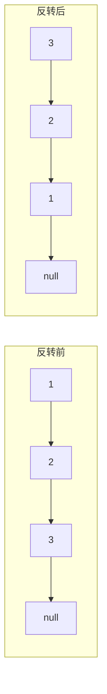
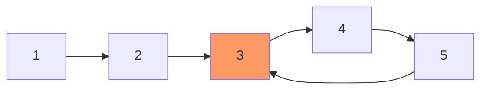

# 链表

## 概念说明

链表是最基础的数据结构之一，面试中出现频率极高。链表题目的核心技巧包括：**虚拟头节点**、**快慢指针**、**递归**和**迭代反转**。

## 核心题目

### 一、反转链表（LeetCode 206）🟢 Easy | 🔥🔥🔥

**题目描述**：给定单链表的头节点 `head`，反转链表并返回反转后的链表。

**解题思路**：



**方法一：迭代法**（推荐）

用三个指针 `prev`、`curr`、`next` 逐步反转指针方向。

```java
/**
 * 迭代法反转链表
 * 时间复杂度: O(n)，空间复杂度: O(1)
 */
public ListNode reverseList(ListNode head) {
    ListNode prev = null;
    ListNode curr = head;
    while (curr != null) {
        ListNode next = curr.next; // 暂存下一个节点
        curr.next = prev;          // 反转指针
        prev = curr;               // prev 前进
        curr = next;               // curr 前进
    }
    return prev;
}
```

**方法二：递归法**

```java
/**
 * 递归法反转链表
 * 时间复杂度: O(n)，空间复杂度: O(n) 递归栈
 */
public ListNode reverseListRecursive(ListNode head) {
    if (head == null || head.next == null) return head;
    ListNode newHead = reverseListRecursive(head.next);
    head.next.next = head; // 让下一个节点指向自己
    head.next = null;       // 断开原来的指向
    return newHead;
}
```

**复杂度分析**：

| 方法 | 时间复杂度 | 空间复杂度 |
|------|-----------|-----------|
| 迭代法 | O(n) | O(1) |
| 递归法 | O(n) | O(n) |

**常见变体**：反转链表 II（LC 92，反转指定区间）

---

### 二、合并两个有序链表（LeetCode 21）🟢 Easy | 🔥🔥🔥

**题目描述**：将两个升序链表合并为一个新的升序链表。

**解题思路**：使用虚拟头节点 + 双指针逐一比较。

```java
/**
 * 合并两个有序链表 — 迭代法
 * 时间复杂度: O(m+n)，空间复杂度: O(1)
 */
public ListNode mergeTwoLists(ListNode l1, ListNode l2) {
    ListNode dummy = new ListNode(-1); // 虚拟头节点
    ListNode curr = dummy;
    while (l1 != null && l2 != null) {
        if (l1.val <= l2.val) {
            curr.next = l1;
            l1 = l1.next;
        } else {
            curr.next = l2;
            l2 = l2.next;
        }
        curr = curr.next;
    }
    curr.next = (l1 != null) ? l1 : l2; // 拼接剩余部分
    return dummy.next;
}
```

---

### 三、环形链表（LeetCode 141/142）🟢 Easy / 🟡 Medium | 🔥🔥🔥

**题目描述**：
- 141：判断链表是否有环
- 142：找到环的入口节点

**解题思路**：快慢指针（Floyd 判圈算法）



```java
/**
 * LC 141: 判断链表是否有环
 * 快指针每次走两步，慢指针每次走一步，若相遇则有环
 */
public boolean hasCycle(ListNode head) {
    ListNode slow = head, fast = head;
    while (fast != null && fast.next != null) {
        slow = slow.next;
        fast = fast.next.next;
        if (slow == fast) return true;
    }
    return false;
}

/**
 * LC 142: 找到环的入口
 * 快慢指针相遇后，一个从 head 出发，一个从相遇点出发，再次相遇即为入口
 */
public ListNode detectCycle(ListNode head) {
    ListNode slow = head, fast = head;
    while (fast != null && fast.next != null) {
        slow = slow.next;
        fast = fast.next.next;
        if (slow == fast) {
            ListNode p = head;
            while (p != slow) {
                p = p.next;
                slow = slow.next;
            }
            return p; // 环的入口
        }
    }
    return null;
}
```

**数学证明**：设链表头到环入口距离为 `a`，环入口到相遇点距离为 `b`，相遇点到环入口距离为 `c`。快指针走了 `a+b+c+b`，慢指针走了 `a+b`，因为快指针速度是慢指针的 2 倍，所以 `a+b+c+b = 2(a+b)`，化简得 `a = c`。

---

### 四、删除链表的倒数第 N 个节点（LeetCode 19）🟡 Medium | 🔥🔥

**解题思路**：快慢指针，快指针先走 N 步，然后同时走，快指针到末尾时慢指针指向待删除节点的前一个。

```java
/**
 * 删除链表倒数第 N 个节点
 * 时间复杂度: O(n)，空间复杂度: O(1)
 */
public ListNode removeNthFromEnd(ListNode head, int n) {
    ListNode dummy = new ListNode(0, head);
    ListNode fast = dummy, slow = dummy;
    for (int i = 0; i <= n; i++) fast = fast.next; // 快指针先走 n+1 步
    while (fast != null) {
        fast = fast.next;
        slow = slow.next;
    }
    slow.next = slow.next.next; // 删除目标节点
    return dummy.next;
}
```

---

### 五、两两交换链表中的节点（LeetCode 24）🟡 Medium | 🔥🔥

**解题思路**：虚拟头节点 + 每次处理两个节点的交换。

```java
/**
 * 两两交换链表中的节点
 * 时间复杂度: O(n)，空间复杂度: O(1)
 */
public ListNode swapPairs(ListNode head) {
    ListNode dummy = new ListNode(0, head);
    ListNode prev = dummy;
    while (prev.next != null && prev.next.next != null) {
        ListNode first = prev.next;
        ListNode second = prev.next.next;
        first.next = second.next;  // first 指向 second 的下一个
        second.next = first;        // second 指向 first
        prev.next = second;         // prev 指向 second
        prev = first;               // prev 移到 first（交换后在后面）
    }
    return dummy.next;
}
```

## 代码示例

> 💻 完整可运行代码：[code-examples/01-java-core/java-basics/src/main/java/com/example/basics/algorithm/linkedlist/](https://github.com/skyhe58/guide-java/tree/main/code-examples/01-java-core/java-basics/src/main/java/com/example/basics/algorithm/linkedlist/)
> <!-- 本地路径：code-examples/01-java-core/java-basics/src/main/java/com/example/basics/algorithm/linkedlist/ -->

## 常见面试题

### Q1: 如何判断链表是否有环？找到环的入口？

**难度**：⭐⭐⭐ | **频率**：🔥🔥🔥

**答题思路**：

1. 使用快慢指针（Floyd 判圈算法）
2. 快指针每次走两步，慢指针每次走一步
3. 若相遇则有环；找入口时从 head 和相遇点同时出发

**标准答案**：见上方 LC 141/142 解法。

**深入追问**：
- 为什么快慢指针一定会在环内相遇？（快指针每次比慢指针多走一步，相对速度为 1，一定会追上）
- 能否用 O(1) 空间判断两个链表是否相交？（先求长度差，长的先走差值步，再同时走）

### Q2: 反转链表的迭代和递归写法？

**难度**：⭐⭐ | **频率**：🔥🔥🔥

**标准答案**：见上方 LC 206 解法。

**深入追问**：
- 如何反转链表的前 N 个节点？
- 如何反转链表中第 m 到第 n 个节点？（LC 92）

## 参考资料

- [LeetCode 206. 反转链表](https://leetcode.cn/problems/reverse-linked-list/)
- [LeetCode 141. 环形链表](https://leetcode.cn/problems/linked-list-cycle/)
- [LeetCode 142. 环形链表 II](https://leetcode.cn/problems/linked-list-cycle-ii/)
