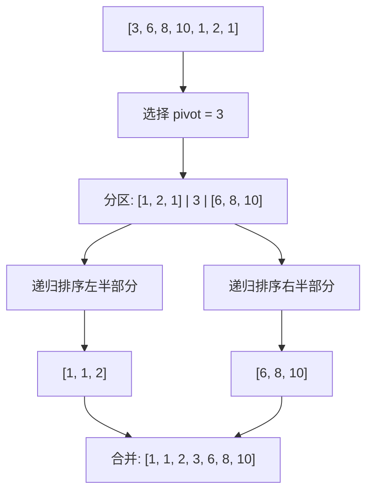
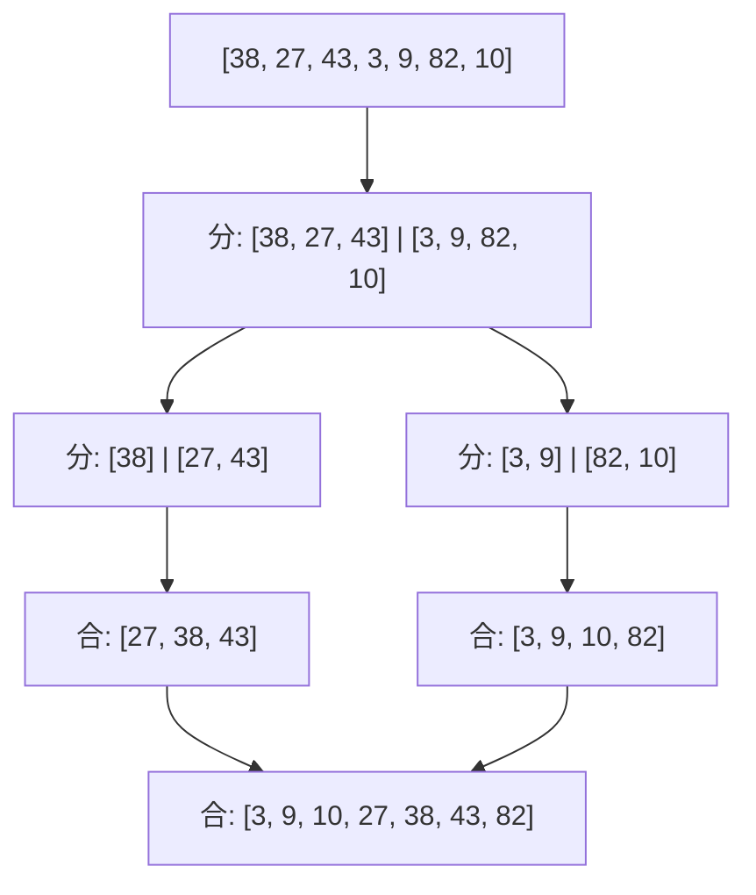

# 排序算法

## 概念说明

排序是最基础的算法之一，面试中重点考察快速排序、归并排序和堆排序的原理、实现和复杂度分析。

## 复杂度对比表

| 排序算法 | 平均时间 | 最坏时间 | 最好时间 | 空间复杂度 | 稳定性 |
|---------|---------|---------|---------|-----------|--------|
| 快速排序 | O(n log n) | O(n²) | O(n log n) | O(log n) | ❌ 不稳定 |
| 归并排序 | O(n log n) | O(n log n) | O(n log n) | O(n) | ✅ 稳定 |
| 堆排序 | O(n log n) | O(n log n) | O(n log n) | O(1) | ❌ 不稳定 |
| 冒泡排序 | O(n²) | O(n²) | O(n) | O(1) | ✅ 稳定 |
| 插入排序 | O(n²) | O(n²) | O(n) | O(1) | ✅ 稳定 |
| 选择排序 | O(n²) | O(n²) | O(n²) | O(1) | ❌ 不稳定 |

> 💡 **稳定性**：相等元素排序后相对顺序不变。归并排序稳定，快排和堆排不稳定。

## 核心算法

### 一、快速排序

**原理**：选择一个基准元素（pivot），将数组分为两部分：小于 pivot 的在左，大于 pivot 的在右，然后递归排序。



```java
/**
 * 快速排序
 * 平均时间: O(n log n)，最坏: O(n²)（有序数组 + 固定选第一个做 pivot）
 * 空间: O(log n) 递归栈
 */
public void quickSort(int[] arr, int left, int right) {
    if (left >= right) return;
    int pivotIndex = partition(arr, left, right);
    quickSort(arr, left, pivotIndex - 1);
    quickSort(arr, pivotIndex + 1, right);
}

private int partition(int[] arr, int left, int right) {
    // 随机选择 pivot 避免最坏情况
    int randomIdx = left + (int)(Math.random() * (right - left + 1));
    swap(arr, randomIdx, right);

    int pivot = arr[right];
    int i = left; // i 指向下一个小于 pivot 的位置
    for (int j = left; j < right; j++) {
        if (arr[j] < pivot) {
            swap(arr, i++, j);
        }
    }
    swap(arr, i, right);
    return i;
}
```

**为什么快排最常用？**
- 平均性能最好，常数因子小
- 原地排序，空间开销小
- 缓存友好（顺序访问数组）

---

### 二、归并排序

**原理**：分治法，将数组不断二分，然后合并两个有序子数组。



```java
/**
 * 归并排序
 * 时间: O(n log n)（稳定），空间: O(n)
 */
public void mergeSort(int[] arr, int left, int right) {
    if (left >= right) return;
    int mid = left + (right - left) / 2;
    mergeSort(arr, left, mid);
    mergeSort(arr, mid + 1, right);
    merge(arr, left, mid, right);
}

private void merge(int[] arr, int left, int mid, int right) {
    int[] temp = new int[right - left + 1];
    int i = left, j = mid + 1, k = 0;
    while (i <= mid && j <= right) {
        if (arr[i] <= arr[j]) { // <= 保证稳定性
            temp[k++] = arr[i++];
        } else {
            temp[k++] = arr[j++];
        }
    }
    while (i <= mid) temp[k++] = arr[i++];
    while (j <= right) temp[k++] = arr[j++];
    System.arraycopy(temp, 0, arr, left, temp.length);
}
```

**归并排序的优势**：
- 时间复杂度稳定 O(n log n)，不受输入数据影响
- 稳定排序
- 适合链表排序（不需要额外空间）和外部排序

---

### 三、堆排序

**原理**：利用最大堆的性质，每次将堆顶（最大值）与末尾交换，然后缩小堆范围并下沉调整。

```java
/**
 * 堆排序
 * 时间: O(n log n)，空间: O(1)
 */
public void heapSort(int[] arr) {
    int n = arr.length;
    // 1. 建堆：从最后一个非叶子节点开始下沉
    for (int i = n / 2 - 1; i >= 0; i--) {
        siftDown(arr, i, n);
    }
    // 2. 排序：每次将堆顶与末尾交换，然后下沉调整
    for (int i = n - 1; i > 0; i--) {
        swap(arr, 0, i);    // 堆顶（最大值）放到末尾
        siftDown(arr, 0, i); // 缩小堆范围，下沉调整
    }
}

private void siftDown(int[] arr, int i, int n) {
    while (2 * i + 1 < n) {
        int child = 2 * i + 1; // 左子节点
        if (child + 1 < n && arr[child + 1] > arr[child]) {
            child++; // 选较大的子节点
        }
        if (arr[i] >= arr[child]) break;
        swap(arr, i, child);
        i = child;
    }
}
```

## 稳定性分析

**什么是排序稳定性？**

如果两个元素的值相等，排序后它们的相对顺序与排序前一致，则称该排序算法是稳定的。

**为什么稳定性重要？**

在多关键字排序时，稳定排序可以保留之前排序的结果。例如先按成绩排序，再按姓名排序，稳定排序能保证同名学生仍按成绩有序。

| 算法 | 稳定性 | 原因 |
|------|--------|------|
| 归并排序 | ✅ 稳定 | 合并时相等元素取左边的，保持相对顺序 |
| 快速排序 | ❌ 不稳定 | 分区操作可能改变相等元素的相对顺序 |
| 堆排序 | ❌ 不稳定 | 堆调整过程中可能改变相等元素的相对顺序 |

## 代码示例

> 💻 完整可运行代码：[code-examples/01-java-core/java-basics/src/main/java/com/example/basics/algorithm/sort/](../../../code-examples/01-java-core/java-basics/src/main/java/com/example/basics/algorithm/sort/)

## 常见面试题

### Q1: 快排、归并、堆排序的区别和适用场景？

**难度**：⭐⭐⭐ | **频率**：🔥🔥🔥

**标准答案**：
- **快排**：平均最快，原地排序，但不稳定，最坏 O(n²)。适合一般场景，Java 的 `Arrays.sort()` 对基本类型使用双轴快排。
- **归并**：稳定排序，时间稳定 O(n log n)，但需要 O(n) 额外空间。适合链表排序、外部排序、需要稳定性的场景。Java 的 `Arrays.sort()` 对对象类型使用 TimSort（归并排序的优化版）。
- **堆排序**：O(1) 额外空间，但不稳定，缓存不友好。适合内存受限场景。

**深入追问**：
- Java 的 `Arrays.sort()` 底层用的什么排序？（基本类型用双轴快排，对象类型用 TimSort）
- 什么是 TimSort？（归并排序 + 插入排序的混合算法，利用数据中已有的有序片段）

### Q2: 快排为什么平均情况下比归并快？

**难度**：⭐⭐⭐ | **频率**：🔥🔥

**标准答案**：虽然两者平均时间复杂度都是 O(n log n)，但快排的常数因子更小：（1）快排是原地排序，不需要额外数组拷贝；（2）快排的数据访问模式更缓存友好（顺序访问数组）；（3）归并排序需要 O(n) 额外空间用于合并。

## 参考资料

- [排序算法可视化](https://visualgo.net/en/sorting)
- [Java Arrays.sort 源码分析](https://github.com/openjdk/jdk/blob/master/src/java.base/share/classes/java/util/Arrays.java)
