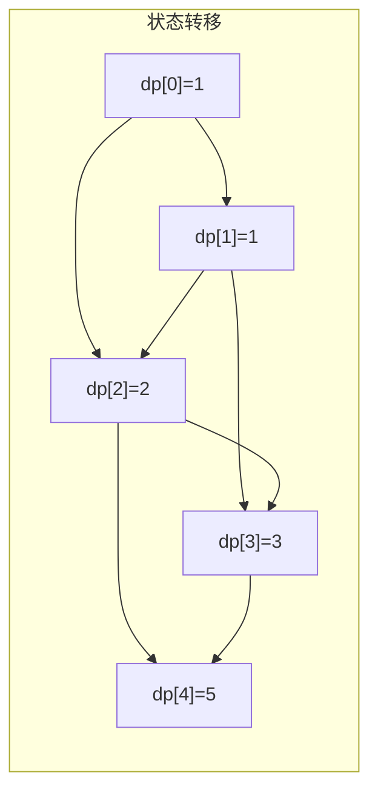
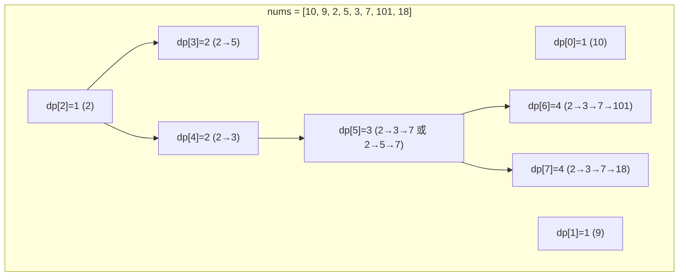
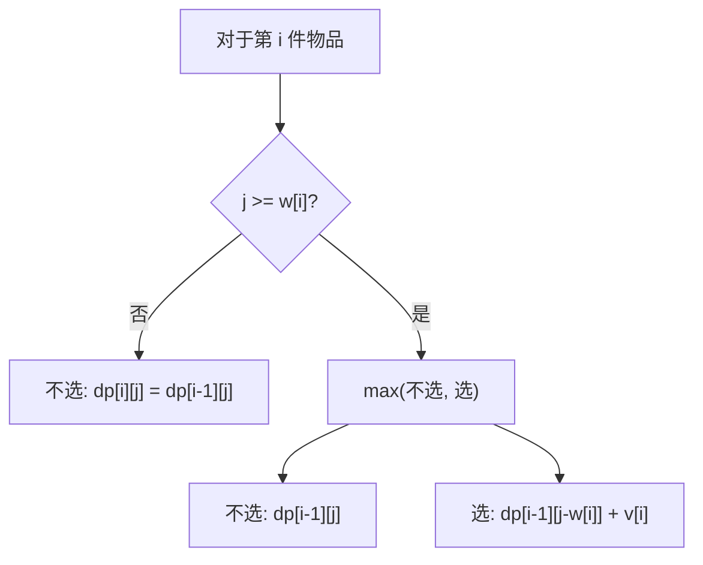
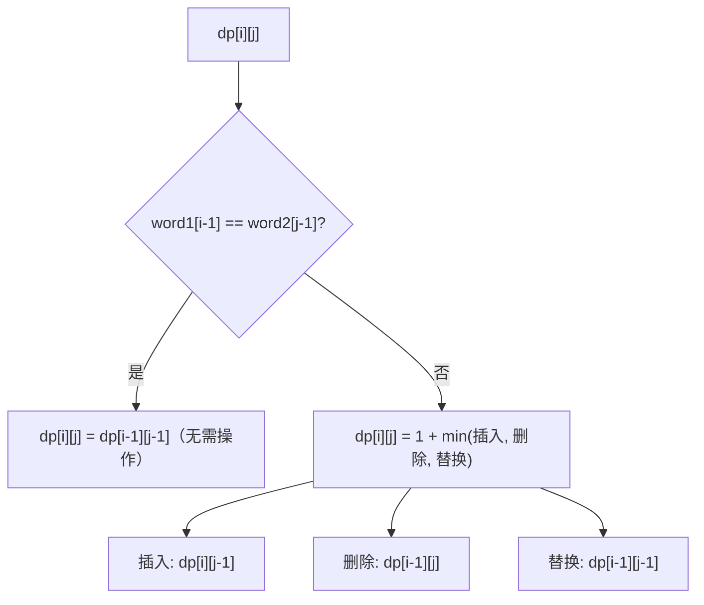

# 动态规划

## 概念说明

动态规划（Dynamic Programming, DP）是解决**最优子结构**和**重叠子问题**的算法思想。核心步骤：
1. **定义状态**：`dp[i]` 代表什么
2. **状态转移方程**：`dp[i]` 如何从之前的状态推导
3. **初始化**：base case
4. **遍历顺序**：确保计算 `dp[i]` 时所依赖的状态已经计算过

## 核心题目

### 一、爬楼梯（LeetCode 70）🟢 Easy | 🔥🔥🔥

**状态定义**：`dp[i]` = 爬到第 i 阶的方法数

**状态转移方程**：`dp[i] = dp[i-1] + dp[i-2]`



```java
/**
 * 爬楼梯 — 空间优化版
 * 时间: O(n)，空间: O(1)
 */
public int climbStairs(int n) {
    if (n <= 2) return n;
    int prev2 = 1, prev1 = 2;
    for (int i = 3; i <= n; i++) {
        int curr = prev1 + prev2;
        prev2 = prev1;
        prev1 = curr;
    }
    return prev1;
}
```

---

### 二、最长递增子序列（LeetCode 300）🟡 Medium | 🔥🔥🔥

**状态定义**：`dp[i]` = 以 `nums[i]` 结尾的最长递增子序列长度

**状态转移方程**：`dp[i] = max(dp[j] + 1)`，其中 `j < i` 且 `nums[j] < nums[i]`



```java
/**
 * 最长递增子序列 — DP
 * 时间: O(n²)，空间: O(n)
 */
public int lengthOfLIS(int[] nums) {
    int n = nums.length;
    int[] dp = new int[n];
    Arrays.fill(dp, 1);
    int maxLen = 1;
    for (int i = 1; i < n; i++) {
        for (int j = 0; j < i; j++) {
            if (nums[j] < nums[i]) {
                dp[i] = Math.max(dp[i], dp[j] + 1);
            }
        }
        maxLen = Math.max(maxLen, dp[i]);
    }
    return maxLen;
}

/**
 * 最长递增子序列 — 贪心 + 二分（优化）
 * 时间: O(n log n)
 */
public int lengthOfLISOptimized(int[] nums) {
    List<Integer> tails = new ArrayList<>(); // tails[i] = 长度为 i+1 的 LIS 的最小末尾
    for (int num : nums) {
        int pos = Collections.binarySearch(tails, num);
        if (pos < 0) pos = -(pos + 1);
        if (pos == tails.size()) tails.add(num);
        else tails.set(pos, num);
    }
    return tails.size();
}
```

---

### 三、0-1 背包问题

**问题描述**：有 N 件物品和容量为 W 的背包，第 i 件物品重量 `w[i]`、价值 `v[i]`，求最大价值。

**状态定义**：`dp[i][j]` = 前 i 件物品、容量为 j 时的最大价值

**状态转移方程**：`dp[i][j] = max(dp[i-1][j], dp[i-1][j-w[i]] + v[i])`



```java
/**
 * 0-1 背包 — 一维空间优化
 * 时间: O(N*W)，空间: O(W)
 */
public int knapsack(int[] weights, int[] values, int capacity) {
    int[] dp = new int[capacity + 1];
    for (int i = 0; i < weights.length; i++) {
        // 逆序遍历，保证每件物品只选一次
        for (int j = capacity; j >= weights[i]; j--) {
            dp[j] = Math.max(dp[j], dp[j - weights[i]] + values[i]);
        }
    }
    return dp[capacity];
}
```

> ⚠️ 0-1 背包必须逆序遍历容量，完全背包正序遍历。

---

### 四、编辑距离（LeetCode 72）🟡 Medium | 🔥🔥

**状态定义**：`dp[i][j]` = `word1` 前 i 个字符转换为 `word2` 前 j 个字符的最少操作数

**状态转移方程**：



```java
/**
 * 编辑距离
 * 时间: O(m*n)，空间: O(m*n)
 */
public int minDistance(String word1, String word2) {
    int m = word1.length(), n = word2.length();
    int[][] dp = new int[m + 1][n + 1];
    // 初始化：空串到另一个串的编辑距离
    for (int i = 0; i <= m; i++) dp[i][0] = i;
    for (int j = 0; j <= n; j++) dp[0][j] = j;

    for (int i = 1; i <= m; i++) {
        for (int j = 1; j <= n; j++) {
            if (word1.charAt(i - 1) == word2.charAt(j - 1)) {
                dp[i][j] = dp[i - 1][j - 1];
            } else {
                dp[i][j] = 1 + Math.min(dp[i - 1][j - 1], // 替换
                                Math.min(dp[i - 1][j],      // 删除
                                         dp[i][j - 1]));    // 插入
            }
        }
    }
    return dp[m][n];
}
```

---

### 五、最长公共子序列（LeetCode 1143）🟡 Medium | 🔥🔥

**状态定义**：`dp[i][j]` = `text1` 前 i 个字符和 `text2` 前 j 个字符的 LCS 长度

```java
/**
 * 最长公共子序列
 * 时间: O(m*n)，空间: O(m*n)
 */
public int longestCommonSubsequence(String text1, String text2) {
    int m = text1.length(), n = text2.length();
    int[][] dp = new int[m + 1][n + 1];
    for (int i = 1; i <= m; i++) {
        for (int j = 1; j <= n; j++) {
            if (text1.charAt(i - 1) == text2.charAt(j - 1)) {
                dp[i][j] = dp[i - 1][j - 1] + 1;
            } else {
                dp[i][j] = Math.max(dp[i - 1][j], dp[i][j - 1]);
            }
        }
    }
    return dp[m][n];
}
```

---

### 六、零钱兑换（LeetCode 322）🟡 Medium | 🔥🔥

**状态定义**：`dp[i]` = 凑出金额 i 所需的最少硬币数

**状态转移方程**：`dp[i] = min(dp[i - coin] + 1)`，对所有 coin

```java
/**
 * 零钱兑换 — 完全背包
 * 时间: O(amount * n)，空间: O(amount)
 */
public int coinChange(int[] coins, int amount) {
    int[] dp = new int[amount + 1];
    Arrays.fill(dp, amount + 1); // 初始化为不可能的大值
    dp[0] = 0;
    for (int i = 1; i <= amount; i++) {
        for (int coin : coins) {
            if (coin <= i) {
                dp[i] = Math.min(dp[i], dp[i - coin] + 1);
            }
        }
    }
    return dp[amount] > amount ? -1 : dp[amount];
}
```

## 代码示例

> 💻 完整可运行代码：[code-examples/01-java-core/java-basics/src/main/java/com/example/basics/algorithm/dp/](../../../code-examples/01-java-core/java-basics/src/main/java/com/example/basics/algorithm/dp/)

## 常见面试题

### Q1: 动态规划和贪心算法的区别？

**难度**：⭐⭐⭐ | **频率**：🔥🔥

**标准答案**：DP 考虑所有子问题的最优解来构建全局最优解，保证全局最优；贪心每一步都选择当前最优，不回溯，不一定全局最优。DP 适用于有重叠子问题和最优子结构的问题；贪心需要证明贪心选择性质。

### Q2: 0-1 背包和完全背包的区别？

**难度**：⭐⭐⭐ | **频率**：🔥🔥🔥

**标准答案**：0-1 背包每件物品只能选一次，一维 DP 时逆序遍历容量；完全背包每件物品可以选无限次，正序遍历容量。

**深入追问**：
- 如何输出背包问题的具体方案？（回溯 dp 数组）
- 多重背包怎么处理？（二进制拆分优化）

## 参考资料

- [LeetCode 70. 爬楼梯](https://leetcode.cn/problems/climbing-stairs/)
- [LeetCode 300. 最长递增子序列](https://leetcode.cn/problems/longest-increasing-subsequence/)
- [LeetCode 72. 编辑距离](https://leetcode.cn/problems/edit-distance/)
