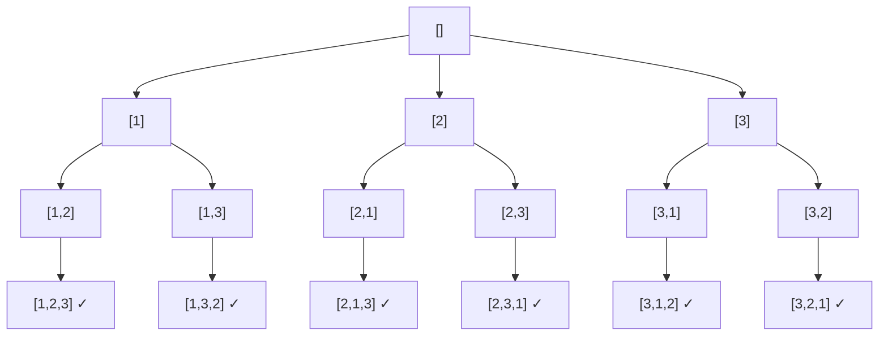
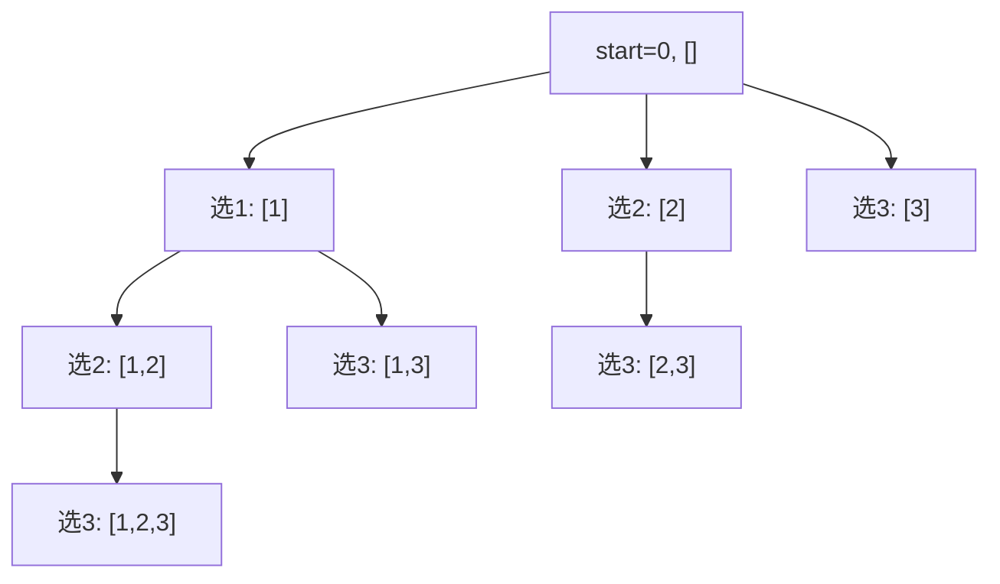
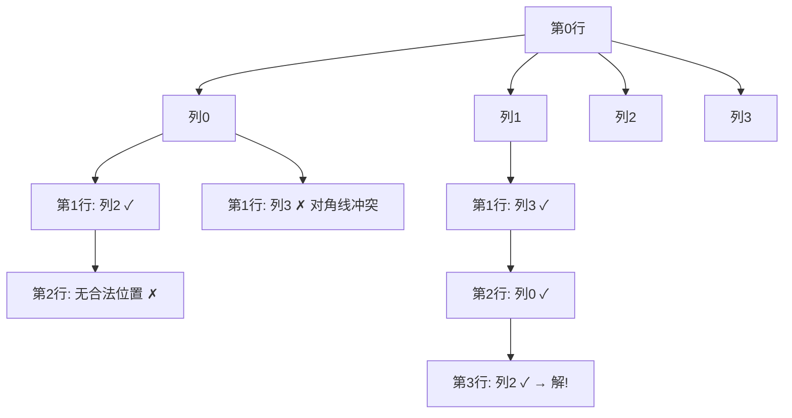

# 回溯算法

## 概念说明

回溯算法本质是**穷举 + 剪枝**，通过递归遍历决策树的所有路径，在不满足条件时回退（回溯）。适用于排列、组合、子集、棋盘等问题。

## 回溯模板

```java
void backtrack(路径, 选择列表) {
    if (满足结束条件) {
        result.add(路径);
        return;
    }
    for (选择 : 选择列表) {
        做选择;          // 将选择加入路径
        backtrack(路径, 选择列表);
        撤销选择;        // 将选择从路径移除（回溯）
    }
}
```

## 核心题目

### 一、全排列（LeetCode 46）🟡 Medium | 🔥🔥🔥

**决策树**：



```java
/**
 * 全排列
 * 时间复杂度: O(n * n!)，空间复杂度: O(n)
 */
public List<List<Integer>> permute(int[] nums) {
    List<List<Integer>> result = new ArrayList<>();
    boolean[] used = new boolean[nums.length];
    backtrackPermute(nums, used, new ArrayList<>(), result);
    return result;
}

private void backtrackPermute(int[] nums, boolean[] used,
                               List<Integer> path, List<List<Integer>> result) {
    if (path.size() == nums.length) {
        result.add(new ArrayList<>(path)); // 注意要拷贝
        return;
    }
    for (int i = 0; i < nums.length; i++) {
        if (used[i]) continue;
        used[i] = true;
        path.add(nums[i]);
        backtrackPermute(nums, used, path, result);
        path.remove(path.size() - 1); // 回溯
        used[i] = false;
    }
}
```

---

### 二、子集（LeetCode 78）🟡 Medium | 🔥🔥

**决策树**：每个元素选或不选。



```java
/**
 * 子集
 * 时间复杂度: O(n * 2^n)
 */
public List<List<Integer>> subsets(int[] nums) {
    List<List<Integer>> result = new ArrayList<>();
    backtrackSubsets(nums, 0, new ArrayList<>(), result);
    return result;
}

private void backtrackSubsets(int[] nums, int start,
                               List<Integer> path, List<List<Integer>> result) {
    result.add(new ArrayList<>(path)); // 每个节点都是一个子集
    for (int i = start; i < nums.length; i++) {
        path.add(nums[i]);
        backtrackSubsets(nums, i + 1, path, result);
        path.remove(path.size() - 1);
    }
}
```

---

### 三、组合总和（LeetCode 39）🟡 Medium | 🔥🔥

**题目描述**：从候选数组中找出所有和为 target 的组合，数字可以重复使用。

```java
/**
 * 组合总和 — 元素可重复使用
 */
public List<List<Integer>> combinationSum(int[] candidates, int target) {
    List<List<Integer>> result = new ArrayList<>();
    Arrays.sort(candidates); // 排序方便剪枝
    backtrackCombination(candidates, target, 0, new ArrayList<>(), result);
    return result;
}

private void backtrackCombination(int[] candidates, int remain, int start,
                                   List<Integer> path, List<List<Integer>> result) {
    if (remain == 0) {
        result.add(new ArrayList<>(path));
        return;
    }
    for (int i = start; i < candidates.length; i++) {
        if (candidates[i] > remain) break; // 剪枝
        path.add(candidates[i]);
        backtrackCombination(candidates, remain - candidates[i], i, path, result); // i 不是 i+1，可重复
        path.remove(path.size() - 1);
    }
}
```

---

### 四、N 皇后（LeetCode 51）🔴 Hard | 🔥🔥

**题目描述**：在 N×N 棋盘上放置 N 个皇后，使其不能互相攻击。

**决策树**（以 4 皇后为例）：



```java
/**
 * N 皇后
 * 时间复杂度: O(n!)
 */
public List<List<String>> solveNQueens(int n) {
    List<List<String>> result = new ArrayList<>();
    int[] queens = new int[n]; // queens[i] = 第 i 行皇后所在的列
    Arrays.fill(queens, -1);
    Set<Integer> cols = new HashSet<>();      // 已占用的列
    Set<Integer> diag1 = new HashSet<>();     // 已占用的主对角线 (row - col)
    Set<Integer> diag2 = new HashSet<>();     // 已占用的副对角线 (row + col)
    backtrackQueens(n, 0, queens, cols, diag1, diag2, result);
    return result;
}

private void backtrackQueens(int n, int row, int[] queens,
                              Set<Integer> cols, Set<Integer> diag1, Set<Integer> diag2,
                              List<List<String>> result) {
    if (row == n) {
        result.add(buildBoard(queens, n));
        return;
    }
    for (int col = 0; col < n; col++) {
        if (cols.contains(col) || diag1.contains(row - col) || diag2.contains(row + col)) {
            continue; // 剪枝：列或对角线冲突
        }
        queens[row] = col;
        cols.add(col);
        diag1.add(row - col);
        diag2.add(row + col);
        backtrackQueens(n, row + 1, queens, cols, diag1, diag2, result);
        queens[row] = -1; // 回溯
        cols.remove(col);
        diag1.remove(row - col);
        diag2.remove(row + col);
    }
}

private List<String> buildBoard(int[] queens, int n) {
    List<String> board = new ArrayList<>();
    for (int queen : queens) {
        char[] row = new char[n];
        Arrays.fill(row, '.');
        row[queen] = 'Q';
        board.add(new String(row));
    }
    return board;
}
```

---

### 五、电话号码的字母组合（LeetCode 17）🟡 Medium | 🔥🔥

```java
/**
 * 电话号码的字母组合
 */
private static final String[] PHONE = {
    "", "", "abc", "def", "ghi", "jkl", "mno", "pqrs", "tuv", "wxyz"
};

public List<String> letterCombinations(String digits) {
    List<String> result = new ArrayList<>();
    if (digits.isEmpty()) return result;
    backtrackPhone(digits, 0, new StringBuilder(), result);
    return result;
}

private void backtrackPhone(String digits, int index,
                             StringBuilder path, List<String> result) {
    if (index == digits.length()) {
        result.add(path.toString());
        return;
    }
    String letters = PHONE[digits.charAt(index) - '0'];
    for (char c : letters.toCharArray()) {
        path.append(c);
        backtrackPhone(digits, index + 1, path, result);
        path.deleteCharAt(path.length() - 1);
    }
}
```

## 代码示例

> 💻 完整可运行代码：[code-examples/01-java-core/java-basics/src/main/java/com/example/basics/algorithm/backtrack/](https://github.com/skyhe58/guide-java/tree/main/code-examples/01-java-core/java-basics/src/main/java/com/example/basics/algorithm/backtrack/)
> <!-- 本地路径：code-examples/01-java-core/java-basics/src/main/java/com/example/basics/algorithm/backtrack/ -->

## 常见面试题

### Q1: 回溯和 DFS 的区别？

**难度**：⭐⭐ | **频率**：🔥🔥

**标准答案**：DFS 是一种遍历策略，回溯是在 DFS 基础上加了"撤销选择"的操作。回溯强调的是"做选择→递归→撤销选择"的过程，用于穷举所有可能的解。

### Q2: 排列、组合、子集问题的区别？

**难度**：⭐⭐⭐ | **频率**：🔥🔥🔥

**标准答案**：
- **排列**：元素有序，`[1,2]` 和 `[2,1]` 不同，用 `used` 数组标记
- **组合**：元素无序，`[1,2]` 和 `[2,1]` 相同，用 `start` 参数避免重复
- **子集**：组合的特殊情况，每个节点都是结果

**深入追问**：
- 如何处理有重复元素的排列/组合？（排序 + 同层去重：`i > start && nums[i] == nums[i-1]`）

## 参考资料

- [LeetCode 46. 全排列](https://leetcode.cn/problems/permutations/)
- [LeetCode 78. 子集](https://leetcode.cn/problems/subsets/)
- [LeetCode 51. N 皇后](https://leetcode.cn/problems/n-queens/)
