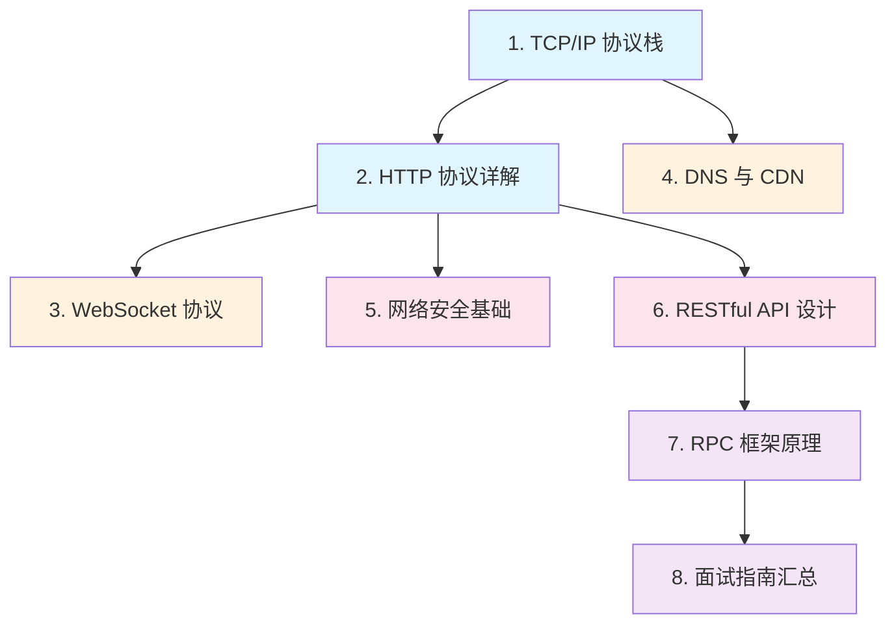

# 网络与协议

## 概念说明

网络与协议是 Java 后端开发者的**必备基础**。无论是日常开发中的 HTTP 接口调用、WebSocket 实时通信，还是面试中的 TCP 三次握手、HTTPS 加密流程，网络知识都是绕不开的核心考点。

本模块从传输层（TCP/UDP）到应用层（HTTP/WebSocket/RPC），系统梳理 Java 后端开发者需要掌握的网络协议知识，并配合可运行的 Java 代码示例加深理解。

## 知识点列表

| 序号 | 知识点 | 难度 | 面试频率 | 文档链接 |
|------|--------|------|----------|----------|
| 1 | TCP/IP 协议栈 | ⭐⭐⭐ | 🔥🔥🔥 | [tcp-ip](./01-tcp-ip.md) |
| 2 | HTTP 协议详解 | ⭐⭐⭐ | 🔥🔥🔥 | [http](./02-http.md) |
| 3 | WebSocket 协议 | ⭐⭐ | 🔥🔥 | [websocket](./03-websocket.md) |
| 4 | DNS 与 CDN | ⭐⭐ | 🔥🔥 | [dns-cdn](./04-dns-cdn.md) |
| 5 | 网络安全基础 | ⭐⭐⭐ | 🔥🔥🔥 | [security](./05-security.md) |
| 6 | RESTful API 设计 | ⭐⭐ | 🔥🔥🔥 | [restful](./06-restful.md) |
| 7 | RPC 框架原理 | ⭐⭐⭐ | 🔥🔥🔥 | [rpc](./07-rpc.md) |
| 8 | 网络面试指南 | ⭐⭐⭐ | 🔥🔥🔥 | [interview](./99-interview.md) |

## 推荐学习顺序

**学习路线说明**：
- 🔵 **基础层**（1-2）：先理解 TCP/IP 和 HTTP，这是一切网络通信的基石
- 🟠 **协议层**（3-4）：掌握 WebSocket 实时通信和 DNS 解析原理
- 🔴 **应用层**（5-6）：网络安全防护和 RESTful API 设计规范
- 🟣 **进阶层**（7-8）：RPC 框架原理和面试汇总

## 相关模块链接

- [Java 进阶 - 网络编程](/1-java-core/1.2-java-advanced/06-network-programming) — BIO/NIO/AIO/Netty 底层编程模型
- [并发编程](/1-java-core/1.3-concurrent/) — 网络服务端的多线程处理
- [Spring Boot](/2-framework/2.2-springboot/) — Web 开发、RESTful API 实现
- [Spring Cloud](/2-framework/2.3-springcloud/) — 微服务间的网络通信
- [Nginx](/4-middleware/4.6-nginx/) — 反向代理与负载均衡

## 参考资料

- [TCP/IP Illustrated, Volume 1](https://www.amazon.com/TCP-Illustrated-Protocols-Addison-Wesley-Professional/dp/0321336313)
- [HTTP: The Definitive Guide](https://www.oreilly.com/library/view/http-the-definitive/1565925092/)
- [RFC 793 - TCP](https://datatracker.ietf.org/doc/html/rfc793)
- [RFC 9110 - HTTP Semantics](https://datatracker.ietf.org/doc/html/rfc9110)
