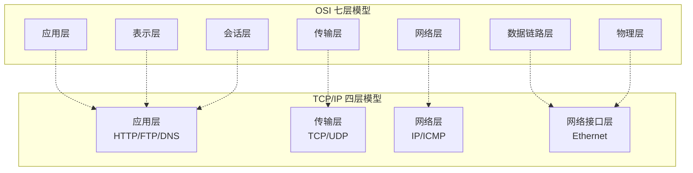
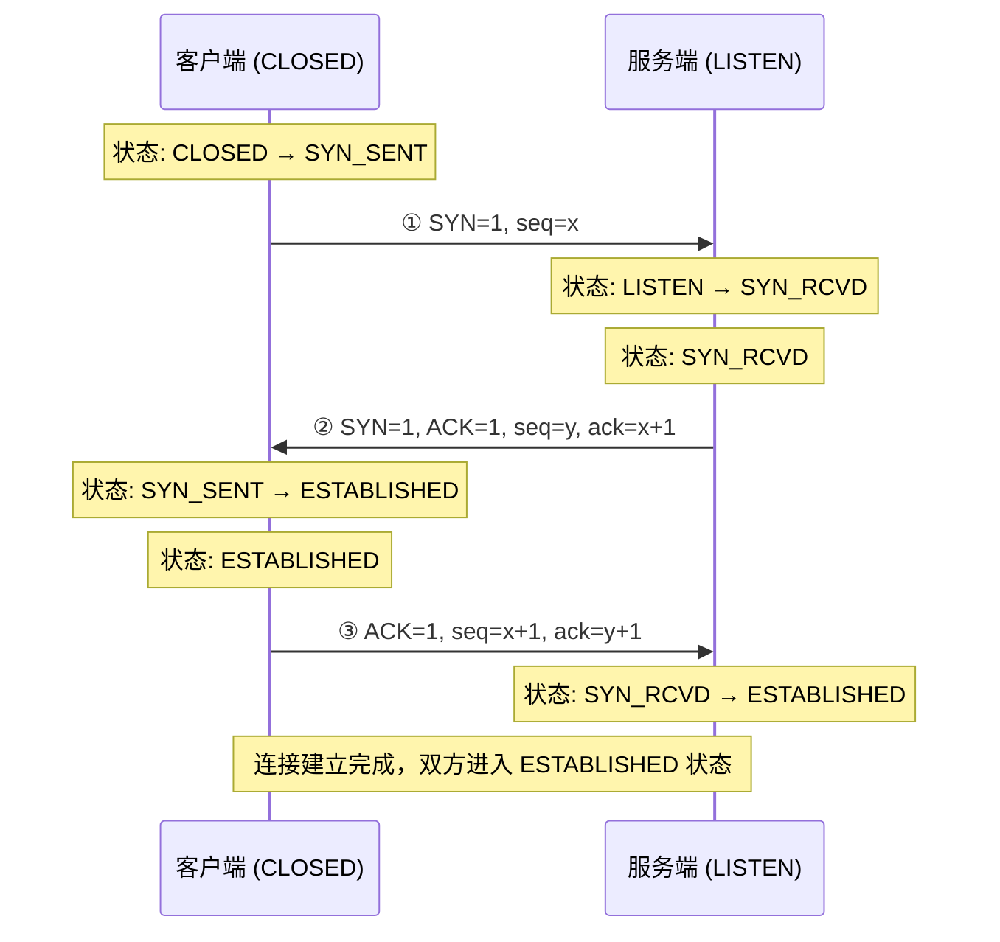
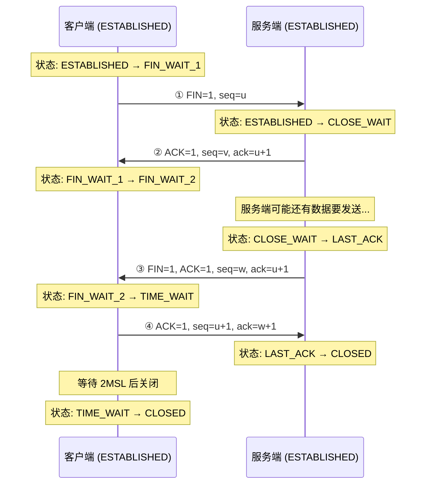
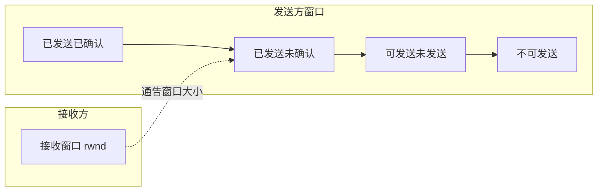
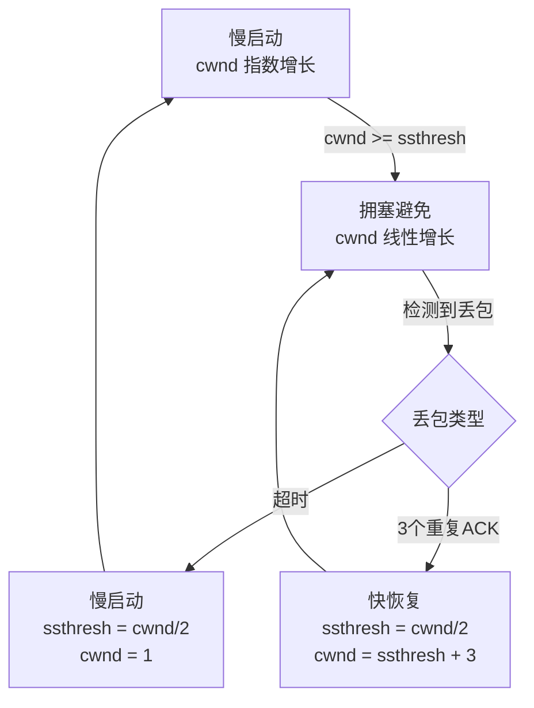

# TCP/IP 协议栈

## 概念说明

TCP/IP 协议栈是互联网通信的基石。作为 Java 后端开发者，理解 TCP/IP 不仅是面试必考内容，更是排查网络问题、优化系统性能的基础。

TCP（Transmission Control Protocol，传输控制协议）提供**可靠的、面向连接的、基于字节流**的传输服务；UDP（User Datagram Protocol，用户数据报协议）提供**无连接的、不可靠的**传输服务。两者各有适用场景。

## 核心原理

### 一、OSI 七层模型与 TCP/IP 四层模型

| OSI 七层 | TCP/IP 四层 | 协议示例 | 说明 |
|----------|------------|----------|------|
| 应用层 | 应用层 | HTTP、FTP、DNS、SMTP | 为应用程序提供网络服务 |
| 表示层 | 应用层 | SSL/TLS、JPEG | 数据格式转换、加密解密 |
| 会话层 | 应用层 | RPC、SQL | 建立和管理会话 |
| 传输层 | 传输层 | TCP、UDP | 端到端的可靠传输 |
| 网络层 | 网络层 | IP、ICMP、ARP | 路由选择和逻辑寻址 |
| 数据链路层 | 网络接口层 | Ethernet、PPP | 帧的传输和错误检测 |
| 物理层 | 网络接口层 | 光纤、双绞线 | 比特流的物理传输 |



### 二、TCP 三次握手（建立连接）

TCP 三次握手的目的是**确认双方的发送和接收能力都正常**，并协商初始序列号。



**三次握手详细流程**：

| 步骤 | 发送方 | 报文内容 | 目的 |
|------|--------|----------|------|
| 第一次 | 客户端→服务端 | SYN=1, seq=x | 客户端请求建立连接，发送初始序列号 x |
| 第二次 | 服务端→客户端 | SYN=1, ACK=1, seq=y, ack=x+1 | 服务端确认收到，发送自己的初始序列号 y |
| 第三次 | 客户端→服务端 | ACK=1, seq=x+1, ack=y+1 | 客户端确认收到服务端的 SYN |

> ⚠️ **为什么是三次而不是两次？** 两次握手无法防止**历史重复连接**的建立。如果客户端发送的旧 SYN 报文先到达服务端，两次握手会导致服务端错误地建立连接。三次握手让客户端有机会判断并拒绝这种过期连接。

### 三、TCP 四次挥手（断开连接）

TCP 四次挥手的目的是**确保双方都完成了数据传输**后再关闭连接。



**四次挥手详细流程**：

| 步骤 | 发送方 | 报文内容 | 说明 |
|------|--------|----------|------|
| 第一次 | 客户端→服务端 | FIN=1, seq=u | 客户端请求关闭，不再发送数据 |
| 第二次 | 服务端→客户端 | ACK=1, ack=u+1 | 服务端确认收到 FIN，但可能还有数据要发 |
| 第三次 | 服务端→客户端 | FIN=1, seq=w | 服务端数据发完，请求关闭 |
| 第四次 | 客户端→服务端 | ACK=1, ack=w+1 | 客户端确认，进入 TIME_WAIT |

> ⚠️ **为什么需要 TIME_WAIT 等待 2MSL？**
> 1. 确保最后一个 ACK 能到达服务端（如果丢失，服务端会重发 FIN）
> 2. 确保本次连接的所有报文都从网络中消失，避免影响新连接

### 四、TCP 滑动窗口与流量控制

滑动窗口机制用于**流量控制**，防止发送方发送过快导致接收方缓冲区溢出。



**核心概念**：
- **发送窗口**：发送方可以连续发送的数据量，由接收方的接收窗口（rwnd）决定
- **接收窗口**：接收方缓冲区中可用的空间大小
- **零窗口**：当接收方缓冲区满时，通告窗口为 0，发送方暂停发送

### 五、TCP 拥塞控制

拥塞控制防止**网络过载**，包含四个核心算法：



| 算法 | 触发条件 | 行为 |
|------|----------|------|
| 慢启动 | 连接建立初期 | cwnd 从 1 开始，每个 RTT 翻倍 |
| 拥塞避免 | cwnd ≥ ssthresh | cwnd 每个 RTT 加 1 |
| 快重传 | 收到 3 个重复 ACK | 立即重传丢失的报文 |
| 快恢复 | 快重传后 | ssthresh = cwnd/2，cwnd = ssthresh + 3 |

### 六、TCP 与 UDP 对比

| 特性 | TCP | UDP |
|------|-----|-----|
| 连接方式 | 面向连接（三次握手） | 无连接 |
| 可靠性 | 可靠传输（确认、重传、排序） | 不可靠，尽最大努力交付 |
| 传输方式 | 字节流 | 数据报 |
| 拥塞控制 | 有 | 无 |
| 首部开销 | 20 字节（最小） | 8 字节 |
| 传输效率 | 较低 | 较高 |
| 适用场景 | 文件传输、HTTP、邮件 | 视频直播、DNS 查询、游戏 |

## 代码示例

### TCP 客户端/服务端通信

```java
// TCP 服务端 — BIO 模型
try (ServerSocket serverSocket = new ServerSocket(8080)) {
    System.out.println("服务端启动，监听端口 8080...");
    while (true) {
        Socket client = serverSocket.accept(); // 阻塞等待连接
        new Thread(() -> handleClient(client)).start();
    }
}

// TCP 客户端
try (Socket socket = new Socket("localhost", 8080)) {
    PrintWriter out = new PrintWriter(socket.getOutputStream(), true);
    BufferedReader in = new BufferedReader(
        new InputStreamReader(socket.getInputStream()));
    out.println("Hello, Server!");
    String response = in.readLine();
    System.out.println("收到响应: " + response);
}
```

> 💻 完整可运行代码：[TCPDemo.java](../../../code-examples/02-framework/network-programming/src/main/java/com/example/network/tcp/TCPDemo.java)

## 常见面试题

### Q1: TCP 三次握手的过程？为什么是三次而不是两次？

**难度**：⭐⭐⭐ | **频率**：🔥🔥🔥

**答题思路**：

1. 先描述三次握手的具体过程（SYN → SYN+ACK → ACK）
2. 解释每次握手的目的
3. 说明为什么两次不够（历史连接问题）

**标准答案**：

三次握手过程：客户端发送 SYN 报文（seq=x），服务端收到后回复 SYN+ACK（seq=y, ack=x+1），客户端再发送 ACK（ack=y+1）。三次握手的核心目的是确认双方的发送和接收能力，并同步初始序列号。

两次握手不够的原因：如果只有两次握手，当客户端的一个旧 SYN 报文因网络延迟先到达服务端时，服务端会直接建立连接并分配资源，但客户端并不认可这个连接，导致服务端资源浪费。三次握手让客户端有机会通过第三次 ACK 来确认或拒绝连接。

**深入追问**：

- 三次握手中如果第三次 ACK 丢失会怎样？（服务端重传 SYN+ACK，超时后关闭）
- SYN Flood 攻击的原理和防御？（大量半连接，用 SYN Cookie 防御）
- 初始序列号（ISN）为什么要随机？（防止历史报文干扰和安全攻击）

**易错点**：

- 不要把 TCP 的 RUNNABLE 和操作系统的 Ready/Running 混淆
- TIME_WAIT 是在主动关闭方，不是被动关闭方

### Q2: TCP 四次挥手的过程？为什么需要 TIME_WAIT？

**难度**：⭐⭐⭐ | **频率**：🔥🔥🔥

**答题思路**：

1. 描述四次挥手的过程
2. 解释为什么是四次而不是三次（半关闭状态）
3. 说明 TIME_WAIT 的作用和 2MSL 的含义

**标准答案**：

四次挥手过程：主动关闭方发送 FIN，被动关闭方回复 ACK（此时被动方可能还有数据要发），被动方数据发完后也发送 FIN，主动关闭方回复 ACK 后进入 TIME_WAIT 状态，等待 2MSL 后关闭。

TIME_WAIT 存在的原因：(1) 确保最后一个 ACK 能到达对方，如果丢失对方会重发 FIN；(2) 确保本次连接的所有报文都从网络中消失，不会影响后续新连接。

**深入追问**：

- 大量 TIME_WAIT 怎么处理？（调整 tcp_tw_reuse、tcp_tw_recycle 参数）
- 大量 CLOSE_WAIT 说明什么问题？（程序没有正确关闭连接，代码 bug）
- 四次挥手能否合并为三次？（可以，当被动方没有数据要发时，FIN 和 ACK 可以合并）

**易错点**：

- TIME_WAIT 是在主动关闭方，不是被动关闭方
- CLOSE_WAIT 是在被动关闭方，通常是代码没有调用 close()

### Q3: TCP 和 UDP 的区别？各自的应用场景？

**难度**：⭐⭐ | **频率**：🔥🔥🔥

**答题思路**：

1. 从连接方式、可靠性、传输效率等维度对比
2. 举出各自的典型应用场景

**标准答案**：

TCP 是面向连接的可靠传输协议，通过三次握手建立连接，提供确认、重传、排序机制保证数据可靠到达，适用于文件传输、HTTP 通信、邮件等对可靠性要求高的场景。UDP 是无连接的不可靠传输协议，没有握手过程，首部开销小（8 字节 vs TCP 的 20 字节），传输效率高，适用于视频直播、DNS 查询、在线游戏等对实时性要求高、可以容忍少量丢包的场景。

**深入追问**：

- 如何基于 UDP 实现可靠传输？（QUIC 协议、KCP 协议）
- TCP 粘包/拆包问题怎么解决？（定长、分隔符、长度字段）

## 参考资料

- [RFC 793 - TCP](https://datatracker.ietf.org/doc/html/rfc793)
- [RFC 768 - UDP](https://datatracker.ietf.org/doc/html/rfc768)
- [TCP/IP Illustrated, Volume 1](https://www.amazon.com/TCP-Illustrated-Protocols-Addison-Wesley-Professional/dp/0321336313)
