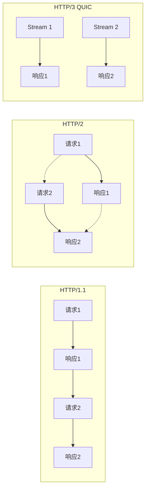
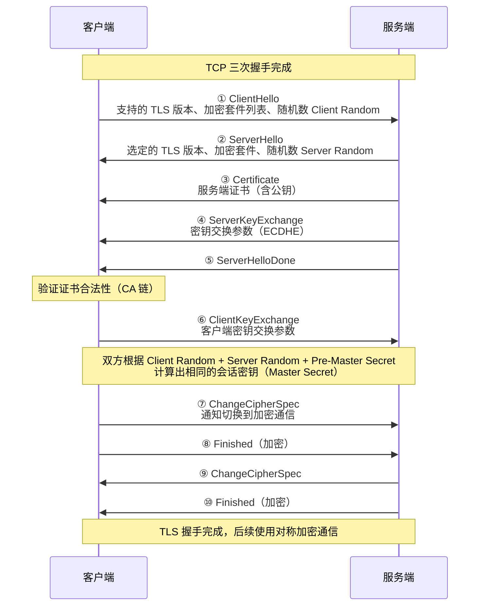
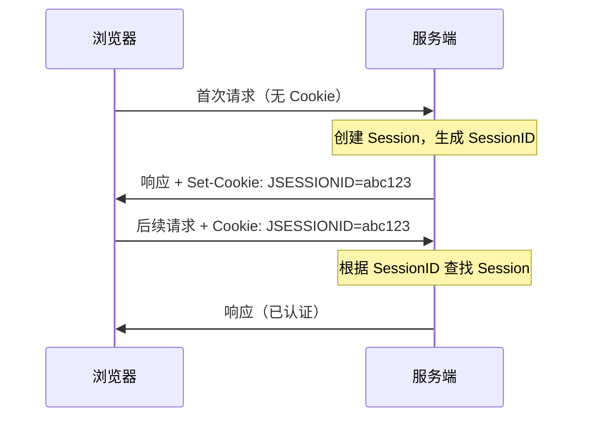

# HTTP 协议详解

## 概念说明

HTTP（HyperText Transfer Protocol，超文本传输协议）是 Web 通信的基础协议，基于 TCP 的**请求-响应**模型。作为 Java 后端开发者，HTTP 是每天都在打交道的协议——从 RESTful API 到微服务调用，从浏览器请求到 CDN 加速，HTTP 无处不在。

## 核心原理

### 一、HTTP/1.1 vs HTTP/2 vs HTTP/3 对比

| 特性 | HTTP/1.1 | HTTP/2 | HTTP/3 |
|------|----------|--------|--------|
| 传输层 | TCP | TCP | QUIC (UDP) |
| 多路复用 | ❌ 队头阻塞 | ✅ 二进制帧 | ✅ 无队头阻塞 |
| 头部压缩 | ❌ | ✅ HPACK | ✅ QPACK |
| 服务器推送 | ❌ | ✅ | ✅ |
| 连接建立 | TCP 三次握手 + TLS | TCP + TLS | 0-RTT / 1-RTT |
| 队头阻塞 | 应用层 + 传输层 | 传输层 | ❌ 无 |
| 发布年份 | 1997 | 2015 | 2022 |



### 二、HTTPS 加密流程（TLS 1.2 握手）

HTTPS = HTTP + TLS/SSL，在 TCP 连接建立后、HTTP 通信前，增加 TLS 握手过程。



**TLS 握手核心要点**：
- **非对称加密**用于密钥交换（RSA/ECDHE），解决密钥分发问题
- **对称加密**用于数据传输（AES），性能远高于非对称加密
- **数字证书**用于验证服务端身份，防止中间人攻击
- **TLS 1.3** 将握手简化为 1-RTT，甚至支持 0-RTT 恢复

### 三、HTTP 状态码

| 分类 | 范围 | 含义 | 常见状态码 |
|------|------|------|-----------|
| 1xx | 100-199 | 信息性 | 100 Continue、101 Switching Protocols |
| 2xx | 200-299 | 成功 | 200 OK、201 Created、204 No Content |
| 3xx | 300-399 | 重定向 | 301 永久重定向、302 临时重定向、304 Not Modified |
| 4xx | 400-499 | 客户端错误 | 400 Bad Request、401 Unauthorized、403 Forbidden、404 Not Found |
| 5xx | 500-599 | 服务端错误 | 500 Internal Server Error、502 Bad Gateway、503 Service Unavailable |

> ⚠️ **面试高频**：301 vs 302 的区别？304 的原理？502 vs 504 的区别？

### 四、HTTP 请求方法

| 方法 | 语义 | 幂等性 | 安全性 | 请求体 |
|------|------|--------|--------|--------|
| GET | 获取资源 | ✅ | ✅ | 无 |
| POST | 创建资源 | ❌ | ❌ | 有 |
| PUT | 全量更新 | ✅ | ❌ | 有 |
| PATCH | 部分更新 | ❌ | ❌ | 有 |
| DELETE | 删除资源 | ✅ | ❌ | 可选 |
| HEAD | 获取头信息 | ✅ | ✅ | 无 |
| OPTIONS | 预检请求 | ✅ | ✅ | 无 |

### 五、Cookie 与 Session



| 特性 | Cookie | Session |
|------|--------|---------|
| 存储位置 | 客户端（浏览器） | 服务端（内存/Redis） |
| 安全性 | 较低（可被篡改） | 较高 |
| 大小限制 | 4KB | 无限制（受服务器内存限制） |
| 生命周期 | 可设置过期时间 | 默认 30 分钟（可配置） |
| 跨域 | 受同源策略限制 | 不涉及 |

### 六、Keep-Alive 长连接

HTTP/1.0 默认短连接（每次请求都建立新的 TCP 连接），HTTP/1.1 默认开启 Keep-Alive 长连接，复用 TCP 连接发送多个请求。

```
# HTTP/1.1 默认开启
Connection: keep-alive
Keep-Alive: timeout=5, max=100

# 关闭长连接
Connection: close
```

## 代码示例

### Java HttpClient 使用

```java
// Java 11+ HttpClient — 发送 GET 请求
HttpClient client = HttpClient.newBuilder()
    .version(HttpClient.Version.HTTP_2)
    .connectTimeout(Duration.ofSeconds(10))
    .build();

HttpRequest request = HttpRequest.newBuilder()
    .uri(URI.create("https://httpbin.org/get"))
    .header("Accept", "application/json")
    .GET()
    .build();

HttpResponse<String> response = client.send(request,
    HttpResponse.BodyHandlers.ofString());
System.out.println("状态码: " + response.statusCode());
System.out.println("响应体: " + response.body());
```

> 💻 完整可运行代码：[HttpDemo.java](https://github.com/skyhe58/guide-java/tree/main/code-examples/02-framework/network-programming/src/main/java/com/example/network/http/HttpDemo.java)
> <!-- 本地路径：code-examples/02-framework/network-programming/src/main/java/com/example/network/http/HttpDemo.java -->

## 常见面试题

### Q1: HTTP/1.1、HTTP/2、HTTP/3 有什么区别？

**难度**：⭐⭐⭐ | **频率**：🔥🔥🔥

**答题思路**：

1. 从多路复用、头部压缩、传输层协议三个维度对比
2. 重点说明 HTTP/2 解决了什么问题，HTTP/3 又解决了什么问题

**标准答案**：

HTTP/1.1 存在队头阻塞问题，一个请求必须等前一个响应完成才能发送。HTTP/2 引入二进制帧和多路复用，在一个 TCP 连接上并行传输多个请求/响应，同时支持头部压缩（HPACK）和服务器推送。但 HTTP/2 仍基于 TCP，存在 TCP 层的队头阻塞。HTTP/3 基于 QUIC 协议（UDP），彻底解决了队头阻塞问题，并将连接建立缩短到 0-1 RTT。

**深入追问**：

- HTTP/2 的多路复用是如何实现的？（二进制帧、流、帧的交错传输）
- QUIC 协议的核心优势是什么？（0-RTT、无队头阻塞、连接迁移）

### Q2: HTTPS 的加密流程是怎样的？

**难度**：⭐⭐⭐ | **频率**：🔥🔥🔥

**答题思路**：

1. 先说 HTTPS = HTTP + TLS
2. 描述 TLS 握手过程
3. 说明非对称加密和对称加密各自的作用

**标准答案**：

HTTPS 在 TCP 连接建立后进行 TLS 握手。客户端发送 ClientHello（支持的加密套件、随机数），服务端回复 ServerHello（选定的加密套件、随机数、证书）。客户端验证证书后，双方通过密钥交换算法（如 ECDHE）协商出预主密钥，再结合两个随机数生成会话密钥。后续通信使用对称加密（如 AES）。非对称加密用于安全地交换密钥，对称加密用于高效地传输数据。

**深入追问**：

- 证书是如何验证的？（CA 证书链、根证书）
- 中间人攻击是如何防御的？（数字证书、证书固定）
- TLS 1.3 相比 1.2 有什么改进？（1-RTT、移除不安全算法）

### Q3: GET 和 POST 的区别？

**难度**：⭐⭐ | **频率**：🔥🔥🔥

**答题思路**：

1. 从语义、幂等性、安全性、参数传递方式等维度对比
2. 纠正常见误区

**标准答案**：

从 HTTP 规范角度：GET 用于获取资源，是幂等且安全的；POST 用于创建资源，非幂等非安全。GET 参数通过 URL 传递，POST 参数在请求体中。GET 请求可被缓存和收藏，POST 不行。

常见误区纠正：GET 并非不能有请求体（规范不禁止但不推荐），POST 参数也并非更安全（HTTPS 下都是加密的），GET 的 URL 长度限制是浏览器和服务器的限制而非 HTTP 协议限制。

**深入追问**：

- PUT 和 PATCH 的区别？（全量更新 vs 部分更新）
- 什么是幂等性？哪些方法是幂等的？

## 参考资料

- [RFC 9110 - HTTP Semantics](https://datatracker.ietf.org/doc/html/rfc9110)
- [RFC 9113 - HTTP/2](https://datatracker.ietf.org/doc/html/rfc9113)
- [RFC 9114 - HTTP/3](https://datatracker.ietf.org/doc/html/rfc9114)
- [MDN - HTTP](https://developer.mozilla.org/zh-CN/docs/Web/HTTP)
