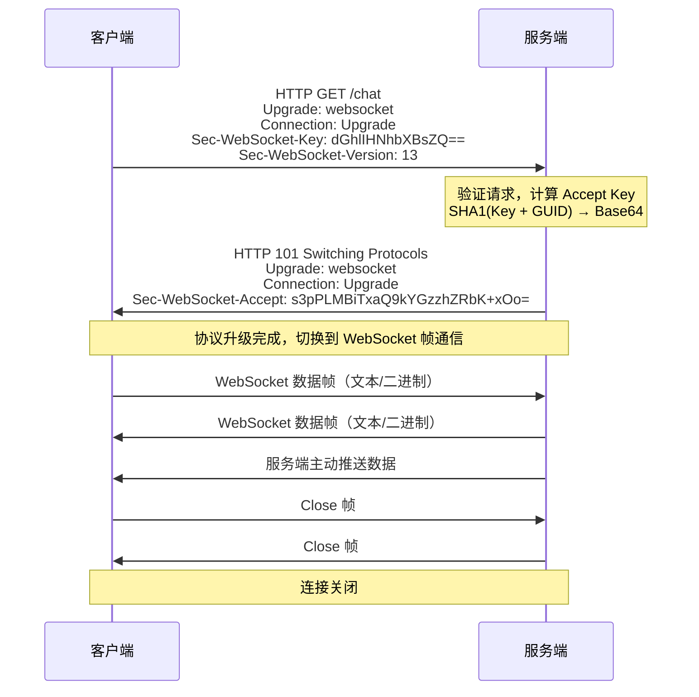

# WebSocket 协议

## 概念说明

WebSocket 是一种在单个 TCP 连接上进行**全双工通信**的协议。与 HTTP 的请求-响应模式不同，WebSocket 允许服务端主动向客户端推送数据，非常适合实时聊天、股票行情、在线游戏等需要低延迟双向通信的场景。

## 核心原理

### 一、WebSocket 与 HTTP 的区别

| 特性 | HTTP | WebSocket |
|------|------|-----------|
| 通信模式 | 请求-响应（半双工） | 全双工 |
| 连接方式 | 短连接（或 Keep-Alive） | 持久连接 |
| 服务端推送 | 不支持（需轮询） | 原生支持 |
| 协议标识 | `http://` / `https://` | `ws://` / `wss://` |
| 数据格式 | 文本 | 文本或二进制帧 |
| 头部开销 | 每次请求都带完整头部 | 握手后帧头仅 2-14 字节 |
| 适用场景 | 普通 Web 请求 | 实时通信、推送 |

### 二、WebSocket 握手过程

WebSocket 通过 HTTP Upgrade 机制建立连接：



**握手要点**：
1. 客户端发送 HTTP GET 请求，带上 `Upgrade: websocket` 头
2. 服务端返回 `101 Switching Protocols`，表示协议升级成功
3. `Sec-WebSocket-Key` 用于防止缓存代理误转发，不是加密用途
4. 握手完成后，通信切换为 WebSocket 帧格式，不再使用 HTTP

### 三、WebSocket 帧格式

```
 0                   1                   2                   3
 0 1 2 3 4 5 6 7 8 9 0 1 2 3 4 5 6 7 8 9 0 1 2 3 4 5 6 7 8 9 0 1
+-+-+-+-+-------+-+-------------+-------------------------------+
|F|R|R|R| opcode|M| Payload len |    Extended payload length    |
|I|S|S|S|  (4)  |A|     (7)     |             (16/64)           |
|N|V|V|V|       |S|             |   (if payload len==126/127)   |
| |1|2|3|       |K|             |                               |
+-+-+-+-+-------+-+-------------+-------------------------------+
|     Masking-key (0 or 4 bytes)                                |
+-------------------------------+-------------------------------+
|                     Payload Data                              |
+---------------------------------------------------------------+
```

| 字段 | 说明 |
|------|------|
| FIN | 是否为消息的最后一帧 |
| opcode | 帧类型：0x1 文本、0x2 二进制、0x8 关闭、0x9 Ping、0xA Pong |
| MASK | 客户端→服务端必须掩码，服务端→客户端不掩码 |
| Payload len | 负载长度（7bit/16bit/64bit） |

### 四、心跳机制

WebSocket 通过 Ping/Pong 帧实现心跳检测，保持连接活跃：

```
客户端/服务端 → Ping 帧（opcode=0x9）
对方 → Pong 帧（opcode=0xA，携带相同数据）
```

如果一段时间内没有收到 Pong 响应，则认为连接已断开。

## 代码示例

### Java WebSocket 服务端/客户端

```java
// WebSocket 服务端（基于 Java 标准 API 模拟）
ServerSocket serverSocket = new ServerSocket(8081);
Socket client = serverSocket.accept();
// 读取 HTTP 升级请求，发送 101 响应
// 切换到 WebSocket 帧通信...

// WebSocket 客户端（基于 java.net.http）
HttpClient httpClient = HttpClient.newHttpClient();
WebSocket ws = httpClient.newWebSocketBuilder()
    .buildAsync(URI.create("ws://localhost:8081/chat"), listener)
    .join();
ws.sendText("Hello WebSocket!", true);
```

> 💻 完整可运行代码：[WebSocketDemo.java](https://github.com/skyhe58/guide-java/tree/main/code-examples/02-framework/network-programming/src/main/java/com/example/network/websocket/WebSocketDemo.java)
> <!-- 本地路径：code-examples/02-framework/network-programming/src/main/java/com/example/network/websocket/WebSocketDemo.java -->

## 常见面试题

### Q1: WebSocket 和 HTTP 有什么区别？

**难度**：⭐⭐ | **频率**：🔥🔥🔥

**答题思路**：

1. 从通信模式、连接方式、数据推送能力对比
2. 说明 WebSocket 的建立过程依赖 HTTP

**标准答案**：

HTTP 是请求-响应模式的半双工协议，客户端发起请求后服务端才能响应，服务端无法主动推送数据。WebSocket 是全双工协议，建立连接后双方可以随时发送数据。WebSocket 通过 HTTP Upgrade 机制建立连接（101 Switching Protocols），握手完成后切换为独立的 WebSocket 帧协议，头部开销极小（2-14 字节 vs HTTP 的数百字节）。

**深入追问**：

- WebSocket 的心跳机制是怎样的？（Ping/Pong 帧）
- 如果不用 WebSocket，还有哪些实时通信方案？（SSE、长轮询、短轮询）
- WebSocket 如何处理断线重连？（客户端定时检测 + 自动重连策略）

### Q2: WebSocket 的握手过程是怎样的？

**难度**：⭐⭐⭐ | **频率**：🔥🔥

**答题思路**：

1. 描述 HTTP Upgrade 请求
2. 说明 Sec-WebSocket-Key 的作用
3. 解释 101 状态码

**标准答案**：

WebSocket 握手基于 HTTP。客户端发送 GET 请求，携带 `Upgrade: websocket`、`Connection: Upgrade`、`Sec-WebSocket-Key`（随机 Base64 字符串）和 `Sec-WebSocket-Version: 13` 头。服务端验证后返回 101 Switching Protocols，并在 `Sec-WebSocket-Accept` 中返回 Key 与固定 GUID 拼接后的 SHA1 Base64 值。握手完成后，TCP 连接保持，通信协议从 HTTP 切换为 WebSocket 帧格式。

**深入追问**：

- Sec-WebSocket-Key 的作用是什么？（防止缓存代理误转发，不是加密）
- WebSocket 能否跨域？（可以，不受同源策略限制，但服务端可以检查 Origin）

### Q3: WebSocket 适用于哪些场景？如何选择 WebSocket 和 SSE？

**难度**：⭐⭐ | **频率**：🔥🔥

**标准答案**：

WebSocket 适用于需要双向实时通信的场景：在线聊天、协同编辑、实时游戏、股票行情推送等。SSE（Server-Sent Events）是单向的服务端推送，基于 HTTP，适用于只需要服务端向客户端推送的场景（如通知、日志流）。选择原则：需要双向通信用 WebSocket，只需服务端推送用 SSE（更简单、自动重连、支持 HTTP/2 多路复用）。

**深入追问**：

- SSE 和 WebSocket 的性能对比？
- 在微服务架构中如何实现 WebSocket 的负载均衡？（sticky session 或消息广播）

## 参考资料

- [RFC 6455 - The WebSocket Protocol](https://datatracker.ietf.org/doc/html/rfc6455)
- [MDN - WebSocket API](https://developer.mozilla.org/zh-CN/docs/Web/API/WebSocket)
