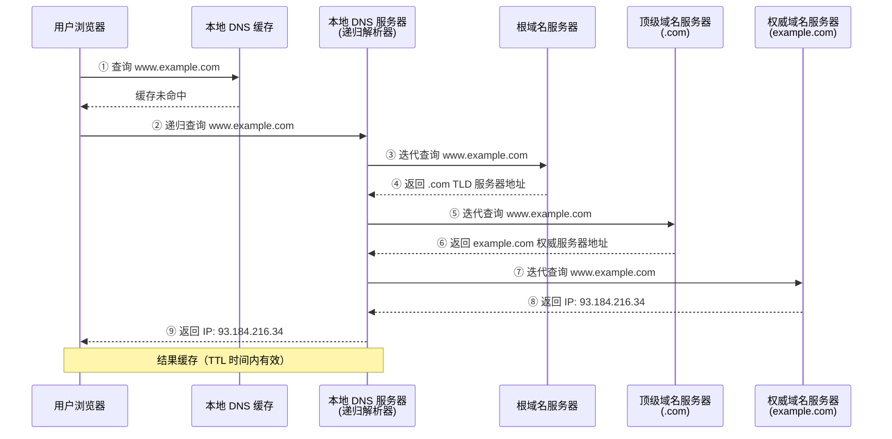
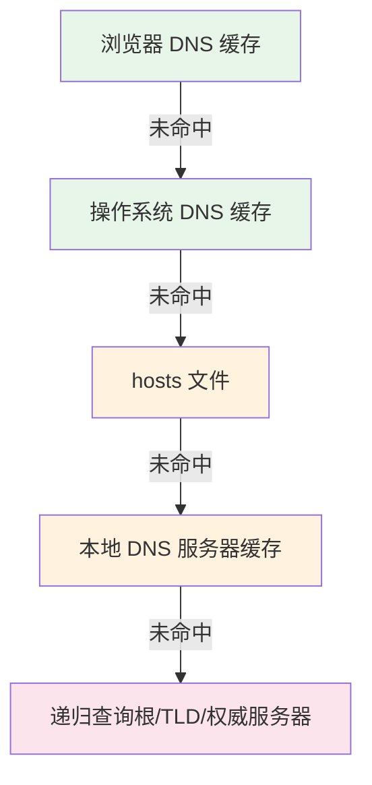
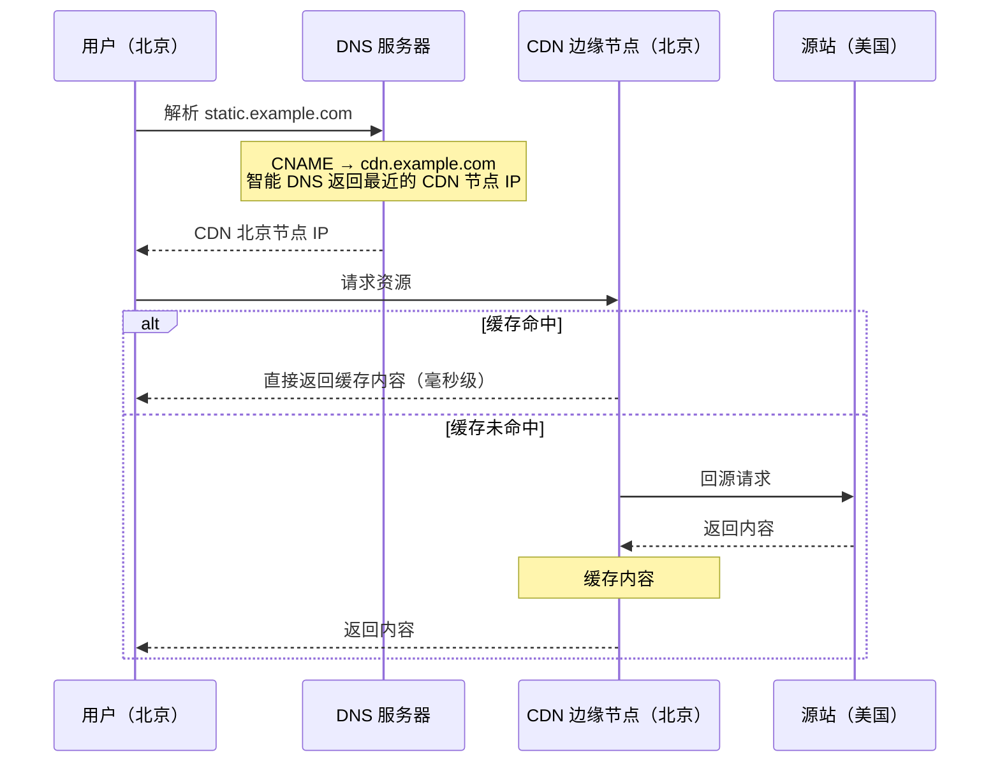

# DNS 与 CDN

## 概念说明

DNS（Domain Name System，域名系统）是互联网的"电话簿"，将人类可读的域名（如 `www.example.com`）转换为机器可识别的 IP 地址。CDN（Content Delivery Network，内容分发网络）通过将内容缓存到全球各地的边缘节点，加速用户访问。

理解 DNS 解析过程和 CDN 加速原理，有助于排查域名解析问题、优化网站访问速度。

## 核心原理

### 一、DNS 解析过程

DNS 解析分为**递归查询**和**迭代查询**两种方式：



**递归查询 vs 迭代查询**：

| 类型 | 说明 | 使用场景 |
|------|------|----------|
| 递归查询 | 客户端只发一次请求，DNS 服务器负责完整解析 | 客户端 → 本地 DNS 服务器 |
| 迭代查询 | DNS 服务器返回下一步应该查询的服务器地址 | 本地 DNS 服务器 → 各级域名服务器 |

### 二、DNS 缓存层级

DNS 缓存存在于多个层级，命中缓存可以大幅减少解析时间：



| 缓存层级 | TTL | 说明 |
|----------|-----|------|
| 浏览器缓存 | 约 1 分钟 | Chrome: `chrome://net-internals/#dns` |
| 操作系统缓存 | 跟随 DNS TTL | Linux: `systemd-resolve --statistics` |
| hosts 文件 | 永久 | `/etc/hosts` 或 `C:\Windows\System32\drivers\etc\hosts` |
| 本地 DNS 服务器 | 跟随 DNS TTL | ISP 提供或自建（如 114.114.114.114） |

### 三、DNS 记录类型

| 记录类型 | 说明 | 示例 |
|----------|------|------|
| A | 域名 → IPv4 地址 | `example.com → 93.184.216.34` |
| AAAA | 域名 → IPv6 地址 | `example.com → 2606:2800:220:1:...` |
| CNAME | 域名别名 | `www.example.com → example.com` |
| MX | 邮件服务器 | `example.com → mail.example.com` |
| NS | 域名服务器 | `example.com → ns1.example.com` |
| TXT | 文本记录 | SPF、DKIM 验证 |

### 四、CDN 原理与加速机制

CDN 通过**就近访问**和**内容缓存**加速用户请求：



**CDN 核心组件**：

| 组件 | 作用 |
|------|------|
| 智能 DNS | 根据用户地理位置、网络状况返回最优 CDN 节点 |
| 边缘节点 | 分布在全球各地的缓存服务器，就近服务用户 |
| 回源机制 | 缓存未命中时从源站获取内容 |
| 缓存策略 | 根据 Cache-Control、Expires 等头部控制缓存时间 |

**CDN 适用内容**：
- ✅ 静态资源（JS/CSS/图片/视频）
- ✅ 大文件下载
- ✅ 音视频流媒体
- ❌ 动态 API 请求（但可用动态加速 DCDN）

## 代码示例

```java
// Java 中进行 DNS 解析
InetAddress[] addresses = InetAddress.getAllByName("www.example.com");
for (InetAddress addr : addresses) {
    System.out.println("IP: " + addr.getHostAddress());
}
```

> 💻 完整可运行代码：[HttpDemo.java](../../../code-examples/02-framework/network-programming/src/main/java/com/example/network/http/HttpDemo.java)（包含 DNS 解析示例）

## 常见面试题

### Q1: 浏览器输入 URL 到页面展示的全过程？

**难度**：⭐⭐⭐ | **频率**：🔥🔥🔥

**答题思路**：

1. DNS 解析 → TCP 连接 → TLS 握手 → HTTP 请求 → 服务端处理 → 响应返回 → 浏览器渲染

**标准答案**：

(1) DNS 解析：浏览器缓存 → OS 缓存 → hosts → 本地 DNS → 递归查询，获取目标 IP；(2) TCP 三次握手建立连接；(3) 如果是 HTTPS，进行 TLS 握手；(4) 发送 HTTP 请求；(5) 服务端处理请求，返回 HTTP 响应；(6) 浏览器解析 HTML，构建 DOM 树，加载 CSS/JS 等资源；(7) 渲染页面（Layout → Paint → Composite）。

**深入追问**：

- DNS 解析过程中有哪些缓存？
- 如何优化首屏加载速度？（CDN、资源压缩、懒加载、预加载）

### Q2: DNS 的递归查询和迭代查询有什么区别？

**难度**：⭐⭐ | **频率**：🔥🔥

**标准答案**：

递归查询中，客户端只发一次请求，本地 DNS 服务器负责完成整个解析过程并返回最终结果。迭代查询中，DNS 服务器不会代为查询，而是返回下一步应该查询的服务器地址，由请求方自己继续查询。通常客户端到本地 DNS 服务器使用递归查询，本地 DNS 服务器到各级域名服务器使用迭代查询。

**深入追问**：

- DNS 劫持是什么？如何防御？（DNSSEC、DoH/DoT）
- DNS 负载均衡是如何实现的？（一个域名对应多个 A 记录，轮询返回）

### Q3: CDN 的工作原理是什么？

**难度**：⭐⭐ | **频率**：🔥🔥

**标准答案**：

CDN 通过在全球部署边缘节点缓存内容，利用智能 DNS 将用户请求导向最近的节点。用户请求域名时，DNS 返回最优 CDN 节点 IP，用户直接从边缘节点获取缓存内容。如果缓存未命中，CDN 节点回源获取内容并缓存。CDN 主要加速静态资源访问，减少源站压力，降低网络延迟。

**深入追问**：

- CDN 缓存如何更新？（TTL 过期、主动刷新、版本号）
- CDN 回源策略有哪些？（全量回源、Range 回源）

## 参考资料

- [RFC 1035 - DNS](https://datatracker.ietf.org/doc/html/rfc1035)
- [What is a CDN? - Cloudflare](https://www.cloudflare.com/learning/cdn/what-is-a-cdn/)
