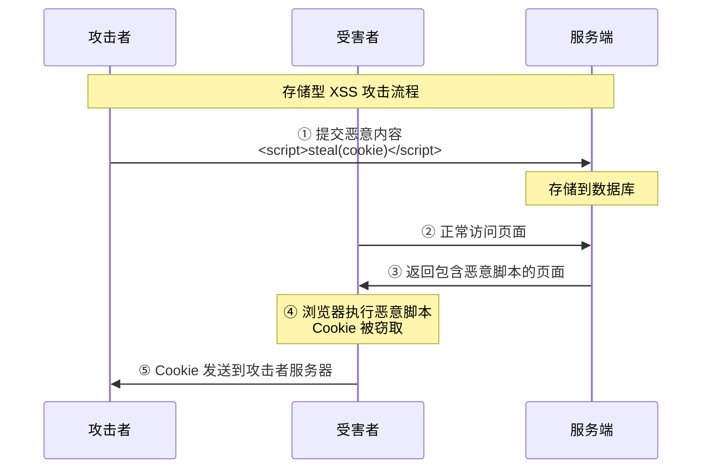
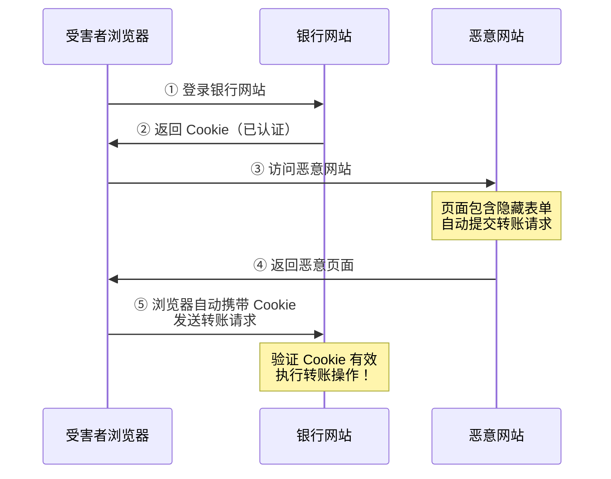
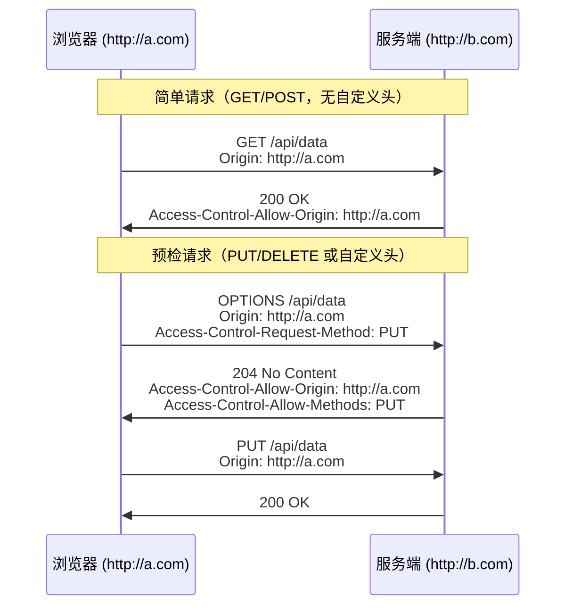

# 网络安全基础

## 概念说明

Web 安全是后端开发者的必备知识。常见的 Web 攻击包括 XSS（跨站脚本攻击）、CSRF（跨站请求伪造）、SQL 注入等。理解这些攻击的原理和防御方法，是构建安全 Web 应用的基础。

## 核心原理

### 一、XSS（Cross-Site Scripting，跨站脚本攻击）

XSS 攻击通过在网页中注入恶意脚本，窃取用户信息或执行恶意操作。

#### 三种 XSS 类型

| 类型 | 存储位置 | 触发方式 | 危害程度 |
|------|----------|----------|----------|
| 存储型 XSS | 服务端数据库 | 用户访问包含恶意脚本的页面 | ⭐⭐⭐ 最高 |
| 反射型 XSS | URL 参数 | 用户点击恶意链接 | ⭐⭐ |
| DOM 型 XSS | 前端 DOM | 前端 JS 直接操作 DOM | ⭐⭐ |



#### XSS 防御措施

| 防御方式 | 说明 |
|----------|------|
| 输入过滤 | 对用户输入进行转义（`<` → `&lt;`） |
| 输出编码 | 根据输出上下文进行编码（HTML/JS/URL） |
| CSP | Content-Security-Policy 头限制脚本来源 |
| HttpOnly | Cookie 设置 HttpOnly，JS 无法读取 |
| X-XSS-Protection | 浏览器内置 XSS 过滤器 |

### 二、CSRF（Cross-Site Request Forgery，跨站请求伪造）

CSRF 利用用户已登录的身份，在用户不知情的情况下发送恶意请求。



#### CSRF 防御措施

| 防御方式 | 说明 |
|----------|------|
| CSRF Token | 服务端生成随机 Token，表单提交时验证 |
| SameSite Cookie | 设置 `SameSite=Strict/Lax`，限制跨站携带 Cookie |
| Referer 检查 | 验证请求来源是否为合法域名 |
| 双重 Cookie | 将 Token 同时放在 Cookie 和请求参数中对比 |

### 三、SQL 注入防护

SQL 注入通过在输入中嵌入 SQL 代码，篡改数据库查询逻辑。

```
# 恶意输入
用户名: admin' OR '1'='1' --
密码: 任意

# 拼接后的 SQL（危险！）
SELECT * FROM users WHERE username='admin' OR '1'='1' --' AND password='任意'
```

#### SQL 注入防御

| 防御方式 | 说明 | 示例 |
|----------|------|------|
| 参数化查询 | 使用预编译语句 | `PreparedStatement` |
| ORM 框架 | MyBatis `#{}` / JPA | 自动参数化 |
| 输入验证 | 白名单校验 | 正则表达式 |
| 最小权限 | 数据库账号最小权限 | 只读账号 |

```java
// ❌ 危险：字符串拼接
String sql = "SELECT * FROM users WHERE name='" + name + "'";

// ✅ 安全：参数化查询
PreparedStatement ps = conn.prepareStatement(
    "SELECT * FROM users WHERE name = ?");
ps.setString(1, name);
```

### 四、CORS（Cross-Origin Resource Sharing，跨域资源共享）

浏览器的**同源策略**限制了不同源之间的资源访问。CORS 是一种机制，允许服务端声明哪些外部源可以访问其资源。



**同源的定义**：协议 + 域名 + 端口 三者完全相同。

| CORS 响应头 | 说明 |
|-------------|------|
| `Access-Control-Allow-Origin` | 允许的源（`*` 或具体域名） |
| `Access-Control-Allow-Methods` | 允许的 HTTP 方法 |
| `Access-Control-Allow-Headers` | 允许的请求头 |
| `Access-Control-Allow-Credentials` | 是否允许携带 Cookie |
| `Access-Control-Max-Age` | 预检请求缓存时间 |

## 代码示例

```java
// Spring Boot 中配置 CORS
@Configuration
public class CorsConfig implements WebMvcConfigurer {
    @Override
    public void addCorsMappings(CorsRegistry registry) {
        registry.addMapping("/api/**")
            .allowedOrigins("http://localhost:3000")
            .allowedMethods("GET", "POST", "PUT", "DELETE")
            .allowCredentials(true)
            .maxAge(3600);
    }
}
```

> 💻 完整可运行代码：[HttpDemo.java](../../../code-examples/02-framework/network-programming/src/main/java/com/example/network/http/HttpDemo.java)

## 常见面试题

### Q1: XSS 攻击有哪些类型？如何防御？

**难度**：⭐⭐⭐ | **频率**：🔥🔥🔥

**答题思路**：

1. 说明三种 XSS 类型及区别
2. 列举防御措施

**标准答案**：

XSS 分为三种：存储型（恶意脚本存储在服务端数据库，所有访问该页面的用户都会受影响，危害最大）、反射型（恶意脚本在 URL 参数中，需要诱导用户点击链接）、DOM 型（前端 JS 直接操作 DOM 导致，不经过服务端）。防御措施包括：输入过滤和输出编码（对 `<>&"'` 等特殊字符转义）、设置 CSP 策略限制脚本来源、Cookie 设置 HttpOnly 防止 JS 读取、使用成熟的模板引擎自动转义。

**深入追问**：

- 存储型和反射型 XSS 的区别？
- CSP 是什么？如何配置？
- HttpOnly 和 Secure 标志的区别？

### Q2: CSRF 攻击的原理和防御方法？

**难度**：⭐⭐⭐ | **频率**：🔥🔥🔥

**标准答案**：

CSRF 利用浏览器自动携带 Cookie 的特性，在用户已登录目标网站的情况下，通过恶意网站诱导浏览器向目标网站发送请求。防御方法：(1) CSRF Token——服务端生成随机 Token 嵌入表单，提交时验证；(2) SameSite Cookie——设置 `SameSite=Strict` 或 `Lax`，限制跨站请求携带 Cookie；(3) 验证 Referer/Origin 头；(4) 关键操作增加二次确认。

**深入追问**：

- CSRF Token 存在哪里？（Session 或 Cookie）
- SameSite=Strict 和 Lax 的区别？

### Q3: 什么是 CORS？简单请求和预检请求的区别？

**难度**：⭐⭐ | **频率**：🔥🔥🔥

**标准答案**：

CORS 是浏览器的跨域资源共享机制。当请求的协议、域名、端口与当前页面不同时，浏览器会进行跨域检查。简单请求（GET/HEAD/POST 且无自定义头）直接发送，服务端通过 `Access-Control-Allow-Origin` 头控制是否允许。非简单请求（PUT/DELETE 或自定义头）会先发送 OPTIONS 预检请求，服务端确认允许后才发送实际请求。

**深入追问**：

- 为什么需要预检请求？（保护旧服务器不被新类型请求攻击）
- `Access-Control-Allow-Origin: *` 和具体域名的区别？（`*` 不能携带 Cookie）

## 参考资料

- [OWASP Top 10](https://owasp.org/www-project-top-ten/)
- [MDN - CORS](https://developer.mozilla.org/zh-CN/docs/Web/HTTP/CORS)
- [MDN - CSP](https://developer.mozilla.org/zh-CN/docs/Web/HTTP/CSP)
