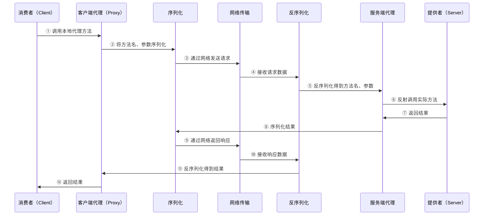
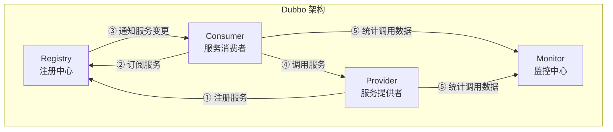
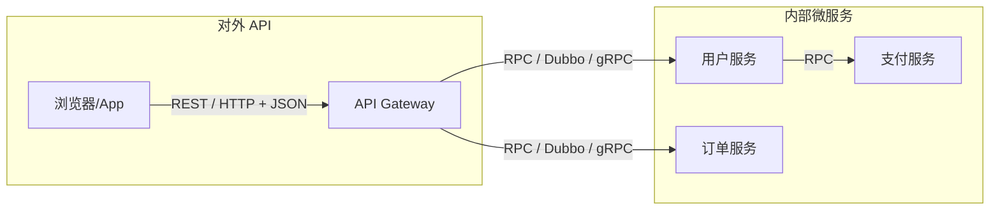

# RPC 框架原理

## 概念说明

RPC（Remote Procedure Call，远程过程调用）让调用远程服务像调用本地方法一样简单。RPC 框架屏蔽了网络通信、序列化、服务发现等底层细节，是微服务架构中服务间通信的核心技术。

主流 Java RPC 框架包括 Dubbo（阿里）、gRPC（Google）、Thrift（Facebook）等。

## 核心原理

### 一、RPC 调用流程



**RPC 核心组件**：

| 组件 | 作用 | 技术选型 |
|------|------|----------|
| 动态代理 | 屏蔽远程调用细节 | JDK Proxy / CGLIB / Javassist |
| 序列化 | 将对象转为字节流 | Hessian / Protobuf / Kryo / JSON |
| 网络传输 | 发送和接收数据 | Netty / Socket / HTTP/2 |
| 服务发现 | 找到服务提供者地址 | ZooKeeper / Consul / Nacos |
| 负载均衡 | 选择合适的服务实例 | 随机 / 轮询 / 一致性哈希 |

### 二、Dubbo 架构与核心组件



**Dubbo 核心特性**：

| 特性 | 说明 |
|------|------|
| 服务注册与发现 | 支持 ZooKeeper、Nacos、Consul 等 |
| 负载均衡 | Random、RoundRobin、LeastActive、ConsistentHash |
| 容错机制 | Failover（重试）、Failfast（快速失败）、Failsafe（安全失败） |
| 序列化 | Hessian2（默认）、Protobuf、Kryo、FST |
| 协议 | Dubbo 协议（默认）、Triple（兼容 gRPC）、REST |

### 三、gRPC 与 Protobuf

gRPC 是 Google 开源的高性能 RPC 框架，基于 HTTP/2 和 Protocol Buffers。

**gRPC 特点**：
- 基于 HTTP/2：多路复用、头部压缩、双向流
- Protocol Buffers：高效的二进制序列化，比 JSON 小 3-10 倍
- 跨语言：支持 Java、Go、Python、C++ 等
- 四种通信模式：Unary、Server Streaming、Client Streaming、Bidirectional Streaming

```protobuf
// user.proto — Protobuf 定义
syntax = "proto3";

service UserService {
  rpc GetUser (GetUserRequest) returns (UserResponse);
  rpc ListUsers (ListUsersRequest) returns (stream UserResponse); // 服务端流
}

message GetUserRequest {
  int64 id = 1;
}

message UserResponse {
  int64 id = 1;
  string name = 2;
  string email = 3;
}
```

### 四、RPC vs REST 对比

| 维度 | RPC | REST |
|------|-----|------|
| 设计理念 | 以操作为中心 | 以资源为中心 |
| 传输协议 | TCP / HTTP/2 | HTTP |
| 序列化 | 二进制（Protobuf/Hessian） | 文本（JSON/XML） |
| 性能 | 高（二进制 + 长连接） | 较低（文本 + 短连接） |
| 可读性 | 低（二进制不可读） | 高（JSON 可读） |
| 跨语言 | 需要 IDL 定义 | 天然跨语言 |
| 适用场景 | 内部微服务通信 | 对外 API、前后端交互 |
| 代表框架 | Dubbo、gRPC、Thrift | Spring MVC、JAX-RS |



## 代码示例

### 简易 RPC 框架实现

```java
// 1. 定义服务接口
public interface HelloService {
    String sayHello(String name);
}

// 2. 服务端实现
public class HelloServiceImpl implements HelloService {
    public String sayHello(String name) {
        return "Hello, " + name + "!";
    }
}

// 3. 客户端通过动态代理调用
HelloService proxy = RPCClient.getProxy(HelloService.class, "localhost", 9090);
String result = proxy.sayHello("World"); // 像调用本地方法一样
```

> 💻 完整可运行代码：[RPCDemo.java](../../../code-examples/02-framework/network-programming/src/main/java/com/example/network/rpc/RPCDemo.java)
>
> 包含完整的简易 RPC 框架实现：动态代理 + Socket 通信 + Java 序列化

## 常见面试题

### Q1: RPC 的调用流程是怎样的？

**难度**：⭐⭐⭐ | **频率**：🔥🔥🔥

**答题思路**：

1. 从客户端调用到服务端执行的完整链路
2. 重点说明动态代理、序列化、网络传输三个核心环节

**标准答案**：

RPC 调用流程：(1) 客户端调用本地代理对象的方法；(2) 代理对象将方法名、参数等信息序列化为字节流；(3) 通过网络（TCP/HTTP）发送到服务端；(4) 服务端反序列化得到方法名和参数；(5) 通过反射调用实际的服务实现；(6) 将返回值序列化后通过网络返回；(7) 客户端反序列化得到结果。核心组件包括动态代理（屏蔽远程调用细节）、序列化（对象与字节流转换）、网络传输（数据收发）、服务发现（定位服务地址）。

**深入追问**：

- 动态代理有哪些实现方式？各自的优缺点？
- 常见的序列化方式有哪些？如何选择？
- 如何实现服务发现？

### Q2: Dubbo 的架构是怎样的？核心组件有哪些？

**难度**：⭐⭐⭐ | **频率**：🔥🔥🔥

**标准答案**：

Dubbo 架构包含四个核心角色：Provider（服务提供者，暴露服务）、Consumer（服务消费者，调用服务）、Registry（注册中心，服务注册与发现）、Monitor（监控中心，统计调用数据）。工作流程：Provider 启动时向 Registry 注册服务，Consumer 启动时从 Registry 订阅服务，Registry 将 Provider 地址列表推送给 Consumer，Consumer 根据负载均衡策略选择 Provider 直接调用。

**深入追问**：

- Dubbo 支持哪些负载均衡策略？
- Dubbo 的容错机制有哪些？
- Dubbo 和 Spring Cloud 的区别？

### Q3: gRPC 相比传统 RPC 有什么优势？

**难度**：⭐⭐⭐ | **频率**：🔥🔥

**标准答案**：

gRPC 基于 HTTP/2 和 Protobuf，主要优势：(1) 高性能——Protobuf 二进制序列化比 JSON 小 3-10 倍，解析速度快 20-100 倍；(2) HTTP/2 支持多路复用、头部压缩、双向流；(3) 强类型——通过 .proto 文件定义接口，自动生成客户端和服务端代码；(4) 跨语言——支持 10+ 种编程语言；(5) 四种通信模式——Unary、Server Streaming、Client Streaming、Bidirectional Streaming。

**深入追问**：

- Protobuf 的编码原理？（Varint、ZigZag、Tag-Length-Value）
- gRPC 的四种通信模式分别适用于什么场景？

## 参考资料

- [Apache Dubbo 官方文档](https://dubbo.apache.org/zh/)
- [gRPC 官方文档](https://grpc.io/docs/)
- [Protocol Buffers 官方文档](https://protobuf.dev/)
