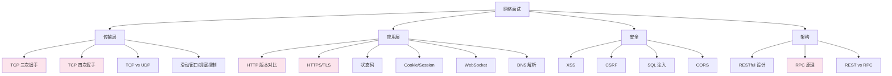

# 网络面试指南

## 概念说明

网络知识是 Java 后端面试的**必考内容**，尤其是 TCP 三次握手/四次挥手、HTTP/HTTPS 原理、网络安全等话题。本指南汇总网络模块的高频面试题，按主题分类并标注难度和频率，帮助你系统地准备面试。

## 面试知识图谱

> 🔴 红色标注为最高频面试题

## 高频面试题汇总

### 一、TCP/IP 协议（传输层）

#### Q1: TCP 三次握手的详细过程？为什么不能两次？

**难度**：⭐⭐⭐ | **频率**：🔥🔥🔥 | **详细解析**：[TCP/IP 协议栈](./01-tcp-ip.md)

**答题要点**：
1. SYN → SYN+ACK → ACK 三步流程
2. 每步的序列号和确认号变化
3. 两次握手无法防止历史重复连接

**追问链路**：
- 三次握手 → SYN Flood 攻击 → SYN Cookie 防御
- 三次握手 → ISN 随机化 → 防止序列号预测攻击
- 三次握手 → 半连接队列和全连接队列 → backlog 参数

#### Q2: TCP 四次挥手的过程？TIME_WAIT 的作用？

**难度**：⭐⭐⭐ | **频率**：🔥🔥🔥 | **详细解析**：[TCP/IP 协议栈](./01-tcp-ip.md)

**答题要点**：
1. FIN → ACK → FIN → ACK 四步流程
2. 半关闭状态（CLOSE_WAIT）
3. TIME_WAIT 等待 2MSL 的两个原因

**追问链路**：
- 四次挥手 → 大量 TIME_WAIT → tcp_tw_reuse 参数
- 四次挥手 → 大量 CLOSE_WAIT → 代码未正确关闭连接
- 四次挥手 → 能否合并为三次 → 延迟确认

#### Q3: TCP 和 UDP 的区别？各自的应用场景？

**难度**：⭐⭐ | **频率**：🔥🔥🔥 | **详细解析**：[TCP/IP 协议栈](./01-tcp-ip.md)

**追问链路**：
- TCP vs UDP → 基于 UDP 的可靠传输 → QUIC 协议
- TCP vs UDP → TCP 粘包问题 → 解决方案（定长/分隔符/长度字段）

#### Q4: TCP 的拥塞控制算法有哪些？

**难度**：⭐⭐⭐ | **频率**：🔥🔥

**答题要点**：慢启动、拥塞避免、快重传、快恢复四个算法的触发条件和行为。

### 二、HTTP 协议（应用层）

#### Q5: HTTP/1.1、HTTP/2、HTTP/3 的区别？

**难度**：⭐⭐⭐ | **频率**：🔥🔥🔥 | **详细解析**：[HTTP 协议详解](./02-http.md)

**追问链路**：
- HTTP 版本对比 → HTTP/2 多路复用原理 → 二进制帧
- HTTP/2 → TCP 队头阻塞 → HTTP/3 QUIC 协议
- QUIC → 0-RTT 连接建立 → 连接迁移

#### Q6: HTTPS 的加密流程？TLS 握手过程？

**难度**：⭐⭐⭐ | **频率**：🔥🔥🔥 | **详细解析**：[HTTP 协议详解](./02-http.md)

**追问链路**：
- TLS 握手 → 非对称加密 vs 对称加密 → 为什么混合使用
- TLS 握手 → 证书验证 → CA 证书链 → 中间人攻击
- TLS 1.2 → TLS 1.3 改进 → 1-RTT 握手

#### Q7: GET 和 POST 的区别？

**难度**：⭐⭐ | **频率**：🔥🔥🔥 | **详细解析**：[HTTP 协议详解](./02-http.md)

**答题要点**：语义、幂等性、安全性、参数传递方式。纠正常见误区。

#### Q8: HTTP 常见状态码及含义？

**难度**：⭐⭐ | **频率**：🔥🔥🔥

**重点状态码**：200、201、204、301、302、304、400、401、403、404、500、502、503

**追问链路**：
- 301 vs 302 → 永久重定向 vs 临时重定向 → SEO 影响
- 304 → 协商缓存 → ETag/Last-Modified
- 502 vs 504 → Bad Gateway vs Gateway Timeout

#### Q9: Cookie 和 Session 的区别？

**难度**：⭐⭐ | **频率**：🔥🔥🔥

**追问链路**：
- Cookie/Session → 分布式 Session → Redis Session → JWT
- Cookie → SameSite 属性 → CSRF 防御

### 三、综合题

#### Q10: 浏览器输入 URL 到页面展示的全过程？

**难度**：⭐⭐⭐ | **频率**：🔥🔥🔥 | **详细解析**：[DNS 与 CDN](./04-dns-cdn.md)

**答题要点**：DNS 解析 → TCP 连接 → TLS 握手 → HTTP 请求 → 服务端处理 → 响应返回 → 浏览器渲染

**追问链路**：
- DNS 解析 → DNS 缓存层级 → DNS 劫持
- TCP 连接 → 三次握手 → 为什么三次
- 浏览器渲染 → DOM 树 → CSSOM → 重排重绘

#### Q11: WebSocket 和 HTTP 的区别？

**难度**：⭐⭐ | **频率**：🔥🔥 | **详细解析**：[WebSocket 协议](./03-websocket.md)

**追问链路**：
- WebSocket → 握手过程 → HTTP Upgrade
- WebSocket → 心跳机制 → 断线重连
- WebSocket vs SSE vs 长轮询

### 四、安全与设计

#### Q12: XSS、CSRF、SQL 注入的原理和防御？

**难度**：⭐⭐⭐ | **频率**：🔥🔥🔥 | **详细解析**：[网络安全基础](./05-security.md)

**追问链路**：
- XSS → 三种类型 → CSP 策略 → HttpOnly
- CSRF → Token 防御 → SameSite Cookie
- SQL 注入 → PreparedStatement → ORM 框架

#### Q13: RESTful API 设计规范？REST vs RPC？

**难度**：⭐⭐⭐ | **频率**：🔥🔥🔥 | **详细解析**：[RESTful API](./06-restful.md) / [RPC 框架](./07-rpc.md)

**追问链路**：
- REST 设计 → 幂等性 → 如何保证 POST 幂等
- REST vs RPC → 适用场景 → 对外 REST 对内 RPC
- RPC → Dubbo 架构 → 服务发现 → 负载均衡

#### Q14: RPC 的调用流程？Dubbo 的架构？

**难度**：⭐⭐⭐ | **频率**：🔥🔥🔥 | **详细解析**：[RPC 框架原理](./07-rpc.md)

**追问链路**：
- RPC 流程 → 动态代理 → JDK Proxy vs CGLIB
- RPC 流程 → 序列化 → Protobuf vs Hessian vs JSON
- Dubbo → 负载均衡 → 一致性哈希 → 容错机制

## 面试准备建议

### 按公司类型准备

| 公司类型 | 重点内容 | 深度要求 |
|----------|----------|----------|
| 大厂（BAT） | TCP 三次握手/四次挥手、HTTPS、RPC 原理 | 需要深入底层原理 |
| 中厂 | HTTP 协议、RESTful 设计、网络安全 | 原理 + 实践 |
| 创业公司 | RESTful API、CORS、基本安全防护 | 偏实践应用 |

### 复习优先级

1. 🔴 **必须掌握**：TCP 三次握手/四次挥手、HTTP/HTTPS、GET vs POST、状态码
2. 🟠 **应该掌握**：RPC 原理、RESTful 设计、XSS/CSRF 防御、Cookie/Session
3. 🟢 **了解即可**：HTTP/3 QUIC、WebSocket 帧格式、DNS 详细过程

## 参考资料

- [小林 Coding - 图解网络](https://xiaolincoding.com/network/)
- [JavaGuide - 计算机网络](https://javaguide.cn/cs-basics/network/)
