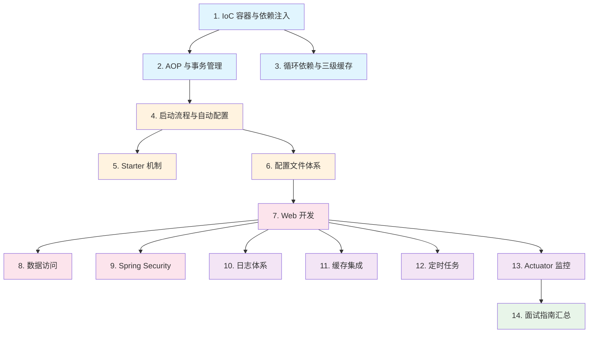

# Spring Boot

## 概念说明

Spring Boot 是 Java 后端开发的**事实标准框架**，也是面试中考察最密集的模块之一。它基于 Spring Framework，通过"约定优于配置"的理念，极大简化了 Spring 应用的搭建和开发过程。

本模块从 Spring 核心原理（IoC/AOP）出发，深入 Spring Boot 的启动流程、自动配置机制，再到 Web 开发、数据访问、安全、缓存、监控等实战主题，系统覆盖 Spring Boot 面试和工作中的核心知识点。

## 知识点列表

| 序号 | 知识点 | 难度 | 面试频率 | 文档链接 |
|------|--------|------|----------|----------|
| 1 | IoC 容器与依赖注入 | ⭐⭐⭐ | 🔥🔥🔥 | [ioc-di](./01-ioc-di.md) |
| 2 | AOP 与事务管理 | ⭐⭐⭐ | 🔥🔥🔥 | [aop](./02-aop.md) |
| 3 | 循环依赖与三级缓存 | ⭐⭐⭐ | 🔥🔥🔥 | [circular-dependency](./03-circular-dependency.md) |
| 4 | 启动流程与自动配置 | ⭐⭐⭐ | 🔥🔥🔥 | [startup](./04-startup.md) |
| 5 | Starter 机制 | ⭐⭐⭐ | 🔥🔥 | [starter](./05-starter.md) |
| 6 | 配置文件体系 | ⭐⭐ | 🔥🔥🔥 | [config-files](./06-config-files.md) |
| 7 | Web 开发 | ⭐⭐ | 🔥🔥🔥 | [web](./07-web.md) |
| 8 | 数据访问 | ⭐⭐ | 🔥🔥 | [data-access](./08-data-access.md) |
| 9 | Spring Security | ⭐⭐⭐ | 🔥🔥 | [security](./09-security.md) |
| 10 | 日志体系 | ⭐⭐ | 🔥🔥 | [logging](./10-logging.md) |
| 11 | 缓存集成 | ⭐⭐ | 🔥🔥 | [cache](./11-cache.md) |
| 12 | 定时任务 | ⭐⭐ | 🔥🔥 | [task](./12-task.md) |
| 13 | Actuator 监控 | ⭐⭐ | 🔥🔥 | [actuator](./13-actuator.md) |
| 14 | Spring Boot 面试指南 | ⭐⭐⭐ | 🔥🔥🔥 | [interview](./99-interview.md) |

## 推荐学习顺序

**学习路线说明**：
- 🔵 **核心原理层**（1-3）：IoC/AOP/循环依赖是 Spring 的灵魂，面试必考
- 🟠 **启动配置层**（4-6）：理解 Spring Boot 的"魔法"从何而来
- 🔴 **Web 开发层**（7-9）：日常开发最常用的功能
- 🟣 **运维支撑层**（10-13）：日志、缓存、定时任务、监控
- 🟢 **面试汇总**（14）：高频面试题和追问链路

## 相关模块链接

- [设计模式 - Spring 中的设计模式](/1-java-core/1.5-design-patterns/04-spring-patterns) — Spring 框架中大量运用的设计模式
- [Java 进阶 - 动态代理](/1-java-core/1.2-java-advanced/03-dynamic-proxy) — AOP 的底层实现基础
- [Spring Cloud](/2-framework/2.3-springcloud/) — 基于 Spring Boot 的微服务框架
- [Redis](/3-data-store/3.2-redis/) — 缓存集成的核心中间件
- [数据库](/3-data-store/3.1-database/) — 数据访问层的底层存储

## 参考资料

- [Spring Boot 官方文档](https://docs.spring.io/spring-boot/docs/current/reference/html/)
- [Spring Framework 官方文档](https://docs.spring.io/spring-framework/reference/)
- [Spring Boot 源码 - GitHub](https://github.com/spring-projects/spring-boot)
