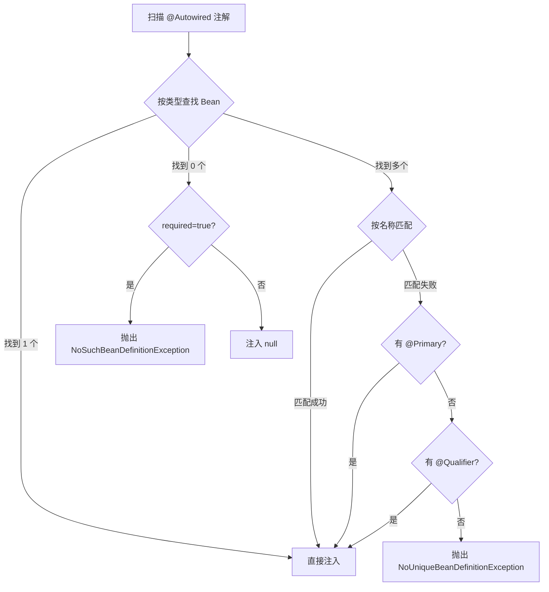
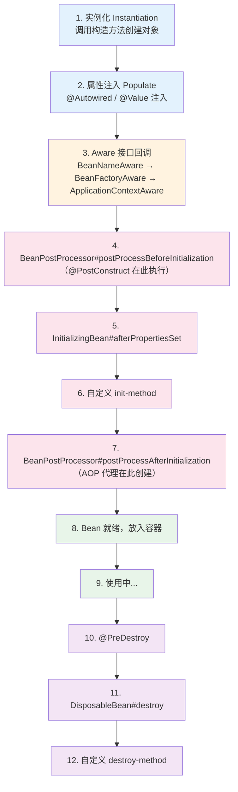

# Spring IoC 容器与依赖注入

## 概念说明

IoC（Inversion of Control，控制反转）是 Spring 框架的**核心思想**。传统编程中，对象自己负责创建和管理依赖对象；而 IoC 将这个控制权交给了 Spring 容器，由容器负责对象的创建、装配和生命周期管理。

DI（Dependency Injection，依赖注入）是 IoC 的**具体实现方式**，通过构造器注入、Setter 注入或字段注入，将依赖对象"注入"到目标对象中。

> 面试核心：IoC 是思想，DI 是手段。Spring 通过 DI 实现了 IoC。

## 核心原理

### 一、三种注入方式对比

| 注入方式 | 写法 | 推荐度 | 说明 |
|----------|------|--------|------|
| 构造器注入 | `@Autowired` 构造方法 | ⭐⭐⭐⭐⭐ | Spring 官方推荐，不可变、可测试、防止循环依赖 |
| Setter 注入 | `@Autowired` setter 方法 | ⭐⭐⭐ | 适合可选依赖 |
| 字段注入 | `@Autowired` 字段 | ⭐⭐ | 代码简洁但不利于测试，Spring 不推荐 |

```java
// ✅ 推荐：构造器注入（Spring 4.3+ 单构造器可省略 @Autowired）
@Service
public class UserService {
    private final UserRepository userRepository;

    public UserService(UserRepository userRepository) {
        this.userRepository = userRepository;
    }
}

// ⚠️ 不推荐：字段注入
@Service
public class UserService {
    @Autowired
    private UserRepository userRepository;
}
```

### 二、@Autowired 注入原理

`@Autowired` 的处理由 `AutowiredAnnotationBeanPostProcessor` 完成：

1. Spring 容器启动时注册 `AutowiredAnnotationBeanPostProcessor`
2. Bean 实例化后，调用 `postProcessProperties()` 方法
3. 通过反射扫描 `@Autowired` 注解的字段/方法
4. **先按类型（byType）** 在容器中查找匹配的 Bean
5. 如果找到多个同类型 Bean，**再按名称（byName）** 匹配
6. 如果仍然无法确定，检查 `@Primary` 和 `@Qualifier` 注解
7. 将找到的 Bean 注入到目标字段/方法



### 三、Bean 生命周期（面试重点）

Bean 的完整生命周期分为四个阶段：**实例化 → 属性注入 → 初始化 → 销毁**。每个阶段都有对应的回调点。



**各回调点详解**：

| 阶段 | 回调点 | 说明 |
|------|--------|------|
| 实例化 | 构造方法 | 通过反射调用构造方法创建 Bean 实例 |
| 属性注入 | @Autowired/@Value | 注入依赖和配置值 |
| Aware 回调 | BeanNameAware | 获取 Bean 在容器中的名称 |
| Aware 回调 | BeanFactoryAware | 获取 BeanFactory 引用 |
| Aware 回调 | ApplicationContextAware | 获取 ApplicationContext 引用 |
| 初始化前 | BeanPostProcessor#postProcessBeforeInitialization | 所有 Bean 都会经过，@PostConstruct 在此触发 |
| 初始化 | InitializingBean#afterPropertiesSet | 实现接口的回调 |
| 初始化 | @Bean(initMethod="xxx") | 自定义初始化方法 |
| 初始化后 | BeanPostProcessor#postProcessAfterInitialization | AOP 代理对象在此创建 |
| 销毁前 | @PreDestroy | 容器关闭前的清理 |
| 销毁 | DisposableBean#destroy | 实现接口的回调 |
| 销毁 | @Bean(destroyMethod="xxx") | 自定义销毁方法 |

### 四、BeanPostProcessor 扩展机制

`BeanPostProcessor` 是 Spring 最强大的扩展点之一，它可以在 Bean 初始化前后对 Bean 进行修改或替换。

Spring 内部大量使用 BeanPostProcessor：
- `AutowiredAnnotationBeanPostProcessor` — 处理 `@Autowired` 注入
- `CommonAnnotationBeanPostProcessor` — 处理 `@PostConstruct`、`@PreDestroy`
- `AbstractAutoProxyCreator` — 创建 AOP 代理对象

```java
@Component
public class CustomBeanPostProcessor implements BeanPostProcessor {

    @Override
    public Object postProcessBeforeInitialization(Object bean, String beanName) {
        // 初始化前的处理（@PostConstruct 之前）
        System.out.println("Before Init: " + beanName);
        return bean;
    }

    @Override
    public Object postProcessAfterInitialization(Object bean, String beanName) {
        // 初始化后的处理（AOP 代理在此创建）
        System.out.println("After Init: " + beanName);
        return bean; // 可以返回代理对象
    }
}
```

### 五、Bean 作用域

| 作用域 | 说明 | 使用场景 |
|--------|------|----------|
| singleton（默认） | 容器中只有一个实例 | 无状态的 Service、DAO |
| prototype | 每次获取创建新实例 | 有状态的 Bean |
| request | 每个 HTTP 请求一个实例 | Web 应用 |
| session | 每个 HTTP Session 一个实例 | Web 应用 |

## 代码示例

```java
/**
 * Bean 生命周期完整演示
 */
@Component
public class LifecycleBean implements BeanNameAware, InitializingBean, DisposableBean {

    private String beanName;

    public LifecycleBean() {
        System.out.println("1. 构造方法 - 实例化");
    }

    @Override
    public void setBeanName(String name) {
        this.beanName = name;
        System.out.println("3. BeanNameAware#setBeanName: " + name);
    }

    @PostConstruct
    public void postConstruct() {
        System.out.println("4. @PostConstruct - 初始化前回调");
    }

    @Override
    public void afterPropertiesSet() {
        System.out.println("5. InitializingBean#afterPropertiesSet");
    }

    @PreDestroy
    public void preDestroy() {
        System.out.println("10. @PreDestroy - 销毁前回调");
    }

    @Override
    public void destroy() {
        System.out.println("11. DisposableBean#destroy");
    }
}
```

> 💻 完整可运行代码：[IoCDemo.java](https://github.com/skyhe58/guide-java/tree/main/code-examples/02-framework/springboot-examples/src/main/java/com/example/springboot/ioc/IoCDemo.java)
> <!-- 本地路径：code-examples/02-framework/springboot-examples/src/main/java/com/example/springboot/ioc/IoCDemo.java -->

## 常见面试题

### Q1: Spring IoC 的理解？什么是控制反转？

**难度**：⭐⭐ | **频率**：🔥🔥🔥

**答题思路**：

1. 先解释传统方式的问题（对象自己 new 依赖，耦合度高）
2. 再解释 IoC 的核心思想（控制权反转给容器）
3. 说明 DI 是 IoC 的实现方式
4. 举例说明好处（解耦、可测试、可替换）

**标准答案**：

IoC 是一种设计思想，将对象的创建和依赖管理从代码中转移到外部容器。传统方式中，A 依赖 B，A 需要自己 `new B()`，这导致 A 和 B 强耦合。IoC 模式下，A 只声明需要 B，由 Spring 容器负责创建 B 并注入到 A 中。DI（依赖注入）是 IoC 的具体实现，Spring 通过构造器注入、Setter 注入、字段注入三种方式实现 DI。

**深入追问**：

- @Autowired 和 @Resource 的区别？（@Autowired 按类型，@Resource 按名称）
- 为什么推荐构造器注入？（不可变、防止 NPE、利于测试、可发现循环依赖）
- BeanFactory 和 ApplicationContext 的区别？

**易错点**：

- IoC 不等于 DI，IoC 是思想，DI 是实现
- @Autowired 先按类型再按名称，不是只按类型

### Q2: Bean 的生命周期？

**难度**：⭐⭐⭐ | **频率**：🔥🔥🔥

**答题思路**：

1. 按四个阶段回答：实例化 → 属性注入 → 初始化 → 销毁
2. 重点说明初始化阶段的回调顺序
3. 提到 BeanPostProcessor 的作用

**标准答案**：

Bean 生命周期分为四个阶段：（1）实例化：通过反射调用构造方法创建对象；（2）属性注入：处理 @Autowired 等注入依赖；（3）初始化：依次执行 Aware 接口回调 → BeanPostProcessor#postProcessBeforeInitialization（@PostConstruct 在此触发）→ InitializingBean#afterPropertiesSet → 自定义 init-method → BeanPostProcessor#postProcessAfterInitialization（AOP 代理在此创建）；（4）销毁：@PreDestroy → DisposableBean#destroy → 自定义 destroy-method。

**深入追问**：

- @PostConstruct 和 InitializingBean 的执行顺序？（@PostConstruct 先执行）
- AOP 代理在哪个阶段创建？（postProcessAfterInitialization）
- BeanPostProcessor 和 BeanFactoryPostProcessor 的区别？

**易错点**：

- @PostConstruct 不是在"初始化"阶段执行，而是在 BeanPostProcessor 的 before 方法中
- AOP 代理对象是在 postProcessAfterInitialization 中创建的

### Q3: @Autowired 的注入原理？多个同类型 Bean 怎么处理？

**难度**：⭐⭐⭐ | **频率**：🔥🔥🔥

**答题思路**：

1. 说明 AutowiredAnnotationBeanPostProcessor 负责处理
2. 先按类型查找，再按名称匹配
3. 多个同类型 Bean 的解决方案

**标准答案**：

@Autowired 由 AutowiredAnnotationBeanPostProcessor 处理。注入时先按类型（byType）在容器中查找，如果找到唯一 Bean 直接注入；如果找到多个同类型 Bean，再按字段名（byName）匹配；如果仍无法确定，检查 @Primary 和 @Qualifier 注解。解决多个同类型 Bean 的方式：（1）@Primary 标记首选 Bean；（2）@Qualifier("beanName") 指定具体 Bean；（3）字段名与 Bean 名称一致。

**深入追问**：

- @Autowired 和 @Inject 的区别？
- 如何自定义注入逻辑？（实现 BeanPostProcessor）

## 在 Spring Cloud 项目中体验

启动 Spring Cloud 项目后，通过 REST 接口直接验证：

```bash
# 启动中间件
docker compose -f docker/docker-compose.yml up -d
docker compose -f docker/docker-compose.consul.yml up -d

# 启动项目
cd code-examples/02-framework/springcloud-examples
mvn spring-boot:run

# 验证接口
curl http://localhost:8090/demo/boot/ioc/inject-types
curl http://localhost:8090/demo/boot/ioc/prototype
```

> 💻 Spring Cloud 实战代码：[IoCController.java](https://github.com/skyhe58/guide-java/tree/main/code-examples/02-framework/springcloud-examples/src/main/java/com/example/springcloud/boot/IoCController.java)
> <!-- 本地路径：code-examples/02-framework/springcloud-examples/src/main/java/com/example/springcloud/boot/IoCController.java -->

## 参考资料

- [Spring IoC 容器官方文档](https://docs.spring.io/spring-framework/reference/core/beans.html)
- [Spring Bean 生命周期源码分析](https://docs.spring.io/spring-framework/reference/core/beans/factory-nature.html)
