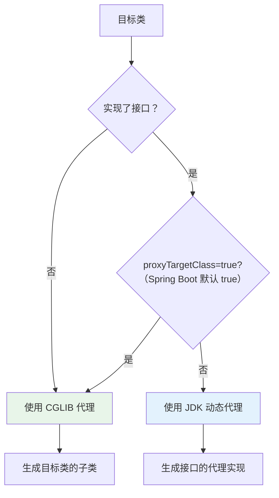
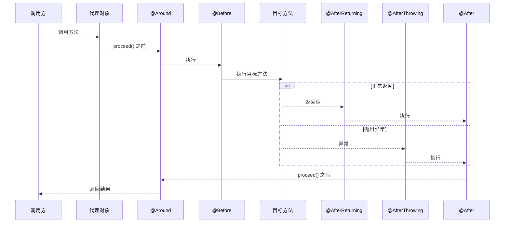

# AOP 原理与事务管理

## 概念说明

AOP（Aspect-Oriented Programming，面向切面编程）是 Spring 的另一个核心特性。它通过**动态代理**在不修改源代码的情况下，为方法添加横切关注点（如日志、事务、权限校验）。

Spring 中最常用的 AOP 应用就是 `@Transactional` 声明式事务。理解 AOP 原理和事务失效场景是面试的**高频考点**。

## 核心原理

### 一、AOP 代理选择机制

Spring AOP 底层使用两种动态代理：

| 代理方式 | 条件 | 原理 | 限制 |
|----------|------|------|------|
| JDK 动态代理 | 目标类实现了接口 | 基于 `java.lang.reflect.Proxy` | 只能代理接口方法 |
| CGLIB 代理 | 目标类没有实现接口 | 基于字节码生成子类 | 不能代理 final 类/方法 |

> Spring Boot 2.x 开始默认使用 CGLIB 代理（`spring.aop.proxy-target-class=true`）



### 二、切面执行顺序



**执行顺序总结**：
- 正常：`@Around(前)` → `@Before` → 目标方法 → `@AfterReturning` → `@After` → `@Around(后)`
- 异常：`@Around(前)` → `@Before` → 目标方法 → `@AfterThrowing` → `@After`

### 三、@Transactional 事务失效的 8 种场景（面试重点）

| 序号 | 失效场景 | 原因 | 解决方案 |
|------|----------|------|----------|
| 1 | 方法不是 public | Spring AOP 默认只拦截 public 方法 | 改为 public |
| 2 | 同类内部方法调用（self-invocation） | 内部调用不经过代理对象 | 注入自身 / `AopContext.currentProxy()` |
| 3 | 方法用 final 修饰 | CGLIB 无法重写 final 方法 | 去掉 final |
| 4 | 非 Spring 管理的类 | 没有被代理 | 加 @Service/@Component |
| 5 | 异常被 catch 吞掉 | 事务管理器感知不到异常 | 重新抛出或手动回滚 |
| 6 | 抛出的是 checked 异常 | 默认只回滚 RuntimeException | `@Transactional(rollbackFor = Exception.class)` |
| 7 | 数据库引擎不支持事务 | MyISAM 不支持事务 | 使用 InnoDB |
| 8 | 传播行为设置不当 | `REQUIRES_NEW` 等传播行为影响 | 根据业务选择正确的传播行为 |

**场景 2 详解（最常考）**：

```java
@Service
public class OrderService {

    // ❌ 事务失效！内部调用不经过代理
    public void createOrder() {
        // this.updateStock() 是直接调用，不走代理
        this.updateStock();
    }

    @Transactional
    public void updateStock() {
        // 事务不会生效
    }

    // ✅ 解决方案1：注入自身
    @Autowired
    private OrderService self;

    public void createOrderFixed() {
        self.updateStock(); // 通过代理对象调用
    }
}
```

### 四、事务传播行为

| 传播行为 | 说明 | 使用场景 |
|----------|------|----------|
| REQUIRED（默认） | 有事务就加入，没有就新建 | 大多数场景 |
| REQUIRES_NEW | 总是新建事务，挂起当前事务 | 独立事务（如日志记录） |
| NESTED | 嵌套事务，外层回滚则内层也回滚 | 部分回滚场景 |
| SUPPORTS | 有事务就加入，没有就非事务执行 | 查询方法 |
| NOT_SUPPORTED | 非事务执行，挂起当前事务 | 不需要事务的操作 |
| MANDATORY | 必须在事务中调用，否则抛异常 | 强制要求事务 |
| NEVER | 必须非事务执行，有事务则抛异常 | 禁止事务的操作 |

## 代码示例

```java
/**
 * 自定义切面示例
 */
@Aspect
@Component
@Slf4j
public class LogAspect {

    @Pointcut("execution(* com.example.springboot.web..*.*(..))")
    public void webPointcut() {}

    @Around("webPointcut()")
    public Object around(ProceedingJoinPoint joinPoint) throws Throwable {
        long start = System.currentTimeMillis();
        String methodName = joinPoint.getSignature().getName();
        log.info("方法 {} 开始执行, 参数: {}", methodName, joinPoint.getArgs());
        try {
            Object result = joinPoint.proceed();
            log.info("方法 {} 执行成功, 耗时: {}ms", methodName, System.currentTimeMillis() - start);
            return result;
        } catch (Throwable e) {
            log.error("方法 {} 执行异常: {}", methodName, e.getMessage());
            throw e;
        }
    }
}
```

> 💻 完整可运行代码：[AopDemo.java](https://github.com/skyhe58/guide-java/tree/main/code-examples/02-framework/springboot-examples/src/main/java/com/example/springboot/aop/AopDemo.java)
> <!-- 本地路径：code-examples/02-framework/springboot-examples/src/main/java/com/example/springboot/aop/AopDemo.java -->

## 常见面试题

### Q1: Spring AOP 的实现原理？JDK 动态代理和 CGLIB 的区别？

**难度**：⭐⭐⭐ | **频率**：🔥🔥🔥

**答题思路**：

1. Spring AOP 基于动态代理实现
2. 两种代理方式的选择条件
3. Spring Boot 默认使用 CGLIB

**标准答案**：

Spring AOP 通过动态代理在运行时为目标对象创建代理对象。JDK 动态代理基于 `java.lang.reflect.Proxy`，要求目标类实现接口，代理对象实现相同接口；CGLIB 基于字节码技术（ASM），通过生成目标类的子类来实现代理，不要求接口但不能代理 final 类/方法。Spring Boot 2.x 默认使用 CGLIB（`proxyTargetClass=true`），即使目标类实现了接口也用 CGLIB。

**深入追问**：

- 为什么 Spring Boot 默认改用 CGLIB？（避免类型转换异常）
- AspectJ 和 Spring AOP 的区别？（编译时织入 vs 运行时代理）
- AOP 代理对象在 Bean 生命周期的哪个阶段创建？（postProcessAfterInitialization）

### Q2: @Transactional 事务失效的场景有哪些？

**难度**：⭐⭐⭐ | **频率**：🔥🔥🔥

**答题思路**：

1. 按照代理层面、异常层面、配置层面分类回答
2. 重点讲同类内部调用和异常处理

**标准答案**：

事务失效主要有 8 种场景：（1）方法非 public，AOP 默认不拦截；（2）同类内部调用，不经过代理对象；（3）方法被 final 修饰，CGLIB 无法重写；（4）类未被 Spring 管理；（5）异常被 catch 吞掉；（6）抛出 checked 异常，默认只回滚 RuntimeException；（7）数据库引擎不支持事务；（8）传播行为设置不当。

**深入追问**：

- 同类内部调用怎么解决？（注入自身 / AopContext / 拆分到不同类）
- REQUIRES_NEW 和 NESTED 的区别？
- 如何手动回滚事务？（`TransactionAspectSupport.currentTransactionStatus().setRollbackOnly()`）

### Q3: 切面的执行顺序是什么？多个切面如何控制顺序？

**难度**：⭐⭐⭐ | **频率**：🔥🔥

**答题思路**：

1. 单个切面内的通知执行顺序
2. 多个切面通过 @Order 控制

**标准答案**：

单个切面内：正常情况下 @Around(前) → @Before → 目标方法 → @AfterReturning → @After → @Around(后)；异常情况下 @Around(前) → @Before → 目标方法 → @AfterThrowing → @After。多个切面通过 `@Order(n)` 注解控制顺序，值越小优先级越高。进入时按 Order 从小到大，返回时从大到小（类似洋葱模型）。

**易错点**：

- @After 在 Spring 5.2.7+ 中在 @AfterReturning/@AfterThrowing 之后执行（之前版本是之前）

## 在 Spring Cloud 项目中体验

启动 Spring Cloud 项目后，通过 REST 接口直接验证：

```bash
# 启动中间件
docker compose -f docker/docker-compose.yml up -d
docker compose -f docker/docker-compose.consul.yml up -d

# 启动项目
cd code-examples/02-framework/springcloud-examples
mvn spring-boot:run

# 验证接口
curl http://localhost:8090/demo/boot/aop/log
curl http://localhost:8090/demo/boot/aop/timing
```

> 💻 Spring Cloud 实战代码：[AopController.java](https://github.com/skyhe58/guide-java/tree/main/code-examples/02-framework/springcloud-examples/src/main/java/com/example/springcloud/boot/AopController.java)
> <!-- 本地路径：code-examples/02-framework/springcloud-examples/src/main/java/com/example/springcloud/boot/AopController.java -->

## 参考资料

- [Spring AOP 官方文档](https://docs.spring.io/spring-framework/reference/core/aop.html)
- [Spring 事务管理官方文档](https://docs.spring.io/spring-framework/reference/data-access/transaction.html)
