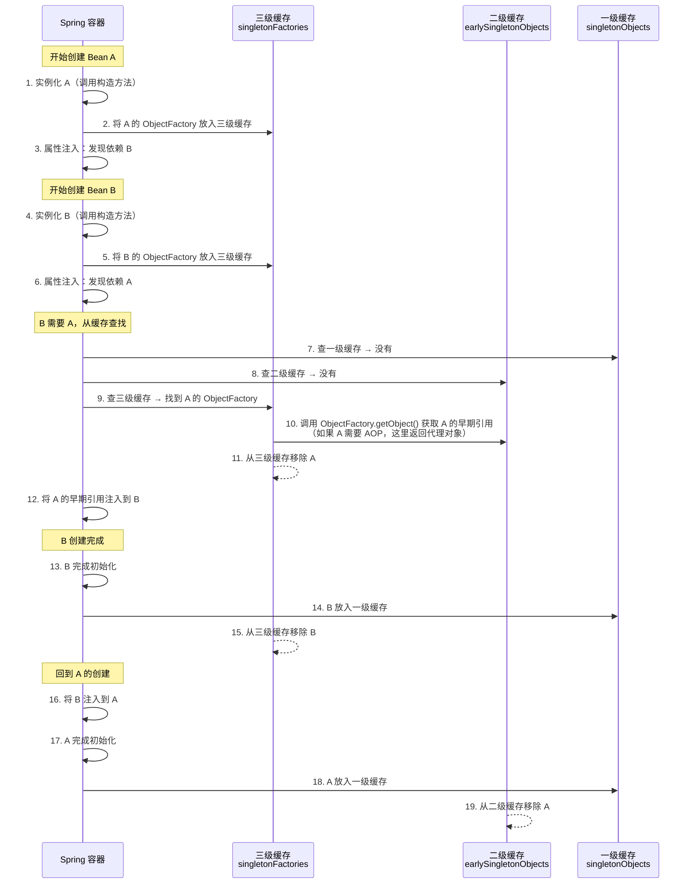
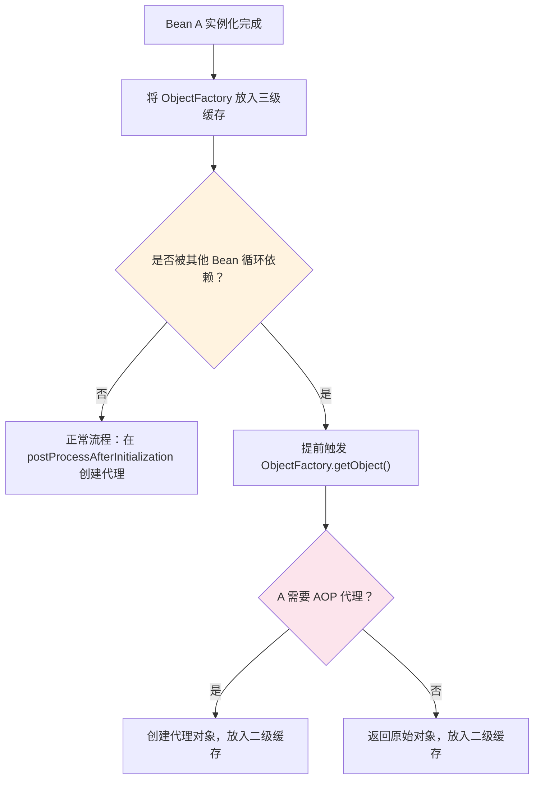

# 循环依赖与三级缓存

## 概念说明

循环依赖是指两个或多个 Bean 之间形成了相互依赖的环。例如 A 依赖 B，B 又依赖 A。Spring 通过**三级缓存**机制解决了 Setter 注入和字段注入场景下的循环依赖问题。

> 这是 Spring 面试中**最高频**的深度问题之一，面试官通常会追问到三级缓存的每一步。

## 核心原理

### 一、三级缓存结构

Spring 在 `DefaultSingletonBeanRegistry` 中维护了三个 Map：

| 缓存级别 | 字段名 | 存储内容 | 说明 |
|----------|--------|----------|------|
| 一级缓存 | `singletonObjects` | 完整的 Bean 实例 | 经过完整生命周期的成品 Bean |
| 二级缓存 | `earlySingletonObjects` | 提前暴露的 Bean 实例 | 已实例化但未完成属性注入的半成品 |
| 三级缓存 | `singletonFactories` | Bean 的 ObjectFactory | 用于生成早期引用（可能是代理对象） |

```java
// DefaultSingletonBeanRegistry 源码
public class DefaultSingletonBeanRegistry {
    // 一级缓存：存放完整的 Bean
    private final Map<String, Object> singletonObjects = new ConcurrentHashMap<>(256);
    // 二级缓存：存放提前暴露的半成品 Bean
    private final Map<String, Object> earlySingletonObjects = new ConcurrentHashMap<>(16);
    // 三级缓存：存放 Bean 的 ObjectFactory
    private final Map<String, ObjectFactory<?>> singletonFactories = new HashMap<>(16);
}
```

### 二、三级缓存解决循环依赖的完整流程

以 A 依赖 B，B 依赖 A 为例：



### 三、为什么需要三级缓存而不是两级？

这是面试中最常见的追问。核心原因：**为了处理 AOP 代理对象的创建时机**。

| 方案 | 问题 |
|------|------|
| 只用一级缓存 | 无法区分完整 Bean 和半成品 Bean，可能获取到未初始化的对象 |
| 只用两级缓存 | 如果 A 需要 AOP 代理，在没有循环依赖时代理在 postProcessAfterInitialization 创建；有循环依赖时需要提前创建代理。两级缓存无法延迟代理创建的决策 |
| 三级缓存 | ObjectFactory 封装了"是否需要创建代理"的逻辑，只有在真正被循环依赖引用时才触发代理创建，保持了代理创建时机的一致性 |



**关键点**：三级缓存的 ObjectFactory 是一个**延迟决策**机制。它不会立即创建代理，而是在被循环依赖引用时才决定是否创建代理。这样保证了：
- 没有循环依赖时，代理在正常的 BeanPostProcessor 阶段创建
- 有循环依赖时，代理提前创建但只创建一次

### 四、构造器注入无法解决循环依赖

```java
// ❌ 构造器注入的循环依赖 → 启动报错 BeanCurrentlyInCreationException
@Service
public class A {
    public A(B b) { } // A 构造时需要 B
}

@Service
public class B {
    public B(A a) { } // B 构造时需要 A
}
```

**原因**：构造器注入在**实例化阶段**就需要依赖对象，而此时对象还没创建出来，无法放入任何缓存。三级缓存机制是在实例化之后、属性注入之前生效的。

**解决方案**：
1. 改用 Setter 注入或字段注入
2. 使用 `@Lazy` 延迟加载
3. 重新设计，消除循环依赖

## 代码示例

```java
// 循环依赖示例：A 依赖 B，B 依赖 A
@Component
public class ServiceA {
    @Autowired
    private ServiceB serviceB; // 字段注入，可以解决循环依赖

    public String hello() {
        return "ServiceA -> " + serviceB.getName();
    }
}

@Component
public class ServiceB {
    @Autowired
    private ServiceA serviceA; // 字段注入，可以解决循环依赖

    public String getName() {
        return "ServiceB";
    }
}
```

> 💻 完整可运行代码：[IoCDemo.java](../../../code-examples/02-framework/springboot-examples/src/main/java/com/example/springboot/ioc/IoCDemo.java)

## 常见面试题

### Q1: Spring 如何解决循环依赖？

**难度**：⭐⭐⭐ | **频率**：🔥🔥🔥

**答题思路**：

1. 先说三级缓存的结构
2. 再描述解决流程（以 A→B→A 为例）
3. 说明只能解决 Setter/字段注入，不能解决构造器注入

**标准答案**：

Spring 通过三级缓存解决循环依赖。一级缓存 singletonObjects 存放完整 Bean，二级缓存 earlySingletonObjects 存放提前暴露的半成品 Bean，三级缓存 singletonFactories 存放 Bean 的 ObjectFactory。流程：创建 A 时先实例化 A 并将其 ObjectFactory 放入三级缓存，然后注入属性发现依赖 B；创建 B 时同样实例化并放入三级缓存，注入属性发现依赖 A；此时从三级缓存获取 A 的 ObjectFactory 生成早期引用注入到 B；B 创建完成后注入到 A，A 也完成创建。

**深入追问**：

- 为什么需要三级缓存而不是两级？（延迟 AOP 代理创建的决策）
- 构造器注入为什么不能解决？（实例化阶段就需要依赖）
- Spring Boot 2.6+ 默认禁止循环依赖，怎么开启？（`spring.main.allow-circular-references=true`）

### Q2: 为什么需要三级缓存？两级不行吗？

**难度**：⭐⭐⭐⭐ | **频率**：🔥🔥🔥

**标准答案**：

两级缓存可以解决简单的循环依赖，但无法优雅地处理 AOP 代理。如果只用两级缓存，在实例化后就必须立即决定是否创建代理对象，这破坏了 Spring 的设计原则（代理应该在 BeanPostProcessor 阶段创建）。三级缓存通过 ObjectFactory 实现了延迟决策：只有在真正被循环依赖引用时才触发代理创建，没有循环依赖时代理仍在正常阶段创建，保持了一致性。

### Q3: 哪些场景下循环依赖无法解决？

**难度**：⭐⭐⭐ | **频率**：🔥🔥

**标准答案**：

（1）构造器注入的循环依赖无法解决，因为实例化阶段就需要依赖对象；（2）prototype 作用域的循环依赖无法解决，因为 prototype Bean 不会放入缓存；（3）@Async 标注的 Bean 可能导致循环依赖问题，因为 @Async 的代理创建时机特殊。

**易错点**：

- Spring Boot 2.6+ 默认禁止循环依赖，需要手动开启
- 最佳实践是避免循环依赖，而不是依赖三级缓存

## 参考资料

- [Spring 循环依赖源码 - DefaultSingletonBeanRegistry](https://github.com/spring-projects/spring-framework/blob/main/spring-beans/src/main/java/org/springframework/beans/factory/support/DefaultSingletonBeanRegistry.java)
- [Spring 官方文档 - 循环依赖](https://docs.spring.io/spring-framework/reference/core/beans/dependencies/factory-collaborators.html)
