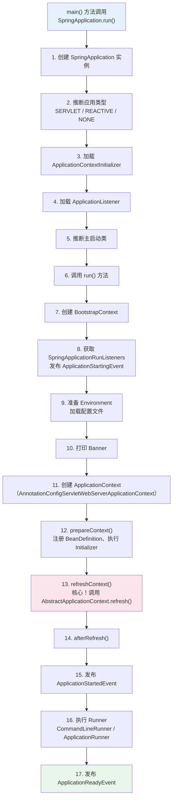
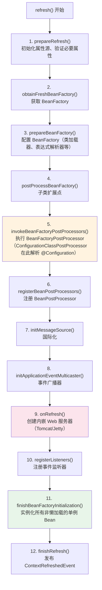
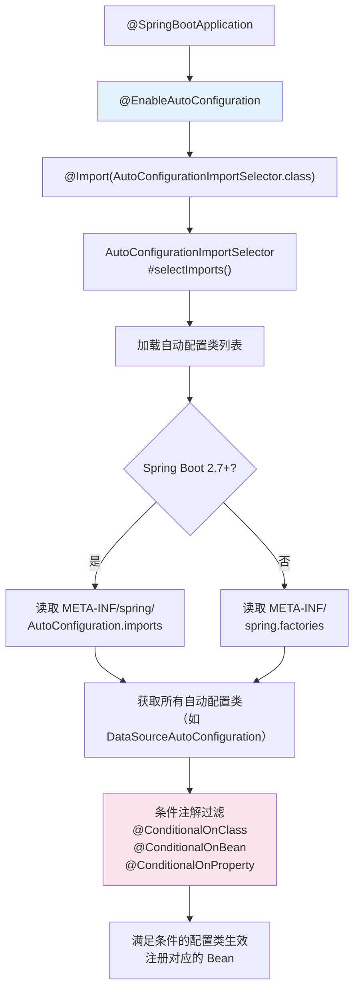

# Spring Boot 启动流程与自动配置

## 概念说明

Spring Boot 的"魔法"来自两个核心机制：**SpringApplication.run() 启动流程**和 **@EnableAutoConfiguration 自动配置**。理解这两个机制，就能理解 Spring Boot 为什么能做到"零配置启动"。

## 核心原理

### 一、SpringApplication.run() 全过程



### 二、refreshContext() 核心步骤

`refreshContext()` 是启动流程中最核心的方法，它调用了 `AbstractApplicationContext.refresh()`：



**关键步骤说明**：
- **步骤 5**：`ConfigurationClassPostProcessor` 在此解析 `@Configuration`、`@ComponentScan`、`@Import`、`@Bean` 等注解，完成 BeanDefinition 的注册
- **步骤 9**：内嵌 Web 服务器（Tomcat）在此创建
- **步骤 11**：所有非懒加载的单例 Bean 在此实例化，触发 Bean 生命周期

### 三、自动配置原理

`@SpringBootApplication` = `@SpringBootConfiguration` + `@EnableAutoConfiguration` + `@ComponentScan`



### 四、常用条件注解

| 条件注解 | 说明 | 示例 |
|----------|------|------|
| `@ConditionalOnClass` | classpath 中存在指定类时生效 | 有 DataSource.class 才配置数据源 |
| `@ConditionalOnMissingBean` | 容器中不存在指定 Bean 时生效 | 用户没自定义就用默认的 |
| `@ConditionalOnProperty` | 配置属性满足条件时生效 | `spring.cache.type=redis` |
| `@ConditionalOnBean` | 容器中存在指定 Bean 时生效 | 有 DataSource 才配置 JdbcTemplate |
| `@ConditionalOnWebApplication` | Web 应用环境时生效 | 只在 Web 环境注册 Filter |

```java
// 自动配置类示例（简化版）
@AutoConfiguration
@ConditionalOnClass(DataSource.class)
@EnableConfigurationProperties(DataSourceProperties.class)
public class DataSourceAutoConfiguration {

    @Bean
    @ConditionalOnMissingBean
    public DataSource dataSource(DataSourceProperties properties) {
        // 用户没有自定义 DataSource 时，使用默认配置创建
        return properties.initializeDataSourceBuilder().build();
    }
}
```

## 代码示例

```java
@SpringBootApplication
public class SpringBootApp {
    public static void main(String[] args) {
        // SpringApplication.run() 是一切的起点
        ConfigurableApplicationContext context = SpringApplication.run(SpringBootApp.class, args);

        // 查看容器中注册了多少个 Bean
        System.out.println("Bean 总数: " + context.getBeanDefinitionCount());

        // 查看自动配置了哪些类
        String[] beanNames = context.getBeanDefinitionNames();
        Arrays.stream(beanNames)
              .filter(name -> name.contains("auto"))
              .forEach(System.out::println);
    }
}
```

> 💻 完整可运行代码：[SpringBootApp.java](../../../code-examples/02-framework/springboot-examples/src/main/java/com/example/springboot/SpringBootApp.java)

## 常见面试题

### Q1: Spring Boot 的启动流程？

**难度**：⭐⭐⭐ | **频率**：🔥🔥🔥

**答题思路**：

1. 从 main 方法开始
2. 创建 SpringApplication → 推断应用类型 → 加载监听器
3. 调用 run() → 准备环境 → 创建上下文 → refreshContext → 执行 Runner

**标准答案**：

Spring Boot 启动从 `SpringApplication.run()` 开始：（1）创建 SpringApplication 实例，推断应用类型（Servlet/Reactive），加载 Initializer 和 Listener；（2）调用 run() 方法，创建 Environment 加载配置文件，打印 Banner；（3）创建 ApplicationContext；（4）调用 refreshContext()，这是核心步骤，包括执行 BeanFactoryPostProcessor 解析配置类、注册 BeanPostProcessor、创建内嵌 Web 服务器、实例化所有单例 Bean；（5）执行 CommandLineRunner/ApplicationRunner；（6）发布 ApplicationReadyEvent。

**深入追问**：

- refreshContext() 里面做了什么？（12 个步骤）
- 内嵌 Tomcat 在哪个阶段启动？（onRefresh）
- Bean 在哪个阶段实例化？（finishBeanFactoryInitialization）

### Q2: 自动配置的原理？

**难度**：⭐⭐⭐ | **频率**：🔥🔥🔥

**标准答案**：

`@SpringBootApplication` 包含 `@EnableAutoConfiguration`，它通过 `@Import(AutoConfigurationImportSelector.class)` 导入自动配置选择器。选择器从 `META-INF/spring/AutoConfiguration.imports`（Spring Boot 2.7+）或 `META-INF/spring.factories` 中加载所有自动配置类的全限定名，然后通过条件注解（@ConditionalOnClass、@ConditionalOnMissingBean 等）过滤，只有满足条件的配置类才会生效，注册对应的 Bean 到容器中。

**深入追问**：

- spring.factories 和 AutoConfiguration.imports 的区别？
- @ConditionalOnMissingBean 的作用？（用户自定义优先）
- 如何排除某个自动配置？（`@SpringBootApplication(exclude = xxx.class)`）

### Q3: @SpringBootApplication 注解包含哪些注解？

**难度**：⭐⭐ | **频率**：🔥🔥🔥

**标准答案**：

`@SpringBootApplication` 是一个组合注解，包含三个核心注解：（1）`@SpringBootConfiguration`（本质是 @Configuration，标记为配置类）；（2）`@EnableAutoConfiguration`（开启自动配置）；（3）`@ComponentScan`（组件扫描，默认扫描主启动类所在包及子包）。

## 参考资料

- [Spring Boot 自动配置官方文档](https://docs.spring.io/spring-boot/docs/current/reference/html/using.html#using.auto-configuration)
- [SpringApplication 源码](https://github.com/spring-projects/spring-boot/blob/main/spring-boot-project/spring-boot/src/main/java/org/springframework/boot/SpringApplication.java)
