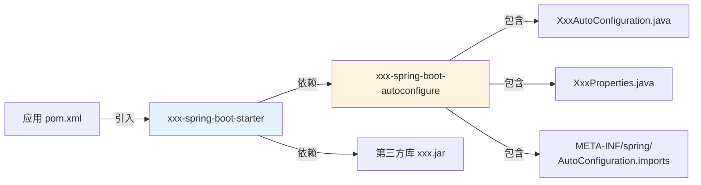
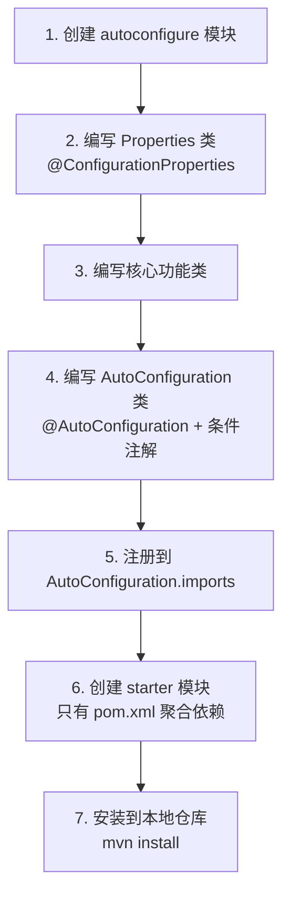

# Starter 机制与自定义 Starter

## 概念说明

Starter 是 Spring Boot 的**依赖管理机制**。一个 Starter 本质上是一个 Maven 依赖集合 + 自动配置类，引入一个 Starter 就能自动获得该功能所需的所有依赖和默认配置。

例如 `spring-boot-starter-web` 包含了 Spring MVC、内嵌 Tomcat、Jackson 等依赖，以及对应的自动配置。

## 核心原理

### 一、Starter 的组成

一个标准的 Starter 由两部分组成：

| 组件 | 作用 | 命名规范 |
|------|------|----------|
| starter 模块 | 只包含 pom.xml，聚合依赖 | `xxx-spring-boot-starter` |
| autoconfigure 模块 | 包含自动配置类和条件判断 | `xxx-spring-boot-autoconfigure` |



### 二、自定义 Starter 开发步骤



**示例：自定义一个短信发送 Starter**

```java
// 1. 配置属性类
@ConfigurationProperties(prefix = "sms")
public class SmsProperties {
    private String apiKey;
    private String apiSecret;
    private String signName;
    // getter/setter
}

// 2. 核心功能类
public class SmsService {
    private final SmsProperties properties;

    public SmsService(SmsProperties properties) {
        this.properties = properties;
    }

    public void send(String phone, String message) {
        System.out.println("发送短信到 " + phone + ": " + message);
    }
}

// 3. 自动配置类
@AutoConfiguration
@ConditionalOnClass(SmsService.class)
@EnableConfigurationProperties(SmsProperties.class)
public class SmsAutoConfiguration {

    @Bean
    @ConditionalOnMissingBean
    public SmsService smsService(SmsProperties properties) {
        return new SmsService(properties);
    }
}
```

```
// 4. META-INF/spring/org.springframework.boot.autoconfigure.AutoConfiguration.imports
com.example.sms.SmsAutoConfiguration
```

### 三、spring-boot-autoconfigure 模块

`spring-boot-autoconfigure` 是 Spring Boot 自动配置的核心模块，包含了 100+ 个自动配置类：

| 自动配置类 | 功能 |
|-----------|------|
| `DataSourceAutoConfiguration` | 数据源自动配置 |
| `WebMvcAutoConfiguration` | Spring MVC 自动配置 |
| `JacksonAutoConfiguration` | JSON 序列化自动配置 |
| `CacheAutoConfiguration` | 缓存自动配置 |
| `SecurityAutoConfiguration` | Spring Security 自动配置 |

## 代码示例

> 💻 完整可运行代码：[SpringBootApp.java](../../../code-examples/02-framework/springboot-examples/src/main/java/com/example/springboot/SpringBootApp.java)

## 常见面试题

### Q1: Spring Boot Starter 的原理？

**难度**：⭐⭐⭐ | **频率**：🔥🔥

**标准答案**：

Starter 本质是一个依赖聚合 + 自动配置的机制。一个 Starter 包含两部分：starter 模块（聚合依赖的 pom.xml）和 autoconfigure 模块（自动配置类 + 条件注解）。引入 Starter 后，Spring Boot 启动时通过 `AutoConfigurationImportSelector` 加载 `META-INF/spring/AutoConfiguration.imports` 中注册的自动配置类，条件注解判断通过后自动注册相关 Bean。

**深入追问**：

- 如何自定义一个 Starter？（创建 autoconfigure + starter 两个模块）
- Starter 的命名规范？（官方：spring-boot-starter-xxx，第三方：xxx-spring-boot-starter）

### Q2: 如何自定义一个 Spring Boot Starter？

**难度**：⭐⭐⭐ | **频率**：🔥🔥

**标准答案**：

（1）创建 autoconfigure 模块，编写 `@ConfigurationProperties` 属性类、核心功能类、`@AutoConfiguration` 自动配置类（加条件注解）；（2）在 `META-INF/spring/org.springframework.boot.autoconfigure.AutoConfiguration.imports` 中注册配置类；（3）创建 starter 模块，pom.xml 中依赖 autoconfigure 模块和第三方库；（4）安装到仓库后，其他项目引入 starter 即可自动配置。

### Q3: @ConditionalOnMissingBean 的作用？

**难度**：⭐⭐ | **频率**：🔥🔥

**标准答案**：

`@ConditionalOnMissingBean` 表示当容器中不存在指定类型的 Bean 时，当前 Bean 定义才生效。这是 Spring Boot 自动配置的核心设计理念——**用户自定义优先**。如果用户已经手动配置了某个 Bean，自动配置就不会覆盖。

## 参考资料

- [Spring Boot Starter 官方文档](https://docs.spring.io/spring-boot/docs/current/reference/html/features.html#features.developing-auto-configuration)
- [创建自定义 Starter](https://docs.spring.io/spring-boot/docs/current/reference/html/features.html#features.developing-auto-configuration.custom-starter)
