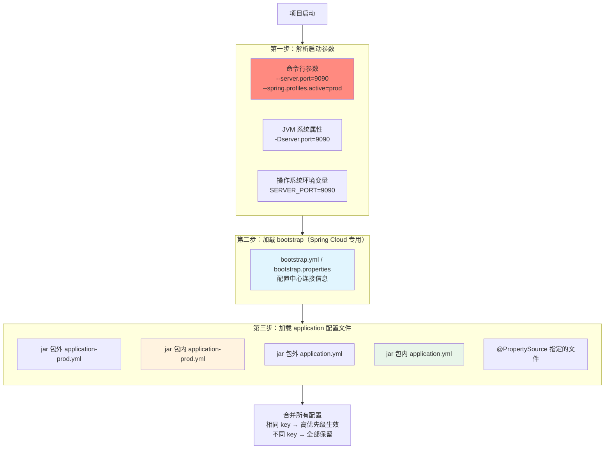
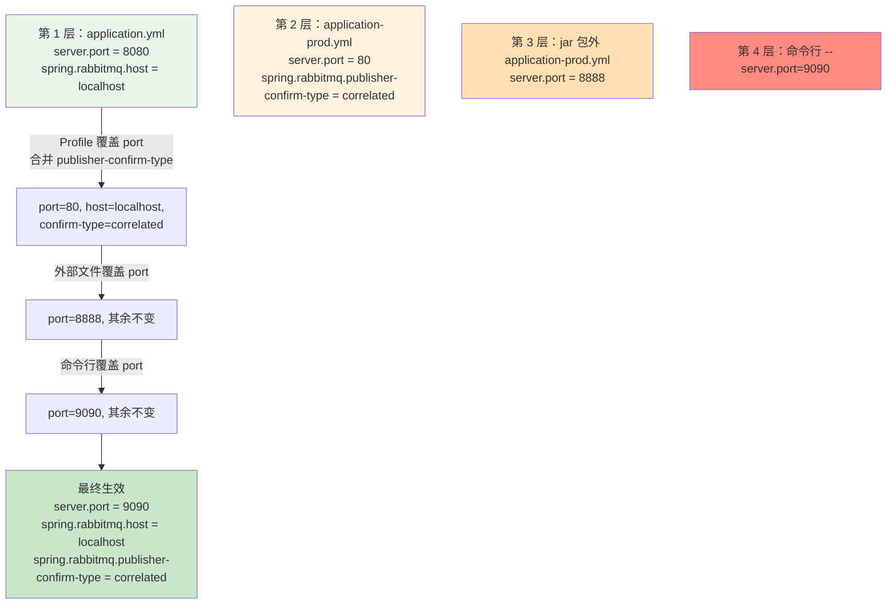
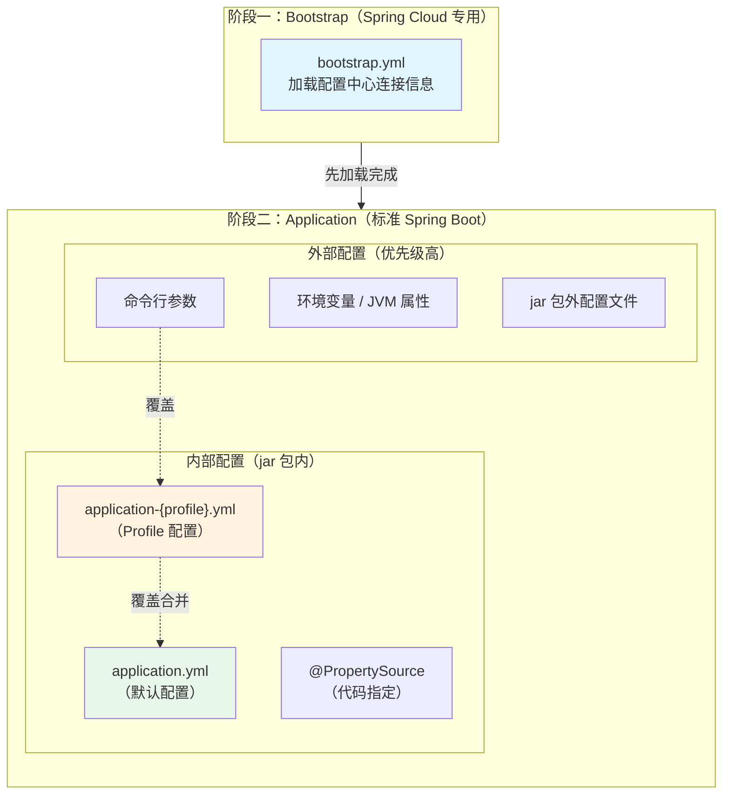
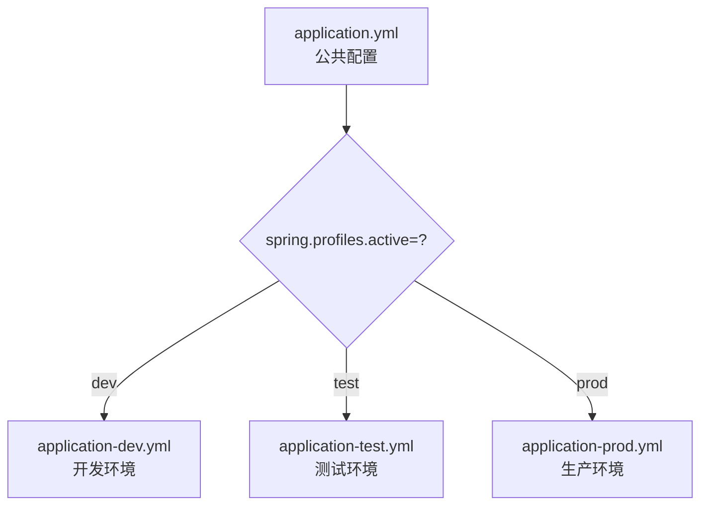
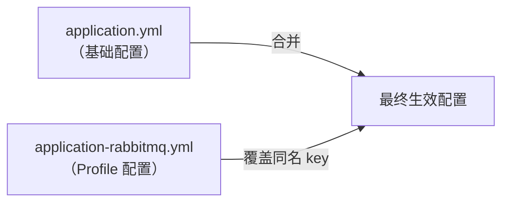

# 配置文件体系

## 概念说明

Spring Boot 提供了灵活的配置文件体系，支持多种格式（yml/properties）、多环境切换（Profile）、外部化配置等特性。理解配置文件的加载顺序和优先级，是日常开发和面试中的常见考点。

## 核心原理

### 一、加载顺序、优先级与覆盖规则

#### 先搞清一个关键问题

> "优先级高"是指先加载还是后加载？后加载的相同 key 会覆盖先加载的吗？

答案：**Spring Boot 内部实现是"先加载的优先级高，后加载的相同 key 被忽略"**。但从使用者角度看，你只需要记住一个结论：

**优先级高的值最终生效，优先级低的相同 key 被覆盖。不同 key 互补合并。**

至于底层是"先加载的保留"还是"后加载的覆盖"，这是实现细节，不影响最终结果。

#### 完整加载流程（按实际执行顺序）

项目启动时，Spring Boot 按以下顺序加载配置：



#### 优先级排序（从高到低）

| 优先级 | 加载阶段 | 配置来源 | 示例 | 相同 key 时 |
|--------|---------|----------|------|------------|
| ①（最高） | 启动参数 | 命令行参数 | `--server.port=9090` | 覆盖一切 |
| ② | 启动参数 | JVM 系统属性 | `-Dserver.port=9090` | 覆盖③~⑧ |
| ③ | 启动参数 | 环境变量 | `SERVER_PORT=9090` | 覆盖④~⑧ |
| ④ | 配置文件 | jar 包外 Profile 配置 | `./config/application-prod.yml` | 覆盖⑤~⑧ |
| ⑤ | 配置文件 | jar 包内 Profile 配置 | `classpath:application-prod.yml` | 覆盖⑥~⑧ |
| ⑥ | 配置文件 | jar 包外默认配置 | `./config/application.yml` | 覆盖⑦~⑧ |
| ⑦ | 配置文件 | jar 包内默认配置 | `classpath:application.yml` | 覆盖⑧ |
| ⑧（最低） | 代码 | `@PropertySource` | `@PropertySource("classpath:x.properties")` | 被所有覆盖 |

> `bootstrap.yml` 不在上述优先级链中。它在独立的父 ApplicationContext 中加载，用于配置中心连接信息，不会被 application.yml 覆盖（见下文详解）。

#### 覆盖规则详解

**规则 1：相同 key — 高优先级的值生效**

```bash
# ⑦ jar 包内 application.yml 定义：
server:
  port: 8080

# ⑤ jar 包内 application-prod.yml 定义：
server:
  port: 80

# ① 命令行参数：
java -jar app.jar --server.port=9090

# 最终生效：server.port = 9090
# 原因：① 命令行 > ⑤ Profile > ⑦ 默认配置
```

**规则 2：不同 key — 互补合并，全部生效**

以本项目为例，启动命令 `mvn spring-boot:run -Dspring-boot.run.profiles=rabbitmq`：

```
加载顺序：
  1. 先加载 application.yml（⑦ 默认配置）
  2. 再加载 application-rabbitmq.yml（⑤ Profile 配置，优先级更高）
```

```yaml
# ⑦ application.yml（先加载，优先级低）
spring:
  rabbitmq:
    host: localhost              # key A
    port: 5672                   # key B
    listener:
      simple:
        acknowledge-mode: auto   # key C
        prefetch: 10             # key D
```

```yaml
# ⑤ application-rabbitmq.yml（后加载，优先级高）
spring:
  rabbitmq:
    publisher-confirm-type: correlated  # key E（新 key）
    listener:
      simple:
        acknowledge-mode: manual        # key C（相同 key）
        prefetch: 1                     # key D（相同 key）
        concurrency: 3                  # key F（新 key）
```

```yaml
# 最终生效的配置：
spring:
  rabbitmq:
    host: localhost                     # key A → 只在 ⑦ 中定义，保留
    port: 5672                          # key B → 只在 ⑦ 中定义，保留
    publisher-confirm-type: correlated  # key E → 只在 ⑤ 中定义，合并生效
    listener:
      simple:
        acknowledge-mode: manual        # key C → 两边都有，⑤ 优先级高，覆盖为 manual
        prefetch: 1                     # key D → 两边都有，⑤ 优先级高，覆盖为 1
        concurrency: 3                  # key F → 只在 ⑤ 中定义，合并生效
```

**规则 3：多个 Profile 同时激活 — 后面的优先级更高**

```bash
java -jar app.jar --spring.profiles.active=dev,prod
```

```
加载顺序：application.yml → application-dev.yml → application-prod.yml
优先级：prod > dev > 默认（后激活的 Profile 优先级更高）
```

```yaml
# application-dev.yml
server:
  port: 8080
logging:
  level:
    root: DEBUG

# application-prod.yml
server:
  port: 80
logging:
  level:
    root: WARN

# 最终生效：
# server.port = 80          ← prod 覆盖 dev
# logging.level.root = WARN ← prod 覆盖 dev
```

#### 一图总结：四层覆盖链路



#### 各类配置文件详解

Spring Boot 的配置文件分为两个独立的加载阶段：



**1. 外部配置（命令行、环境变量、jar 包外文件）**

外部配置优先级最高，适合在不修改 jar 包的情况下覆盖配置：

```bash
# 命令行参数（优先级最高）
java -jar app.jar --server.port=9090 --spring.profiles.active=prod

# JVM 系统属性
java -Dserver.port=9090 -jar app.jar

# 操作系统环境变量（Spring Boot 自动将 SERVER_PORT 映射为 server.port）
export SERVER_PORT=9090
java -jar app.jar

# jar 包外配置文件（放在 jar 同级目录或 config/ 子目录）
# 目录结构：
# ├── app.jar
# ├── application.yml          ← jar 包外默认配置
# └── config/
#     └── application-prod.yml ← jar 包外 Profile 配置（优先级最高的文件配置）
```

jar 包外配置文件的搜索路径（优先级从高到低）：
1. `./config/application-{profile}.yml`
2. `./config/application.yml`
3. `./application-{profile}.yml`
4. `./application.yml`

> 生产环境常用做法：将敏感配置（数据库密码等）放在 jar 包外的配置文件中，不打入 jar 包。

**2. bootstrap.yml / bootstrap.properties**

Spring Cloud 专用配置文件，由 `BootstrapApplicationListener` 加载，**早于** `application.yml`：

| 特性 | bootstrap.yml | application.yml |
|------|--------------|-----------------|
| 加载时机 | 父 ApplicationContext 初始化时 | 主 ApplicationContext 初始化时 |
| 用途 | 配置中心连接信息、加密密钥 | 应用业务配置 |
| 典型内容 | Nacos/Apollo 地址、加密 key | 端口、数据库、Redis 等 |
| 是否可被覆盖 | 不会被 application.yml 覆盖 | 会被外部配置覆盖 |

```yaml
# bootstrap.yml 示例 — 连接 Nacos 配置中心
spring:
  application:
    name: my-service
  cloud:
    nacos:
      config:
        server-addr: localhost:8848
        namespace: dev
        file-extension: yml
```

> ⚠️ Spring Cloud 2022+（Spring Boot 3.x）默认不再自动加载 bootstrap.yml，需要引入依赖：
> ```xml
> <dependency>
>     <groupId>org.springframework.cloud</groupId>
>     <artifactId>spring-cloud-starter-bootstrap</artifactId>
> </dependency>
> ```

**3. application.yml / application.properties**

Spring Boot 的核心配置文件，存放应用的所有默认配置：

```yaml
# application.yml — 所有环境共用的基础配置
server:
  port: 8080

spring:
  application:
    name: my-service
  datasource:
    driver-class-name: com.mysql.cj.jdbc.Driver
    # 默认连接本地数据库，生产环境通过 Profile 覆盖
    url: jdbc:mysql://localhost:3306/demo
    username: root
    password: root123
```

yml 和 properties 同时存在时的规则：
- **同名文件**：`application.properties` 优先级高于 `application.yml`
- **建议**：一个项目只用一种格式，推荐 yml（可读性更好）

yml 多文档特性（`---` 分隔符）：

```yaml
# 在一个文件中定义多个 Profile（Spring Boot 2.4+ 语法）
spring:
  profiles:
    active: dev

---
spring:
  config:
    activate:
      on-profile: dev
server:
  port: 8080

---
spring:
  config:
    activate:
      on-profile: prod
server:
  port: 80
```

**4. 多环境配置文件（application-{profile}.yml）**

按环境拆分配置，通过 Profile 激活对应文件：

```
src/main/resources/
├── application.yml              ← 公共配置（所有环境共用）
├── application-dev.yml          ← 开发环境（本地数据库、DEBUG 日志）
├── application-test.yml         ← 测试环境（测试数据库、INFO 日志）
├── application-prod.yml         ← 生产环境（生产数据库、WARN 日志、连接池调优）
├── application-rabbitmq.yml     ← 功能 Profile（RabbitMQ 生产级配置）
└── application-sentinel.yml     ← 功能 Profile（切换熔断实现）
```

Profile 文件的两种用法：

| 用法 | 示例 | 说明 |
|------|------|------|
| 环境 Profile | `application-dev.yml` / `application-prod.yml` | 按部署环境区分，通常互斥激活 |
| 功能 Profile | `application-rabbitmq.yml` / `application-sentinel.yml` | 按功能模块区分，可叠加激活 |

```bash
# 环境 Profile（互斥）
mvn spring-boot:run -Dspring-boot.run.profiles=prod

# 功能 Profile（叠加）— 生产环境 + RabbitMQ 生产级配置 + Sentinel 熔断
mvn spring-boot:run -Dspring-boot.run.profiles=prod,rabbitmq,sentinel
```

**5. @PropertySource 自定义配置文件**

加载非标准名称的配置文件（优先级最低）：

```java
@Configuration
@PropertySource("classpath:custom-config.properties")
public class CustomConfig {
    @Value("${custom.key}")
    private String customKey;
}
```

> 注意：`@PropertySource` 默认只支持 `.properties` 格式，不支持 `.yml`。需要 yml 支持可自定义 `PropertySourceFactory`。

### 二、application.yml vs application.properties

| 特性 | yml | properties |
|------|-----|------------|
| 格式 | 层级结构，缩进表示层级 | 扁平 key=value |
| 可读性 | ⭐⭐⭐⭐⭐ | ⭐⭐⭐ |
| 多文档 | 支持 `---` 分隔多文档 | 不支持 |
| 列表 | 原生支持 | 用逗号或索引 |
| 同时存在 | properties 优先级更高 | — |

### 三、Profile 多环境配置



激活 Profile 的方式：
1. 配置文件：`spring.profiles.active=dev`
2. 命令行：`--spring.profiles.active=prod`
3. 环境变量：`SPRING_PROFILES_ACTIVE=prod`
4. JVM 参数：`-Dspring.profiles.active=prod`
5. Maven 参数：`mvn spring-boot:run -Dspring-boot.run.profiles=prod`

#### Profile 文件加载与覆盖合并机制

Profile 配置文件不是替换 `application.yml`，而是**覆盖合并**：



规则：
- **相同 key**：Profile 文件的值覆盖默认文件的值
- **不同 key**：两个文件的配置互补合并，都生效
- **多个 Profile**：`--spring.profiles.active=rabbitmq,kafka` 可同时激活多个，后面的覆盖前面的

实际示例（本项目 Spring Cloud 实战模块）：

| 配置项 | application.yml（默认） | application-rabbitmq.yml（Profile） | 最终生效 |
|--------|----------------------|-----------------------------------|---------|
| `spring.rabbitmq.host` | localhost | localhost | localhost |
| `spring.rabbitmq.listener.simple.acknowledge-mode` | auto | manual | **manual**（被覆盖） |
| `spring.rabbitmq.listener.simple.prefetch` | 10 | 1 | **1**（被覆盖） |
| `spring.rabbitmq.publisher-confirm-type` | 无 | correlated | **correlated**（新增） |
| `spring.rabbitmq.listener.simple.concurrency` | 无 | 3 | **3**（新增） |

```bash
# 默认启动 — 使用 application.yml 的基础配置（auto 确认，prefetch=10）
mvn spring-boot:run

# 激活 rabbitmq Profile — 覆盖为生产级配置（manual 确认，prefetch=1，发布确认）
mvn spring-boot:run -Dspring-boot.run.profiles=rabbitmq

# 同时激活多个 Profile
mvn spring-boot:run -Dspring-boot.run.profiles=rabbitmq,kafka
```

#### 本项目 Profile 配置一览

| Profile | 文件 | 用途 | 启动命令 |
|---------|------|------|---------|
| 默认 | `application.yml` | 基础配置（Consul + 全部中间件） | `mvn spring-boot:run` |
| nacos | `application-nacos.yml` | 切换注册中心为 Nacos | `mvn spring-boot:run -Dspring-boot.run.profiles=nacos` |
| zk | `application-zk.yml` | 切换注册中心为 ZooKeeper | `mvn spring-boot:run -Dspring-boot.run.profiles=zk` |
| rabbitmq | `application-rabbitmq.yml` | RabbitMQ 生产级配置（手动确认+发布确认） | `mvn spring-boot:run -Dspring-boot.run.profiles=rabbitmq` |
| kafka | `application-kafka.yml` | Kafka 生产级配置（acks=all+幂等+手动提交） | `mvn spring-boot:run -Dspring-boot.run.profiles=kafka` |
| sentinel | `application-sentinel.yml` | 切换熔断为 Sentinel（替代 Resilience4j） | `mvn spring-boot:run -Dspring-boot.run.profiles=sentinel` |

### 四、@ConfigurationProperties 属性绑定

```java
@Component
@ConfigurationProperties(prefix = "app")
public class AppProperties {
    private String name;
    private int maxRetry;
    private Duration timeout;
    private List<String> servers;
    // getter/setter
}
```

```yaml
app:
  name: my-application
  max-retry: 3
  timeout: 30s
  servers:
    - server1.example.com
    - server2.example.com
```

**@ConfigurationProperties vs @Value**：

| 特性 | @ConfigurationProperties | @Value |
|------|-------------------------|--------|
| 绑定方式 | 批量绑定前缀下所有属性 | 逐个绑定 |
| 松散绑定 | 支持（camelCase/kebab-case/snake_case） | 不支持 |
| SpEL | 不支持 | 支持 |
| 复杂类型 | 支持（List/Map/嵌套对象） | 不支持 |
| 校验 | 支持 @Validated | 不支持 |
| 推荐度 | ⭐⭐⭐⭐⭐ | ⭐⭐⭐ |

### 五、配置加密

敏感配置（数据库密码等）不应明文存储，常用方案：

| 方案 | 说明 |
|------|------|
| Jasypt | `spring-boot-starter-jasypt`，ENC(密文) 格式 |
| 配置中心 | Apollo/Nacos 支持配置加密 |
| 环境变量 | 敏感信息通过环境变量注入 |
| Vault | HashiCorp Vault 密钥管理 |

## 代码示例

```java
@Component
@ConfigurationProperties(prefix = "app")
@Validated
public class AppConfig {

    @NotBlank
    private String name;

    @Min(1) @Max(10)
    private int maxRetry = 3;

    private Duration timeout = Duration.ofSeconds(30);

    // getter/setter
}
```

> 💻 完整可运行代码：[ConfigDemo.java](https://github.com/skyhe58/guide-java/tree/main/code-examples/02-framework/springboot-examples/src/main/java/com/example/springboot/config/ConfigDemo.java)
> <!-- 本地路径：code-examples/02-framework/springboot-examples/src/main/java/com/example/springboot/config/ConfigDemo.java -->

## 常见面试题

### Q1: Spring Boot 配置文件的加载顺序？

**难度**：⭐⭐ | **频率**：🔥🔥🔥

**标准答案**：

优先级从高到低：命令行参数 > JVM 系统属性 > 环境变量 > jar 包外 Profile 配置 > jar 包内 Profile 配置 > jar 包外默认配置 > jar 包内默认配置 > @PropertySource。相同 key 高优先级覆盖低优先级，不同 key 互补合并都生效。

**深入追问**：

- 加载顺序和优先级是一回事吗？（不是。加载顺序是读取的先后，优先级是相同 key 谁生效。Spring Boot 的设计是先读到的优先级高）
- yml 和 properties 同时存在谁优先？（properties 优先）
- Profile 文件和默认文件的关系？（覆盖合并，不是替换。Profile 中定义的 key 覆盖默认文件的同名 key，未定义的 key 保留默认文件的值）
- 多个 Profile 同时激活谁优先？（后面的覆盖前面的，如 `dev,prod` 中 prod 优先）

### Q2: @ConfigurationProperties 和 @Value 的区别？

**难度**：⭐⭐ | **频率**：🔥🔥🔥

**标准答案**：

@ConfigurationProperties 批量绑定前缀下所有属性，支持松散绑定、复杂类型、@Validated 校验；@Value 逐个绑定，支持 SpEL 表达式但不支持松散绑定和复杂类型。推荐使用 @ConfigurationProperties。

### Q3: 如何实现多环境配置？

**难度**：⭐⭐ | **频率**：🔥🔥

**标准答案**：

通过 Profile 机制：创建 `application-{profile}.yml` 文件（如 application-dev.yml、application-prod.yml），通过 `spring.profiles.active` 指定激活的 Profile。可以在配置文件、命令行参数、环境变量、JVM 参数中设置。

**深入追问**：

- Profile 文件和默认文件的关系？（覆盖合并，不是替换。相同 key 被 Profile 覆盖，不同 key 互补合并）
- 多个 Profile 同时激活时谁优先？（后面的覆盖前面的，如 `--spring.profiles.active=dev,prod` 中 prod 优先）
- Profile 配置文件的典型用法？（基础配置放 application.yml，环境差异放 Profile 文件，如数据库地址、日志级别、中间件参数等）

### Q4: bootstrap.yml 和 application.yml 的区别？

**难度**：⭐⭐ | **频率**：🔥🔥

**标准答案**：

bootstrap.yml 由 Spring Cloud 的 `BootstrapApplicationListener` 加载，优先于 application.yml，用于配置中心（如 Nacos Config、Apollo）的连接信息。application.yml 是 Spring Boot 的标准配置文件，加载应用级配置。Spring Cloud 2022+ 默认不再自动加载 bootstrap.yml，需要引入 `spring-cloud-starter-bootstrap` 依赖。

## 参考资料

- [Spring Boot 外部化配置](https://docs.spring.io/spring-boot/docs/current/reference/html/features.html#features.external-config)
- [Spring Boot Profiles](https://docs.spring.io/spring-boot/docs/current/reference/html/features.html#features.profiles)
