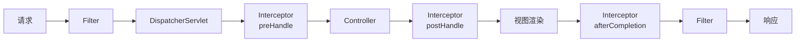

# Web 开发

## 概念说明

Spring Boot Web 开发基于 Spring MVC，通过 `spring-boot-starter-web` 自动配置了内嵌 Tomcat、Jackson、Spring MVC 等组件。本节覆盖 RESTful API 开发、拦截器、过滤器、全局异常处理、参数校验等日常开发和面试高频知识点。

## 核心原理

### 一、Filter vs Interceptor vs AOP

| 特性 | Filter（过滤器） | Interceptor（拦截器） | AOP（切面） |
|------|-----------------|---------------------|------------|
| 规范 | Servlet 规范 | Spring MVC | Spring AOP |
| 作用范围 | 所有请求（包括静态资源） | Controller 方法 | 任意 Spring Bean |
| 获取 Bean | 不方便 | 方便 | 方便 |
| 执行顺序 | 最先执行 | Filter 之后 | Interceptor 之后 |
| 典型场景 | 编码设置、CORS | 登录校验、日志 | 事务、权限 |



### 二、全局异常处理（@ControllerAdvice）

```java
@RestControllerAdvice
public class GlobalExceptionHandler {

    @ExceptionHandler(MethodArgumentNotValidException.class)
    public Result<?> handleValidation(MethodArgumentNotValidException e) {
        String message = e.getBindingResult().getFieldErrors().stream()
                .map(error -> error.getField() + ": " + error.getDefaultMessage())
                .collect(Collectors.joining(", "));
        return Result.fail(400, message);
    }

    @ExceptionHandler(BusinessException.class)
    public Result<?> handleBusiness(BusinessException e) {
        return Result.fail(e.getCode(), e.getMessage());
    }

    @ExceptionHandler(Exception.class)
    public Result<?> handleException(Exception e) {
        return Result.fail(500, "服务器内部错误");
    }
}
```

### 三、参数校验（@Valid）

```java
public class UserCreateRequest {
    @NotBlank(message = "用户名不能为空")
    private String username;

    @Email(message = "邮箱格式不正确")
    private String email;

    @Min(value = 1, message = "年龄最小为1")
    @Max(value = 150, message = "年龄最大为150")
    private Integer age;
}

@RestController
@RequestMapping("/api/users")
public class UserController {

    @PostMapping
    public Result<User> createUser(@Valid @RequestBody UserCreateRequest request) {
        // 参数校验通过后执行业务逻辑
        return Result.ok(userService.create(request));
    }
}
```

### 四、拦截器（HandlerInterceptor）

```java
@Component
public class AuthInterceptor implements HandlerInterceptor {

    @Override
    public boolean preHandle(HttpServletRequest request, HttpServletResponse response,
                             Object handler) {
        String token = request.getHeader("Authorization");
        if (token == null || !tokenService.verify(token)) {
            response.setStatus(401);
            return false; // 拦截请求
        }
        return true; // 放行
    }
}

@Configuration
public class WebConfig implements WebMvcConfigurer {
    @Autowired
    private AuthInterceptor authInterceptor;

    @Override
    public void addInterceptors(InterceptorRegistry registry) {
        registry.addInterceptor(authInterceptor)
                .addPathPatterns("/api/**")
                .excludePathPatterns("/api/login", "/api/register");
    }
}
```

## 代码示例

> 💻 完整可运行代码：[WebDemo.java](../../../code-examples/02-framework/springboot-examples/src/main/java/com/example/springboot/web/WebDemo.java)

## 常见面试题

### Q1: Filter 和 Interceptor 的区别？

**难度**：⭐⭐ | **频率**：🔥🔥🔥

**标准答案**：

Filter 是 Servlet 规范定义的，作用于所有请求（包括静态资源），在 DispatcherServlet 之前执行；Interceptor 是 Spring MVC 提供的，只作用于 Controller 方法，可以方便地获取 Spring Bean。执行顺序：Filter → DispatcherServlet → Interceptor → Controller。

**深入追问**：

- 多个 Filter 的执行顺序如何控制？（@Order 或 FilterRegistrationBean 设置 order）
- Interceptor 的三个方法分别在什么时候执行？

### Q2: Spring Boot 如何实现全局异常处理？

**难度**：⭐⭐ | **频率**：🔥🔥🔥

**标准答案**：

使用 `@RestControllerAdvice` + `@ExceptionHandler` 实现。@RestControllerAdvice 是 @ControllerAdvice + @ResponseBody 的组合，@ExceptionHandler 指定处理的异常类型。可以按异常类型分别处理，如参数校验异常、业务异常、系统异常等。

### Q3: @Valid 和 @Validated 的区别？

**难度**：⭐⭐ | **频率**：🔥🔥

**标准答案**：

@Valid 是 JSR-303 标准注解，支持嵌套校验；@Validated 是 Spring 扩展注解，支持分组校验。在 Controller 方法参数上两者效果相同，但 @Validated 可以用在类上开启方法级别校验。

## 在 Spring Cloud 项目中体验

启动 Spring Cloud 项目后，通过 REST 接口直接验证：

```bash
# 启动中间件
docker compose -f docker/docker-compose.yml up -d
docker compose -f docker/docker-compose.consul.yml up -d

# 启动项目
cd code-examples/02-framework/springcloud-examples
mvn spring-boot:run

# 验证接口
curl http://localhost:8090/demo/boot/exception/business
curl -X POST http://localhost:8090/demo/boot/validate/user -H "Content-Type: application/json" -d '{"name":"test","email":"test@example.com","age":25}'
```

> 💻 Spring Cloud 实战代码：[ExceptionController.java](../../../code-examples/02-framework/springcloud-examples/src/main/java/com/example/springcloud/boot/ExceptionController.java) | [ValidateController.java](../../../code-examples/02-framework/springcloud-examples/src/main/java/com/example/springcloud/boot/ValidateController.java)

## 参考资料

- [Spring Boot Web 开发官方文档](https://docs.spring.io/spring-boot/docs/current/reference/html/web.html)
- [Spring MVC 官方文档](https://docs.spring.io/spring-framework/reference/web/webmvc.html)
