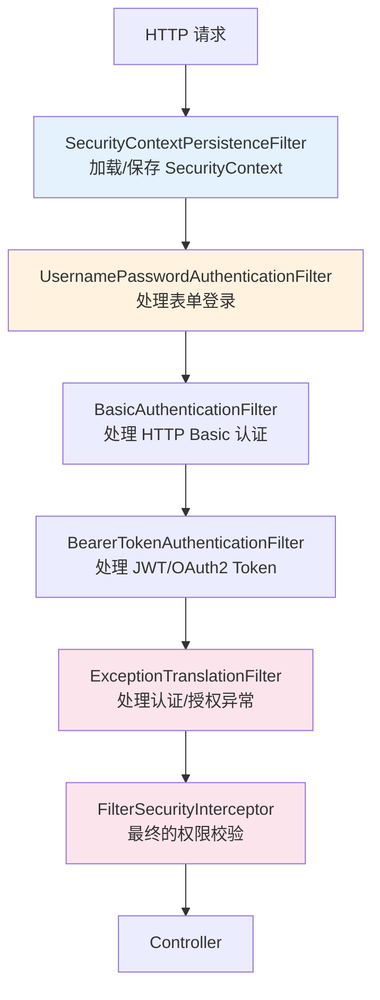
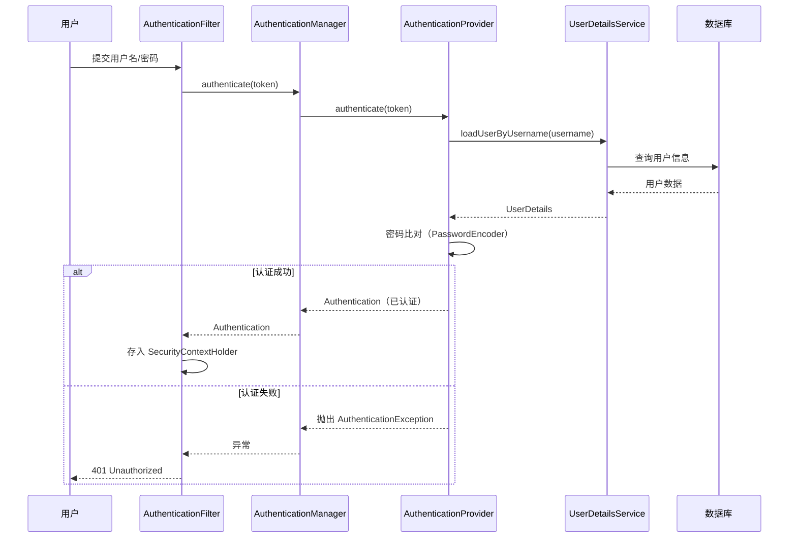

# Spring Security 认证与授权

## 概念说明

Spring Security 是 Spring 生态的安全框架，提供**认证（Authentication）**和**授权（Authorization）**两大核心功能。认证解决"你是谁"，授权解决"你能做什么"。

## 核心原理

### 一、过滤器链架构

Spring Security 的核心是一条**过滤器链（FilterChain）**，所有请求都要经过这条链：



### 二、认证流程



### 三、JWT 集成方案

```java
// JWT 认证过滤器
public class JwtAuthenticationFilter extends OncePerRequestFilter {

    @Override
    protected void doFilterInternal(HttpServletRequest request,
                                     HttpServletResponse response,
                                     FilterChain filterChain) throws ServletException, IOException {
        String token = extractToken(request);
        if (token != null && jwtUtils.validateToken(token)) {
            String username = jwtUtils.getUsernameFromToken(token);
            UserDetails userDetails = userDetailsService.loadUserByUsername(username);
            UsernamePasswordAuthenticationToken authentication =
                    new UsernamePasswordAuthenticationToken(userDetails, null, userDetails.getAuthorities());
            SecurityContextHolder.getContext().setAuthentication(authentication);
        }
        filterChain.doFilter(request, response);
    }
}
```

### 四、OAuth2 简介

OAuth2 定义了四种授权模式：

| 模式 | 适用场景 | 安全性 |
|------|----------|--------|
| 授权码模式 | Web 应用 | 最高 |
| 简化模式 | 单页应用（已不推荐） | 低 |
| 密码模式 | 受信任的客户端 | 中 |
| 客户端凭证模式 | 服务间调用 | 中 |

## 代码示例

> 💻 完整可运行代码：[SpringBootApp.java](https://github.com/skyhe58/guide-java/tree/main/code-examples/02-framework/springboot-examples/src/main/java/com/example/springboot/SpringBootApp.java)
> <!-- 本地路径：code-examples/02-framework/springboot-examples/src/main/java/com/example/springboot/SpringBootApp.java -->

## 常见面试题

### Q1: Spring Security 的认证流程？

**难度**：⭐⭐⭐ | **频率**：🔥🔥

**标准答案**：

请求经过 AuthenticationFilter，提取认证信息封装为 Authentication Token，交给 AuthenticationManager，Manager 委托给 AuthenticationProvider，Provider 调用 UserDetailsService 从数据库加载用户信息，然后用 PasswordEncoder 比对密码。认证成功后将 Authentication 存入 SecurityContextHolder。

**深入追问**：

- SecurityContextHolder 的存储策略？（默认 ThreadLocal）
- 如何自定义认证逻辑？（实现 UserDetailsService 或 AuthenticationProvider）

### Q2: JWT 和 Session 的区别？

**难度**：⭐⭐ | **频率**：🔥🔥🔥

**标准答案**：

Session 是服务端存储，有状态，需要 Session 共享（分布式场景）；JWT 是客户端存储（Token），无状态，天然支持分布式。JWT 缺点是无法主动失效（除非引入黑名单机制）、Token 较大。

### Q3: 如何实现接口级别的权限控制？

**难度**：⭐⭐ | **频率**：🔥🔥

**标准答案**：

（1）`@PreAuthorize("hasRole('ADMIN')")` 方法级别注解；（2）`SecurityFilterChain` 中配置 URL 级别权限；（3）自定义权限表达式。

## 参考资料

- [Spring Security 官方文档](https://docs.spring.io/spring-security/reference/)
- [Spring Security Architecture](https://spring.io/guides/topicals/spring-security-architecture)
