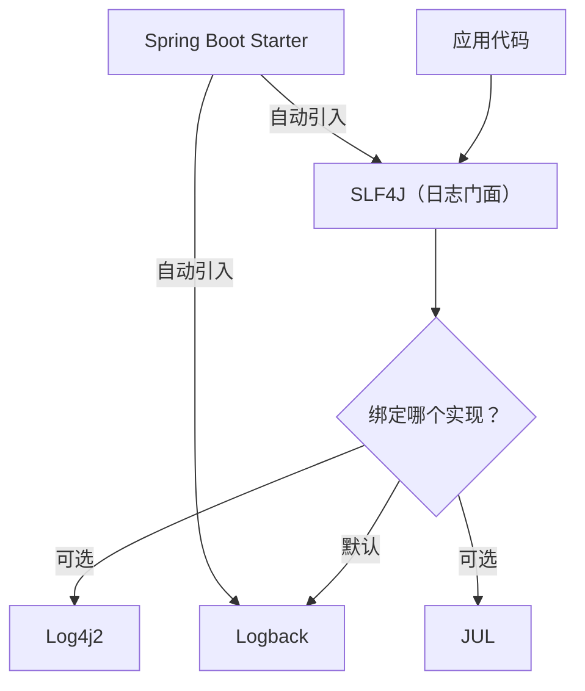
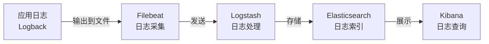

# 日志体系

## 概念说明

Spring Boot 默认使用 **SLF4J + Logback** 作为日志框架。SLF4J 是日志门面（接口），Logback 是日志实现。理解日志体系对于线上问题排查、链路追踪至关重要。

## 核心原理

### 一、日志框架关系



### 二、SLF4J + Logback 配置

```xml
<!-- logback-spring.xml（推荐使用 -spring 后缀，支持 Profile） -->
<configuration>
    <springProfile name="dev">
        <root level="DEBUG">
            <appender-ref ref="CONSOLE"/>
        </root>
    </springProfile>

    <springProfile name="prod">
        <root level="INFO">
            <appender-ref ref="FILE"/>
        </root>
    </springProfile>

    <appender name="CONSOLE" class="ch.qos.logback.core.ConsoleAppender">
        <encoder>
            <pattern>%d{yyyy-MM-dd HH:mm:ss.SSS} [%thread] [%X{traceId}] %-5level %logger{36} - %msg%n</pattern>
        </encoder>
    </appender>

    <appender name="FILE" class="ch.qos.logback.core.rolling.RollingFileAppender">
        <rollingPolicy class="ch.qos.logback.core.rolling.TimeBasedRollingPolicy">
            <fileNamePattern>logs/app.%d{yyyy-MM-dd}.log</fileNamePattern>
            <maxHistory>30</maxHistory>
        </rollingPolicy>
        <encoder>
            <pattern>%d{yyyy-MM-dd HH:mm:ss.SSS} [%thread] [%X{traceId}] %-5level %logger{36} - %msg%n</pattern>
        </encoder>
    </appender>
</configuration>
```

### 三、日志级别动态调整

```yaml
# application.yml 中配置日志级别
logging:
  level:
    root: INFO
    com.example.springboot: DEBUG
    org.springframework.web: WARN
```

通过 Actuator 端点动态调整（无需重启）：

```bash
# 查看当前日志级别
curl http://localhost:8080/actuator/loggers/com.example.springboot

# 动态修改日志级别
curl -X POST http://localhost:8080/actuator/loggers/com.example.springboot \
  -H "Content-Type: application/json" \
  -d '{"configuredLevel": "DEBUG"}'
```

### 四、MDC 链路追踪日志

MDC（Mapped Diagnostic Context）可以在日志中自动携带上下文信息（如 traceId），实现链路追踪：

```java
// 拦截器中设置 traceId
public class TraceInterceptor implements HandlerInterceptor {

    @Override
    public boolean preHandle(HttpServletRequest request, HttpServletResponse response,
                             Object handler) {
        String traceId = request.getHeader("X-Trace-Id");
        if (traceId == null) {
            traceId = UUID.randomUUID().toString().replace("-", "");
        }
        MDC.put("traceId", traceId);
        return true;
    }

    @Override
    public void afterCompletion(HttpServletRequest request, HttpServletResponse response,
                                Object handler, Exception ex) {
        MDC.clear(); // 防止内存泄漏
    }
}
```

日志输出中通过 `%X{traceId}` 引用 MDC 中的值。

### 五、ELK 日志收集方案



## 代码示例

```java
@Slf4j
@Service
public class LogDemoService {

    public void process(String orderId) {
        MDC.put("orderId", orderId);
        log.info("开始处理订单");
        log.debug("订单详情查询中...");
        log.info("订单处理完成");
        MDC.remove("orderId");
    }
}
```

> 💻 完整可运行代码：[LogDemo.java](https://github.com/skyhe58/guide-java/tree/main/code-examples/02-framework/springboot-examples/src/main/java/com/example/springboot/log/LogDemo.java)
> <!-- 本地路径：code-examples/02-framework/springboot-examples/src/main/java/com/example/springboot/log/LogDemo.java -->

## 常见面试题

### Q1: SLF4J 和 Logback 的关系？

**难度**：⭐⭐ | **频率**：🔥🔥

**标准答案**：

SLF4J 是日志门面（接口层），定义了统一的日志 API；Logback 是日志实现，是 SLF4J 的原生实现（同一作者）。应用代码只依赖 SLF4J 接口，底层实现可以替换为 Log4j2 等。Spring Boot 默认使用 SLF4J + Logback。

### Q2: 如何实现日志链路追踪？

**难度**：⭐⭐⭐ | **频率**：🔥🔥

**标准答案**：

通过 MDC（Mapped Diagnostic Context）实现。在请求入口（Filter/Interceptor）生成 traceId 放入 MDC，日志格式中通过 `%X{traceId}` 引用，请求结束后清除 MDC。分布式场景下，traceId 通过 HTTP Header 在服务间传递。也可以使用 Spring Cloud Sleuth / Micrometer Tracing 自动实现。

### Q3: 生产环境日志最佳实践？

**难度**：⭐⭐ | **频率**：🔥🔥

**标准答案**：

（1）生产环境日志级别设为 INFO，避免 DEBUG 日志影响性能；（2）使用异步日志（AsyncAppender）提升性能；（3）日志文件按天滚动，保留 30 天；（4）敏感信息脱敏；（5）通过 ELK 集中收集和分析日志；（6）使用 MDC 携带 traceId 实现链路追踪。

## 在 Spring Cloud 项目中体验

启动 Spring Cloud 项目后，通过 REST 接口直接验证：

```bash
# 启动中间件
docker compose -f docker/docker-compose.yml up -d
docker compose -f docker/docker-compose.consul.yml up -d

# 启动项目
cd code-examples/02-framework/springcloud-examples
mvn spring-boot:run

# 所有接口自动带 traceId，查看日志输出
curl http://localhost:8090/demo/registry/services
```

Spring Cloud 项目中使用 `logback-spring.xml` 配置了 traceId 日志格式，所有请求日志自动携带 `[traceId/spanId]` 字段，方便链路追踪和问题排查。

> 💻 Spring Cloud 实战代码：[logback-spring.xml](https://github.com/skyhe58/guide-java/tree/main/code-examples/02-framework/springcloud-examples/src/main/resources/logback-spring.xml)
> <!-- 本地路径：code-examples/02-framework/springcloud-examples/src/main/resources/logback-spring.xml -->

## 参考资料

- [Spring Boot 日志官方文档](https://docs.spring.io/spring-boot/docs/current/reference/html/features.html#features.logging)
- [Logback 官方文档](https://logback.qos.ch/manual/)
