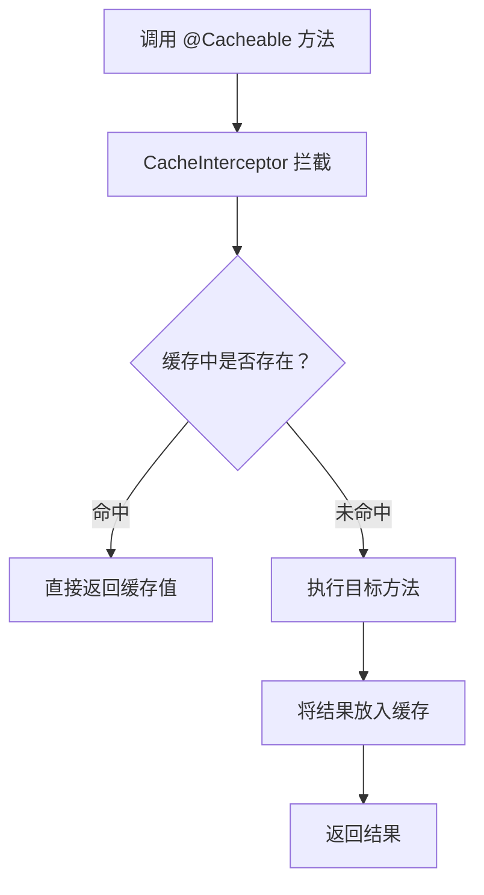

# 缓存集成

## 概念说明

Spring Boot 提供了统一的缓存抽象层（Spring Cache），通过注解即可实现方法级别的缓存。底层可以对接多种缓存实现（ConcurrentMap、Redis、Caffeine 等）。

## 核心原理

### 一、缓存注解体系

| 注解 | 作用 | 说明 |
|------|------|------|
| `@Cacheable` | 查询缓存 | 先查缓存，命中则返回；未命中则执行方法并缓存结果 |
| `@CachePut` | 更新缓存 | 始终执行方法，并将结果更新到缓存 |
| `@CacheEvict` | 删除缓存 | 删除指定缓存 |
| `@Caching` | 组合操作 | 组合多个缓存操作 |
| `@CacheConfig` | 类级别配置 | 统一配置缓存名称等 |

```java
@Service
@CacheConfig(cacheNames = "users")
public class UserService {

    @Cacheable(key = "#id")
    public User findById(Long id) {
        // 第一次调用执行数据库查询，结果缓存
        // 后续调用直接返回缓存
        return userRepository.findById(id).orElse(null);
    }

    @CachePut(key = "#user.id")
    public User update(User user) {
        // 始终执行，更新缓存
        return userRepository.save(user);
    }

    @CacheEvict(key = "#id")
    public void delete(Long id) {
        // 删除缓存
        userRepository.deleteById(id);
    }

    @CacheEvict(allEntries = true)
    public void clearAll() {
        // 清空所有缓存
    }
}
```

### 二、缓存原理（基于 AOP）



> 注意：@Cacheable 基于 AOP 代理，同类内部调用不会走缓存（与 @Transactional 失效原因相同）。

### 三、Redis 缓存集成

```yaml
spring:
  cache:
    type: redis
  data:
    redis:
      host: localhost
      port: 6379
      timeout: 3000ms
```

```java
@Configuration
@EnableCaching
public class CacheConfig {

    @Bean
    public RedisCacheConfiguration redisCacheConfiguration() {
        return RedisCacheConfiguration.defaultCacheConfig()
                .entryTtl(Duration.ofMinutes(30))
                .serializeKeysWith(RedisSerializationContext.SerializationPair
                        .fromSerializer(new StringRedisSerializer()))
                .serializeValuesWith(RedisSerializationContext.SerializationPair
                        .fromSerializer(new GenericJackson2JsonRedisSerializer()));
    }
}
```

### 四、缓存一致性

| 策略 | 说明 | 适用场景 |
|------|------|----------|
| Cache Aside | 先更新 DB，再删除缓存 | 最常用 |
| Read/Write Through | 缓存层代理读写 | 缓存框架支持 |
| Write Behind | 异步写入 DB | 高写入场景 |

## 代码示例

> 💻 完整可运行代码：[CacheDemo.java](https://github.com/skyhe58/guide-java/tree/main/code-examples/02-framework/springboot-examples/src/main/java/com/example/springboot/cache/CacheDemo.java)
> <!-- 本地路径：code-examples/02-framework/springboot-examples/src/main/java/com/example/springboot/cache/CacheDemo.java -->

## 常见面试题

### Q1: @Cacheable 的工作原理？

**难度**：⭐⭐ | **频率**：🔥🔥

**标准答案**：

@Cacheable 基于 Spring AOP 实现。调用方法时，CacheInterceptor 先根据 key 查询缓存，命中则直接返回缓存值，不执行方法；未命中则执行方法，将返回值存入缓存后返回。因为基于 AOP，同类内部调用不会走缓存。

**深入追问**：

- @Cacheable 的 key 如何生成？（默认使用方法参数，可自定义 SpEL）
- @Cacheable 和 @CachePut 的区别？（@Cacheable 命中不执行方法，@CachePut 始终执行）

### Q2: 缓存穿透、击穿、雪崩怎么解决？

**难度**：⭐⭐⭐ | **频率**：🔥🔥🔥

**标准答案**：

穿透（查询不存在的数据）：缓存空值 + 布隆过滤器；击穿（热点 key 过期）：互斥锁 + 永不过期；雪崩（大量 key 同时过期）：随机过期时间 + 多级缓存。

### Q3: 如何保证缓存和数据库的一致性？

**难度**：⭐⭐⭐ | **频率**：🔥🔥🔥

**标准答案**：

最常用的是 Cache Aside 模式：读时先查缓存，未命中查 DB 并写入缓存；写时先更新 DB，再删除缓存。为什么是删除而不是更新缓存？因为更新缓存在并发场景下可能导致脏数据。延迟双删可以进一步降低不一致的概率。

## 在 Spring Cloud 项目中体验

启动 Spring Cloud 项目后，通过 REST 接口直接验证：

```bash
# 启动中间件
docker compose -f docker/docker-compose.yml up -d
docker compose -f docker/docker-compose.consul.yml up -d

# 启动项目
cd code-examples/02-framework/springcloud-examples
mvn spring-boot:run

# 验证接口
curl -X POST "http://localhost:8090/demo/cache/set?key=name&value=kiro&ttl=60"
curl http://localhost:8090/demo/cache/get/name
curl http://localhost:8090/demo/cache/user/1
```

> 💻 Spring Cloud 实战代码：[RedisCacheController.java](https://github.com/skyhe58/guide-java/tree/main/code-examples/02-framework/springcloud-examples/src/main/java/com/example/springcloud/cache/RedisCacheController.java)
> <!-- 本地路径：code-examples/02-framework/springcloud-examples/src/main/java/com/example/springcloud/cache/RedisCacheController.java -->

## 参考资料

- [Spring Cache 官方文档](https://docs.spring.io/spring-framework/reference/integration/cache.html)
- [Spring Boot Cache 配置](https://docs.spring.io/spring-boot/docs/current/reference/html/io.html#io.caching)
