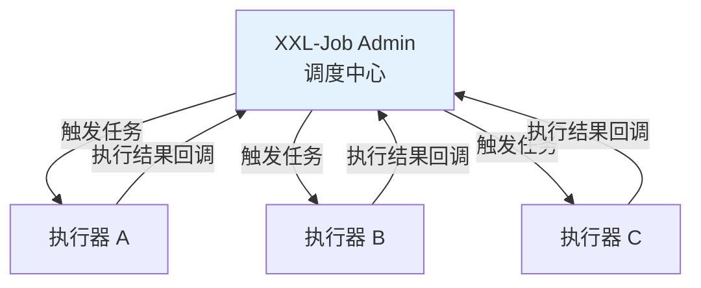

# 定时任务

## 概念说明

定时任务是后端开发中的常见需求，如数据同步、报表生成、缓存刷新等。Spring Boot 提供了 `@Scheduled` 注解实现简单定时任务，分布式场景下通常使用 XXL-Job 或 Quartz。

## 核心原理

### 一、@Scheduled 定时任务

```java
@Component
@EnableScheduling
public class ScheduledTasks {

    // 固定频率：每 5 秒执行一次
    @Scheduled(fixedRate = 5000)
    public void fixedRateTask() {
        System.out.println("fixedRate: " + LocalDateTime.now());
    }

    // 固定延迟：上次执行完成后延迟 5 秒
    @Scheduled(fixedDelay = 5000)
    public void fixedDelayTask() {
        System.out.println("fixedDelay: " + LocalDateTime.now());
    }

    // Cron 表达式：每天凌晨 2 点执行
    @Scheduled(cron = "0 0 2 * * ?")
    public void cronTask() {
        System.out.println("cron: " + LocalDateTime.now());
    }
}
```

**fixedRate vs fixedDelay**：

| 属性 | 说明 | 区别 |
|------|------|------|
| fixedRate | 固定频率 | 从上次开始时间算起 |
| fixedDelay | 固定延迟 | 从上次结束时间算起 |
| cron | Cron 表达式 | 灵活的时间表达 |

### 二、@Scheduled vs XXL-Job vs Quartz

| 特性 | @Scheduled | XXL-Job | Quartz |
|------|-----------|---------|--------|
| 分布式 | ❌ 不支持 | ✅ 支持 | ✅ 支持（需集群配置） |
| 管理界面 | ❌ | ✅ 可视化 | ❌ |
| 动态调整 | ❌ 需重启 | ✅ 在线调整 | ✅ |
| 失败重试 | ❌ | ✅ | ✅ |
| 任务分片 | ❌ | ✅ | ❌ |
| 适用场景 | 单机简单任务 | 分布式任务调度 | 复杂调度需求 |

### 三、XXL-Job 分布式任务调度



XXL-Job 核心特性：
- 调度中心与执行器分离
- 支持 GLUE 模式（在线编写任务代码）
- 支持任务分片（大数据量并行处理）
- 支持失败重试和告警

## 代码示例

```java
@Component
@EnableScheduling
public class TaskDemo {

    @Scheduled(fixedRate = 10000)
    public void reportCurrentTime() {
        System.out.println("当前时间: " + LocalDateTime.now());
    }
}
```

> 💻 完整可运行代码：[TaskDemo.java](https://github.com/skyhe58/guide-java/tree/main/code-examples/02-framework/springboot-examples/src/main/java/com/example/springboot/task/TaskDemo.java)
> <!-- 本地路径：code-examples/02-framework/springboot-examples/src/main/java/com/example/springboot/task/TaskDemo.java -->

## 常见面试题

### Q1: @Scheduled 的 fixedRate 和 fixedDelay 的区别？

**难度**：⭐⭐ | **频率**：🔥🔥

**标准答案**：

fixedRate 是固定频率，从上次任务开始时间算起，不管任务是否执行完成；fixedDelay 是固定延迟，从上次任务执行完成后算起。如果任务执行时间超过 fixedRate 间隔，任务会排队等待。

### Q2: 分布式定时任务怎么实现？

**难度**：⭐⭐⭐ | **频率**：🔥🔥

**标准答案**：

常用方案：（1）XXL-Job：轻量级分布式任务调度平台，支持可视化管理、任务分片、失败重试；（2）Quartz 集群模式：通过数据库锁实现分布式调度；（3）分布式锁 + @Scheduled：用 Redis 分布式锁保证只有一个节点执行。推荐使用 XXL-Job。

### Q3: Cron 表达式怎么写？

**难度**：⭐⭐ | **频率**：🔥🔥

**标准答案**：

Cron 表达式格式：`秒 分 时 日 月 周`。常用示例：`0 0 2 * * ?`（每天凌晨 2 点）、`0 */5 * * * ?`（每 5 分钟）、`0 0 9-18 * * MON-FRI`（工作日 9-18 点每小时）。

## 在 Spring Cloud 项目中体验

启动 Spring Cloud 项目后，通过 REST 接口直接验证：

```bash
# 启动中间件
docker compose -f docker/docker-compose.yml up -d
docker compose -f docker/docker-compose.consul.yml up -d

# 启动项目
cd code-examples/02-framework/springcloud-examples
mvn spring-boot:run

# 验证接口
curl http://localhost:8090/demo/task/status
curl -X POST http://localhost:8090/demo/task/trigger
```

> 💻 Spring Cloud 实战代码：[ScheduledTaskController.java](https://github.com/skyhe58/guide-java/tree/main/code-examples/02-framework/springcloud-examples/src/main/java/com/example/springcloud/task/ScheduledTaskController.java)
> <!-- 本地路径：code-examples/02-framework/springcloud-examples/src/main/java/com/example/springcloud/task/ScheduledTaskController.java -->

## 参考资料

- [Spring Scheduling 官方文档](https://docs.spring.io/spring-framework/reference/integration/scheduling.html)
- [XXL-Job 官方文档](https://www.xuxueli.com/xxl-job/)
