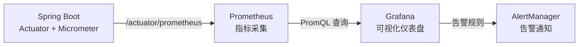

# Actuator 监控与健康检查

## 概念说明

Spring Boot Actuator 提供了生产级别的监控和管理功能，通过 HTTP 端点暴露应用的健康状态、指标、配置等信息。它是微服务可观测性的基础组件。

## 核心原理

### 一、常用 Actuator 端点

| 端点 | 路径 | 说明 |
|------|------|------|
| health | `/actuator/health` | 健康检查 |
| info | `/actuator/info` | 应用信息 |
| metrics | `/actuator/metrics` | 指标数据 |
| loggers | `/actuator/loggers` | 日志级别管理 |
| env | `/actuator/env` | 环境变量 |
| beans | `/actuator/beans` | 所有 Bean 列表 |
| mappings | `/actuator/mappings` | URL 映射 |
| threaddump | `/actuator/threaddump` | 线程转储 |
| prometheus | `/actuator/prometheus` | Prometheus 格式指标 |

```yaml
# application.yml 配置
management:
  endpoints:
    web:
      exposure:
        include: health,info,metrics,loggers,prometheus
  endpoint:
    health:
      show-details: always
```

### 二、自定义健康检查

```java
@Component
public class CustomHealthIndicator implements HealthIndicator {

    @Override
    public Health health() {
        // 检查外部依赖是否可用
        boolean databaseUp = checkDatabase();
        boolean redisUp = checkRedis();

        if (databaseUp && redisUp) {
            return Health.up()
                    .withDetail("database", "Available")
                    .withDetail("redis", "Available")
                    .build();
        }
        return Health.down()
                .withDetail("database", databaseUp ? "Available" : "Unavailable")
                .withDetail("redis", redisUp ? "Available" : "Unavailable")
                .build();
    }
}
```

### 三、Prometheus 集成



添加依赖后自动暴露 Prometheus 格式的指标：

```xml
<dependency>
    <groupId>io.micrometer</groupId>
    <artifactId>micrometer-registry-prometheus</artifactId>
</dependency>
```

### 四、自定义端点

```java
@Component
@Endpoint(id = "custom")
public class CustomEndpoint {

    @ReadOperation
    public Map<String, Object> info() {
        Map<String, Object> info = new HashMap<>();
        info.put("appName", "Spring Boot Demo");
        info.put("version", "1.0.0");
        info.put("startTime", LocalDateTime.now().toString());
        return info;
    }
}
```

## 代码示例

> 💻 完整可运行代码：[ActuatorDemo.java](https://github.com/skyhe58/guide-java/tree/main/code-examples/02-framework/springboot-examples/src/main/java/com/example/springboot/actuator/ActuatorDemo.java)
> <!-- 本地路径：code-examples/02-framework/springboot-examples/src/main/java/com/example/springboot/actuator/ActuatorDemo.java -->

## 常见面试题

### Q1: Spring Boot Actuator 有什么用？

**难度**：⭐⭐ | **频率**：🔥🔥

**标准答案**：

Actuator 提供生产级别的监控和管理功能，通过 HTTP 端点暴露应用的健康状态、指标、日志级别、环境变量等信息。常用于健康检查（K8s 探针）、指标采集（Prometheus）、日志级别动态调整等场景。

### Q2: 如何自定义健康检查？

**难度**：⭐⭐ | **频率**：🔥🔥

**标准答案**：

实现 `HealthIndicator` 接口，重写 `health()` 方法，返回 `Health.up()` 或 `Health.down()`，可以附带详细信息。Spring Boot 会自动将自定义的 HealthIndicator 注册到 `/actuator/health` 端点。

### Q3: Actuator 端点的安全性如何保证？

**难度**：⭐⭐ | **频率**：🔥🔥

**标准答案**：

（1）只暴露必要的端点（`management.endpoints.web.exposure.include`）；（2）通过 Spring Security 对 Actuator 端点进行认证授权；（3）使用独立的管理端口（`management.server.port`）；（4）生产环境禁止暴露 env、beans 等敏感端点。

## 在 Spring Cloud 项目中体验

启动 Spring Cloud 项目后，通过 REST 接口直接验证：

```bash
# 启动中间件
docker compose -f docker/docker-compose.yml up -d
docker compose -f docker/docker-compose.consul.yml up -d

# 启动项目
cd code-examples/02-framework/springcloud-examples
mvn spring-boot:run

# 验证接口
curl http://localhost:8090/actuator/health
curl http://localhost:8090/actuator/metrics
curl http://localhost:8090/actuator/info
```

> 💻 Spring Cloud 实战代码：[application.yml](https://github.com/skyhe58/guide-java/tree/main/code-examples/02-framework/springcloud-examples/src/main/resources/application.yml)
> <!-- 本地路径：code-examples/02-framework/springcloud-examples/src/main/resources/application.yml -->

## 参考资料

- [Spring Boot Actuator 官方文档](https://docs.spring.io/spring-boot/docs/current/reference/html/actuator.html)
- [Micrometer 官方文档](https://micrometer.io/docs)
