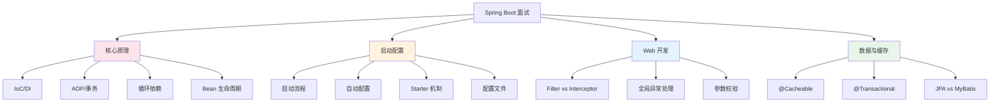

# Spring Boot 面试指南

## 概念说明

Spring Boot 是 Java 后端面试的**重灾区**，几乎每场面试都会涉及。本指南汇总了 Spring Boot 模块的高频面试题，按照面试中常见的追问链路组织，帮助你系统准备。

## 面试知识图谱

## 高频面试题汇总

### 一、核心原理篇（必考）

#### Q1: 谈谈你对 Spring IoC 的理解

**难度**：⭐⭐⭐ | **频率**：🔥🔥🔥

**追问链路**：IoC 是什么 → DI 的三种方式 → 为什么推荐构造器注入 → @Autowired 原理 → @Autowired 和 @Resource 区别

详见 [IoC 容器与依赖注入](./01-ioc-di.md)

#### Q2: Bean 的生命周期

**难度**：⭐⭐⭐ | **频率**：🔥🔥🔥

**追问链路**：四个阶段 → 初始化回调顺序 → BeanPostProcessor 作用 → AOP 代理在哪个阶段创建 → @PostConstruct 和 InitializingBean 的区别

详见 [IoC 容器与依赖注入](./01-ioc-di.md)

#### Q3: Spring AOP 的实现原理

**难度**：⭐⭐⭐ | **频率**：🔥🔥🔥

**追问链路**：JDK 动态代理 vs CGLIB → Spring Boot 默认用哪个 → 切面执行顺序 → @Transactional 事务失效场景

详见 [AOP 原理与事务管理](./02-aop.md)

#### Q4: @Transactional 事务失效的场景

**难度**：⭐⭐⭐ | **频率**：🔥🔥🔥

**追问链路**：8 种失效场景 → 同类内部调用怎么解决 → 事务传播行为 → REQUIRES_NEW 和 NESTED 区别

详见 [AOP 原理与事务管理](./02-aop.md)

#### Q5: Spring 如何解决循环依赖

**难度**：⭐⭐⭐⭐ | **频率**：🔥🔥🔥

**追问链路**：三级缓存结构 → 解决流程 → 为什么需要三级而不是两级 → 构造器注入为什么不行 → Spring Boot 2.6+ 的变化

详见 [循环依赖与三级缓存](./03-circular-dependency.md)

### 二、启动配置篇

#### Q6: Spring Boot 的启动流程

**难度**：⭐⭐⭐ | **频率**：🔥🔥🔥

**追问链路**：SpringApplication.run() → refreshContext() → 内嵌 Tomcat 在哪启动 → Bean 在哪实例化

详见 [启动流程与自动配置](./04-startup.md)

#### Q7: 自动配置的原理

**难度**：⭐⭐⭐ | **频率**：🔥🔥🔥

**追问链路**：@SpringBootApplication 包含什么 → @EnableAutoConfiguration → spring.factories / AutoConfiguration.imports → 条件注解

详见 [启动流程与自动配置](./04-startup.md)

#### Q8: 配置文件的加载顺序

**难度**：⭐⭐ | **频率**：🔥🔥🔥

**追问链路**：优先级排序 → yml 和 properties 谁优先 → Profile 机制 → @ConfigurationProperties 和 @Value 区别

详见 [配置文件体系](./06-config-files.md)

### 三、Web 开发篇

#### Q9: Filter 和 Interceptor 的区别

**难度**：⭐⭐ | **频率**：🔥🔥🔥

**追问链路**：规范层面 → 执行顺序 → 使用场景 → 如何控制多个 Filter 的顺序

详见 [Web 开发](./07-web.md)

#### Q10: 如何实现全局异常处理

**难度**：⭐⭐ | **频率**：🔥🔥🔥

**追问链路**：@ControllerAdvice + @ExceptionHandler → 异常处理优先级 → 统一返回格式

详见 [Web 开发](./07-web.md)

### 四、数据与缓存篇

#### Q11: JPA 和 MyBatis 怎么选

**难度**：⭐⭐ | **频率**：🔥🔥

详见 [数据访问](./08-data-access.md)

#### Q12: @Cacheable 的工作原理

**难度**：⭐⭐ | **频率**：🔥🔥

**追问链路**：基于 AOP → 同类调用失效 → 缓存一致性 → 缓存穿透/击穿/雪崩

详见 [缓存集成](./11-cache.md)

### 五、运维监控篇

#### Q13: Spring Boot Actuator 的作用

**难度**：⭐⭐ | **频率**：🔥🔥

详见 [Actuator 监控](./13-actuator.md)

#### Q14: 如何实现日志链路追踪

**难度**：⭐⭐⭐ | **频率**：🔥🔥

详见 [日志体系](./10-logging.md)

## 面试准备建议

### 按公司类型准备

| 公司类型 | 重点考察 | 深度要求 |
|----------|----------|----------|
| 大厂（BAT/TMD） | IoC/AOP 原理、循环依赖、启动流程、事务失效 | 需要到源码级别 |
| 中厂 | 自动配置、配置文件、Web 开发、缓存 | 原理 + 实战 |
| 创业公司 | Web 开发、数据访问、定时任务、Actuator | 偏实战应用 |

### 答题技巧

1. **先总后分**：先给出总体概念，再展开细节
2. **画图辅助**：Bean 生命周期、三级缓存流程等用图说明
3. **结合实战**：举实际项目中的使用场景
4. **主动延伸**：回答完主动提到相关知识点，展示知识面

## 参考资料

- [Spring Boot 官方文档](https://docs.spring.io/spring-boot/docs/current/reference/html/)
- [Spring Framework 官方文档](https://docs.spring.io/spring-framework/reference/)
