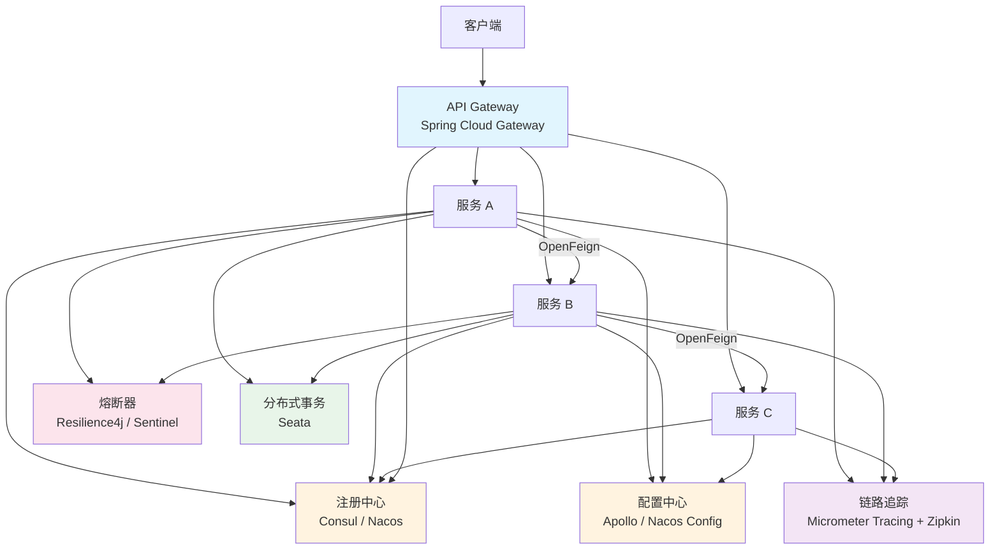
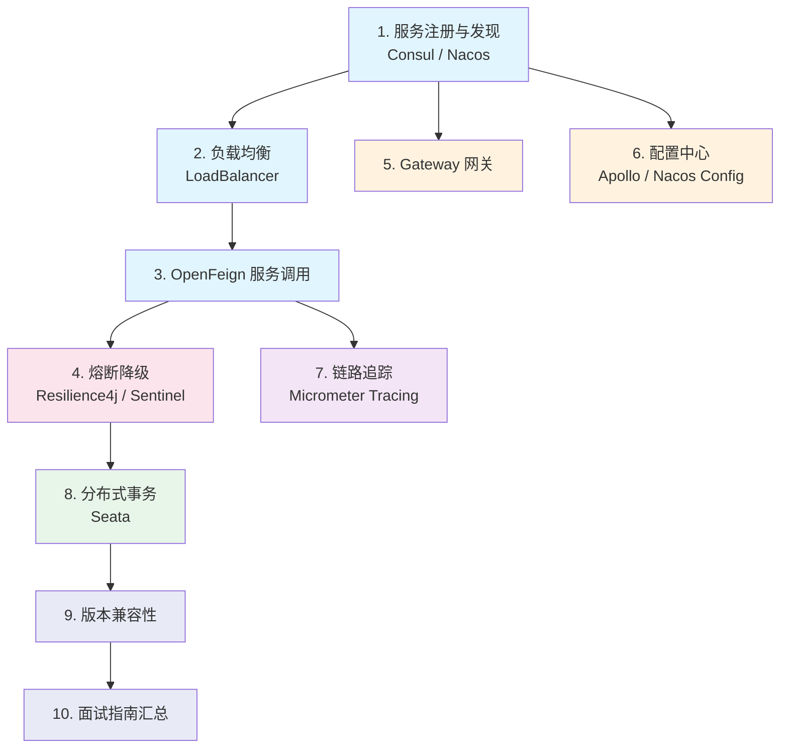

# Spring Cloud 微服务

## 概念说明

Spring Cloud 是基于 Spring Boot 的**微服务架构一站式解决方案**，提供了服务注册与发现、负载均衡、服务调用、熔断降级、网关路由、配置中心、链路追踪、分布式事务等核心能力。它不是一个具体的框架，而是一系列框架的有序集合，通过 Spring Boot 的自动配置机制将各组件无缝集成。

> 面试核心：Spring Cloud 是微服务的"全家桶"，理解各组件的职责和协作关系是关键。

## 微服务架构全景图

## 知识点列表

| 序号 | 知识点 | 难度 | 面试频率 | 文档链接 |
|------|--------|------|----------|----------|
| 1 | 服务注册与发现 | ⭐⭐⭐ | 🔥🔥🔥 | [registry](./01-registry.md) |
| 2 | 负载均衡 | ⭐⭐⭐ | 🔥🔥🔥 | [loadbalancer](./02-loadbalancer.md) |
| 3 | OpenFeign 服务调用 | ⭐⭐⭐ | 🔥🔥🔥 | [feign](./03-feign.md) |
| 4 | 熔断降级 | ⭐⭐⭐ | 🔥🔥🔥 | [circuit-breaker](./04-circuit-breaker.md) |
| 5 | Gateway 网关 | ⭐⭐⭐ | 🔥🔥🔥 | [gateway](./05-gateway.md) |
| 6 | 配置中心集成 | ⭐⭐⭐ | 🔥🔥 | [config](./06-config.md) |
| 7 | 链路追踪 | ⭐⭐⭐ | 🔥🔥 | [tracing](./07-tracing.md) |
| 8 | 分布式事务 | ⭐⭐⭐ | 🔥🔥🔥 | [transaction](./08-transaction.md) |
| 9 | 版本兼容性对照表 | ⭐⭐ | 🔥🔥 | [version-compatibility](./09-version-compatibility.md) |
| 10 | Spring Cloud 面试指南 | ⭐⭐⭐ | 🔥🔥🔥 | [interview](./99-interview.md) |

## 推荐学习顺序

**学习路线说明**：
- 🔵 **服务通信层**（1-3）：注册发现 → 负载均衡 → 声明式调用，微服务通信基础
- 🔴 **容错保护层**（4）：熔断降级是微服务稳定性的关键
- 🟠 **流量治理层**（5-6）：网关统一入口 + 配置中心统一管理
- 🟣 **可观测性层**（7）：链路追踪是排查分布式问题的利器
- 🟢 **数据一致性层**（8）：分布式事务是最复杂也最重要的主题
- 🔵 **综合汇总**（9-10）：版本兼容性和面试指南

## 相关模块链接

- [Spring Boot](/2-framework/2.2-springboot/) — Spring Cloud 的基础框架
- [注册中心](/4-middleware/4.5-registry/) — 深入 Consul/Nacos/ZooKeeper 原理
- [配置中心](/4-middleware/4.4-config-center/) — 深入 Apollo/Nacos Config 原理
- [分布式系统理论](/5-distributed/5.1-distributed/) — CAP/BASE 理论、分布式锁、分布式事务
- [消息队列](/4-middleware/4.1-mq-rabbitmq/) — 异步通信与最终一致性

## 参考资料

- [Spring Cloud 官方文档](https://spring.io/projects/spring-cloud)
- [Spring Cloud Consul 文档](https://docs.spring.io/spring-cloud-consul/reference/)
- [Spring Cloud OpenFeign 文档](https://docs.spring.io/spring-cloud-openfeign/reference/)
