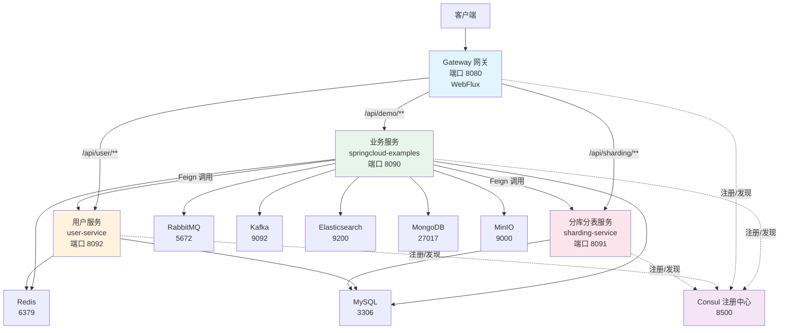
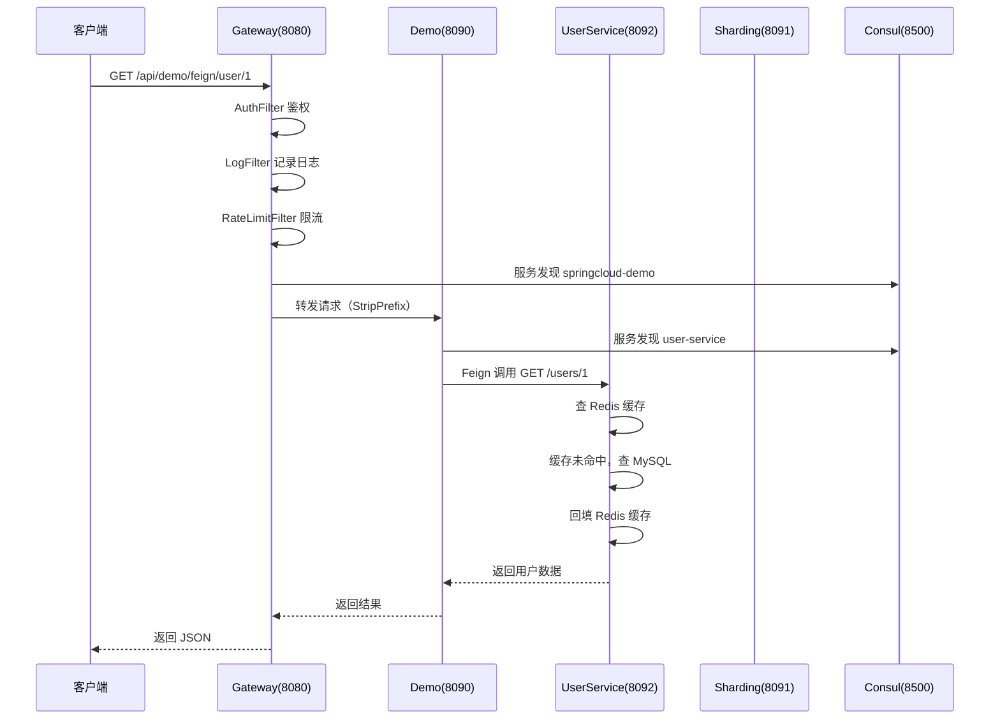

# Spring Cloud 实战项目

## 项目简介

一个一键启动就能体验 Spring Cloud 全家桶的微服务项目，包含 4 个独立模块，覆盖注册发现、Feign 调用、熔断降级、网关、消息队列、缓存、数据库、搜索、文件存储、定时任务、链路追踪、分库分表、分布式限流、分布式会话、缓存一致性等核心功能。

## 架构总览



## 四个模块

| 模块 | 端口 | 技术栈 | 独立原因 |
|------|------|--------|---------|
| springcloud-examples | 8090 | WebMVC | 业务服务，集成全部中间件 |
| springcloud-gateway | 8080 | WebFlux | WebFlux 和 WebMVC 不能共存 |
| springcloud-sharding | 8091 | ShardingSphere | 独立 DataSource，影响其他模块 |
| springcloud-user-service | 8092 | WebMVC | 独立微服务，被 Feign 调用 |

## 一键启动

### 1. 启动中间件

```bash
docker compose -f docker/docker-compose.yml up -d          # MySQL + Redis + MongoDB + MinIO
docker compose -f docker/docker-compose.consul.yml up -d    # Consul
docker compose -f docker/docker-compose.mq.yml up -d        # RabbitMQ + Kafka + ZooKeeper
docker compose -f docker/docker-compose.es.yml up -d        # Elasticsearch
```

### 2. 启动微服务

```bash
# 业务服务（必须）
cd code-examples/02-framework/springcloud-examples
mvn spring-boot:run

# 网关（可选）
cd code-examples/02-framework/springcloud-gateway
mvn spring-boot:run

# 分库分表（可选）
cd code-examples/02-framework/springcloud-sharding
mvn spring-boot:run

# 用户服务（可选，Feign 调用需要）
cd code-examples/02-framework/springcloud-user-service
mvn spring-boot:run
```

## REST 接口汇总

### 注册发现

| 方法 | 接口 | 说明 |
|------|------|------|
| GET | `/demo/registry/services` | 列出所有注册的服务 |
| GET | `/demo/registry/instances/{serviceId}` | 获取实例列表 |
| GET | `/demo/registry/self` | 查看自身注册信息 |

### 声明式调用（Feign）

| 方法 | 接口 | 说明 |
|------|------|------|
| GET | `/demo/feign/user/{id}` | Feign 调用用户服务 |
| GET | `/demo/feign/users` | Feign 调用列出所有用户 |
| POST | `/demo/feign/user` | Feign 调用创建用户 |
| GET | `/demo/feign/fallback` | 模拟调用失败触发 Fallback |

### 熔断降级

| 方法 | 接口 | 说明 |
|------|------|------|
| GET | `/demo/cb/success` | 正常调用（CLOSED 状态） |
| GET | `/demo/cb/fail` | 模拟失败（触发熔断 → OPEN） |
| GET | `/demo/cb/status` | 查看熔断器当前状态 |
| GET | `/demo/cb/reset` | 重置熔断器 |

### Spring Boot 基础实战

| 方法 | 接口 | 说明 |
|------|------|------|
| GET | `/demo/boot/ioc/inject-types` | IoC 注入方式演示 |
| GET | `/demo/boot/aop/log` | AOP 日志切面 |
| GET | `/demo/boot/exception/business` | 全局异常处理 |
| POST | `/demo/boot/validate/user` | 参数校验 |

### 消息队列

| 方法 | 接口 | 说明 |
|------|------|------|
| POST | `/demo/mq/rabbit/send?msg=xxx` | RabbitMQ 发送消息 |
| GET | `/demo/mq/rabbit/history` | RabbitMQ 消费历史 |
| POST | `/demo/mq/kafka/send?msg=xxx` | Kafka 发送消息 |
| GET | `/demo/mq/kafka/history` | Kafka 消费历史 |

### 缓存 + 分布式锁

| 方法 | 接口 | 说明 |
|------|------|------|
| POST | `/demo/cache/set?key=xxx&value=xxx&ttl=60` | Redis 写入 |
| GET | `/demo/cache/get/{key}` | Redis 读取 |
| DELETE | `/demo/cache/del/{key}` | Redis 删除 |
| GET | `/demo/cache/user/{id}` | @Cacheable 注解缓存 |
| DELETE | `/demo/cache/user/{id}` | @CacheEvict 清除缓存 |
| POST | `/demo/cache/lock?key=xxx&ttl=10` | Redisson 分布式锁 |
| DELETE | `/demo/cache/lock/{key}` | 释放分布式锁 |

### 数据库

| 方法 | 接口 | 说明 |
|------|------|------|
| GET | `/demo/db/init` | 初始化测试表和数据 |
| GET | `/demo/db/users` | 查询所有用户 |
| GET | `/demo/db/users/{id}` | 查询单个用户 |
| POST | `/demo/db/users` | 创建用户 |
| GET | `/demo/db/pool` | HikariCP 连接池状态 |

### Elasticsearch

| 方法 | 接口 | 说明 |
|------|------|------|
| GET | `/demo/es/init` | 初始化测试数据 |
| GET | `/demo/es/search?keyword=xxx` | 全文搜索 |
| GET | `/demo/es/articles` | 查询所有文章 |
| POST | `/demo/es/articles` | 创建文档 |
| DELETE | `/demo/es/articles/{id}` | 删除文档 |

### MongoDB

| 方法 | 接口 | 说明 |
|------|------|------|
| GET | `/demo/mongo/init` | 初始化测试数据 |
| GET | `/demo/mongo/users` | 查询所有用户 |
| GET | `/demo/mongo/users/{id}` | 查询单个用户 |
| POST | `/demo/mongo/users` | 创建用户 |
| GET | `/demo/mongo/users/search?name=xxx` | 按名称搜索 |

### 文件存储（MinIO）

| 方法 | 接口 | 说明 |
|------|------|------|
| POST | `/demo/file/upload` | 上传文件 |
| GET | `/demo/file/download/{fileName}` | 下载文件 |
| GET | `/demo/file/list` | 列出所有文件 |
| DELETE | `/demo/file/{fileName}` | 删除文件 |
| GET | `/demo/file/presigned/{fileName}` | 预签名下载 URL |

### 定时任务

| 方法 | 接口 | 说明 |
|------|------|------|
| GET | `/demo/task/status` | 查看任务执行状态和历史 |
| POST | `/demo/task/trigger` | 手动触发一次任务 |
| POST | `/demo/task/cron?expr=xxx` | 动态修改 cron 表达式 |

### 分布式限流

| 方法 | 接口 | 说明 |
|------|------|------|
| POST | `/demo/ratelimit/fixed?key=api1&limit=10&window=60` | 固定窗口限流 |
| POST | `/demo/ratelimit/sliding?key=api1&limit=10&window=60` | 滑动窗口限流 |
| POST | `/demo/ratelimit/token-bucket?key=api1&rate=10&capacity=20` | 令牌桶限流 |
| GET | `/demo/ratelimit/compare` | 限流方案对比 |

### 分布式会话

| 方法 | 接口 | 说明 |
|------|------|------|
| POST | `/demo/session/login?username=xxx` | Redis Session 登录 |
| GET | `/demo/session/info?sessionId=xxx` | 查看 Session 信息 |
| POST | `/demo/session/logout?sessionId=xxx` | 销毁 Session |
| POST | `/demo/session/jwt/login?username=xxx` | JWT Token 登录 |
| GET | `/demo/session/jwt/verify?token=xxx` | JWT 验证 |
| GET | `/demo/session/compare` | Session vs JWT 对比 |

### 缓存一致性

| 方法 | 接口 | 说明 |
|------|------|------|
| GET | `/demo/consistency/init` | 初始化测试数据 |
| PUT | `/demo/consistency/cache-aside?id=1&name=xxx` | Cache Aside 更新 |
| PUT | `/demo/consistency/write-through?id=1&name=xxx` | Write Through 更新 |
| PUT | `/demo/consistency/delay-double-delete?id=1&name=xxx` | 延迟双删更新 |
| GET | `/demo/consistency/verify?id=1` | 验证 DB 和缓存一致性 |
| GET | `/demo/consistency/compare` | 缓存一致性方案对比 |

### 分库分表（端口 8091）

| 方法 | 接口 | 说明 |
|------|------|------|
| GET | `/demo/sharding/init` | 初始化分片表和测试数据 |
| POST | `/demo/sharding/order` | 插入订单（自动路由） |
| GET | `/demo/sharding/orders` | 查询所有订单（归并） |
| GET | `/demo/sharding/orders/{userId}` | 按 userId 查询 |
| GET | `/demo/sharding/compare` | 分库分表方案对比 |

### 用户服务（端口 8092）

| 方法 | 接口 | 说明 |
|------|------|------|
| GET | `/users/init` | 初始化测试表和数据 |
| GET | `/users/{id}` | 查询用户（被 Feign 调用） |
| POST | `/users` | 创建用户 |
| GET | `/users` | 列出所有用户 |
| GET | `/users/search?name=xxx` | 按名称搜索 |

### 网关（端口 8080）

| 方法 | 接口 | 说明 |
|------|------|------|
| GET | `/api/demo/**` | 路由到业务服务（需 Authorization 头） |
| GET | `/api/user/**` | 路由到用户服务 |
| GET | `/api/sharding/**` | 路由到分库分表服务 |
| GET | `/actuator/gateway/routes` | 查看所有路由规则 |

## Profile 切换

通过 `--spring.profiles.active=xxx` 切换中间件实现，代码层不变：

| 功能 | 默认 | 可切换 | 启动命令 |
|------|------|--------|---------|
| 注册中心 | Consul | Nacos | `mvn spring-boot:run -Dspring-boot.run.profiles=nacos` |
| 注册中心 | Consul | ZooKeeper | `mvn spring-boot:run -Dspring-boot.run.profiles=zk` |
| 熔断 | Resilience4j | Sentinel | `mvn spring-boot:run -Dspring-boot.run.profiles=sentinel` |
| RabbitMQ | 基础配置 | 生产级配置 | `mvn spring-boot:run -Dspring-boot.run.profiles=rabbitmq` |
| Kafka | 基础配置 | 生产级配置 | `mvn spring-boot:run -Dspring-boot.run.profiles=kafka` |
| 分库分表 | 单库分表 | 分库分表 | `mvn spring-boot:run -Dspring-boot.run.profiles=db-table` |
| 分库分表 | 单库分表 | 读写分离 | `mvn spring-boot:run -Dspring-boot.run.profiles=readwrite` |

## 微服务调用链路



## 与原理模拟 Demo 的关系

本项目中 `springcloud-examples` 模块同时包含两类代码：

| 类型 | 运行方式 | 示例 | 用途 |
|------|---------|------|------|
| Part A 原理模拟 | `main()` 直接运行 | RegistryDemo.java、FeignDemo.java | 理解底层原理 |
| Controller 实战 | Spring Boot 启动后 REST 接口 | RegistryController.java、FeignController.java | 体验真实中间件 |

两者共存互补，学习路径：先运行 Demo 理解原理 → 再启动项目通过接口验证。

## 相关文档

- [服务注册与发现](/2-framework/2.3-springcloud/01-registry)
- [OpenFeign 声明式调用](/2-framework/2.3-springcloud/03-feign)
- [熔断降级](/2-framework/2.3-springcloud/04-circuit-breaker)
- [Gateway 网关](/2-framework/2.3-springcloud/05-gateway)
- [链路追踪](/2-framework/2.3-springcloud/07-tracing)
- [分布式事务](/2-framework/2.3-springcloud/08-transaction)
