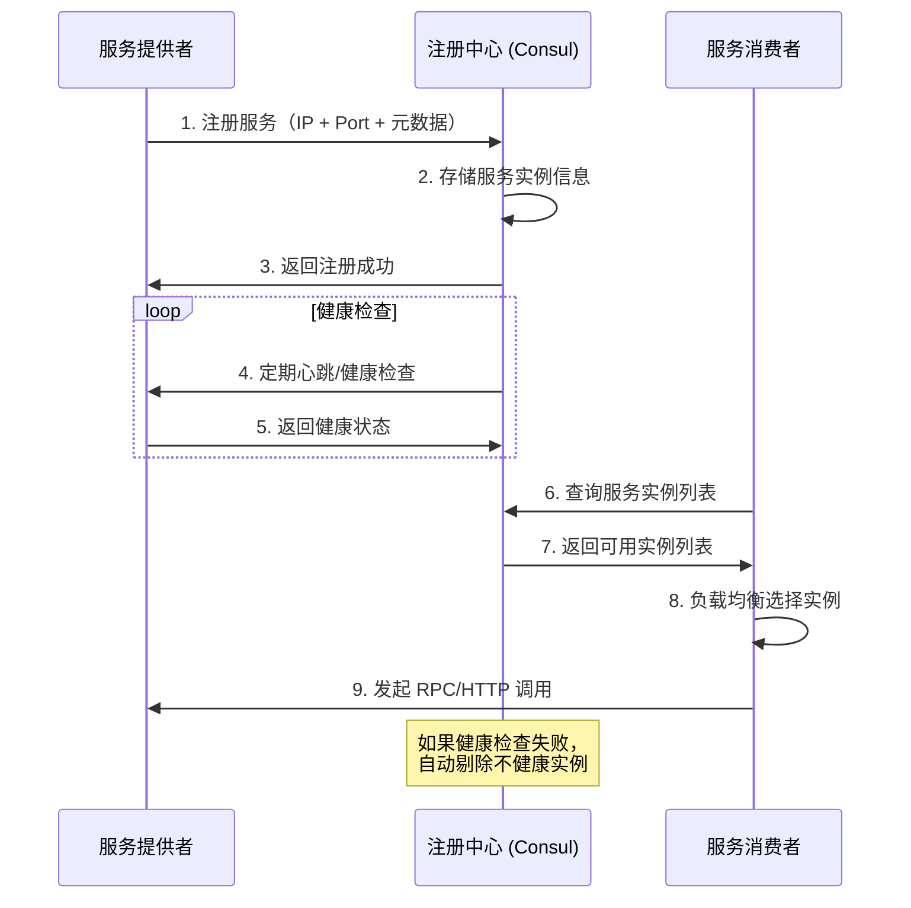
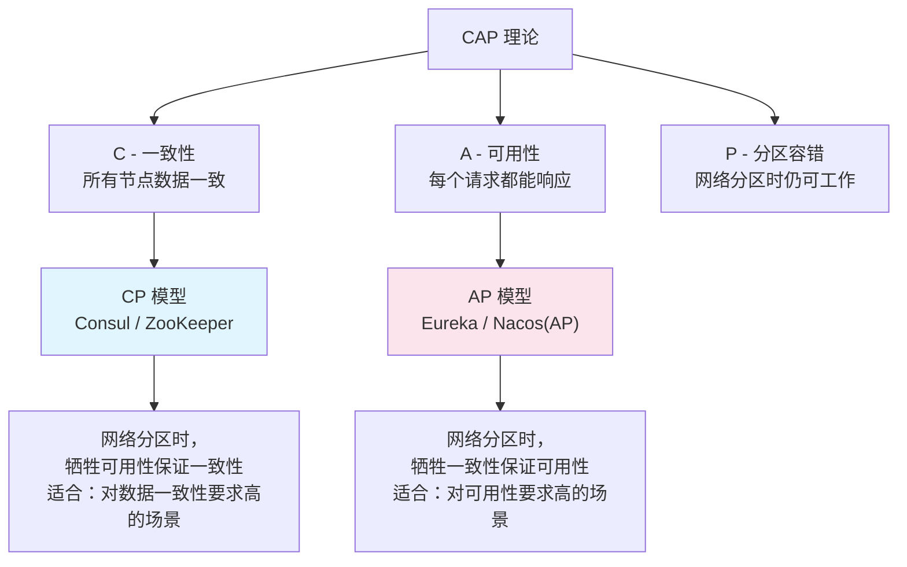

# 服务注册与发现

## 概念说明

服务注册与发现是微服务架构的**基石**。在单体应用中，服务调用通过本地方法调用完成；而在微服务架构中，服务实例动态变化（扩缩容、故障重启），调用方需要一种机制来**动态获取**可用的服务实例地址。

注册中心就是解决这个问题的核心组件：
- **服务注册**：服务启动时将自身地址信息注册到注册中心
- **服务发现**：调用方从注册中心获取目标服务的可用实例列表
- **健康检查**：注册中心定期检测服务实例是否存活，剔除不健康实例

## 核心原理

### 一、服务注册与发现流程



### 二、三大注册中心对比（CAP 视角）

| 特性 | Consul | Nacos | Eureka |
|------|--------|-------|--------|
| **CAP 模型** | CP（强一致性） | AP/CP 可切换 | AP（高可用） |
| 一致性协议 | Raft | Raft (CP) / Distro (AP) | 无（对等复制） |
| 健康检查 | TCP/HTTP/gRPC/脚本 | 心跳 + TCP | 客户端心跳 |
| 多数据中心 | ✅ 原生支持 | ❌ | ❌ |
| KV 存储 | ✅ 内置 | ✅ 配置中心 | ❌ |
| ACL 安全 | ✅ 完善 | ✅ 基础 | ❌ |
| Spring Cloud 集成 | ✅ 官方支持 | ✅ Alibaba | ✅ Netflix（已停更） |
| 适用场景 | 生产环境首选 | 国内生态丰富 | 遗留系统 |

> ⚠️ Eureka 2.x 已停止开发，新项目不建议使用。推荐 Consul（CP 模型，功能全面）或 Nacos（国内生态好）。

### 三、CAP 理论与注册中心选型



**选型建议**：
- **Consul（推荐）**：CP 模型，Raft 协议保证强一致性，内置健康检查、KV 存储、多数据中心支持，功能最全面
- **Nacos**：支持 AP/CP 切换，国内社区活跃，同时提供配置中心功能
- **Eureka**：AP 模型，自我保护机制保证高可用，但已停更

### 四、Consul 核心特性

Consul 是 HashiCorp 开源的服务网格解决方案，核心特性：

1. **服务发现**：HTTP/DNS 两种发现方式
2. **健康检查**：支持 HTTP、TCP、gRPC、脚本、TTL 多种检查方式
3. **KV 存储**：内置键值存储，可用于动态配置
4. **多数据中心**：原生支持多数据中心部署
5. **ACL 安全**：完善的访问控制列表

```yaml
# Spring Cloud Consul 配置示例
spring:
  cloud:
    consul:
      host: localhost
      port: 8500
      discovery:
        service-name: ${spring.application.name}
        health-check-path: /actuator/health
        health-check-interval: 10s
        prefer-ip-address: true
        instance-id: ${spring.application.name}:${server.port}
```

> 🐳 启动 Consul：`docker compose -f docker/docker-compose.consul.yml up -d`

## 代码示例

```java
/**
 * Consul 服务注册配置说明
 * 
 * 1. 添加依赖：spring-cloud-starter-consul-discovery
 * 2. 配置 Consul 地址和服务名
 * 3. 启用服务发现：@EnableDiscoveryClient
 * 4. 配置健康检查端点
 */
@SpringBootApplication
@EnableDiscoveryClient  // 启用服务发现（Spring Cloud 通用注解）
public class ConsulServiceApplication {
    public static void main(String[] args) {
        SpringApplication.run(ConsulServiceApplication.class, args);
    }
}
```

> 💻 完整可运行代码：[RegistryDemo.java](https://github.com/skyhe58/guide-java/tree/main/code-examples/02-framework/springcloud-examples/src/main/java/com/example/springcloud/registry/RegistryDemo.java)
> <!-- 本地路径：code-examples/02-framework/springcloud-examples/src/main/java/com/example/springcloud/registry/RegistryDemo.java -->

## 常见面试题

### Q1: 注册中心的作用是什么？为什么需要注册中心？

**难度**：⭐⭐ | **频率**：🔥🔥🔥

**答题思路**：

1. 从微服务架构的痛点出发（服务实例动态变化）
2. 说明注册中心的三大核心功能
3. 对比没有注册中心时的硬编码方式

**标准答案**：

在微服务架构中，服务实例会动态变化（扩缩容、故障重启），如果使用硬编码的方式配置服务地址，维护成本极高且无法应对动态变化。注册中心提供三大核心功能：（1）服务注册：服务启动时自动注册地址信息；（2）服务发现：消费方动态获取可用实例列表；（3）健康检查：自动剔除不健康实例。这样消费方无需关心服务的具体地址，只需通过服务名即可调用。

**深入追问**：

- 注册中心宕机了怎么办？（客户端缓存、多节点部署）
- 服务上下线如何通知消费方？（推拉模型）

**易错点**：

- 注册中心不是负载均衡器，它只提供服务实例列表，负载均衡由客户端完成

### Q2: Consul、Nacos、Eureka 有什么区别？如何选型？

**难度**：⭐⭐⭐ | **频率**：🔥🔥🔥

**答题思路**：

1. 从 CAP 理论角度对比
2. 说明各自的核心特性差异
3. 给出选型建议

**标准答案**：

三者最核心的区别在 CAP 模型：Consul 是 CP 模型（Raft 协议），保证强一致性；Eureka 是 AP 模型（对等复制），保证高可用；Nacos 支持 AP/CP 切换。功能上，Consul 最全面（服务发现 + 健康检查 + KV 存储 + 多数据中心 + ACL），Nacos 同时提供配置中心功能，Eureka 功能最简单且已停更。选型建议：新项目推荐 Consul（功能全面、CP 模型适合生产）或 Nacos（国内生态好、配置中心一体化）。

**深入追问**：

- CAP 理论中为什么不能同时满足三者？
- Consul 的 Raft 协议是如何保证一致性的？
- Nacos 的 AP 和 CP 模式分别在什么场景下使用？

**易错点**：

- Eureka 的自我保护机制不是"优点"，而是 AP 模型下的妥协
- Nacos 默认是 AP 模式（临时实例），持久化实例才是 CP 模式

### Q3: 服务注册后，消费方是如何发现服务的？推模型还是拉模型？

**难度**：⭐⭐⭐ | **频率**：🔥🔥

**答题思路**：

1. 说明推拉两种模型的区别
2. 各注册中心的实现方式
3. 客户端缓存机制

**标准答案**：

服务发现通常结合推和拉两种模型：（1）拉模型：消费方定期从注册中心拉取服务列表并缓存到本地，Eureka 默认每 30 秒拉取一次；（2）推模型：注册中心在服务列表变化时主动通知消费方，Consul 通过 Long Polling（长轮询）实现，Nacos 通过 UDP 推送 + 定期拉取实现。客户端通常会缓存服务列表，即使注册中心短暂不可用也能继续调用。

**深入追问**：

- 客户端缓存的服务列表过期了怎么办？
- 如何实现服务的优雅下线？

## 在 Spring Cloud 项目中体验

启动 Spring Cloud 项目后，通过 REST 接口直接验证：

```bash
# 启动中间件
docker compose -f docker/docker-compose.yml up -d
docker compose -f docker/docker-compose.consul.yml up -d

# 启动项目
cd code-examples/02-framework/springcloud-examples
mvn spring-boot:run

# 验证接口
curl http://localhost:8090/demo/registry/services
curl http://localhost:8090/demo/registry/self
```

> 💻 Spring Cloud 实战代码：[RegistryController.java](https://github.com/skyhe58/guide-java/tree/main/code-examples/02-framework/springcloud-examples/src/main/java/com/example/springcloud/registry/RegistryController.java)
> <!-- 本地路径：code-examples/02-framework/springcloud-examples/src/main/java/com/example/springcloud/registry/RegistryController.java -->

## 参考资料

- [Spring Cloud Consul 官方文档](https://docs.spring.io/spring-cloud-consul/reference/)
- [Consul 官方文档](https://developer.hashicorp.com/consul/docs)
- [Nacos 官方文档](https://nacos.io/docs/latest/overview/)
