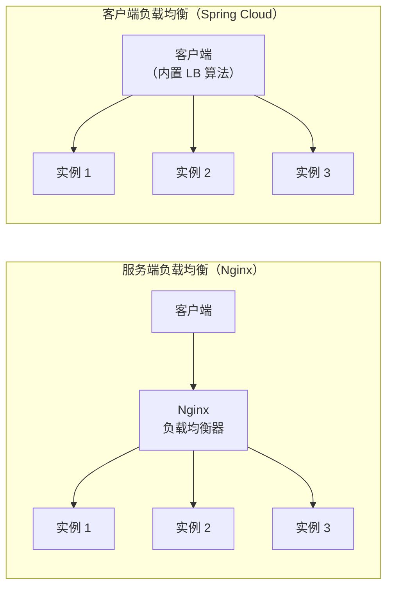
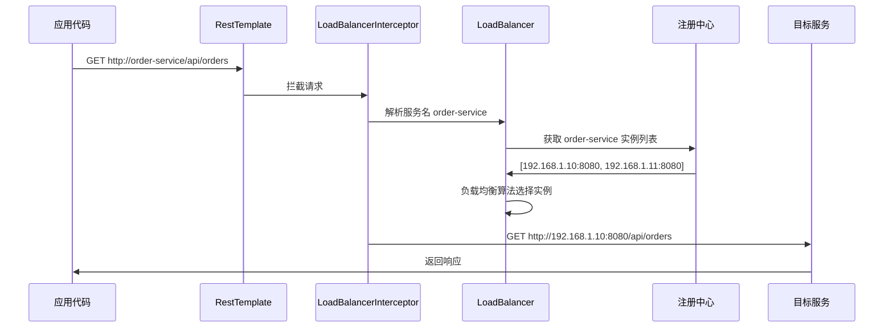

# 负载均衡

## 概念说明

在微服务架构中，一个服务通常部署多个实例来提高可用性和吞吐量。负载均衡的作用是将请求**合理分配**到多个服务实例上，避免单个实例过载。

Spring Cloud 的负载均衡是**客户端负载均衡**（Client-Side Load Balancing），即由调用方从注册中心获取实例列表后，在本地通过负载均衡算法选择一个实例进行调用，区别于 Nginx 等服务端负载均衡。

## 核心原理

### 一、客户端负载均衡 vs 服务端负载均衡



| 对比项 | 服务端负载均衡 | 客户端负载均衡 |
|--------|--------------|--------------|
| 代表 | Nginx、F5 | Ribbon、Spring Cloud LoadBalancer |
| 实例列表 | 在负载均衡器上配置 | 从注册中心动态获取 |
| 单点风险 | 负载均衡器是单点 | 无单点，每个客户端独立 |
| 适用场景 | 外部流量入口 | 微服务内部调用 |

### 二、Ribbon vs Spring Cloud LoadBalancer

| 特性 | Ribbon | Spring Cloud LoadBalancer |
|------|--------|--------------------------|
| 维护状态 | Netflix 已停更 | Spring 官方维护 |
| Spring Cloud 版本 | 2020.0 之前默认 | 2020.0 之后默认 |
| 内置策略 | 7 种 | 2 种（轮询、随机） |
| 扩展性 | 通过 IRule 接口 | 通过 ReactorServiceInstanceLoadBalancer |
| 响应式支持 | ❌ | ✅ |

> ⚠️ Spring Cloud 2020.0（对应 Spring Boot 2.4+）开始，Ribbon 被移除，默认使用 Spring Cloud LoadBalancer。

### 三、常见负载均衡策略

| 策略 | 说明 | 适用场景 |
|------|------|----------|
| **轮询（Round Robin）** | 依次分配请求 | 实例性能相近 |
| **随机（Random）** | 随机选择实例 | 简单场景 |
| **加权轮询（Weighted）** | 按权重分配，性能好的实例权重高 | 实例性能不均 |
| **一致性哈希（Consistent Hash）** | 相同请求参数路由到同一实例 | 有状态服务、缓存场景 |
| **最少连接（Least Connections）** | 选择当前连接数最少的实例 | 长连接场景 |
| **响应时间加权** | 响应时间越短权重越高 | 对延迟敏感的场景 |

### 四、@LoadBalanced 原理

`@LoadBalanced` 注解标记在 `RestTemplate` 上，其原理是通过 `LoadBalancerInterceptor` 拦截器，在发起 HTTP 请求前将服务名替换为实际的 IP:Port。



## 代码示例

```java
@Configuration
public class LoadBalancerConfig {

    /**
     * @LoadBalanced 使 RestTemplate 具备负载均衡能力
     * 底层通过 LoadBalancerInterceptor 拦截请求，
     * 将服务名替换为实际的 IP:Port
     */
    @Bean
    @LoadBalanced
    public RestTemplate restTemplate() {
        return new RestTemplate();
    }
}

// 使用时直接用服务名调用
@Service
public class OrderService {
    private final RestTemplate restTemplate;

    public OrderService(RestTemplate restTemplate) {
        this.restTemplate = restTemplate;
    }

    public String getUser(Long userId) {
        // order-service 会被替换为实际地址
        return restTemplate.getForObject(
            "http://user-service/api/users/" + userId, String.class);
    }
}
```

> 💻 完整可运行代码：[LoadBalancerDemo.java](../../../code-examples/02-framework/springcloud-examples/src/main/java/com/example/springcloud/loadbalancer/LoadBalancerDemo.java)

## 常见面试题

### Q1: Spring Cloud 的负载均衡是怎么实现的？

**难度**：⭐⭐⭐ | **频率**：🔥🔥🔥

**答题思路**：

1. 说明是客户端负载均衡
2. 解释 @LoadBalanced + RestTemplate 的原理
3. 说明 LoadBalancerInterceptor 的拦截机制

**标准答案**：

Spring Cloud 采用客户端负载均衡，由调用方在本地完成负载均衡。核心机制是 `@LoadBalanced` 注解标记 `RestTemplate`，Spring 会为其添加 `LoadBalancerInterceptor` 拦截器。当发起请求时，拦截器从 URL 中提取服务名，通过注册中心获取该服务的实例列表，然后使用负载均衡算法（默认轮询）选择一个实例，将服务名替换为实际的 IP:Port 后发起真正的 HTTP 请求。

**深入追问**：

- 客户端负载均衡和服务端负载均衡的区别？
- 如何自定义负载均衡策略？
- Ribbon 和 Spring Cloud LoadBalancer 的区别？

**易错点**：

- @LoadBalanced 不是直接实现负载均衡，而是添加拦截器
- 不加 @LoadBalanced 的 RestTemplate 无法通过服务名调用

### Q2: 常见的负载均衡策略有哪些？各自适用什么场景？

**难度**：⭐⭐ | **频率**：🔥🔥🔥

**答题思路**：

1. 列举常见策略
2. 说明各策略的原理和适用场景
3. 重点说明一致性哈希的应用

**标准答案**：

常见策略包括：（1）轮询：依次分配，适合实例性能相近的场景；（2）随机：随机选择，简单但不够均匀；（3）加权轮询：按权重分配，适合实例性能不均的场景；（4）一致性哈希：相同参数路由到同一实例，适合有状态服务或缓存场景；（5）最少连接：选择连接数最少的实例，适合长连接场景。生产中最常用的是加权轮询和一致性哈希。

**深入追问**：

- 一致性哈希是如何解决节点增减时的数据迁移问题的？
- 如何实现自定义的负载均衡策略？

### Q3: 如何自定义 Spring Cloud LoadBalancer 的负载均衡策略？

**难度**：⭐⭐⭐ | **频率**：🔥🔥

**答题思路**：

1. 实现 ReactorServiceInstanceLoadBalancer 接口
2. 通过 @LoadBalancerClient 指定配置类
3. 给出代码示例

**标准答案**：

自定义策略需要实现 `ReactorServiceInstanceLoadBalancer` 接口，重写 `choose` 方法。然后通过 `@LoadBalancerClient` 注解为特定服务指定自定义配置类。配置类中定义一个返回自定义 LoadBalancer 的 Bean。注意配置类不能被 `@ComponentScan` 扫描到，否则会对所有服务生效。

**深入追问**：

- 如何为不同的服务配置不同的负载均衡策略？

## 在 Spring Cloud 项目中体验

启动 Spring Cloud 项目后，通过 REST 接口直接验证：

```bash
# 启动中间件
docker compose -f docker/docker-compose.yml up -d
docker compose -f docker/docker-compose.consul.yml up -d

# 启动项目
cd code-examples/02-framework/springcloud-examples
mvn spring-boot:run

# 验证接口（LoadBalancer 在 Feign 调用中自动生效）
curl http://localhost:8090/demo/feign/users
```

Spring Cloud LoadBalancer 集成在 OpenFeign 中自动生效，当通过 Feign 调用其他服务时，LoadBalancer 会自动从注册中心获取实例列表并进行负载均衡。

> 💻 Spring Cloud 实战代码：[FeignController.java](../../../code-examples/02-framework/springcloud-examples/src/main/java/com/example/springcloud/feign/FeignController.java)

## 参考资料

- [Spring Cloud LoadBalancer 官方文档](https://docs.spring.io/spring-cloud-commons/reference/spring-cloud-commons/loadbalancer.html)
- [Spring Cloud Commons 源码](https://github.com/spring-cloud/spring-cloud-commons)
