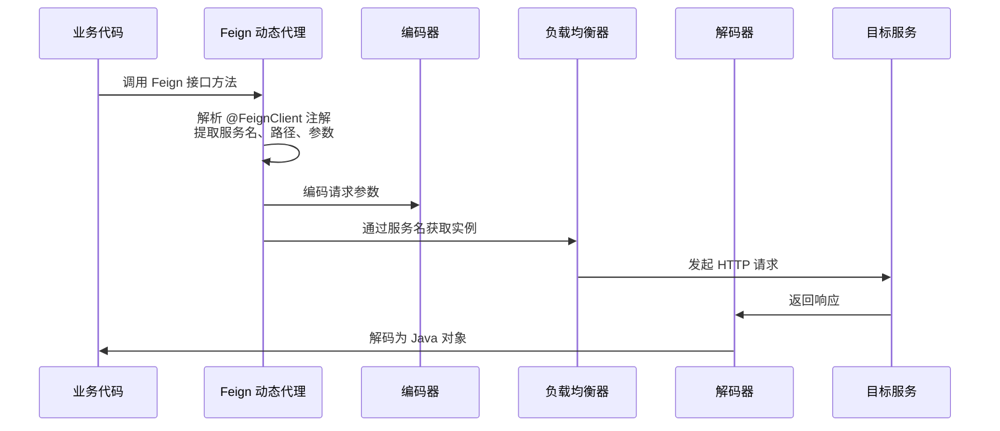

# OpenFeign 服务调用

## 概念说明

OpenFeign 是 Spring Cloud 提供的**声明式 HTTP 客户端**。传统的 RestTemplate 需要手动拼接 URL、处理参数和响应，代码冗长且不易维护。OpenFeign 通过定义接口 + 注解的方式，像调用本地方法一样调用远程服务，底层自动集成了负载均衡和服务发现。

> 面试核心：Feign = 声明式 HTTP 客户端 + 负载均衡 + 服务发现。

## 核心原理

### 一、Feign 工作原理



**核心流程**：
1. 启动时扫描 `@FeignClient` 注解的接口，为每个接口创建 JDK 动态代理
2. 调用接口方法时，代理对象解析方法上的注解（`@GetMapping`、`@PostMapping` 等）
3. 通过编码器将参数编码为 HTTP 请求
4. 通过负载均衡器选择服务实例
5. 发起 HTTP 请求并通过解码器将响应转换为 Java 对象

### 二、Feign 日志级别

| 级别 | 说明 | 适用场景 |
|------|------|----------|
| `NONE` | 不记录日志（默认） | 生产环境 |
| `BASIC` | 记录请求方法、URL、响应状态码、执行时间 | 生产环境排查 |
| `HEADERS` | BASIC + 请求/响应头 | 测试环境 |
| `FULL` | HEADERS + 请求/响应体 | 开发调试 |

### 三、超时与重试配置

```yaml
# Feign 超时配置
spring:
  cloud:
    openfeign:
      client:
        config:
          default:                    # 全局默认配置
            connect-timeout: 5000     # 连接超时 5 秒
            read-timeout: 10000       # 读取超时 10 秒
            logger-level: BASIC       # 日志级别
          user-service:               # 针对特定服务的配置
            connect-timeout: 3000
            read-timeout: 5000

# 重试配置（默认不重试）
# 需要自定义 Retryer Bean
```

### 四、Feign 拦截器

Feign 拦截器（`RequestInterceptor`）可以在请求发出前统一添加请求头，常用于：
- 传递认证 Token
- 传递链路追踪 TraceId
- 添加公共请求头

```java
@Component
public class FeignAuthInterceptor implements RequestInterceptor {
    @Override
    public void apply(RequestTemplate template) {
        // 从当前请求上下文获取 Token 并传递
        ServletRequestAttributes attributes = (ServletRequestAttributes)
            RequestContextHolder.getRequestAttributes();
        if (attributes != null) {
            String token = attributes.getRequest().getHeader("Authorization");
            template.header("Authorization", token);
        }
    }
}
```

## 代码示例

```java
/**
 * Feign 客户端定义 — 声明式 HTTP 调用
 */
@FeignClient(
    name = "user-service",           // 服务名（注册中心中的名称）
    path = "/api/users",             // 统一路径前缀
    fallbackFactory = UserClientFallbackFactory.class  // 降级工厂
)
public interface UserClient {

    @GetMapping("/{id}")
    UserDTO getUser(@PathVariable("id") Long id);

    @PostMapping
    UserDTO createUser(@RequestBody UserDTO user);

    @GetMapping("/search")
    List<UserDTO> searchUsers(@RequestParam("keyword") String keyword);
}

/**
 * Feign 降级工厂 — 提供降级逻辑和异常信息
 */
@Component
public class UserClientFallbackFactory implements FallbackFactory<UserClient> {
    @Override
    public UserClient create(Throwable cause) {
        return new UserClient() {
            @Override
            public UserDTO getUser(Long id) {
                return new UserDTO(id, "降级用户", "服务不可用: " + cause.getMessage());
            }
            // ... 其他方法的降级实现
        };
    }
}
```

> 💻 完整可运行代码：[FeignDemo.java](../../../code-examples/02-framework/springcloud-examples/src/main/java/com/example/springcloud/feign/FeignDemo.java)

## 常见面试题

### Q1: OpenFeign 的工作原理是什么？

**难度**：⭐⭐⭐ | **频率**：🔥🔥🔥

**答题思路**：

1. 说明声明式 HTTP 客户端的概念
2. 解释动态代理的核心机制
3. 说明与负载均衡的集成

**标准答案**：

OpenFeign 是声明式 HTTP 客户端，核心原理是 JDK 动态代理。启动时，Spring 扫描所有 `@FeignClient` 注解的接口，为每个接口创建动态代理对象并注册为 Spring Bean。调用接口方法时，代理对象解析方法上的 Spring MVC 注解（`@GetMapping` 等），提取服务名、路径、参数信息，通过编码器将参数编码为 HTTP 请求，再通过 Spring Cloud LoadBalancer 选择服务实例，最后发起 HTTP 请求并通过解码器将响应转换为 Java 对象。

**深入追问**：

- Feign 和 RestTemplate 的区别？（声明式 vs 编程式）
- Feign 的超时时间和 Ribbon 的超时时间哪个优先？
- 如何实现 Feign 的请求拦截？

**易错点**：

- Feign 底层默认使用 JDK 的 HttpURLConnection，可以替换为 Apache HttpClient 或 OkHttp
- Feign 的超时配置和 LoadBalancer 的超时配置可能冲突，需要注意优先级

### Q2: Feign 如何实现服务降级？

**难度**：⭐⭐⭐ | **频率**：🔥🔥🔥

**答题思路**：

1. fallback vs fallbackFactory 的区别
2. fallbackFactory 可以获取异常信息
3. 需要配合熔断器使用

**标准答案**：

Feign 降级有两种方式：（1）`fallback`：指定一个实现了 Feign 接口的降级类，简单但无法获取异常信息；（2）`fallbackFactory`：指定一个 FallbackFactory 实现类，`create` 方法接收 Throwable 参数，可以根据不同异常返回不同的降级结果。推荐使用 fallbackFactory，因为它能获取到具体的异常信息，便于日志记录和问题排查。注意，Feign 降级需要配合熔断器（Resilience4j 或 Sentinel）使用，需要开启 `spring.cloud.openfeign.circuitbreaker.enabled=true`。

**深入追问**：

- fallback 和 fallbackFactory 的区别？
- 降级方法中可以做哪些事情？（返回默认值、读缓存、记录日志）

### Q3: Feign 的性能优化有哪些方式？

**难度**：⭐⭐⭐ | **频率**：🔥🔥

**答题思路**：

1. 连接池（替换默认的 HttpURLConnection）
2. 日志级别调整
3. GZIP 压缩
4. 超时配置优化

**标准答案**：

Feign 性能优化主要从四个方面入手：（1）使用连接池：默认的 HttpURLConnection 不支持连接池，替换为 Apache HttpClient 或 OkHttp 可以复用连接；（2）调整日志级别：生产环境使用 NONE 或 BASIC，避免 FULL 级别的性能开销；（3）开启 GZIP 压缩：减少网络传输数据量；（4）合理配置超时时间：避免超时时间过长导致线程阻塞。

**深入追问**：

- 如何将 Feign 的 HTTP 客户端替换为 OkHttp？

## 在 Spring Cloud 项目中体验

启动 Spring Cloud 项目后，通过 REST 接口直接验证：

```bash
# 启动中间件
docker compose -f docker/docker-compose.yml up -d
docker compose -f docker/docker-compose.consul.yml up -d

# 启动项目
cd code-examples/02-framework/springcloud-examples
mvn spring-boot:run

# 验证接口
curl http://localhost:8090/demo/feign/user/1
curl http://localhost:8090/demo/feign/users
curl http://localhost:8090/demo/feign/fallback
```

> 💻 Spring Cloud 实战代码：[FeignController.java](../../../code-examples/02-framework/springcloud-examples/src/main/java/com/example/springcloud/feign/FeignController.java) | [UserFeignClient.java](../../../code-examples/02-framework/springcloud-examples/src/main/java/com/example/springcloud/feign/UserFeignClient.java)

## 参考资料

- [Spring Cloud OpenFeign 官方文档](https://docs.spring.io/spring-cloud-openfeign/reference/)
- [OpenFeign GitHub](https://github.com/OpenFeign/feign)
