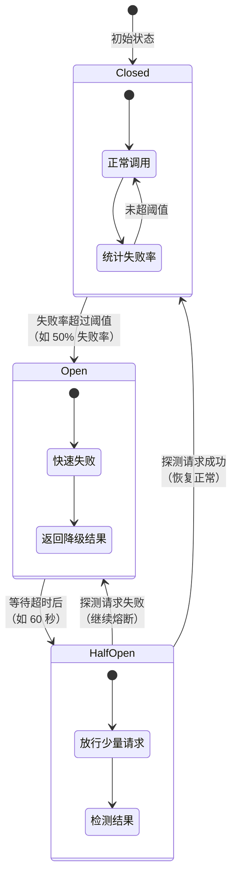

# 熔断降级

## 概念说明

在微服务架构中，服务之间存在调用链路。当某个下游服务出现故障（响应慢或不可用）时，如果不加控制，故障会沿着调用链路**级联传播**，最终导致整个系统雪崩。

熔断降级是防止级联故障的核心手段：
- **熔断（Circuit Breaker）**：当下游服务故障率超过阈值时，自动"断开"调用链路，快速失败而不是等待超时
- **降级（Fallback）**：熔断后返回预设的兜底结果，保证核心链路可用
- **限流（Rate Limiting）**：控制请求速率，防止系统过载

## 核心原理

### 一、熔断器状态机

熔断器有三种状态，状态之间的转换遵循以下规则：



| 状态 | 说明 | 行为 |
|------|------|------|
| **Closed（关闭）** | 正常状态 | 所有请求正常通过，统计失败率 |
| **Open（打开）** | 熔断状态 | 所有请求快速失败，返回降级结果 |
| **Half-Open（半开）** | 探测状态 | 放行少量请求探测下游是否恢复 |

### 二、Sentinel vs Resilience4j 对比

| 特性 | Sentinel | Resilience4j |
|------|----------|-------------|
| 出品方 | 阿里巴巴 | 开源社区 |
| 编程模型 | 注解 + Dashboard | 函数式 + 注解 |
| 控制台 | ✅ 可视化 Dashboard | ❌ 需要集成 Grafana |
| 限流规则 | QPS/线程数/热点参数 | 仅速率限制 |
| 熔断策略 | 慢调用比例/异常比例/异常数 | 失败率/慢调用率 |
| 规则持久化 | Nacos/Apollo/ZK | 配置文件 |
| 集群限流 | ✅ | ❌ |
| 热点参数限流 | ✅ | ❌ |
| Spring Cloud 集成 | Alibaba 体系 | 官方推荐 |
| 适用场景 | 国内大规模微服务 | 轻量级微服务 |

### 三、Sentinel 核心功能

#### 限流规则

```java
// QPS 限流：每秒最多 100 个请求
FlowRule rule = new FlowRule();
rule.setResource("getOrder");
rule.setGrade(RuleConstant.FLOW_GRADE_QPS);
rule.setCount(100);

// 线程数限流：最多 10 个并发线程
FlowRule threadRule = new FlowRule();
threadRule.setResource("getOrder");
threadRule.setGrade(RuleConstant.FLOW_GRADE_THREAD);
threadRule.setCount(10);
```

#### 热点参数限流

针对特定参数值进行限流，例如：对热门商品 ID 限制 QPS。

```java
// 热点参数限流：第 0 个参数为热点参数
ParamFlowRule rule = new ParamFlowRule("getProduct")
    .setParamIdx(0)           // 参数索引
    .setCount(50);            // 默认阈值

// 特定参数值的例外项
ParamFlowItem item = new ParamFlowItem()
    .setObject("hot-product-001")  // 热门商品 ID
    .setCount(10);                  // 更严格的限制
rule.setParamFlowItemList(Collections.singletonList(item));
```

### 四、Resilience4j 熔断器配置

```yaml
resilience4j:
  circuitbreaker:
    instances:
      userService:
        sliding-window-type: COUNT_BASED       # 基于计数的滑动窗口
        sliding-window-size: 10                # 窗口大小：10 次调用
        failure-rate-threshold: 50             # 失败率阈值：50%
        wait-duration-in-open-state: 60s       # 熔断等待时间：60 秒
        permitted-number-of-calls-in-half-open-state: 3  # 半开状态探测次数
        minimum-number-of-calls: 5             # 最小调用次数（低于此值不计算失败率）
  ratelimiter:
    instances:
      userService:
        limit-for-period: 100                  # 每个周期允许的请求数
        limit-refresh-period: 1s               # 刷新周期
        timeout-duration: 500ms                # 等待超时时间
```

## 代码示例

```java
/**
 * Resilience4j 熔断器使用示例
 */
@Service
public class OrderService {

    private final UserClient userClient;

    public OrderService(UserClient userClient) {
        this.userClient = userClient;
    }

    /**
     * @CircuitBreaker 注解实现熔断
     * - name: 熔断器实例名（对应配置文件中的配置）
     * - fallbackMethod: 降级方法名
     */
    @CircuitBreaker(name = "userService", fallbackMethod = "getUserFallback")
    public UserDTO getUser(Long userId) {
        return userClient.getUser(userId);
    }

    /**
     * 降级方法 — 参数必须与原方法一致，额外加 Throwable 参数
     */
    public UserDTO getUserFallback(Long userId, Throwable t) {
        System.out.println("熔断降级: " + t.getMessage());
        return new UserDTO(userId, "降级用户", "服务暂时不可用");
    }
}
```

> 💻 完整可运行代码：[CircuitBreakerDemo.java](https://github.com/skyhe58/guide-java/tree/main/code-examples/02-framework/springcloud-examples/src/main/java/com/example/springcloud/circuitbreaker/CircuitBreakerDemo.java)
> <!-- 本地路径：code-examples/02-framework/springcloud-examples/src/main/java/com/example/springcloud/circuitbreaker/CircuitBreakerDemo.java -->

## 常见面试题

### Q1: 什么是服务雪崩？如何防止？

**难度**：⭐⭐⭐ | **频率**：🔥🔥🔥

**答题思路**：

1. 解释雪崩的产生过程（级联故障）
2. 列举防止手段（熔断、降级、限流、超时）
3. 说明熔断器的工作原理

**标准答案**：

服务雪崩是指一个服务的故障沿着调用链路级联传播，导致整个系统不可用。例如 A 调用 B，B 调用 C，当 C 响应慢时，B 的线程被阻塞，进而 A 的线程也被阻塞，最终所有服务都不可用。防止雪崩的手段包括：（1）熔断：当下游故障率超过阈值时自动断开调用，快速失败；（2）降级：熔断后返回兜底结果；（3）限流：控制请求速率防止过载；（4）超时控制：设置合理的超时时间避免长时间等待。

**深入追问**：

- 熔断器的三种状态是什么？如何转换？
- 熔断和降级的区别？
- 限流算法有哪些？（令牌桶、漏桶、滑动窗口）

**易错点**：

- 熔断是自动触发的保护机制，降级是熔断后的兜底策略
- 限流是预防手段，熔断是事后保护手段

### Q2: Sentinel 和 Resilience4j 的区别？如何选型？

**难度**：⭐⭐⭐ | **频率**：🔥🔥🔥

**答题思路**：

1. 从功能、生态、使用方式三个维度对比
2. 给出选型建议

**标准答案**：

Sentinel 是阿里巴巴开源的流量治理组件，功能丰富（QPS/线程数限流、热点参数限流、集群限流、可视化 Dashboard），适合大规模微服务场景。Resilience4j 是轻量级的容错库，采用函数式编程风格，是 Spring Cloud 官方推荐的熔断器，适合轻量级微服务。选型建议：如果使用 Spring Cloud Alibaba 体系且需要可视化管理，选 Sentinel；如果追求轻量和 Spring Cloud 官方支持，选 Resilience4j。

**深入追问**：

- Sentinel 的热点参数限流是怎么实现的？
- Resilience4j 的滑动窗口有哪两种类型？（基于计数、基于时间）

### Q3: 熔断器的三种状态是什么？状态如何转换？

**难度**：⭐⭐⭐ | **频率**：🔥🔥🔥

**答题思路**：

1. 画出状态机图
2. 说明每种状态的行为
3. 说明转换条件

**标准答案**：

熔断器有三种状态：（1）Closed（关闭）：正常状态，所有请求通过，同时统计失败率；当失败率超过阈值（如 50%）时转为 Open 状态。（2）Open（打开）：熔断状态，所有请求快速失败并返回降级结果；经过一段等待时间（如 60 秒）后转为 Half-Open 状态。（3）Half-Open（半开）：探测状态，放行少量请求探测下游是否恢复；如果探测成功则转为 Closed，失败则转回 Open。

**深入追问**：

- 滑动窗口是如何统计失败率的？
- 半开状态放行多少请求？如何配置？

## 在 Spring Cloud 项目中体验

启动 Spring Cloud 项目后，通过 REST 接口直接验证：

```bash
# 启动中间件
docker compose -f docker/docker-compose.yml up -d
docker compose -f docker/docker-compose.consul.yml up -d

# 启动项目
cd code-examples/02-framework/springcloud-examples
mvn spring-boot:run

# 验证接口
curl http://localhost:8090/demo/cb/success
curl http://localhost:8090/demo/cb/fail
curl http://localhost:8090/demo/cb/status
```

> 💻 Spring Cloud 实战代码：[CircuitBreakerController.java](https://github.com/skyhe58/guide-java/tree/main/code-examples/02-framework/springcloud-examples/src/main/java/com/example/springcloud/circuitbreaker/CircuitBreakerController.java)
> <!-- 本地路径：code-examples/02-framework/springcloud-examples/src/main/java/com/example/springcloud/circuitbreaker/CircuitBreakerController.java -->

## 参考资料

- [Resilience4j 官方文档](https://resilience4j.readme.io/docs)
- [Sentinel 官方文档](https://sentinelguard.io/zh-cn/docs/introduction.html)
