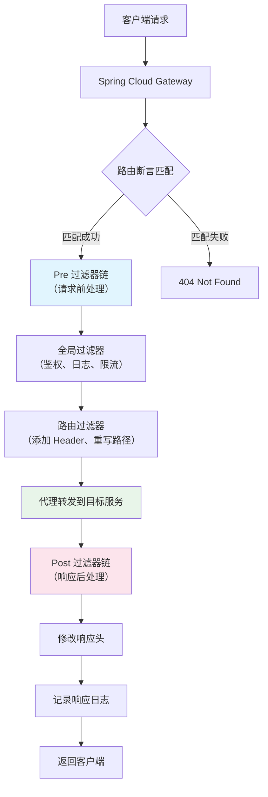

# Gateway 网关

## 概念说明

Spring Cloud Gateway 是 Spring Cloud 官方推出的**API 网关**，基于 Spring WebFlux（Reactor 响应式编程）构建，替代了已停更的 Zuul。它是微服务架构的**统一入口**，负责路由转发、过滤器链处理、限流、鉴权、跨域等功能。

> 面试核心：Gateway 是微服务的"大门"，所有外部请求都经过网关，是流量治理的第一道防线。

## 核心原理

### 一、Gateway 核心概念

| 概念 | 说明 | 类比 |
|------|------|------|
| **Route（路由）** | 网关的基本构建块，包含 ID、目标 URI、断言、过滤器 | 路由表中的一条规则 |
| **Predicate（断言）** | 匹配请求的条件（路径、Header、参数等） | if 条件判断 |
| **Filter（过滤器）** | 对请求/响应进行处理（修改 Header、限流、鉴权等） | Servlet Filter |

### 二、Gateway 过滤器链执行流程



### 三、路由配置

```yaml
spring:
  cloud:
    gateway:
      routes:
        # 路由规则 1：用户服务
        - id: user-service-route
          uri: lb://user-service          # lb:// 表示从注册中心获取实例
          predicates:
            - Path=/api/users/**          # 路径匹配
            - Method=GET,POST             # 方法匹配
          filters:
            - StripPrefix=1               # 去掉第一层路径前缀
            - AddRequestHeader=X-Request-Source, gateway

        # 路由规则 2：订单服务
        - id: order-service-route
          uri: lb://order-service
          predicates:
            - Path=/api/orders/**
            - Header=Authorization, Bearer.*  # Header 匹配
          filters:
            - StripPrefix=1

      # 全局默认过滤器
      default-filters:
        - AddResponseHeader=X-Gateway-Version, 1.0
```

### 四、Gateway vs Nginx

| 对比项 | Spring Cloud Gateway | Nginx |
|--------|---------------------|-------|
| 定位 | 业务网关（API Gateway） | 流量网关（反向代理） |
| 编程语言 | Java（Spring WebFlux） | C |
| 性能 | 中等（适合业务逻辑处理） | 极高（适合流量转发） |
| 动态路由 | ✅ 支持（注册中心集成） | ❌ 需要 reload 配置 |
| 服务发现 | ✅ 集成注册中心 | ❌ 需要手动配置 upstream |
| 业务逻辑 | ✅ 可编写 Java 过滤器 | 有限（Lua 脚本） |
| 限流 | ✅ 内置 RequestRateLimiter | ✅ limit_req/limit_conn |
| 鉴权 | ✅ 集成 Spring Security | 有限 |
| 适用场景 | 微服务内部 API 网关 | 外部流量入口 |

> 生产环境通常 Nginx + Gateway 配合使用：Nginx 作为最外层流量网关处理 SSL 卸载、静态资源、基础限流；Gateway 作为业务网关处理路由、鉴权、业务限流。

### 五、Gateway 限流

Gateway 内置 `RequestRateLimiter` 过滤器，基于 Redis + 令牌桶算法实现限流：

```yaml
spring:
  cloud:
    gateway:
      routes:
        - id: rate-limited-route
          uri: lb://user-service
          predicates:
            - Path=/api/users/**
          filters:
            - name: RequestRateLimiter
              args:
                redis-rate-limiter.replenishRate: 10    # 每秒生成 10 个令牌
                redis-rate-limiter.burstCapacity: 20    # 令牌桶容量 20
                key-resolver: "#{@userKeyResolver}"     # 限流维度
```

### 六、Gateway 跨域配置

```yaml
spring:
  cloud:
    gateway:
      globalcors:
        cors-configurations:
          '[/**]':
            allowed-origins: "https://example.com"
            allowed-methods:
              - GET
              - POST
              - PUT
              - DELETE
            allowed-headers: "*"
            allow-credentials: true
            max-age: 3600
```

## 代码示例

```java
/**
 * 自定义全局过滤器 — 鉴权示例
 */
@Component
public class AuthGlobalFilter implements GlobalFilter, Ordered {

    @Override
    public Mono<Void> filter(ServerWebExchange exchange, GatewayFilterChain chain) {
        String token = exchange.getRequest().getHeaders().getFirst("Authorization");
        
        if (token == null || !token.startsWith("Bearer ")) {
            exchange.getResponse().setStatusCode(HttpStatus.UNAUTHORIZED);
            return exchange.getResponse().setComplete();
        }
        
        // Token 验证通过，继续过滤器链
        return chain.filter(exchange);
    }

    @Override
    public int getOrder() {
        return -1; // 优先级最高
    }
}
```

> 💻 完整可运行代码：[GatewayDemo.java](https://github.com/skyhe58/guide-java/tree/main/code-examples/02-framework/springcloud-examples/src/main/java/com/example/springcloud/gateway/GatewayDemo.java)
> <!-- 本地路径：code-examples/02-framework/springcloud-examples/src/main/java/com/example/springcloud/gateway/GatewayDemo.java -->

## 常见面试题

### Q1: Spring Cloud Gateway 的工作原理？

**难度**：⭐⭐⭐ | **频率**：🔥🔥🔥

**答题思路**：

1. 说明三大核心概念（Route、Predicate、Filter）
2. 描述请求处理流程
3. 说明基于 WebFlux 的响应式架构

**标准答案**：

Gateway 基于 Spring WebFlux 构建，核心由三部分组成：Route（路由）、Predicate（断言）、Filter（过滤器）。请求到达 Gateway 后，首先通过 RoutePredicateHandlerMapping 匹配路由断言，找到匹配的路由后，请求依次经过 Pre 过滤器链（全局过滤器 + 路由过滤器），然后代理转发到目标服务，响应返回后再经过 Post 过滤器链处理，最终返回客户端。

**深入追问**：

- Gateway 为什么基于 WebFlux 而不是 Spring MVC？（非阻塞、高并发）
- 全局过滤器和路由过滤器的区别？
- 如何实现动态路由？

**易错点**：

- Gateway 基于 WebFlux，不能和 Spring MVC（spring-boot-starter-web）同时使用
- 过滤器的执行顺序由 Ordered 接口或 @Order 注解决定

### Q2: Gateway 和 Nginx 的区别？为什么需要两层网关？

**难度**：⭐⭐⭐ | **频率**：🔥🔥🔥

**答题思路**：

1. 定位不同：流量网关 vs 业务网关
2. 各自的优势
3. 生产环境的配合方式

**标准答案**：

Nginx 是流量网关，擅长高性能的流量转发、SSL 卸载、静态资源服务、基础限流；Gateway 是业务网关，擅长动态路由（集成注册中心）、业务鉴权、请求/响应改写、与 Spring 生态集成。生产环境通常两层配合：Nginx 在最外层处理 SSL、静态资源、基础限流和负载均衡；Gateway 在内层处理微服务路由、鉴权、业务限流。这样既利用了 Nginx 的高性能，又利用了 Gateway 的业务处理能力。

**深入追问**：

- 如果只用一层网关行不行？各有什么问题？
- Gateway 的性能瓶颈在哪里？如何优化？

### Q3: 如何在 Gateway 中实现统一鉴权？

**难度**：⭐⭐⭐ | **频率**：🔥🔥

**答题思路**：

1. 实现 GlobalFilter 接口
2. 在过滤器中校验 Token
3. 白名单路径放行

**标准答案**：

通过实现 `GlobalFilter` 接口创建全局鉴权过滤器。在 `filter` 方法中：（1）获取请求路径，判断是否在白名单中（如登录、注册接口）；（2）从请求头获取 Authorization Token；（3）校验 Token 有效性（JWT 解析或调用认证服务）；（4）校验通过则将用户信息放入请求头传递给下游服务；（5）校验失败则返回 401 状态码。通过 `Ordered` 接口设置最高优先级确保鉴权过滤器最先执行。

**深入追问**：

- 如何实现路径白名单？
- Token 过期了怎么处理？（刷新 Token 机制）

## 在 Spring Cloud 项目中体验

启动 Spring Cloud 项目后，通过 REST 接口直接验证：

```bash
# 启动中间件
docker compose -f docker/docker-compose.yml up -d
docker compose -f docker/docker-compose.consul.yml up -d

# 启动主项目
cd code-examples/02-framework/springcloud-examples
mvn spring-boot:run

# 需要先启动 Gateway 模块
cd code-examples/02-framework/springcloud-gateway
mvn spring-boot:run

# 验证接口
curl http://localhost:8080/api/demo/registry/services -H "Authorization: Bearer test-token"
curl http://localhost:8080/actuator/gateway/routes
```

> 💻 Spring Cloud 实战代码：[springcloud-gateway](https://github.com/skyhe58/guide-java/tree/main/code-examples/02-framework/springcloud-gateway/)
> <!-- 本地路径：code-examples/02-framework/springcloud-gateway/ -->

## 参考资料

- [Spring Cloud Gateway 官方文档](https://docs.spring.io/spring-cloud-gateway/reference/)
- [Spring Cloud Gateway 源码](https://github.com/spring-cloud/spring-cloud-gateway)
