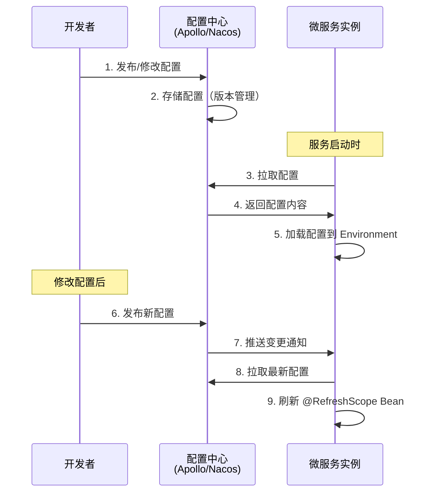
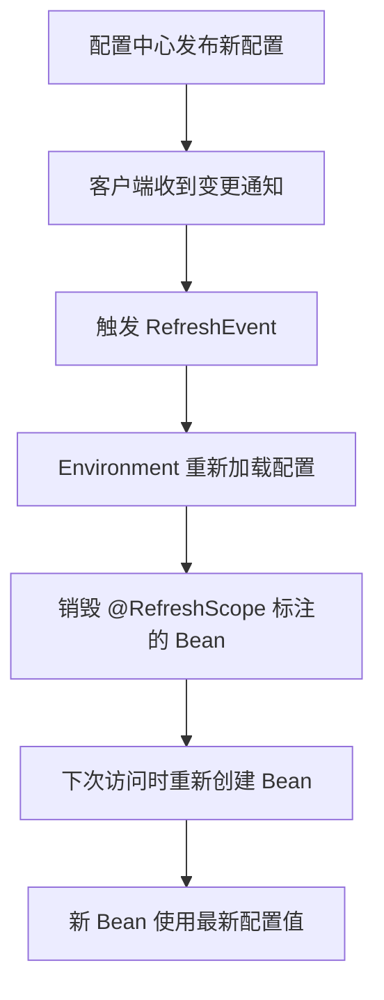

# 配置中心集成

## 概念说明

在微服务架构中，每个服务都有自己的配置文件。当服务实例数量增多时，配置管理面临以下挑战：
- **配置分散**：每个服务独立管理配置，修改困难
- **环境隔离**：开发、测试、生产环境配置不同
- **动态更新**：修改配置需要重启服务

配置中心将所有服务的配置**集中管理**，支持配置的动态更新、版本管理、环境隔离和权限控制。Spring Cloud 中常用的配置中心有 Apollo、Nacos Config 和 Spring Cloud Config。

## 核心原理

### 一、配置中心工作流程



### 二、Apollo vs Nacos Config vs Spring Cloud Config

| 特性 | Apollo | Nacos Config | Spring Cloud Config |
|------|--------|-------------|-------------------|
| 出品方 | 携程 | 阿里巴巴 | Spring 官方 |
| 配置存储 | MySQL | MySQL/内嵌存储 | Git/SVN |
| 实时推送 | ✅ 长轮询 + 推送 | ✅ 长轮询 | ❌ 需要 Bus |
| 灰度发布 | ✅ | ❌ | ❌ |
| 权限管理 | ✅ 完善 | ✅ 基础 | ❌ |
| 多环境 | ✅ Namespace | ✅ Namespace | ✅ Profile |
| 管理界面 | ✅ 功能丰富 | ✅ 简洁 | ❌ |
| 适用场景 | 大规模生产环境 | 中小规模/Alibaba 体系 | 简单场景 |

### 三、@RefreshScope 热更新原理

`@RefreshScope` 是 Spring Cloud 提供的配置热更新机制。标注了 `@RefreshScope` 的 Bean 在配置变更时会被**销毁并重新创建**，从而获取最新的配置值。



```java
@RestController
@RefreshScope  // 配置变更时自动刷新
public class ConfigController {

    @Value("${app.feature.enabled:false}")
    private boolean featureEnabled;

    @GetMapping("/config")
    public String getConfig() {
        return "Feature enabled: " + featureEnabled;
    }
}
```

### 四、Apollo 在 Spring Cloud 中的使用

```yaml
# bootstrap.yml — Apollo 配置
app:
  id: user-service
apollo:
  meta: http://apollo-config:8080
  bootstrap:
    enabled: true
    namespaces: application,common
  cacheDir: /opt/data/apollo-cache  # 本地缓存目录（容灾）
```

### 五、Nacos Config 在 Spring Cloud 中的使用

```yaml
# bootstrap.yml — Nacos Config 配置
spring:
  application:
    name: user-service
  cloud:
    nacos:
      config:
        server-addr: localhost:8848
        file-extension: yaml
        namespace: dev              # 环境隔离
        group: DEFAULT_GROUP
        shared-configs:             # 共享配置
          - data-id: common.yaml
            group: DEFAULT_GROUP
            refresh: true
```

## 代码示例

```java
/**
 * 配置热更新示例
 * 
 * 使用 @RefreshScope 实现配置动态刷新
 * 配置变更后无需重启服务即可生效
 */
@Component
@RefreshScope
@ConfigurationProperties(prefix = "app.order")
public class OrderConfig {
    
    private int maxRetryCount = 3;
    private long timeoutMs = 5000;
    private boolean asyncEnabled = false;

    // getter/setter 省略

    @Override
    public String toString() {
        return String.format("OrderConfig{maxRetryCount=%d, timeoutMs=%d, asyncEnabled=%b}",
            maxRetryCount, timeoutMs, asyncEnabled);
    }
}
```

> 💻 完整代码参考配置中心模块：[配置中心](/4-middleware/4.4-config-center/)

## 常见面试题

### Q1: 为什么需要配置中心？和本地配置文件有什么区别？

**难度**：⭐⭐ | **频率**：🔥🔥🔥

**答题思路**：

1. 本地配置的痛点（分散、重启、无版本管理）
2. 配置中心的核心能力
3. 适用场景

**标准答案**：

本地配置文件存在三个问题：（1）配置分散，每个服务独立管理，修改需要逐个服务操作；（2）修改配置需要重启服务，影响可用性；（3）无版本管理和审计能力。配置中心解决了这些问题：集中管理所有服务配置、支持配置热更新（无需重启）、提供版本管理和回滚能力、支持环境隔离和权限控制。在微服务架构中，配置中心是基础设施的重要组成部分。

**深入追问**：

- 配置中心宕机了怎么办？（本地缓存容灾）
- 配置的优先级是怎样的？（远程配置 > 本地配置）

### Q2: @RefreshScope 的原理是什么？

**难度**：⭐⭐⭐ | **频率**：🔥🔥

**答题思路**：

1. @RefreshScope 的作用
2. 底层实现原理（销毁重建）
3. 注意事项

**标准答案**：

`@RefreshScope` 是 Spring Cloud 提供的配置热更新注解。其原理是：标注了 `@RefreshScope` 的 Bean 被放入一个特殊的 Scope（RefreshScope），当配置变更触发 RefreshEvent 时，RefreshScope 会销毁所有管理的 Bean。下次访问这些 Bean 时，Spring 容器会重新创建它们，新创建的 Bean 会从更新后的 Environment 中获取最新的配置值。注意：`@RefreshScope` 不适用于构造器注入的配置值，因为 Bean 重建时构造器会重新执行。

**深入追问**：

- @RefreshScope 和 @ConfigurationProperties 配合使用时有什么注意事项？
- 配置热更新会影响正在处理的请求吗？

### Q3: Apollo 和 Nacos Config 如何选型？

**难度**：⭐⭐ | **频率**：🔥🔥

**答题思路**：

1. 功能对比
2. 生态对比
3. 选型建议

**标准答案**：

Apollo 功能更完善（灰度发布、完善的权限管理、丰富的管理界面），适合大规模生产环境；Nacos Config 更轻量，同时提供注册中心功能（一体化），适合中小规模或 Spring Cloud Alibaba 体系。选型建议：如果团队已经使用 Nacos 作为注册中心，选 Nacos Config 可以减少组件数量；如果对配置管理有较高要求（灰度、权限、审计），选 Apollo。

**深入追问**：

- Apollo 的灰度发布是怎么实现的？
- 配置中心的高可用如何保证？

## 在 Spring Cloud 项目中体验

启动 Spring Cloud 项目后，通过 REST 接口直接验证：

```bash
# 启动中间件
docker compose -f docker/docker-compose.yml up -d
docker compose -f docker/docker-compose.consul.yml up -d

# 启动项目
cd code-examples/02-framework/springcloud-examples
mvn spring-boot:run

# Consul KV 存储
curl http://localhost:8500/v1/kv/config/springcloud-demo/data -X PUT -d 'custom.key=value'
```

Spring Cloud 项目通过 Consul KV 实现配置中心功能，服务启动时自动从 Consul 拉取配置，支持 `@RefreshScope` 热更新。

> 💻 Spring Cloud 实战代码：[application.yml](https://github.com/skyhe58/guide-java/tree/main/code-examples/02-framework/springcloud-examples/src/main/resources/application.yml)
> <!-- 本地路径：code-examples/02-framework/springcloud-examples/src/main/resources/application.yml -->

## 参考资料

- [Apollo 官方文档](https://www.apolloconfig.com/)
- [Nacos Config 官方文档](https://nacos.io/docs/latest/guide/user/open-api/)
- [Spring Cloud Config 官方文档](https://docs.spring.io/spring-cloud-config/reference/)
