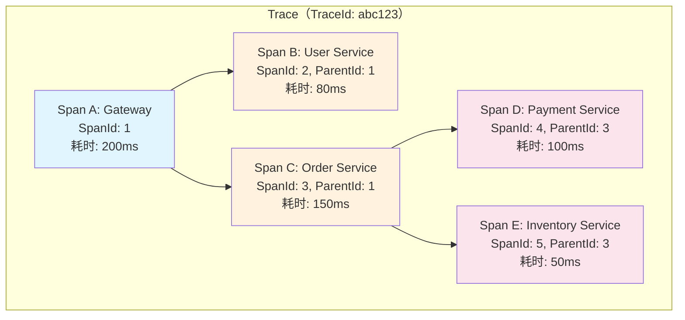
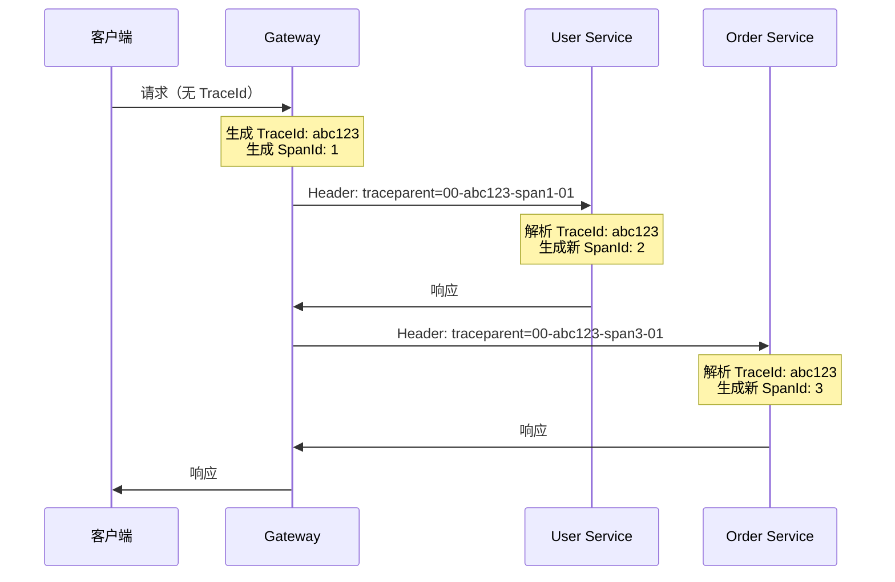

# 链路追踪

## 概念说明

在微服务架构中，一个用户请求可能经过多个服务的处理。当出现问题时，如何快速定位是哪个服务、哪个环节出了问题？链路追踪（Distributed Tracing）就是解决这个问题的关键技术。

链路追踪通过为每个请求分配唯一的 **TraceId**，并在服务间传递，将分散在各个服务中的日志和调用信息串联起来，形成完整的调用链路。

## 核心原理

### 一、核心概念

| 概念 | 说明 | 类比 |
|------|------|------|
| **Trace** | 一次完整的请求链路，由唯一的 TraceId 标识 | 一个快递单号 |
| **Span** | 链路中的一个工作单元（一次服务调用），由 SpanId 标识 | 快递的一个中转站 |
| **Parent Span** | 当前 Span 的父 Span，表示调用关系 | 上一个中转站 |
| **Annotation** | Span 中的事件标记（如请求发送、请求接收） | 中转站的时间戳 |

### 二、链路追踪数据模型



### 三、TraceId 透传机制

TraceId 在服务间的传递通过 HTTP Header 实现：



### 四、Sleuth vs Micrometer Tracing

| 特性 | Spring Cloud Sleuth | Micrometer Tracing |
|------|--------------------|--------------------|
| Spring Boot 版本 | 2.x | 3.x |
| Spring Cloud 版本 | 2022.0 之前 | 2022.0 之后 |
| 追踪标准 | Brave (B3) | OpenTelemetry / Brave |
| Header 格式 | B3 (X-B3-TraceId) | W3C Trace Context (traceparent) |
| 状态 | 已停更 | 官方推荐 |

> ⚠️ Spring Boot 3.x 使用 Micrometer Tracing 替代 Sleuth。

### 五、日志与链路关联（MDC）

通过 MDC（Mapped Diagnostic Context）将 TraceId 自动注入到日志中：

```xml
<!-- logback-spring.xml -->
<pattern>
    %d{yyyy-MM-dd HH:mm:ss.SSS} [%thread] [traceId=%X{traceId}] [spanId=%X{spanId}] 
    %-5level %logger{36} - %msg%n
</pattern>
```

日志输出效果：
```
2024-01-15 10:30:00.123 [http-nio-8080-exec-1] [traceId=abc123] [spanId=span1] 
INFO  c.e.UserService - 查询用户: userId=1001
```

### 六、Zipkin vs SkyWalking

| 特性 | Zipkin | SkyWalking |
|------|--------|------------|
| 出品方 | Twitter | Apache |
| 数据采集 | SDK 埋点 | Java Agent（无侵入） |
| 存储后端 | MySQL/ES/Cassandra | ES/H2/MySQL |
| UI 功能 | 链路查询、依赖图 | 链路查询、拓扑图、告警、性能分析 |
| 性能开销 | 低 | 低（Agent 方式） |
| 适用场景 | 轻量级链路追踪 | 全功能 APM |

## 代码示例

```java
/**
 * TraceId 透传与 MDC 日志关联示例
 */
@RestController
public class TracingController {

    private static final Logger log = LoggerFactory.getLogger(TracingController.class);

    @GetMapping("/api/orders/{id}")
    public String getOrder(@PathVariable Long id) {
        // TraceId 自动注入到 MDC，日志中自动包含 traceId
        log.info("查询订单: orderId={}", id);
        
        // 调用下游服务时，TraceId 自动通过 Header 传递
        // Feign/RestTemplate 已自动集成链路追踪
        return "Order-" + id;
    }
}

/**
 * 自定义 TraceId 过滤器 — 将 TraceId 放入响应头
 * 方便前端排查问题时提供 TraceId
 */
@Component
public class TraceIdFilter implements Filter {
    @Override
    public void doFilter(ServletRequest request, ServletResponse response, 
                         FilterChain chain) throws IOException, ServletException {
        String traceId = MDC.get("traceId");
        if (traceId != null && response instanceof HttpServletResponse httpResponse) {
            httpResponse.setHeader("X-Trace-Id", traceId);
        }
        chain.doFilter(request, response);
    }
}
```

> 💻 完整可运行代码：[TracingDemo.java](https://github.com/skyhe58/guide-java/tree/main/code-examples/02-framework/springcloud-examples/src/main/java/com/example/springcloud/tracing/TracingDemo.java)
> <!-- 本地路径：code-examples/02-framework/springcloud-examples/src/main/java/com/example/springcloud/tracing/TracingDemo.java -->

## 常见面试题

### Q1: 什么是分布式链路追踪？TraceId 是如何传递的？

**难度**：⭐⭐⭐ | **频率**：🔥🔥🔥

**答题思路**：

1. 解释链路追踪的作用
2. 说明 Trace 和 Span 的概念
3. 说明 TraceId 通过 HTTP Header 传递

**标准答案**：

分布式链路追踪是将一次请求在多个服务间的调用过程串联起来的技术。核心概念是 Trace（一次完整请求，由 TraceId 标识）和 Span（一次服务调用，由 SpanId 标识）。TraceId 的传递通过 HTTP Header 实现：第一个服务生成 TraceId 并放入请求头（W3C 标准使用 `traceparent` 头），下游服务从请求头中解析 TraceId 并继续传递。通过 MDC 机制，TraceId 还会自动注入到日志中，实现日志与链路的关联。

**深入追问**：

- 异步调用（线程池、MQ）中 TraceId 如何传递？
- 采样率是什么？为什么需要采样？

**易错点**：

- TraceId 在异步场景下不会自动传递，需要手动处理（如 TaskDecorator）

### Q2: Sleuth 和 Micrometer Tracing 的区别？

**难度**：⭐⭐ | **频率**：🔥🔥

**答题思路**：

1. 版本对应关系
2. 核心区别
3. 迁移注意事项

**标准答案**：

Sleuth 是 Spring Cloud 2022.0 之前的链路追踪方案，基于 Brave 库，使用 B3 Header 格式。Micrometer Tracing 是 Spring Boot 3.x / Spring Cloud 2022.0 之后的替代方案，支持 OpenTelemetry 和 Brave 两种追踪后端，默认使用 W3C Trace Context Header 格式。迁移时需要注意 Header 格式的变化和依赖的替换。

**深入追问**：

- OpenTelemetry 是什么？和 Brave 有什么区别？

### Q3: 如何将 TraceId 与日志关联？

**难度**：⭐⭐ | **频率**：🔥🔥

**答题思路**：

1. MDC 机制
2. 日志格式配置
3. 实际应用场景

**标准答案**：

通过 MDC（Mapped Diagnostic Context）机制实现。Micrometer Tracing 会自动将 TraceId 和 SpanId 放入 MDC 中，在 Logback 配置中通过 `%X{traceId}` 和 `%X{spanId}` 引用即可。这样每条日志都会自动包含 TraceId，在排查问题时可以通过 TraceId 在 ELK 等日志系统中搜索到一次请求的所有日志。

**深入追问**：

- MDC 在多线程环境下会丢失吗？如何解决？
- 如何将 TraceId 返回给前端？

## 在 Spring Cloud 项目中体验

启动 Spring Cloud 项目后，通过 REST 接口直接验证：

```bash
# 启动中间件
docker compose -f docker/docker-compose.yml up -d
docker compose -f docker/docker-compose.consul.yml up -d

# 启动项目
cd code-examples/02-framework/springcloud-examples
mvn spring-boot:run

# 所有接口自动带 traceId/spanId
curl http://localhost:8090/demo/registry/services
# 查看日志中的 [traceId/spanId] 字段
```

Spring Cloud 项目集成了 Micrometer Tracing，所有请求日志自动携带 `traceId` 和 `spanId`，通过 `logback-spring.xml` 配置日志格式，实现链路追踪与日志关联。

> 💻 Spring Cloud 实战代码：[logback-spring.xml](https://github.com/skyhe58/guide-java/tree/main/code-examples/02-framework/springcloud-examples/src/main/resources/logback-spring.xml)
> <!-- 本地路径：code-examples/02-framework/springcloud-examples/src/main/resources/logback-spring.xml -->

## 参考资料

- [Micrometer Tracing 官方文档](https://micrometer.io/docs/tracing)
- [Zipkin 官方文档](https://zipkin.io/)
- [SkyWalking 官方文档](https://skywalking.apache.org/docs/)
