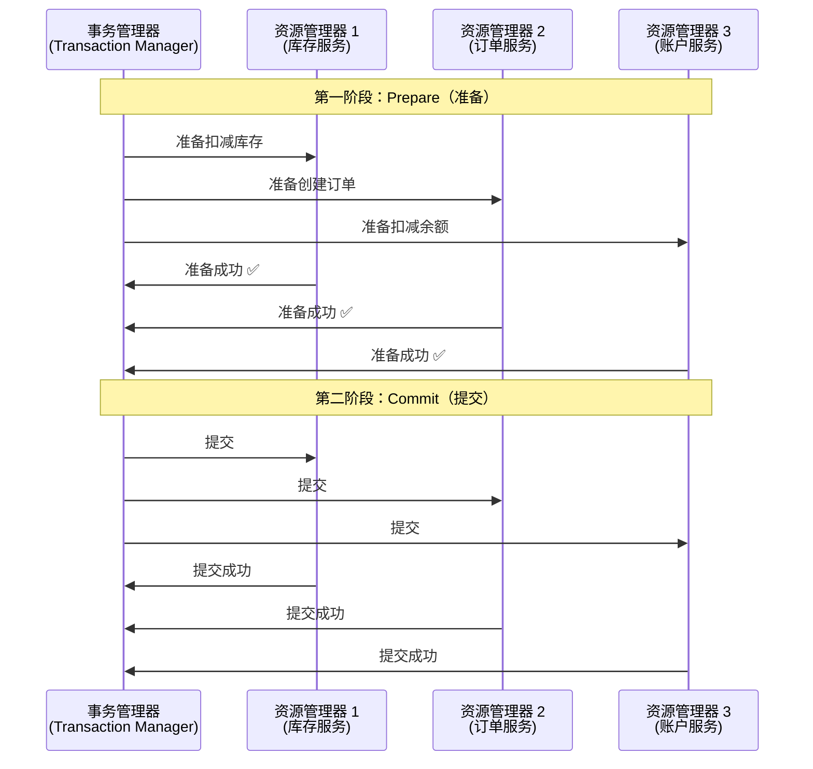
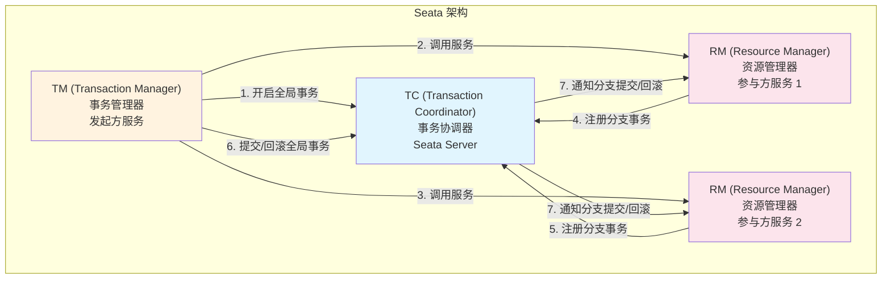
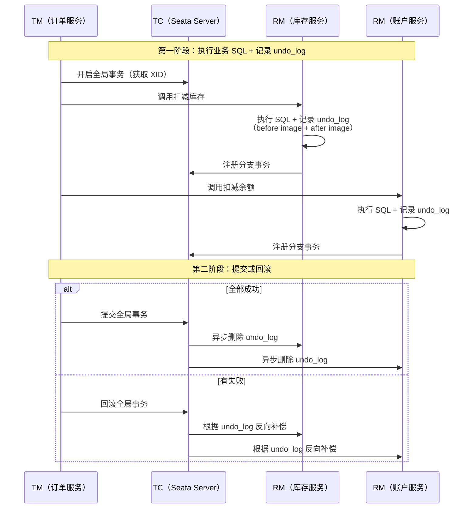

# 分布式事务

## 概念说明

在单体应用中，一个业务操作涉及的数据库操作可以通过本地事务（`@Transactional`）保证 ACID。但在微服务架构中，一个业务操作可能跨越多个服务和多个数据库，本地事务无法保证跨服务的数据一致性，这就需要**分布式事务**。

例如：下单操作需要同时扣减库存（库存服务）、创建订单（订单服务）、扣减余额（账户服务），这三个操作必须要么全部成功，要么全部回滚。

## 核心原理

### 一、两阶段提交（2PC）原理

两阶段提交是分布式事务的基础理论模型：



**2PC 的问题**：
- 同步阻塞：所有参与者在准备阶段锁定资源，等待协调者指令
- 单点故障：协调者宕机导致参与者一直阻塞
- 数据不一致：部分参与者提交成功、部分失败

### 二、Seata 架构

Seata 是阿里巴巴开源的分布式事务解决方案，支持 AT、TCC、Saga 三种模式。



### 三、Seata AT 模式（自动补偿）

AT 模式是 Seata 最常用的模式，对业务代码**零侵入**：



### 四、AT vs TCC vs Saga 对比

| 特性 | AT 模式 | TCC 模式 | Saga 模式 |
|------|---------|----------|-----------|
| 侵入性 | 零侵入 | 高（需实现 Try/Confirm/Cancel） | 中（需实现补偿方法） |
| 一致性 | 最终一致 | 最终一致 | 最终一致 |
| 隔离性 | 全局锁 | 业务自行保证 | 无隔离 |
| 性能 | 中等 | 高 | 高 |
| 适用场景 | 大多数场景 | 高性能/金融场景 | 长事务/跨公司 |
| 回滚方式 | undo_log 自动回滚 | Cancel 方法 | 补偿方法 |

### 五、与本地事务的区别

| 对比项 | 本地事务 | 分布式事务 |
|--------|---------|-----------|
| 范围 | 单个数据库 | 跨服务/跨数据库 |
| 实现 | 数据库原生支持 | 需要额外框架（Seata） |
| ACID | 完全满足 | 通常只保证最终一致性 |
| 性能 | 高 | 较低（额外协调开销） |
| 复杂度 | 低 | 高 |

## 代码示例

```java
/**
 * Seata AT 模式使用示例
 * 
 * @GlobalTransactional 注解标记全局事务入口
 * Seata 会自动拦截 SQL，记录 undo_log，实现自动补偿
 */
@Service
public class OrderService {

    private final OrderRepository orderRepository;
    private final InventoryClient inventoryClient;
    private final AccountClient accountClient;

    @GlobalTransactional(name = "create-order", rollbackFor = Exception.class)
    public Order createOrder(OrderRequest request) {
        // 1. 扣减库存（远程调用库存服务）
        inventoryClient.deduct(request.getProductId(), request.getQuantity());
        
        // 2. 扣减余额（远程调用账户服务）
        accountClient.debit(request.getUserId(), request.getTotalAmount());
        
        // 3. 创建订单（本地数据库操作）
        Order order = new Order(request);
        orderRepository.save(order);
        
        return order;
        // 如果任何一步失败，Seata 自动回滚所有分支事务
    }
}
```

> 💻 完整可运行代码：[TransactionDemo.java](../../../code-examples/02-framework/springcloud-examples/src/main/java/com/example/springcloud/transaction/TransactionDemo.java)

## 常见面试题

### Q1: 分布式事务有哪些解决方案？各自的优缺点？

**难度**：⭐⭐⭐ | **频率**：🔥🔥🔥

**答题思路**：

1. 列举主要方案（2PC、TCC、Saga、消息最终一致性）
2. 说明各方案的原理和适用场景
3. 重点说明 Seata AT 模式

**标准答案**：

分布式事务主要有四种方案：（1）2PC/XA：两阶段提交，强一致性但性能差、有阻塞问题；（2）TCC：Try-Confirm-Cancel，性能好但业务侵入性高，需要实现三个方法；（3）Saga：长事务方案，通过补偿机制实现最终一致性，适合跨公司场景；（4）消息最终一致性：通过可靠消息实现最终一致性，适合对实时性要求不高的场景。Seata 框架支持 AT（自动补偿，零侵入）、TCC、Saga 三种模式，其中 AT 模式最常用。

**深入追问**：

- Seata AT 模式的 undo_log 是什么？如何实现回滚？
- TCC 模式的空回滚和悬挂问题如何解决？
- 消息最终一致性如何保证消息一定被消费？

**易错点**：

- 分布式事务不等于强一致性，大多数方案只保证最终一致性
- AT 模式有全局锁，高并发场景下性能可能不如 TCC

### Q2: Seata AT 模式的原理是什么？

**难度**：⭐⭐⭐ | **频率**：🔥🔥🔥

**答题思路**：

1. 说明 TC/TM/RM 三个角色
2. 描述两阶段的执行过程
3. 说明 undo_log 的作用

**标准答案**：

Seata AT 模式基于两阶段提交，由三个角色协作：TC（事务协调器，Seata Server）、TM（事务管理器，发起方）、RM（资源管理器，参与方）。第一阶段：TM 开启全局事务获取 XID，各 RM 执行业务 SQL 的同时自动记录 undo_log（包含修改前后的数据快照），并向 TC 注册分支事务。第二阶段：如果全部成功，TC 通知各 RM 异步删除 undo_log；如果有失败，TC 通知各 RM 根据 undo_log 进行反向补偿（回滚）。AT 模式对业务代码零侵入，只需加 `@GlobalTransactional` 注解。

**深入追问**：

- AT 模式的全局锁是什么？为什么需要？
- undo_log 的 before image 和 after image 分别是什么？

### Q3: 什么场景下应该使用分布式事务？什么场景下不需要？

**难度**：⭐⭐⭐ | **频率**：🔥🔥

**答题思路**：

1. 需要分布式事务的场景
2. 可以避免的场景
3. 替代方案

**标准答案**：

需要分布式事务的场景：跨服务的数据一致性要求强的业务（如下单扣库存扣余额、转账）。可以避免的场景：（1）能通过合理的服务拆分将相关操作放在同一个服务中；（2）对一致性要求不高的场景可以使用消息最终一致性；（3）可以通过对账、补偿等业务手段保证一致性。原则是：能不用分布式事务就不用，因为它会增加系统复杂度和降低性能。

**深入追问**：

- 如何通过服务设计避免分布式事务？
- 最终一致性和强一致性的区别？

## 参考资料

- [Seata 官方文档](https://seata.apache.org/docs/overview/what-is-seata)
- [Seata AT 模式原理](https://seata.apache.org/docs/dev/mode/at-mode)
