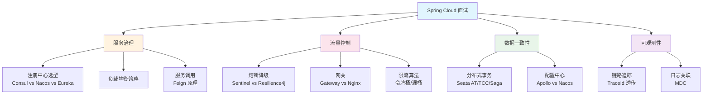

# Spring Cloud 面试指南

## 面试知识图谱



## 高频面试题汇总

### 一、微服务架构基础

#### Q1: 什么是微服务？微服务和单体架构的区别？

**难度**：⭐⭐ | **频率**：🔥🔥🔥

**标准答案**：

微服务是一种将应用拆分为一组小型、独立部署的服务的架构风格。每个服务围绕特定业务能力构建，拥有独立的数据库和部署流程。与单体架构的区别：（1）部署：单体整体部署，微服务独立部署；（2）技术栈：单体统一技术栈，微服务可以异构；（3）扩展：单体整体扩展，微服务按需扩展；（4）故障隔离：单体一个模块故障影响全局，微服务故障隔离。

**追问链路**：
- 微服务的缺点是什么？→ 分布式复杂性（事务、一致性、网络）
- 什么时候不适合用微服务？→ 团队小、业务简单、初创阶段
- 微服务拆分的原则？→ 单一职责、高内聚低耦合、按业务域拆分

#### Q2: Spring Cloud 有哪些核心组件？各自的作用？

**难度**：⭐⭐ | **频率**：🔥🔥🔥

**标准答案**：

Spring Cloud 核心组件包括：（1）注册中心（Consul/Nacos）：服务注册与发现；（2）负载均衡（Spring Cloud LoadBalancer）：客户端负载均衡；（3）服务调用（OpenFeign）：声明式 HTTP 客户端；（4）熔断降级（Resilience4j/Sentinel）：防止级联故障；（5）网关（Spring Cloud Gateway）：统一入口、路由、鉴权；（6）配置中心（Apollo/Nacos Config）：集中配置管理；（7）链路追踪（Micrometer Tracing）：分布式调用链路追踪。

**追问链路**：
- 这些组件之间是如何协作的？→ 画出微服务架构图
- Netflix 组件为什么被替换了？→ Netflix OSS 停更

### 二、服务注册与发现

#### Q3: CAP 理论是什么？注册中心如何选型？

**难度**：⭐⭐⭐ | **频率**：🔥🔥🔥

**标准答案**：

CAP 理论指分布式系统不能同时满足一致性（C）、可用性（A）、分区容错性（P）三者，最多只能满足其中两个。由于网络分区不可避免，实际上是在 CP 和 AP 之间选择。Consul 是 CP 模型（Raft 协议保证强一致性），Eureka 是 AP 模型（自我保护机制保证高可用），Nacos 支持 AP/CP 切换。选型建议：对一致性要求高选 Consul，对可用性要求高选 Eureka/Nacos(AP)。

**追问链路**：
- Raft 协议是如何保证一致性的？→ Leader 选举 + 日志复制
- Eureka 的自我保护机制是什么？→ 心跳失败比例超阈值时不剔除实例

### 三、服务调用与负载均衡

#### Q4: Feign 的工作原理？和 RestTemplate 的区别？

**难度**：⭐⭐⭐ | **频率**：🔥🔥🔥

**标准答案**：

Feign 是声明式 HTTP 客户端，通过 JDK 动态代理实现。启动时扫描 `@FeignClient` 接口创建代理对象，调用时解析注解生成 HTTP 请求，通过负载均衡器选择实例后发起调用。与 RestTemplate 的区别：Feign 是声明式（定义接口即可），RestTemplate 是编程式（手动拼接 URL）；Feign 自动集成负载均衡和服务发现，RestTemplate 需要 `@LoadBalanced` 注解。

**追问链路**：
- Feign 的超时时间如何配置？→ connect-timeout 和 read-timeout
- Feign 如何实现降级？→ fallback 或 fallbackFactory
- Feign 的性能优化？→ 连接池、日志级别、GZIP 压缩

### 四、熔断降级与限流

#### Q5: 什么是服务雪崩？如何防止？

**难度**：⭐⭐⭐ | **频率**：🔥🔥🔥

**标准答案**：

服务雪崩是一个服务的故障沿调用链路级联传播，导致整个系统不可用。防止手段：（1）熔断：故障率超阈值时自动断开调用；（2）降级：返回兜底结果；（3）限流：控制请求速率；（4）超时控制：避免长时间等待；（5）隔离：线程池隔离或信号量隔离。

**追问链路**：
- 熔断器的三种状态？→ Closed → Open → Half-Open
- Sentinel 和 Resilience4j 的区别？→ 功能丰富度、Dashboard、热点限流
- 限流算法有哪些？→ 令牌桶、漏桶、滑动窗口

#### Q6: 限流算法有哪些？各自的特点？

**难度**：⭐⭐⭐ | **频率**：🔥🔥🔥

**标准答案**：

三种主要限流算法：（1）令牌桶：以固定速率生成令牌，请求需要获取令牌才能通过，允许突发流量（桶中有积累的令牌）；（2）漏桶：请求进入桶中，以固定速率流出，平滑流量但不允许突发；（3）滑动窗口：将时间窗口划分为多个小窗口，统计窗口内的请求数，比固定窗口更精确。Gateway 的 RequestRateLimiter 使用令牌桶算法。

### 五、网关

#### Q7: Gateway 和 Nginx 的区别？

**难度**：⭐⭐⭐ | **频率**：🔥🔥🔥

**标准答案**：

Nginx 是流量网关（C 语言，高性能），擅长 SSL 卸载、静态资源、基础限流；Gateway 是业务网关（Java，Spring WebFlux），擅长动态路由、业务鉴权、与 Spring 生态集成。生产环境通常两层配合：Nginx 在外层处理流量，Gateway 在内层处理业务逻辑。

**追问链路**：
- Gateway 为什么不能和 Spring MVC 同时使用？→ 基于 WebFlux（Netty）
- 如何在 Gateway 中实现统一鉴权？→ GlobalFilter
- Gateway 的过滤器执行顺序？→ Ordered 接口

### 六、分布式事务

#### Q8: 分布式事务有哪些方案？Seata AT 模式的原理？

**难度**：⭐⭐⭐ | **频率**：🔥🔥🔥

**标准答案**：

分布式事务方案：2PC/XA（强一致，性能差）、TCC（高性能，侵入性高）、Saga（长事务，补偿机制）、消息最终一致性（异步，最终一致）。Seata AT 模式：第一阶段执行业务 SQL 并记录 undo_log（数据快照），第二阶段根据全局事务结果决定提交（删除 undo_log）或回滚（根据 undo_log 反向补偿）。AT 模式对业务零侵入，只需 `@GlobalTransactional` 注解。

**追问链路**：
- AT 模式的全局锁是什么？→ 防止脏写
- TCC 的空回滚和悬挂问题？→ Try 未执行就 Cancel / Cancel 先于 Try 执行
- 什么场景下不需要分布式事务？→ 消息最终一致性、合理服务拆分

### 七、配置中心与链路追踪

#### Q9: @RefreshScope 的原理？

**难度**：⭐⭐⭐ | **频率**：🔥🔥

**标准答案**：

`@RefreshScope` 标注的 Bean 在配置变更时会被销毁并重新创建。原理：这些 Bean 被放入 RefreshScope 管理，当配置中心推送变更触发 RefreshEvent 时，RefreshScope 销毁所有管理的 Bean，下次访问时重新创建并从更新后的 Environment 获取最新配置值。

#### Q10: TraceId 是如何在服务间传递的？

**难度**：⭐⭐⭐ | **频率**：🔥🔥

**标准答案**：

TraceId 通过 HTTP Header 传递。第一个服务生成 TraceId 放入请求头（W3C 标准使用 `traceparent` 头），下游服务从请求头解析 TraceId 继续传递。Feign 和 RestTemplate 已自动集成链路追踪，无需手动传递。通过 MDC 机制，TraceId 还会自动注入到日志中。

**追问链路**：
- 异步调用中 TraceId 如何传递？→ TaskDecorator / TransmittableThreadLocal
- 采样率是什么？→ 控制追踪数据量，生产环境通常 10%-50%

## 面试准备建议

### 按公司类型准备

| 公司类型 | 重点准备 |
|----------|----------|
| 大厂 | 注册中心选型（CAP）、熔断降级原理、分布式事务、限流算法 |
| 中厂 | Feign 原理、Gateway 使用、配置中心、链路追踪 |
| 创业公司 | Spring Cloud 组件使用、微服务拆分原则、实际问题排查 |

### 高频追问链路

```
注册中心 → CAP 理论 → Raft 协议 → 分布式一致性
Feign → 动态代理 → 负载均衡 → 超时重试
熔断器 → 状态机 → 限流算法 → 令牌桶实现
Gateway → 过滤器链 → 鉴权方案 → JWT
分布式事务 → 2PC → Seata AT → undo_log → 全局锁
```

## 参考资料

- [Spring Cloud 官方文档](https://spring.io/projects/spring-cloud)
- [微服务架构设计模式](https://microservices.io/patterns/)
