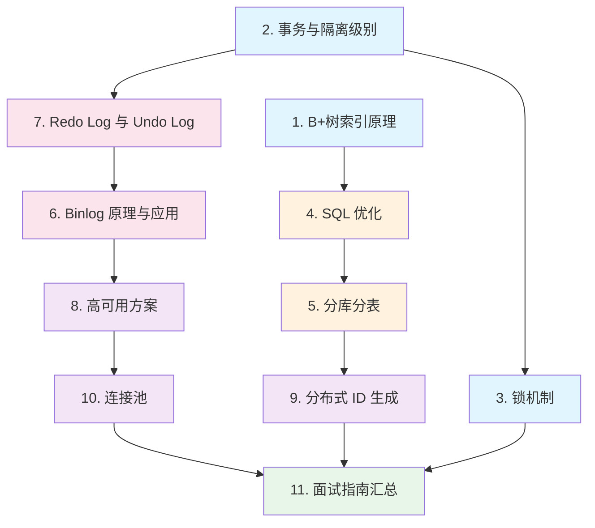

# 数据库/MySQL

## 概念说明

MySQL 是 Java 后端开发中使用最广泛的关系型数据库，也是**面试中考察最密集的模块之一**。从索引原理到事务隔离级别，从锁机制到 SQL 优化，几乎每一轮技术面试都会涉及 MySQL 相关问题。

本模块从 MySQL 的核心原理出发，深入讲解索引（B+树）、事务（MVCC）、锁机制、SQL 优化、日志系统（Binlog/Redo Log/Undo Log）、分库分表、高可用方案等核心知识点，帮助你系统掌握 MySQL 面试和工作中的关键技术。

> ⚠️ 需要 MySQL 环境的示例，请先启动 Docker：`docker compose -f docker/docker-compose.yml up -d mysql`

## 知识点列表

| 序号 | 知识点 | 难度 | 面试频率 | 文档链接 |
|------|--------|------|----------|----------|
| 1 | B+树索引原理 | ⭐⭐⭐ | 🔥🔥🔥 | [index-theory](./01-index-theory.md) |
| 2 | 事务与隔离级别 | ⭐⭐⭐ | 🔥🔥🔥 | [transaction](./02-transaction.md) |
| 3 | 锁机制 | ⭐⭐⭐ | 🔥🔥🔥 | [lock](./03-lock.md) |
| 4 | SQL 优化 | ⭐⭐⭐ | 🔥🔥🔥 | [optimization](./04-optimization.md) |
| 5 | 分库分表 | ⭐⭐⭐ | 🔥🔥 | [sharding](./05-sharding.md) |
| 6 | Binlog 原理与应用 | ⭐⭐⭐ | 🔥🔥🔥 | [binlog](./06-binlog.md) |
| 7 | Redo Log 与 Undo Log | ⭐⭐⭐ | 🔥🔥🔥 | [log-system](./07-log-system.md) |
| 8 | 高可用方案 | ⭐⭐⭐ | 🔥🔥 | [high-availability](./08-high-availability.md) |
| 9 | 分布式 ID 生成 | ⭐⭐ | 🔥🔥🔥 | [distributed-id](./09-distributed-id.md) |
| 10 | 连接池 | ⭐⭐ | 🔥🔥 | [pool](./10-pool.md) |
| 11 | 数据库面试指南 | ⭐⭐⭐ | 🔥🔥🔥 | [interview](./99-interview.md) |

## 推荐学习顺序

**学习路线说明**：
- 🔵 **核心原理层**（1-3）：索引、事务、锁是 MySQL 的三大基石，面试必考
- 🟠 **优化实战层**（4-5）：SQL 优化和分库分表是高频实战问题
- 🔴 **日志系统层**（6-7）：Binlog/Redo Log/Undo Log 是 MySQL 可靠性的保障
- 🟣 **架构进阶层**（8-10）：高可用、分布式 ID、连接池
- 🟢 **面试汇总**（11）：高频面试题和追问链路

## 相关模块链接

- [Spring Boot - 数据访问](/2-framework/2.2-springboot/08-data-access) — MyBatis/JPA 与 MySQL 的集成
- [Redis](/3-data-store/3.2-redis/) — 缓存与数据库的配合使用
- [分布式系统](/5-distributed/5.1-distributed/) — 分布式事务、分布式锁
- [架构设计](/8-architecture/) — 缓存与 DB 双写一致性等场景

## 参考资料

- [MySQL 官方文档](https://dev.mysql.com/doc/refman/8.0/en/)
- [《高性能 MySQL》](https://book.douban.com/subject/23008813/)
- [《MySQL 技术内幕：InnoDB 存储引擎》](https://book.douban.com/subject/24708143/)
