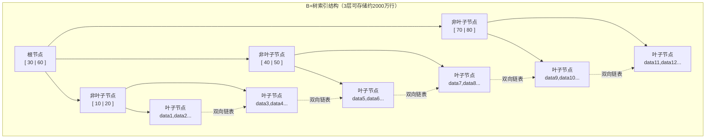
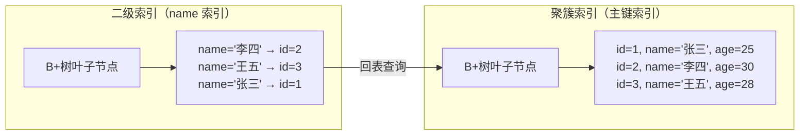
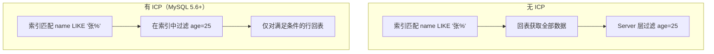

# B+树索引原理

## 概念说明

索引是 MySQL 中**最重要的性能优化手段**，理解索引原理是 SQL 优化的基础。MySQL InnoDB 存储引擎默认使用 B+树作为索引的数据结构，它决定了数据在磁盘上的组织方式和查询效率。

> 面试核心：为什么 MySQL 选择 B+树而不是 B 树、红黑树或 Hash 索引？

## 核心原理

### 一、B+树 vs B 树 vs Hash 索引

| 特性 | B+树 | B 树 | Hash 索引 |
|------|------|------|-----------|
| 数据存储位置 | 仅叶子节点存数据 | 所有节点存数据 | Hash 桶 |
| 叶子节点链表 | ✅ 双向链表连接 | ❌ 无链表 | ❌ 无 |
| 范围查询 | ✅ 高效（链表遍历） | ❌ 需要中序遍历 | ❌ 不支持 |
| 等值查询 | O(log n) | O(log n) | O(1) |
| 排序 | ✅ 天然有序 | ✅ 有序 | ❌ 无序 |
| 磁盘 IO | 更少（非叶子节点更小） | 较多 | 最少（等值） |
| 适用场景 | 通用（InnoDB 默认） | 文件系统 | 等值查询（Memory 引擎） |

**MySQL 选择 B+树的核心原因**：

1. **非叶子节点不存数据**：每个节点能容纳更多 key，树更矮，磁盘 IO 更少
2. **叶子节点双向链表**：范围查询只需遍历链表，无需回溯父节点
3. **查询性能稳定**：所有查询都要走到叶子节点，时间复杂度稳定为 O(log n)

### 二、B+树结构详解



**关键数据**：
- InnoDB 页大小默认 16KB
- 假设主键为 bigint（8 字节），指针 6 字节，则每个非叶子节点可存约 `16KB / 14B ≈ 1170` 个 key
- 3 层 B+树：`1170 × 1170 × 16 ≈ 2190 万行`，仅需 3 次磁盘 IO

### 三、聚簇索引 vs 非聚簇索引

| 特性 | 聚簇索引（主键索引） | 非聚簇索引（二级索引） |
|------|---------------------|----------------------|
| 叶子节点存储 | **完整行数据** | **主键值** |
| 每张表数量 | 只能有 1 个 | 可以有多个 |
| 查询方式 | 直接获取数据 | 需要**回表**查询 |
| 物理排序 | 数据按主键物理排序 | 索引独立存储 |



**回表过程**：
1. 通过二级索引找到主键值
2. 再通过主键索引（聚簇索引）找到完整行数据
3. 这就是"回表"，会增加一次 B+树查找

### 四、覆盖索引

**覆盖索引**是指查询的字段全部包含在索引中，无需回表。

```sql
-- 假设有联合索引 idx_name_age(name, age)

-- ✅ 覆盖索引：查询字段都在索引中，无需回表
SELECT name, age FROM user WHERE name = '张三';

-- ❌ 需要回表：email 不在索引中
SELECT name, age, email FROM user WHERE name = '张三';
```

> EXPLAIN 中 Extra 列显示 `Using index` 表示使用了覆盖索引。

### 五、最左前缀原则

联合索引 `(a, b, c)` 的匹配规则：

| 查询条件 | 是否走索引 | 说明 |
|----------|-----------|------|
| `WHERE a = 1` | ✅ | 匹配最左前缀 |
| `WHERE a = 1 AND b = 2` | ✅ | 匹配前两列 |
| `WHERE a = 1 AND b = 2 AND c = 3` | ✅ | 完全匹配 |
| `WHERE b = 2` | ❌ | 缺少最左列 a |
| `WHERE b = 2 AND c = 3` | ❌ | 缺少最左列 a |
| `WHERE a = 1 AND c = 3` | ⚠️ | 只用到 a，c 无法使用索引 |
| `WHERE a > 1 AND b = 2` | ⚠️ | a 用范围查询后，b 无法使用索引 |

**原理**：联合索引在 B+树中按 (a, b, c) 的顺序排列，只有先确定 a 的值，b 才是有序的。

### 六、索引下推（ICP, Index Condition Pushdown）

MySQL 5.6 引入的优化，将 WHERE 条件的判断从 Server 层下推到存储引擎层。

```sql
-- 联合索引 idx_name_age(name, age)
SELECT * FROM user WHERE name LIKE '张%' AND age = 25;
```

**无 ICP**：存储引擎根据 `name LIKE '张%'` 找到所有匹配行，全部回表后由 Server 层过滤 age。

**有 ICP**：存储引擎在索引中直接判断 age = 25，只对满足条件的行回表，减少回表次数。



## 代码示例

```sql
-- 创建测试表
CREATE TABLE `user` (
    `id` BIGINT PRIMARY KEY AUTO_INCREMENT,
    `name` VARCHAR(50) NOT NULL,
    `age` INT NOT NULL,
    `email` VARCHAR(100),
    `create_time` DATETIME DEFAULT CURRENT_TIMESTAMP,
    INDEX `idx_name_age` (`name`, `age`),
    INDEX `idx_email` (`email`)
) ENGINE=InnoDB DEFAULT CHARSET=utf8mb4;

-- 查看索引信息
SHOW INDEX FROM user;

-- EXPLAIN 分析：覆盖索引
EXPLAIN SELECT name, age FROM user WHERE name = '张三';

-- EXPLAIN 分析：回表查询
EXPLAIN SELECT * FROM user WHERE name = '张三';

-- EXPLAIN 分析：最左前缀失效
EXPLAIN SELECT * FROM user WHERE age = 25;
```

> 💻 完整可运行代码：[IndexDemo.java](../../../code-examples/03-data-store/database-examples/src/main/java/com/example/database/index_demo/IndexDemo.java)
>
> ⚠️ 需要 MySQL 环境：`docker compose -f docker/docker-compose.yml up -d mysql`

## 常见面试题

### Q1: 为什么 MySQL 选择 B+树作为索引结构，而不是 B 树、红黑树或 Hash？

**难度**：⭐⭐⭐ | **频率**：🔥🔥🔥

**答题思路**：

1. 对比 B+树与 B 树的区别
2. 分析磁盘 IO 的影响
3. 说明范围查询的优势

**标准答案**：

MySQL 选择 B+树主要有三个原因：

1. **B+树非叶子节点不存数据**，每个节点能容纳更多 key，树更矮（3 层可存 2000 万行），磁盘 IO 更少
2. **叶子节点通过双向链表连接**，范围查询只需遍历链表，效率远高于 B 树的中序遍历
3. **查询性能稳定**，所有查询都走到叶子节点，不像 B 树可能在中间节点就找到数据

不选红黑树：树太高，数据量大时磁盘 IO 次数多。不选 Hash：不支持范围查询和排序。

**深入追问**：

- B+树一个节点有多大？能存多少 key？
- 为什么 InnoDB 页大小是 16KB？
- 自增主键和 UUID 作为主键有什么区别？

**易错点**：

- 不要说"B+树查询更快"，等值查询 B 树可能更快（数据在中间节点）
- B+树的优势在于**范围查询**和**磁盘 IO 优化**

### Q2: 什么是聚簇索引和非聚簇索引？什么是回表？

**难度**：⭐⭐⭐ | **频率**：🔥🔥🔥

**答题思路**：

1. 解释聚簇索引的存储方式
2. 解释二级索引的存储方式
3. 说明回表的过程和代价

**标准答案**：

**聚簇索引**：InnoDB 中主键索引就是聚簇索引，叶子节点存储完整的行数据。数据按主键物理排序，每张表只能有一个聚簇索引。

**非聚簇索引**（二级索引）：叶子节点存储的是主键值，而不是完整行数据。

**回表**：通过二级索引查询时，先在二级索引中找到主键值，再通过主键索引查找完整行数据，这个过程叫回表。回表会增加一次 B+树查找，影响性能。

**避免回表的方法**：使用覆盖索引，让查询字段全部包含在索引中。

**深入追问**：

- 如果没有定义主键，InnoDB 会怎么处理？
- 覆盖索引的 EXPLAIN 中怎么看出来？
- 为什么建议使用自增主键？

**易错点**：

- InnoDB 没有主键时会选择唯一非空索引，都没有则生成隐藏的 rowid
- 覆盖索引不是一种索引类型，而是一种查询优化方式

### Q3: 什么是最左前缀原则？联合索引 (a,b,c) 在什么情况下会失效？

**难度**：⭐⭐⭐ | **频率**：🔥🔥🔥

**答题思路**：

1. 解释联合索引的排序规则
2. 列举能走索引和不能走索引的情况
3. 说明范围查询对后续列的影响

**标准答案**：

最左前缀原则是指联合索引 (a, b, c) 在 B+树中按 a → b → c 的顺序排列。查询时必须从最左列开始匹配，跳过中间列会导致后续列无法使用索引。

能走索引：`WHERE a=1`、`WHERE a=1 AND b=2`、`WHERE a=1 AND b=2 AND c=3`。

不能走索引：`WHERE b=2`、`WHERE c=3`、`WHERE b=2 AND c=3`。

部分走索引：`WHERE a=1 AND c=3` 只用到 a；`WHERE a>1 AND b=2` 中 a 用范围查询后 b 无法使用索引。

**深入追问**：

- `WHERE a=1 ORDER BY b` 能用到索引吗？
- 索引下推（ICP）是什么？
- 如何设计联合索引的列顺序？

**易错点**：

- MySQL 8.0 的索引跳跃扫描（Index Skip Scan）可能打破最左前缀原则
- `WHERE a=1 AND c=3` 在 MySQL 8.0 中可能通过索引跳跃扫描使用索引

## 参考资料

- [MySQL 官方文档 - InnoDB 索引](https://dev.mysql.com/doc/refman/8.0/en/innodb-index-types.html)
- [《高性能 MySQL》第 5 章 - 创建高性能的索引](https://book.douban.com/subject/23008813/)
