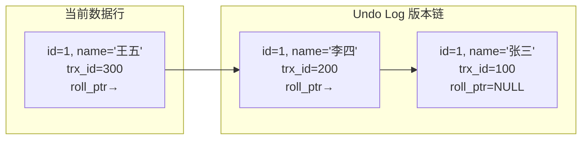
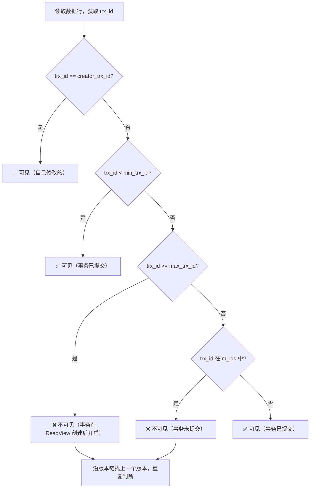

# 事务与隔离级别

## 概念说明

事务是数据库操作的**最小工作单元**，要么全部执行成功，要么全部回滚。MySQL InnoDB 引擎通过 MVCC（多版本并发控制）机制实现事务隔离，这是面试中**必考的核心知识点**。

> 面试核心：MVCC 的 ReadView 四个字段是什么？可重复读是如何解决幻读的？

## 核心原理

### 一、ACID 特性

| 特性 | 含义 | 实现方式 |
|------|------|----------|
| **A**tomicity（原子性） | 事务中的操作要么全部成功，要么全部回滚 | **Undo Log** |
| **C**onsistency（一致性） | 事务前后数据库状态保持一致 | 由 A、I、D 共同保证 |
| **I**solation（隔离性） | 并发事务之间互不干扰 | **MVCC + 锁** |
| **D**urability（持久性） | 事务提交后数据永久保存 | **Redo Log** |

### 二、四种隔离级别

| 隔离级别 | 脏读 | 不可重复读 | 幻读 | 性能 | 说明 |
|----------|------|-----------|------|------|------|
| READ UNCOMMITTED | ✅ 可能 | ✅ 可能 | ✅ 可能 | 最高 | 几乎不用 |
| READ COMMITTED (RC) | ❌ 不会 | ✅ 可能 | ✅ 可能 | 高 | Oracle 默认 |
| **REPEATABLE READ (RR)** | ❌ 不会 | ❌ 不会 | ⚠️ 部分解决 | 中 | **MySQL 默认** |
| SERIALIZABLE | ❌ 不会 | ❌ 不会 | ❌ 不会 | 最低 | 完全串行化 |

**三种并发问题**：
- **脏读**：读到其他事务未提交的数据
- **不可重复读**：同一事务内两次读取同一行，结果不同（被其他事务修改）
- **幻读**：同一事务内两次范围查询，结果集行数不同（被其他事务插入/删除）

### 三、MVCC 实现原理

MVCC（Multi-Version Concurrency Control）通过**版本链 + ReadView**实现非锁定读，是 RC 和 RR 隔离级别的核心机制。

#### 3.1 隐藏字段

InnoDB 为每行数据添加三个隐藏字段：

| 字段 | 大小 | 说明 |
|------|------|------|
| `DB_TRX_ID` | 6 字节 | 最近修改该行的事务 ID |
| `DB_ROLL_PTR` | 7 字节 | 回滚指针，指向 Undo Log 中的上一个版本 |
| `DB_ROW_ID` | 6 字节 | 隐藏主键（无主键时自动生成） |

#### 3.2 Undo Log 版本链

每次修改数据时，旧版本会写入 Undo Log，通过 `DB_ROLL_PTR` 形成版本链：



#### 3.3 ReadView 四个核心字段

ReadView 是事务在执行快照读时创建的"视图"，包含四个关键字段：

| 字段 | 含义 |
|------|------|
| `m_ids` | 创建 ReadView 时，当前系统中**活跃的（未提交的）事务 ID 列表** |
| `min_trx_id` | `m_ids` 中的**最小值** |
| `max_trx_id` | 创建 ReadView 时，系统应该分配给**下一个事务的 ID**（即当前最大事务 ID + 1） |
| `creator_trx_id` | 创建该 ReadView 的**事务自身的 ID** |

#### 3.4 可见性判断规则



#### 3.5 RC 与 RR 的区别

| 隔离级别 | ReadView 创建时机 | 效果 |
|----------|------------------|------|
| READ COMMITTED | **每次 SELECT 都创建新的 ReadView** | 能看到其他事务已提交的最新数据 |
| REPEATABLE READ | **事务中第一次 SELECT 创建，后续复用** | 整个事务看到的数据一致 |

### 四、幻读问题

RR 隔离级别下，MVCC 的快照读可以避免幻读，但**当前读**（`SELECT ... FOR UPDATE`）仍可能出现幻读。InnoDB 通过**间隙锁（Gap Lock）**来解决当前读的幻读问题。

```sql
-- 事务 A
BEGIN;
SELECT * FROM user WHERE age > 20 FOR UPDATE;  -- 当前读，加间隙锁
-- 此时事务 B 无法在 age > 20 的范围内插入新行

-- 事务 B
BEGIN;
INSERT INTO user (name, age) VALUES ('新用户', 25);  -- 被阻塞！
```

## 代码示例

```sql
-- 查看当前隔离级别
SELECT @@transaction_isolation;

-- 设置隔离级别
SET SESSION TRANSACTION ISOLATION LEVEL REPEATABLE READ;

-- 演示 MVCC 快照读
-- 事务 A
BEGIN;
SELECT * FROM user WHERE id = 1;  -- 创建 ReadView

-- 事务 B（另一个连接）
BEGIN;
UPDATE user SET name = '新名字' WHERE id = 1;
COMMIT;

-- 事务 A 再次读取（RR 下结果不变）
SELECT * FROM user WHERE id = 1;  -- 仍然看到旧数据
COMMIT;
```

> 💻 完整可运行代码：[TransactionDemo.java](https://github.com/skyhe58/guide-java/tree/main/code-examples/03-data-store/database-examples/src/main/java/com/example/database/transaction/TransactionDemo.java)
> <!-- 本地路径：code-examples/03-data-store/database-examples/src/main/java/com/example/database/transaction/TransactionDemo.java -->
>
> ⚠️ 需要 MySQL 环境：`docker compose -f docker/docker-compose.yml up -d mysql`

## 常见面试题

### Q1: 请详细说明 MVCC 的实现原理

**难度**：⭐⭐⭐ | **频率**：🔥🔥🔥

**答题思路**：

1. 先说隐藏字段（trx_id, roll_ptr）
2. 再说 Undo Log 版本链
3. 重点说 ReadView 的四个字段和可见性判断规则
4. 最后说 RC 和 RR 创建 ReadView 的时机不同

**标准答案**：

MVCC 通过**版本链 + ReadView**实现。每行数据有隐藏字段 `DB_TRX_ID`（最近修改的事务 ID）和 `DB_ROLL_PTR`（指向 Undo Log 旧版本）。修改数据时旧版本写入 Undo Log，形成版本链。

事务执行快照读时创建 ReadView，包含四个字段：`m_ids`（活跃事务列表）、`min_trx_id`（最小活跃事务 ID）、`max_trx_id`（下一个事务 ID）、`creator_trx_id`（自身事务 ID）。

可见性判断：如果行的 trx_id 等于 creator_trx_id，可见；小于 min_trx_id，可见；大于等于 max_trx_id，不可见；在 min 和 max 之间，看是否在 m_ids 中，在则不可见，不在则可见。不可见时沿版本链找上一个版本继续判断。

RC 每次 SELECT 创建新 ReadView，RR 只在第一次 SELECT 创建并复用。

**深入追问**：

- Undo Log 什么时候会被清理？
- MVCC 能完全解决幻读吗？
- 快照读和当前读的区别是什么？

**易错点**：

- MVCC 只在 RC 和 RR 隔离级别下工作
- RR 下快照读不会幻读，但当前读可能幻读（需要间隙锁配合）

### Q2: MySQL 默认隔离级别是什么？为什么不用 RC？

**难度**：⭐⭐⭐ | **频率**：🔥🔥🔥

**答题思路**：

1. 说明 MySQL 默认 RR
2. 对比 RR 和 RC 的区别
3. 解释历史原因（Binlog 格式）

**标准答案**：

MySQL 默认隔离级别是 REPEATABLE READ（可重复读）。历史原因是 MySQL 早期 Binlog 使用 Statement 格式，RC 隔离级别下主从复制可能导致数据不一致。RR 配合间隙锁可以避免这个问题。

现在 Binlog 推荐使用 Row 格式，RC 隔离级别也可以安全使用。很多互联网公司（如阿里）在生产环境使用 RC，因为 RC 的锁粒度更小，并发性能更好。

**深入追问**：

- RC 和 RR 在加锁上有什么区别？
- 为什么阿里推荐使用 RC？
- Binlog 的 Statement 和 Row 格式有什么区别？

### Q3: 可重复读隔离级别下，是如何解决幻读的？

**难度**：⭐⭐⭐ | **频率**：🔥🔥🔥

**答题思路**：

1. 区分快照读和当前读
2. 快照读通过 MVCC 解决
3. 当前读通过间隙锁解决
4. 说明仍有特殊场景可能出现幻读

**标准答案**：

RR 隔离级别通过两种方式解决幻读：

1. **快照读**（普通 SELECT）：通过 MVCC 的 ReadView 机制，事务内多次读取结果一致
2. **当前读**（SELECT ... FOR UPDATE / INSERT / UPDATE / DELETE）：通过**间隙锁（Gap Lock）**锁住范围，阻止其他事务在该范围内插入新行

但有一种特殊场景仍可能出现幻读：事务 A 先快照读，事务 B 插入并提交，事务 A 再执行当前读（如 UPDATE），此时能看到事务 B 插入的行。

**深入追问**：

- 间隙锁的加锁规则是什么？
- 间隙锁会导致什么问题？
- 如何复现 RR 下的幻读？

## 参考资料

- [MySQL 官方文档 - InnoDB 事务模型](https://dev.mysql.com/doc/refman/8.0/en/innodb-transaction-model.html)
- [MySQL 官方文档 - MVCC](https://dev.mysql.com/doc/refman/8.0/en/innodb-multi-versioning.html)
