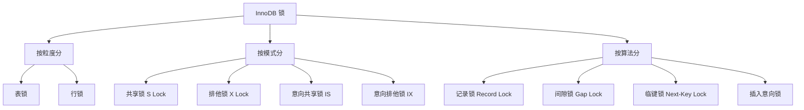
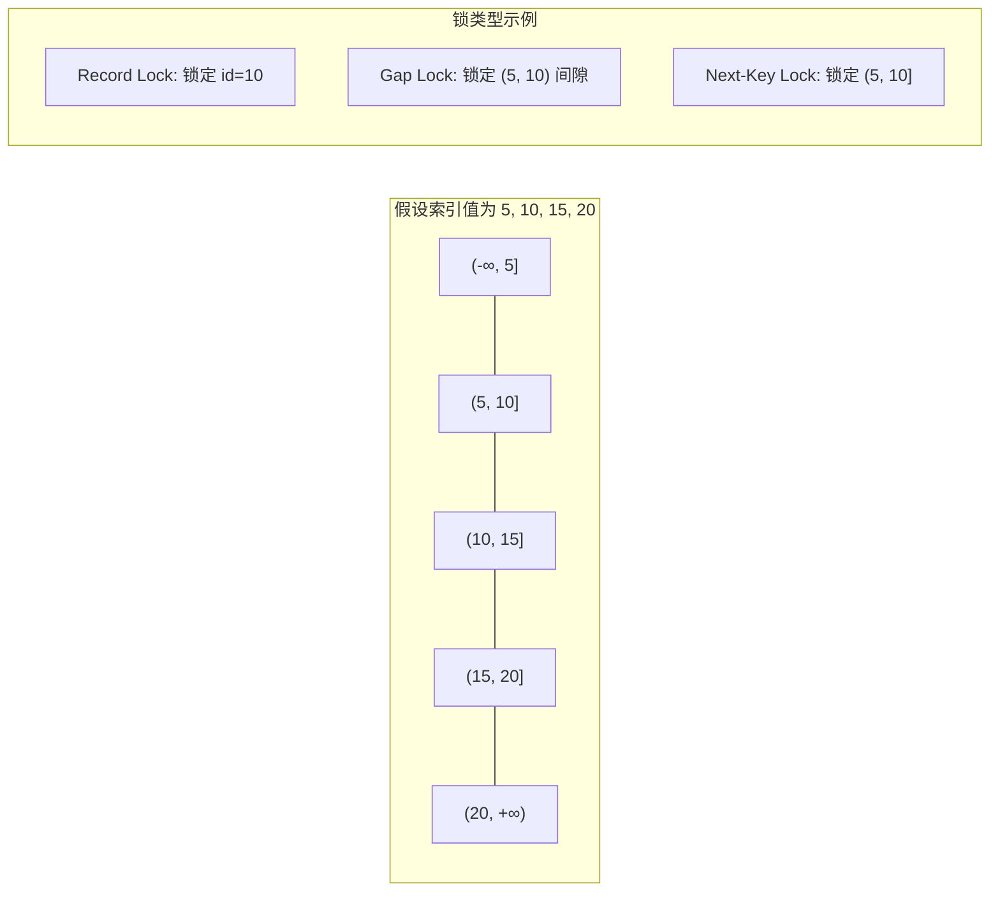

# 锁机制

## 概念说明

MySQL InnoDB 的锁机制是保证事务隔离性的关键手段。理解各种锁的类型、加锁规则和死锁处理，是解决线上并发问题和应对面试的必备知识。

> 面试核心：InnoDB 的行锁是加在索引上的，不是加在数据行上的。

## 核心原理

### 一、锁的分类



### 二、行锁 vs 表锁

| 特性 | 行锁 | 表锁 |
|------|------|------|
| 锁粒度 | 锁定单行 | 锁定整张表 |
| 并发度 | 高 | 低 |
| 加锁开销 | 大 | 小 |
| 死锁 | 可能 | 不会 |
| 引擎支持 | InnoDB | MyISAM/InnoDB |

**关键点**：InnoDB 的行锁是**加在索引上**的。如果 SQL 没有走索引，行锁会退化为表锁。

```sql
-- ✅ 走索引，加行锁
SELECT * FROM user WHERE id = 1 FOR UPDATE;

-- ❌ 不走索引，退化为表锁！
SELECT * FROM user WHERE name = '张三' FOR UPDATE;  -- name 无索引
```

### 三、共享锁与排他锁

| 锁类型 | 简称 | SQL | 兼容性 |
|--------|------|-----|--------|
| 共享锁 | S | `SELECT ... LOCK IN SHARE MODE` | S 与 S 兼容 |
| 排他锁 | X | `SELECT ... FOR UPDATE` / DML | S 与 X 互斥，X 与 X 互斥 |

兼容矩阵：

|  | S | X |
|--|---|---|
| **S** | ✅ 兼容 | ❌ 互斥 |
| **X** | ❌ 互斥 | ❌ 互斥 |

### 四、意向锁

意向锁是**表级锁**，用于表示事务打算对表中的行加什么类型的锁。

| 意向锁 | 含义 | 作用 |
|--------|------|------|
| IS（意向共享锁） | 事务打算对某些行加 S 锁 | 加行级 S 锁前自动加 IS |
| IX（意向排他锁） | 事务打算对某些行加 X 锁 | 加行级 X 锁前自动加 IX |

**作用**：快速判断表中是否有行锁，避免逐行检查。例如 `LOCK TABLES t WRITE` 需要加表级 X 锁，有了意向锁只需检查是否有 IS/IX 锁即可。

### 五、记录锁、间隙锁、临键锁

| 锁类型 | 锁定范围 | 说明 |
|--------|----------|------|
| 记录锁（Record Lock） | 锁定**单条索引记录** | 精确匹配时使用 |
| 间隙锁（Gap Lock） | 锁定索引记录之间的**间隙** | 防止幻读，不锁记录本身 |
| 临键锁（Next-Key Lock） | **记录锁 + 间隙锁** | InnoDB 默认加锁方式，左开右闭 |
| 插入意向锁 | 间隙中的特殊锁 | INSERT 操作在间隙中等待时使用 |



### 六、加锁规则（重要）

InnoDB 在 RR 隔离级别下的加锁规则（基于丁奇《MySQL 实战 45 讲》总结）：

1. **原则 1**：加锁的基本单位是 Next-Key Lock（左开右闭）
2. **原则 2**：查找过程中访问到的对象才会加锁
3. **优化 1**：索引上的等值查询，唯一索引加锁时 Next-Key Lock 退化为 Record Lock
4. **优化 2**：索引上的等值查询，向右遍历时最后一个不满足条件的值，Next-Key Lock 退化为 Gap Lock
5. **Bug**：唯一索引上的范围查询会访问到不满足条件的第一个值为止

```sql
-- 假设表中有 id = 5, 10, 15, 20

-- 等值查询，唯一索引，命中：Record Lock 锁 id=10
SELECT * FROM t WHERE id = 10 FOR UPDATE;

-- 等值查询，唯一索引，未命中：Gap Lock 锁 (5, 10)
SELECT * FROM t WHERE id = 7 FOR UPDATE;

-- 范围查询：Next-Key Lock 锁 (5, 10], (10, 15]
SELECT * FROM t WHERE id >= 10 AND id < 15 FOR UPDATE;
```

### 七、死锁检测与处理

**死锁产生条件**（四个必要条件）：
1. 互斥条件
2. 请求与保持条件
3. 不可剥夺条件
4. 循环等待条件

**InnoDB 死锁处理**：

| 策略 | 参数 | 说明 |
|------|------|------|
| 等待超时 | `innodb_lock_wait_timeout=50` | 默认 50 秒，超时回滚 |
| 死锁检测 | `innodb_deadlock_detect=ON` | 主动检测死锁，回滚代价小的事务 |

```sql
-- 构造死锁示例
-- 事务 A
BEGIN;
UPDATE t SET name='A' WHERE id = 1;  -- 锁住 id=1
UPDATE t SET name='A' WHERE id = 2;  -- 等待 id=2 的锁

-- 事务 B
BEGIN;
UPDATE t SET name='B' WHERE id = 2;  -- 锁住 id=2
UPDATE t SET name='B' WHERE id = 1;  -- 等待 id=1 的锁 → 死锁！

-- 查看死锁信息
SHOW ENGINE INNODB STATUS;
```

## 代码示例

```sql
-- 查看当前锁信息（MySQL 8.0+）
SELECT * FROM performance_schema.data_locks;
SELECT * FROM performance_schema.data_lock_waits;

-- 查看锁等待超时时间
SHOW VARIABLES LIKE 'innodb_lock_wait_timeout';

-- 查看死锁检测是否开启
SHOW VARIABLES LIKE 'innodb_deadlock_detect';
```

> 💻 完整可运行代码：[LockDemo.java](../../../code-examples/03-data-store/database-examples/src/main/java/com/example/database/lock/LockDemo.java)
>
> ⚠️ 需要 MySQL 环境：`docker compose -f docker/docker-compose.yml up -d mysql`

## 常见面试题

### Q1: InnoDB 有哪些锁？行锁是怎么实现的？

**难度**：⭐⭐⭐ | **频率**：🔥🔥🔥

**答题思路**：

1. 按粒度分：表锁、行锁
2. 按模式分：共享锁、排他锁、意向锁
3. 按算法分：记录锁、间隙锁、临键锁
4. 强调行锁加在索引上

**标准答案**：

InnoDB 的锁按粒度分为表锁和行锁；按模式分为共享锁（S）、排他锁（X）和意向锁（IS/IX）；按算法分为记录锁、间隙锁和临键锁。

行锁是**加在索引上**的，不是加在数据行上。如果 SQL 没有使用索引，行锁会退化为表锁。InnoDB 默认的加锁单位是 Next-Key Lock（临键锁），它是记录锁和间隙锁的组合，左开右闭区间。

**深入追问**：

- 什么情况下行锁会退化为表锁？
- 间隙锁和临键锁的区别是什么？
- 意向锁的作用是什么？

### Q2: 什么是间隙锁？它解决了什么问题？

**难度**：⭐⭐⭐ | **频率**：🔥🔥🔥

**答题思路**：

1. 间隙锁锁定的是索引记录之间的间隙
2. 目的是防止幻读
3. 只在 RR 隔离级别下存在

**标准答案**：

间隙锁（Gap Lock）锁定的是索引记录之间的间隙，不包括记录本身。它的主要目的是在 RR 隔离级别下防止幻读，阻止其他事务在间隙中插入新记录。

间隙锁之间不互斥（两个事务可以同时持有同一个间隙的 Gap Lock），但间隙锁会阻塞插入意向锁。这意味着间隙锁可能导致并发插入的等待，甚至死锁。

**深入追问**：

- 间隙锁会导致死锁吗？举个例子？
- RC 隔离级别下有间隙锁吗？
- 如何减少间隙锁的影响？

### Q3: 如何分析和解决死锁？

**难度**：⭐⭐⭐ | **频率**：🔥🔥🔥

**答题思路**：

1. 死锁的四个必要条件
2. InnoDB 的死锁检测机制
3. 排查方法：SHOW ENGINE INNODB STATUS
4. 预防措施

**标准答案**：

InnoDB 有两种死锁处理策略：等待超时（`innodb_lock_wait_timeout`，默认 50 秒）和主动死锁检测（`innodb_deadlock_detect=ON`）。推荐开启死锁检测，它会主动发现死锁并回滚代价较小的事务。

排查死锁：`SHOW ENGINE INNODB STATUS` 查看最近一次死锁信息，包括两个事务持有和等待的锁。

预防死锁：1）按固定顺序访问表和行；2）大事务拆小事务；3）合理使用索引避免锁升级；4）降低隔离级别到 RC（减少间隙锁）。

**深入追问**：

- 死锁检测的时间复杂度是多少？高并发下有什么问题？
- 如何通过 performance_schema 监控锁？
- 热点行更新导致的死锁怎么优化？

## 参考资料

- [MySQL 官方文档 - InnoDB 锁](https://dev.mysql.com/doc/refman/8.0/en/innodb-locking.html)
- [丁奇《MySQL 实战 45 讲》](https://time.geekbang.org/column/intro/139)
