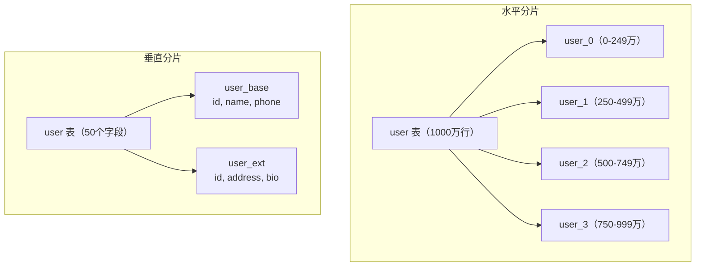

# 分库分表

## 概念说明

当单表数据量超过千万级别或单库写入 QPS 过高时，需要通过分库分表来解决性能瓶颈。分库分表是分布式数据库架构的核心方案，也是面试中的高频考点。

> 面试核心：什么时候需要分库分表？水平分片和垂直分片的区别？分片后如何处理跨库查询？

## 核心原理

### 一、水平分片 vs 垂直分片

| 维度 | 水平分片 | 垂直分片 |
|------|----------|----------|
| 拆分方式 | 按行拆分，同一张表的数据分到多个库/表 | 按列拆分，不同字段分到不同表 |
| 适用场景 | 单表数据量过大 | 表字段过多，热冷数据分离 |
| 示例 | user 表按 user_id 取模分到 user_0, user_1 | user 表拆为 user_base（基本信息）和 user_ext（扩展信息） |
| 复杂度 | 高（跨库查询、分布式事务） | 低（JOIN 查询） |



### 二、分片策略

| 策略 | 算法 | 优点 | 缺点 |
|------|------|------|------|
| Hash 取模 | `user_id % N` | 数据分布均匀 | 扩容困难（需要迁移数据） |
| 范围分片 | `id 1-1000万 → 表1` | 扩容方便 | 热点问题（新数据集中在最后一个分片） |
| 一致性 Hash | 虚拟节点 + Hash 环 | 扩容只迁移部分数据 | 实现复杂 |
| 按时间分片 | `按月/年分表` | 适合日志类数据 | 查询需要跨表 |

### 三、主流中间件对比

| 特性 | ShardingSphere-JDBC | ShardingSphere-Proxy | MyCat |
|------|--------------------|--------------------|-------|
| 架构 | 客户端分片（JAR 包） | 服务端代理 | 服务端代理 |
| 性能 | 高（无网络开销） | 中（多一层代理） | 中 |
| 侵入性 | 低（改配置即可） | 无（透明代理） | 无 |
| 语言支持 | Java | 任意 | 任意 |
| 社区活跃度 | ⭐⭐⭐⭐⭐ | ⭐⭐⭐⭐⭐ | ⭐⭐⭐ |
| 推荐度 | ✅ Java 项目首选 | ✅ 多语言项目 | ⚠️ 维护较少 |

### 四、分布式事务

分库分表后，跨库事务是最大的挑战：

| 方案 | 一致性 | 性能 | 复杂度 | 适用场景 |
|------|--------|------|--------|----------|
| XA 事务（2PC） | 强一致 | 低 | 低 | 对一致性要求极高 |
| Seata AT 模式 | 最终一致 | 中 | 中 | 通用场景 |
| TCC | 最终一致 | 高 | 高 | 高性能场景 |
| 消息最终一致性 | 最终一致 | 高 | 中 | 异步场景 |

### 五、跨库查询问题

| 问题 | 解决方案 |
|------|----------|
| 跨库 JOIN | 冗余字段、应用层组装、全局表 |
| 跨库排序/分页 | 各分片查询后归并排序 |
| 跨库聚合 | 各分片聚合后再汇总 |
| 全局唯一 ID | 雪花算法、Leaf、号段模式 |
| 跨库事务 | Seata、消息最终一致性 |

## 代码示例

```yaml
# ShardingSphere-JDBC 配置示例（application.yml）
spring:
  shardingsphere:
    datasource:
      names: ds0,ds1
      ds0:
        url: jdbc:mysql://localhost:3306/db0
        username: root
        password: root
      ds1:
        url: jdbc:mysql://localhost:3306/db1
        username: root
        password: root
    rules:
      sharding:
        tables:
          user:
            actual-data-nodes: ds$->{0..1}.user_$->{0..3}
            table-strategy:
              standard:
                sharding-column: user_id
                sharding-algorithm-name: user-inline
        sharding-algorithms:
          user-inline:
            type: INLINE
            props:
              algorithm-expression: user_$->{user_id % 4}
```

> 💻 完整可运行代码：[ShardingDemo.java](https://github.com/skyhe58/guide-java/tree/main/code-examples/03-data-store/database-examples/src/main/java/com/example/database/sharding/ShardingDemo.java)
> <!-- 本地路径：code-examples/03-data-store/database-examples/src/main/java/com/example/database/sharding/ShardingDemo.java -->

## 常见面试题

### Q1: 什么时候需要分库分表？怎么选择分片策略？

**难度**：⭐⭐⭐ | **频率**：🔥🔥🔥

**答题思路**：

1. 说明分库分表的触发条件
2. 对比水平分片和垂直分片
3. 分析各种分片策略的优缺点

**标准答案**：

分库分表的触发条件：单表数据量超过 2000 万行或单表大小超过 10GB；单库 QPS 超过 5000；单库连接数不够用。

先考虑垂直分片（按业务拆分），再考虑水平分片（按数据拆分）。分片策略选择：Hash 取模适合数据均匀分布的场景，范围分片适合按时间查询的场景，一致性 Hash 适合需要动态扩容的场景。

**深入追问**：

- 分库分表后如何做数据迁移？
- 如何处理分片键的选择？
- 分库分表后如何做全局排序？

### Q2: ShardingSphere-JDBC 和 ShardingSphere-Proxy 的区别？

**难度**：⭐⭐ | **频率**：🔥🔥

**标准答案**：

JDBC 模式是客户端分片，以 JAR 包形式嵌入应用，性能高但只支持 Java。Proxy 模式是服务端代理，对应用透明，支持任意语言但多一层网络开销。Java 项目推荐 JDBC 模式，多语言项目推荐 Proxy 模式。

**深入追问**：

- ShardingSphere 如何处理分布式事务？
- 如何实现读写分离？

### Q3: 分库分表后，跨库 JOIN 怎么处理？

**难度**：⭐⭐⭐ | **频率**：🔥🔥

**标准答案**：

四种方案：1）冗余字段，避免 JOIN；2）全局表（字典表等小表在每个分片都存一份）；3）应用层组装（分别查询后在代码中关联）；4）使用 ShardingSphere 的跨库 JOIN 功能（性能较差，不推荐大数据量使用）。

**深入追问**：

- 分库分表后如何做深分页？
- 如何保证分布式 ID 的唯一性和有序性？

## 在 Spring Cloud 项目中体验

本项目提供了基于 ShardingSphere-JDBC 的分库分表实战示例，集成在 Spring Cloud 微服务中，可以直接运行体验分片路由、跨库查询等核心功能。

> 💻 实战代码：[ShardingController.java](https://github.com/skyhe58/guide-java/tree/main/code-examples/02-framework/springcloud-sharding/src/main/java/com/example/sharding/controller/ShardingController.java)
> <!-- 本地路径：code-examples/02-framework/springcloud-sharding/src/main/java/com/example/sharding/controller/ShardingController.java -->

**启动步骤：**

```bash
# 1. 启动中间件
docker compose -f docker/docker-compose.yml up -d mysql
docker compose -f docker/docker-compose.consul.yml up -d

# 2. 启动分库分表服务
cd code-examples/02-framework/springcloud-sharding
mvn spring-boot:run
```

**验证接口：**

```bash
# 初始化分片表
curl http://localhost:8091/demo/sharding/init

# 创建订单（观察分片路由）
curl -X POST http://localhost:8091/demo/sharding/order \
  -H "Content-Type: application/json" \
  -d '{"userId":1,"amount":99.9,"status":"NEW"}'

# 查询所有订单（跨分片聚合）
curl http://localhost:8091/demo/sharding/orders

# 按 ID 查询（精确路由）
curl http://localhost:8091/demo/sharding/orders/1

# 分片方案对比
curl http://localhost:8091/demo/sharding/compare
```

## 参考资料

- [ShardingSphere 官方文档](https://shardingsphere.apache.org/document/current/cn/overview/)
- [MyCat 官方文档](http://www.mycat.org.cn/)
