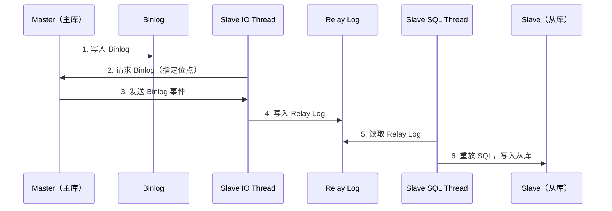
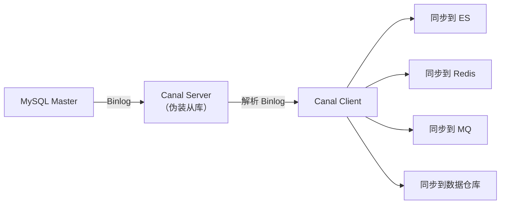

# Binlog 原理与应用

## 概念说明

Binlog（Binary Log，二进制日志）是 MySQL Server 层的日志，记录所有对数据库的修改操作。它是 MySQL 主从复制、数据恢复和数据订阅（Canal）的基础。

> 面试核心：Binlog 三种格式的区别？主从同步的流程？Canal 的工作原理？

## 核心原理

### 一、Binlog 三种格式

| 格式 | 记录内容 | 优点 | 缺点 |
|------|----------|------|------|
| **Statement** | SQL 语句本身 | 日志量小 | 不确定函数（NOW()、RAND()）可能导致主从不一致 |
| **Row** | 行数据的变更（前后镜像） | 数据一致性最好 | 日志量大（尤其批量操作） |
| **Mixed** | 默认 Statement，不安全时自动切 Row | 折中方案 | 仍可能有不一致风险 |

> 推荐使用 **Row 格式**，虽然日志量大，但数据一致性最好，也是 Canal 等工具的要求。

```sql
-- 查看 Binlog 格式
SHOW VARIABLES LIKE 'binlog_format';

-- 设置 Binlog 格式
SET GLOBAL binlog_format = 'ROW';

-- 查看 Binlog 文件列表
SHOW BINARY LOGS;

-- 查看 Binlog 事件
SHOW BINLOG EVENTS IN 'mysql-bin.000001';

-- 使用 mysqlbinlog 工具解析
-- mysqlbinlog --base64-output=decode-rows -v mysql-bin.000001
```

### 二、主从同步流程



**主从同步三个线程**：
1. **Master Binlog Dump Thread**：主库发送 Binlog 给从库
2. **Slave IO Thread**：从库接收 Binlog，写入 Relay Log
3. **Slave SQL Thread**：从库读取 Relay Log，重放 SQL

### 三、Canal 数据订阅

Canal 是阿里开源的 MySQL Binlog 增量订阅组件，伪装成 MySQL 从库来接收 Binlog。



**Canal 典型应用场景**：
- 数据库与缓存（Redis）同步
- 数据库与搜索引擎（ES）同步
- 数据库变更通知（发送到 MQ）
- 数据库迁移和数据恢复

### 四、数据恢复

```bash
# 基于 Binlog 的数据恢复步骤
# 1. 找到误操作的时间点
mysqlbinlog --start-datetime="2024-01-01 10:00:00" --stop-datetime="2024-01-01 10:05:00" mysql-bin.000001

# 2. 恢复到误操作之前
mysqlbinlog --stop-position=12345 mysql-bin.000001 | mysql -u root -p

# 3. 跳过误操作，恢复之后的数据
mysqlbinlog --start-position=12346 mysql-bin.000001 | mysql -u root -p
```

## 代码示例

```java
// Canal 客户端示例（伪代码）
CanalConnector connector = CanalConnectors.newSingleConnector(
    new InetSocketAddress("127.0.0.1", 11111), "example", "", "");
connector.connect();
connector.subscribe(".*\\..*");

while (true) {
    Message message = connector.getWithoutAck(100);
    for (Entry entry : message.getEntries()) {
        RowChange rowChange = RowChange.parseFrom(entry.getStoreValue());
        for (RowData rowData : rowChange.getRowDatasList()) {
            // 处理数据变更
            System.out.println("变更类型: " + rowChange.getEventType());
            System.out.println("变更前: " + rowData.getBeforeColumnsList());
            System.out.println("变更后: " + rowData.getAfterColumnsList());
        }
    }
    connector.ack(message.getId());
}
```

> 💻 完整可运行代码：[BinlogDemo.java](../../../code-examples/03-data-store/database-examples/src/main/java/com/example/database/binlog/BinlogDemo.java)
>
> ⚠️ 需要 MySQL 环境：`docker compose -f docker/docker-compose.yml up -d mysql`

## 常见面试题

### Q1: Binlog 有几种格式？各有什么优缺点？

**难度**：⭐⭐⭐ | **频率**：🔥🔥🔥

**答题思路**：

1. 三种格式：Statement、Row、Mixed
2. 各自的优缺点
3. 推荐使用 Row 格式

**标准答案**：

Statement 记录 SQL 语句，日志量小但不确定函数可能导致主从不一致。Row 记录行数据变更的前后镜像，数据一致性最好但日志量大。Mixed 默认用 Statement，不安全时自动切 Row。

推荐使用 Row 格式，虽然日志量大，但数据一致性最好，也是 Canal 等数据订阅工具的要求。

**深入追问**：

- Statement 格式在什么情况下会导致主从不一致？
- Row 格式的日志量大怎么优化？
- Binlog 和 Redo Log 有什么区别？

### Q2: MySQL 主从同步的原理是什么？有什么延迟问题？

**难度**：⭐⭐⭐ | **频率**：🔥🔥🔥

**标准答案**：

主从同步通过三个线程实现：主库的 Binlog Dump Thread 发送 Binlog，从库的 IO Thread 接收并写入 Relay Log，从库的 SQL Thread 读取 Relay Log 重放 SQL。

主从延迟原因：1）从库 SQL Thread 单线程重放（MySQL 5.7+ 支持并行复制）；2）大事务执行时间长；3）从库机器性能差；4）网络延迟。

解决方案：1）使用并行复制；2）避免大事务；3）使用半同步复制；4）读写分离时关键读走主库。

**深入追问**：

- 半同步复制和异步复制的区别？
- 并行复制的原理是什么？
- 如何监控主从延迟？

### Q3: Canal 的工作原理是什么？有什么应用场景？

**难度**：⭐⭐ | **频率**：🔥🔥

**标准答案**：

Canal 伪装成 MySQL 从库，向主库发送 dump 请求获取 Binlog，解析后推送给下游消费者。要求 Binlog 格式为 Row。

典型应用场景：1）数据库与 Redis 缓存同步；2）数据库与 ES 搜索引擎同步；3）数据变更通知（发送到 MQ）；4）数据库迁移；5）数据审计。

**深入追问**：

- Canal 如何保证数据不丢失？
- Canal 和 Debezium 有什么区别？

## 参考资料

- [MySQL 官方文档 - Binary Log](https://dev.mysql.com/doc/refman/8.0/en/binary-log.html)
- [Canal GitHub](https://github.com/alibaba/canal)
