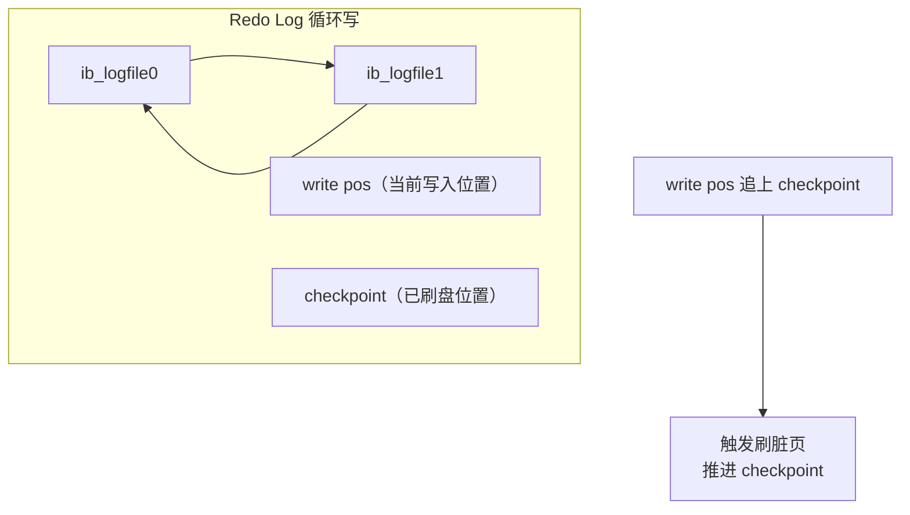
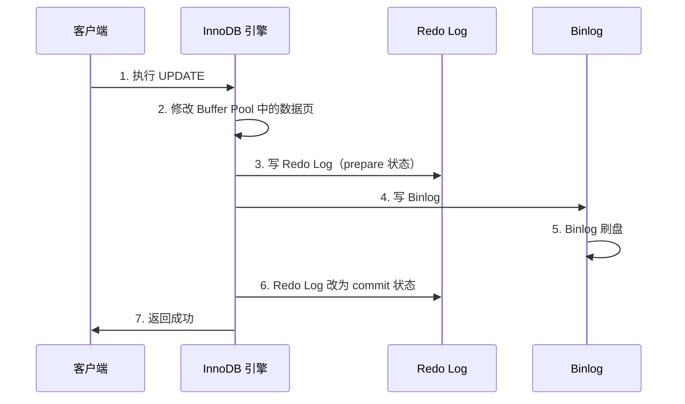
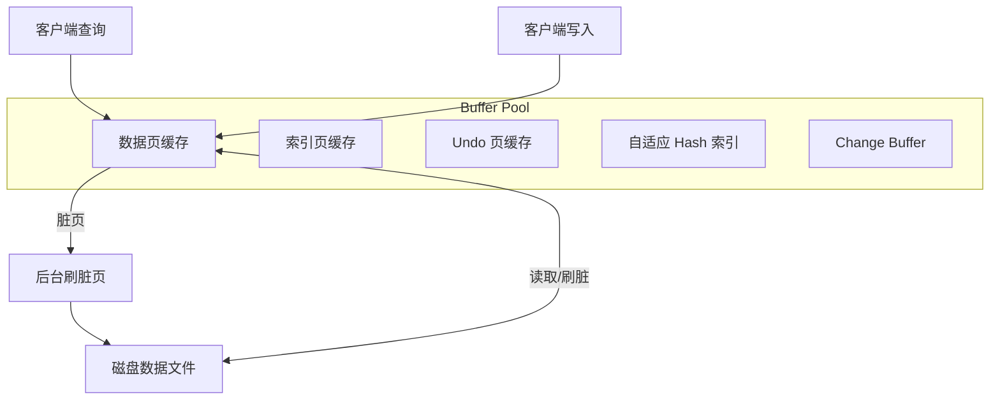

# Redo Log 与 Undo Log

## 概念说明

MySQL InnoDB 的日志系统是保证事务 ACID 特性的核心机制。Redo Log 保证持久性（D），Undo Log 保证原子性（A），两者配合 Binlog 通过两阶段提交保证数据一致性。

> 面试核心：WAL 机制是什么？Redo Log 和 Binlog 的两阶段提交流程？Buffer Pool 的刷脏页机制？

## 核心原理

### 一、WAL 机制（Write-Ahead Logging）

WAL 的核心思想：**先写日志，再写磁盘**。


**为什么需要 WAL？**
- 直接写磁盘是**随机 IO**，性能差
- 写 Redo Log 是**顺序 IO**，性能高
- 即使宕机，也能通过 Redo Log 恢复数据

### 二、Redo Log 详解

| 特性 | 说明 |
|------|------|
| 所属层 | InnoDB 存储引擎层 |
| 作用 | 保证事务持久性（Crash Recovery） |
| 写入方式 | 顺序写，循环使用 |
| 文件 | `ib_logfile0`、`ib_logfile1`（默认 2 个，各 48MB） |
| 记录内容 | 物理日志（数据页的修改） |

#### Redo Log 的循环写



- **write pos**：当前 Redo Log 的写入位置，一边写一边后移
- **checkpoint**：已经刷到磁盘的位置，一边刷一边后移
- 当 write pos 追上 checkpoint 时，必须停下来先刷脏页

#### Redo Log 刷盘策略

`innodb_flush_log_at_trx_commit` 参数：

| 值 | 行为 | 性能 | 安全性 |
|----|------|------|--------|
| **0** | 每秒刷盘 | 最高 | 可能丢 1 秒数据 |
| **1** | 每次提交都刷盘 | 最低 | **最安全（推荐）** |
| **2** | 每次提交写到 OS 缓存，每秒刷盘 | 中 | OS 崩溃可能丢数据 |

### 三、Undo Log 详解

| 特性 | 说明 |
|------|------|
| 所属层 | InnoDB 存储引擎层 |
| 作用 | 保证事务原子性（回滚）+ MVCC 版本链 |
| 记录内容 | 逻辑日志（反向操作） |
| 存储位置 | 系统表空间或独立 Undo 表空间 |

**Undo Log 的两个作用**：
1. **事务回滚**：记录修改前的数据，回滚时执行反向操作
2. **MVCC**：提供数据的历史版本，支持快照读

```sql
-- INSERT 操作的 Undo Log：记录 DELETE（回滚时删除插入的行）
-- UPDATE 操作的 Undo Log：记录旧值（回滚时恢复旧值）
-- DELETE 操作的 Undo Log：记录完整行数据（回滚时重新插入）
```

### 四、两阶段提交

Redo Log 和 Binlog 是两个独立的日志系统，为了保证两者的一致性，MySQL 使用**两阶段提交**（2PC）。



**为什么需要两阶段提交？**

| 场景 | 不用两阶段提交的问题 |
|------|---------------------|
| 先写 Redo Log，后写 Binlog | 宕机后 Redo Log 恢复了数据，但 Binlog 没有该操作，从库数据不一致 |
| 先写 Binlog，后写 Redo Log | 宕机后 Binlog 有该操作，从库执行了，但主库 Redo Log 没有，主库数据丢失 |

### 五、Buffer Pool 与刷脏页

Buffer Pool 是 InnoDB 的内存缓冲池，用于缓存数据页和索引页。



**触发刷脏页的四种场景**：
1. Redo Log 写满（write pos 追上 checkpoint）
2. Buffer Pool 内存不足，淘汰脏页时刷盘
3. MySQL 空闲时后台线程定期刷脏
4. MySQL 正常关闭时刷所有脏页

**Checkpoint 机制**：
- **Sharp Checkpoint**：关闭数据库时，将所有脏页刷回磁盘
- **Fuzzy Checkpoint**：运行时，只刷一部分脏页（默认方式）

## 代码示例

```sql
-- 查看 Redo Log 配置
SHOW VARIABLES LIKE 'innodb_log_file_size';      -- 单个文件大小
SHOW VARIABLES LIKE 'innodb_log_files_in_group';  -- 文件数量
SHOW VARIABLES LIKE 'innodb_flush_log_at_trx_commit';  -- 刷盘策略

-- 查看 Buffer Pool 状态
SHOW VARIABLES LIKE 'innodb_buffer_pool_size';    -- Buffer Pool 大小
SHOW STATUS LIKE 'Innodb_buffer_pool%';           -- Buffer Pool 状态

-- 查看 Undo Log 配置
SHOW VARIABLES LIKE 'innodb_undo%';
```

> 💻 完整可运行代码：[BinlogDemo.java](../../../code-examples/03-data-store/database-examples/src/main/java/com/example/database/binlog/BinlogDemo.java)（日志系统说明部分）
>
> ⚠️ 需要 MySQL 环境：`docker compose -f docker/docker-compose.yml up -d mysql`

## 常见面试题

### Q1: Redo Log 和 Binlog 有什么区别？

**难度**：⭐⭐⭐ | **频率**：🔥🔥🔥

**答题思路**：

1. 所属层不同
2. 记录内容不同
3. 写入方式不同
4. 用途不同

**标准答案**：

| 维度 | Redo Log | Binlog |
|------|----------|--------|
| 所属层 | InnoDB 引擎层 | MySQL Server 层 |
| 记录内容 | 物理日志（数据页修改） | 逻辑日志（SQL 或行变更） |
| 写入方式 | 循环写，固定大小 | 追加写，文件切换 |
| 用途 | Crash Recovery | 主从复制、数据恢复 |
| 事务 | 事务执行中持续写入 | 事务提交时一次性写入 |

**深入追问**：

- 为什么需要两份日志？只用一份行不行？
- 两阶段提交的流程是什么？
- 如果两阶段提交中间宕机了怎么办？

### Q2: 什么是 WAL 机制？为什么需要它？

**难度**：⭐⭐⭐ | **频率**：🔥🔥🔥

**标准答案**：

WAL（Write-Ahead Logging）是先写日志再写磁盘的机制。写 Redo Log 是顺序 IO，写数据文件是随机 IO，顺序 IO 比随机 IO 快几个数量级。通过 WAL，MySQL 将随机写转化为顺序写，大幅提升写入性能。即使宕机，也能通过 Redo Log 恢复未刷盘的数据，保证持久性。

**深入追问**：

- Redo Log 写满了怎么办？
- `innodb_flush_log_at_trx_commit` 参数的三个值分别是什么含义？
- 为什么推荐设置为 1？

### Q3: 两阶段提交的流程是什么？中间宕机怎么恢复？

**难度**：⭐⭐⭐ | **频率**：🔥🔥🔥

**标准答案**：

两阶段提交流程：1）写 Redo Log（prepare 状态）；2）写 Binlog；3）Redo Log 改为 commit 状态。

宕机恢复规则：
- Redo Log 是 prepare 且 Binlog 完整 → 提交事务
- Redo Log 是 prepare 且 Binlog 不完整 → 回滚事务
- Redo Log 是 commit → 提交事务

判断 Binlog 是否完整：Row 格式的 Binlog 末尾有 XID event。

**深入追问**：

- 组提交（Group Commit）是什么？
- 如何优化两阶段提交的性能？

## 参考资料

- [MySQL 官方文档 - InnoDB Redo Log](https://dev.mysql.com/doc/refman/8.0/en/innodb-redo-log.html)
- [MySQL 官方文档 - InnoDB Undo Log](https://dev.mysql.com/doc/refman/8.0/en/innodb-undo-logs.html)
- [丁奇《MySQL 实战 45 讲》](https://time.geekbang.org/column/intro/139)
