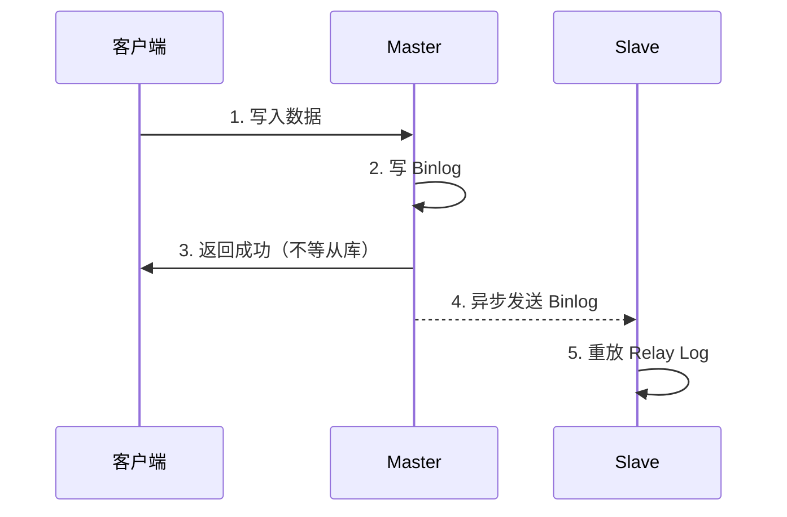
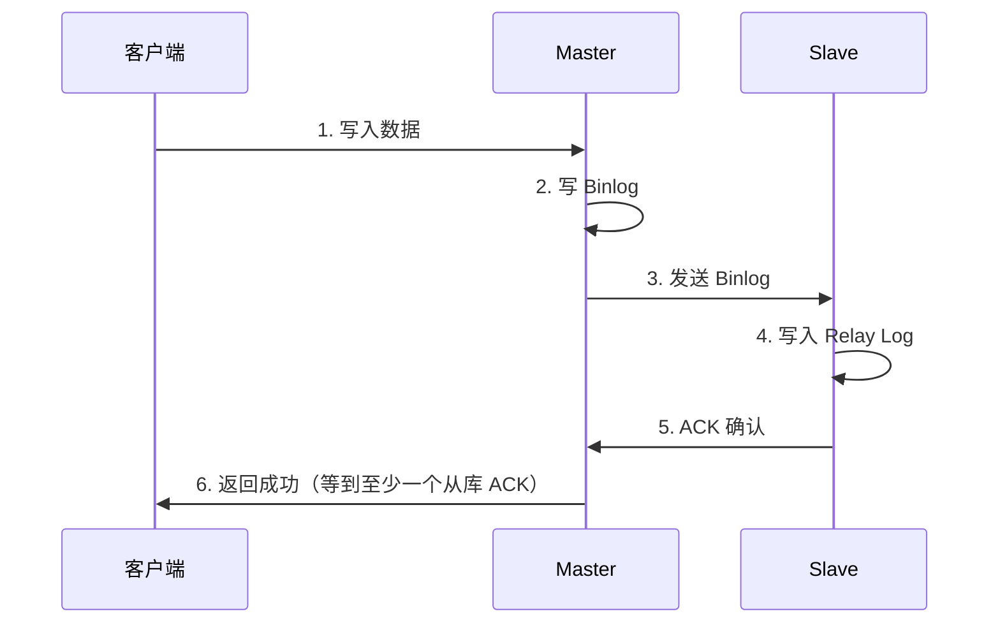
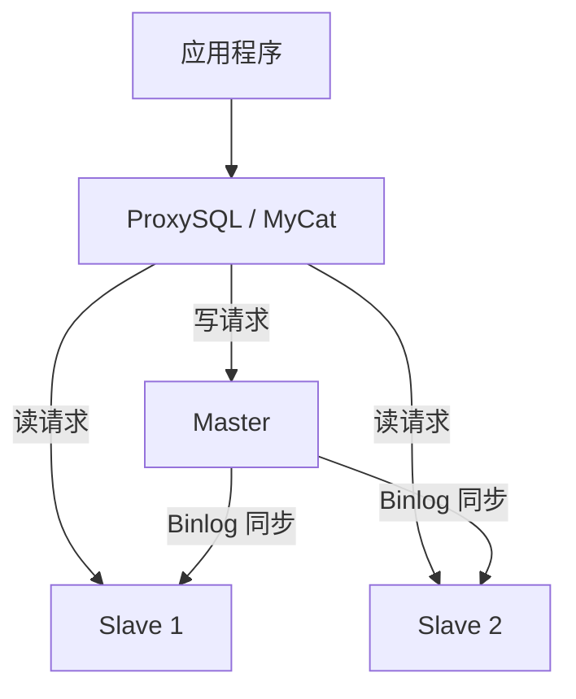

# 高可用方案

## 概念说明

MySQL 高可用是保证数据库服务持续可用的关键。从最基础的主从复制到 MGR 组复制，再到 ProxySQL 读写分离，不同方案适用于不同的业务场景。

> 面试核心：主从复制的原理？半同步复制和异步复制的区别？MGR 的优势？

## 核心原理

### 一、主从复制方案对比

| 方案 | 一致性 | 可用性 | 复杂度 | 适用场景 |
|------|--------|--------|--------|----------|
| 异步复制 | 弱 | 高 | 低 | 读多写少，允许短暂不一致 |
| 半同步复制 | 较强 | 中 | 中 | 对数据一致性有要求 |
| MGR 组复制 | 强 | 高 | 高 | 金融级高可用 |
| MySQL Cluster（NDB） | 强 | 最高 | 最高 | 电信级场景 |

### 二、异步复制



**问题**：主库宕机时，从库可能还没收到最新的 Binlog，导致数据丢失。

### 三、半同步复制



**特点**：主库等待至少一个从库确认收到 Binlog 后才返回成功。如果超时未收到 ACK，退化为异步复制。

### 四、MGR 组复制（MySQL Group Replication）

MGR 是 MySQL 官方推出的高可用方案，基于 Paxos 协议实现多节点数据一致性。

| 模式 | 说明 | 适用场景 |
|------|------|----------|
| 单主模式 | 一个节点可写，其他只读 | 大多数场景 |
| 多主模式 | 所有节点可写 | 写入分散的场景 |

**MGR 优势**：
- 自动故障检测和切换
- 基于 Paxos 协议，数据强一致
- 支持自动成员管理

### 五、读写分离



**读写分离中间件对比**：

| 特性 | ProxySQL | MyCat | ShardingSphere-Proxy |
|------|----------|-------|---------------------|
| 语言 | C++ | Java | Java |
| 性能 | 高 | 中 | 中 |
| 功能 | 读写分离、连接池、查询缓存 | 读写分离、分库分表 | 读写分离、分库分表 |
| 推荐度 | ✅ 纯读写分离首选 | ⚠️ 维护较少 | ✅ 需要分库分表时 |

**主从延迟导致的读写分离问题**：
- 写入后立即读取，可能读到旧数据
- 解决方案：1）关键读走主库；2）延迟判断（判断从库延迟是否在可接受范围内）；3）使用半同步复制

## 代码示例

```sql
-- 查看主从复制状态
SHOW SLAVE STATUS\G

-- 关键字段
-- Slave_IO_Running: Yes
-- Slave_SQL_Running: Yes
-- Seconds_Behind_Master: 0  -- 主从延迟秒数

-- 查看 MGR 状态
SELECT * FROM performance_schema.replication_group_members;

-- 半同步复制配置
-- 主库
INSTALL PLUGIN rpl_semi_sync_master SONAME 'semisync_master.so';
SET GLOBAL rpl_semi_sync_master_enabled = 1;
SET GLOBAL rpl_semi_sync_master_timeout = 1000;  -- 超时 1 秒

-- 从库
INSTALL PLUGIN rpl_semi_sync_slave SONAME 'semisync_slave.so';
SET GLOBAL rpl_semi_sync_slave_enabled = 1;
```

> 💻 完整可运行代码：[BinlogDemo.java](../../../code-examples/03-data-store/database-examples/src/main/java/com/example/database/binlog/BinlogDemo.java)（高可用说明部分）
>
> ⚠️ 需要 MySQL 环境：`docker compose -f docker/docker-compose.yml up -d mysql`

## 常见面试题

### Q1: MySQL 主从复制有几种方式？各有什么优缺点？

**难度**：⭐⭐⭐ | **频率**：🔥🔥

**标准答案**：

三种方式：异步复制（默认，性能最好但可能丢数据）、半同步复制（等待至少一个从库 ACK，兼顾性能和一致性）、MGR 组复制（基于 Paxos，强一致但复杂度高）。

**深入追问**：

- 半同步复制超时后会怎样？
- MGR 最多支持几个节点？
- 如何监控主从延迟？

### Q2: 读写分离有什么问题？怎么解决主从延迟导致的数据不一致？

**难度**：⭐⭐⭐ | **频率**：🔥🔥🔥

**标准答案**：

主要问题是主从延迟导致读到旧数据。解决方案：1）关键业务读走主库（如支付后查询订单状态）；2）使用半同步复制减少延迟；3）在应用层判断从库延迟，超过阈值则读主库；4）使用缓存（写入后同时更新缓存，读缓存而非从库）。

**深入追问**：

- 如何判断从库的延迟时间？
- ProxySQL 如何实现读写分离？
- 多个从库之间如何做负载均衡？

### Q3: MGR 和传统主从复制有什么区别？

**难度**：⭐⭐⭐ | **频率**：🔥🔥

**标准答案**：

MGR 基于 Paxos 协议实现多节点数据一致性，支持自动故障检测和切换，数据强一致。传统主从复制基于 Binlog 异步/半同步传输，需要额外的 HA 工具（如 MHA）实现故障切换。MGR 适合对数据一致性要求高的场景（如金融），传统主从适合读多写少的通用场景。

**深入追问**：

- MGR 的单主模式和多主模式有什么区别？
- MGR 有什么限制？

## 参考资料

- [MySQL 官方文档 - Replication](https://dev.mysql.com/doc/refman/8.0/en/replication.html)
- [MySQL 官方文档 - Group Replication](https://dev.mysql.com/doc/refman/8.0/en/group-replication.html)
- [ProxySQL 官方文档](https://proxysql.com/documentation/)
