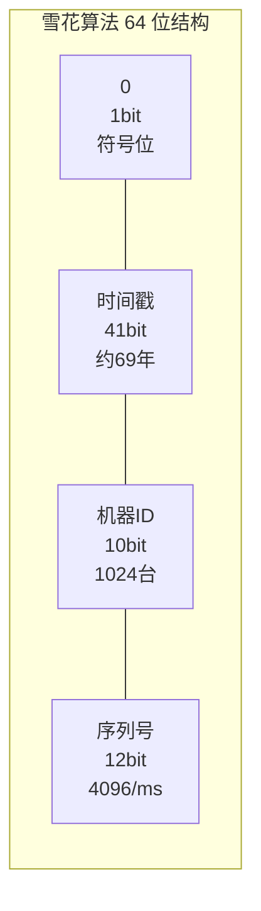
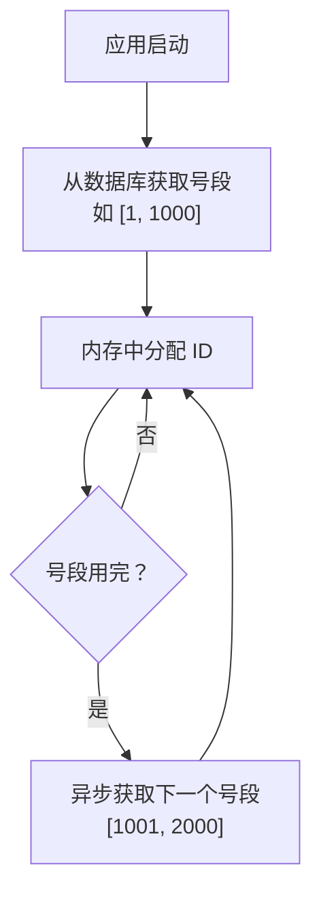

# 分布式 ID 生成

## 概念说明

在分布式系统中，需要全局唯一的 ID 来标识数据。传统的数据库自增 ID 在分库分表场景下无法保证全局唯一性，因此需要分布式 ID 生成方案。

> 面试核心：雪花算法的原理？时钟回拨怎么处理？各种方案的优缺点？

## 核心原理

### 一、方案对比

| 方案 | 唯一性 | 有序性 | 性能 | 可用性 | 复杂度 |
|------|--------|--------|------|--------|--------|
| UUID | ✅ | ❌ 无序 | 高 | 高 | 低 |
| 数据库自增 | ✅ | ✅ | 低 | 低（单点） | 低 |
| 数据库号段模式 | ✅ | ✅ | 高 | 中 | 中 |
| Redis INCR | ✅ | ✅ | 高 | 中 | 中 |
| **雪花算法** | ✅ | ✅ 趋势递增 | **最高** | **高** | 中 |
| Leaf（美团） | ✅ | ✅ | 高 | 高 | 高 |

### 二、UUID

```java
String uuid = UUID.randomUUID().toString();
// 示例：550e8400-e29b-41d4-a716-446655440000
```

**优点**：本地生成，无网络开销，性能高。

**缺点**：
- 无序，作为主键会导致 B+树频繁分裂，插入性能差
- 字符串类型，占用空间大（36 字符）
- 不适合作为数据库主键

### 三、数据库自增

```sql
-- 方案 1：单独的 ID 生成表
CREATE TABLE id_generator (
    id BIGINT NOT NULL AUTO_INCREMENT,
    stub CHAR(1) NOT NULL DEFAULT '',
    PRIMARY KEY (id),
    UNIQUE KEY uk_stub (stub)
) ENGINE=InnoDB;

-- 获取 ID
REPLACE INTO id_generator (stub) VALUES ('a');
SELECT LAST_INSERT_ID();

-- 方案 2：多实例步长
-- 实例 1：起始值 1，步长 2 → 1, 3, 5, 7...
-- 实例 2：起始值 2，步长 2 → 2, 4, 6, 8...
SET @@auto_increment_offset = 1;
SET @@auto_increment_increment = 2;
```

### 四、雪花算法（Snowflake）

Twitter 开源的分布式 ID 生成算法，生成 64 位 long 类型 ID。



| 部分 | 位数 | 说明 |
|------|------|------|
| 符号位 | 1 bit | 固定为 0（正数） |
| 时间戳 | 41 bit | 毫秒级，可用约 69 年 |
| 机器 ID | 10 bit | 5 bit 数据中心 + 5 bit 机器，最多 1024 台 |
| 序列号 | 12 bit | 同一毫秒内的序列号，最多 4096 个 |

**单机 QPS**：理论上每毫秒可生成 4096 个 ID，即 **409.6 万/秒**。

**时钟回拨问题**：
- 如果系统时钟回拨，可能生成重复 ID
- 解决方案：1）抛异常拒绝生成；2）等待时钟追上；3）使用扩展位记录回拨次数

### 五、Leaf（美团）

美团开源的分布式 ID 生成服务，支持两种模式：

| 模式 | 原理 | 优点 | 缺点 |
|------|------|------|------|
| Leaf-Segment（号段模式） | 从数据库批量获取 ID 段 | 高可用，ID 连续 | 依赖数据库 |
| Leaf-Snowflake | 基于雪花算法 + ZK | 不依赖数据库 | 依赖 ZK |

**号段模式原理**：



**双 Buffer 优化**：当前号段使用到 10% 时，异步加载下一个号段到内存，避免号段切换时的等待。

## 代码示例

```java
/**
 * 雪花算法实现（简化版）
 */
public class SnowflakeIdGenerator {
    private final long epoch = 1704067200000L; // 2024-01-01
    private final long workerIdBits = 5L;
    private final long datacenterIdBits = 5L;
    private final long sequenceBits = 12L;

    private final long maxWorkerId = ~(-1L << workerIdBits);
    private final long maxDatacenterId = ~(-1L << datacenterIdBits);

    private final long workerIdShift = sequenceBits;
    private final long datacenterIdShift = sequenceBits + workerIdBits;
    private final long timestampShift = sequenceBits + workerIdBits + datacenterIdBits;
    private final long sequenceMask = ~(-1L << sequenceBits);

    private final long workerId;
    private final long datacenterId;
    private long sequence = 0L;
    private long lastTimestamp = -1L;

    public SnowflakeIdGenerator(long workerId, long datacenterId) {
        this.workerId = workerId;
        this.datacenterId = datacenterId;
    }

    public synchronized long nextId() {
        long timestamp = System.currentTimeMillis();
        if (timestamp < lastTimestamp) {
            throw new RuntimeException("时钟回拨，拒绝生成 ID");
        }
        if (timestamp == lastTimestamp) {
            sequence = (sequence + 1) & sequenceMask;
            if (sequence == 0) {
                timestamp = waitNextMillis(lastTimestamp);
            }
        } else {
            sequence = 0L;
        }
        lastTimestamp = timestamp;
        return ((timestamp - epoch) << timestampShift)
                | (datacenterId << datacenterIdShift)
                | (workerId << workerIdShift)
                | sequence;
    }

    private long waitNextMillis(long lastTimestamp) {
        long timestamp = System.currentTimeMillis();
        while (timestamp <= lastTimestamp) {
            timestamp = System.currentTimeMillis();
        }
        return timestamp;
    }
}
```

> 💻 完整可运行代码：[DistributedIdDemo.java](https://github.com/skyhe58/guide-java/tree/main/code-examples/03-data-store/database-examples/src/main/java/com/example/database/id/DistributedIdDemo.java)
> <!-- 本地路径：code-examples/03-data-store/database-examples/src/main/java/com/example/database/id/DistributedIdDemo.java -->

## 常见面试题

### Q1: 分布式 ID 有哪些生成方案？各有什么优缺点？

**难度**：⭐⭐⭐ | **频率**：🔥🔥🔥

**答题思路**：

1. 列举主要方案
2. 从唯一性、有序性、性能、可用性维度对比
3. 说明推荐方案

**标准答案**：

主要方案：UUID（无序，不适合做主键）、数据库自增（简单但有单点瓶颈）、雪花算法（高性能、趋势递增，推荐）、Leaf 号段模式（高可用，适合大规模系统）。

推荐：中小规模用雪花算法，大规模用 Leaf。

**深入追问**：

- UUID 为什么不适合做数据库主键？
- 雪花算法的时钟回拨怎么处理？
- Leaf 的号段模式和雪花模式怎么选？

### Q2: 请详细说明雪花算法的原理

**难度**：⭐⭐⭐ | **频率**：🔥🔥🔥

**标准答案**：

雪花算法生成 64 位 long 类型 ID，由四部分组成：1 bit 符号位（固定 0）、41 bit 时间戳（毫秒级，可用约 69 年）、10 bit 机器 ID（5 bit 数据中心 + 5 bit 机器，最多 1024 台）、12 bit 序列号（同一毫秒内最多 4096 个）。

优点：本地生成无网络开销、趋势递增适合做主键、性能极高（单机 400 万+/秒）。缺点：依赖系统时钟，时钟回拨可能生成重复 ID。

**深入追问**：

- 如何解决时钟回拨问题？
- 10 bit 机器 ID 怎么分配？
- 能否修改各部分的位数？

### Q3: 为什么自增 ID 比 UUID 更适合做 MySQL 主键？

**难度**：⭐⭐ | **频率**：🔥🔥🔥

**标准答案**：

InnoDB 使用 B+树聚簇索引，数据按主键物理排序。自增 ID 是顺序插入，新数据追加到 B+树末尾，不会导致页分裂。UUID 是随机值，插入时可能需要在 B+树中间插入，导致频繁的页分裂和数据移动，写入性能差。此外 UUID 是字符串（36 字节），比 bigint（8 字节）占用更多空间，索引也更大。

**深入追问**：

- 页分裂是什么？对性能有什么影响？
- 如果业务上必须用 UUID 怎么优化？

## 参考资料

- [Twitter Snowflake](https://github.com/twitter-archive/snowflake)
- [美团 Leaf](https://github.com/Meituan-Dianping/Leaf)
