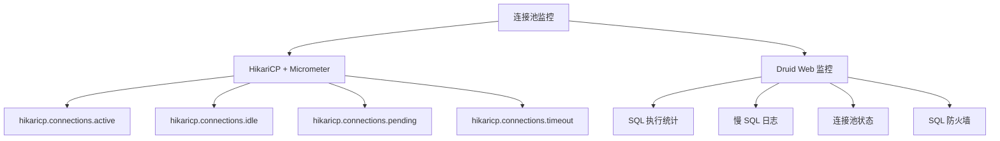

# 连接池

## 概念说明

数据库连接的创建和销毁是昂贵的操作（TCP 三次握手、权限验证等），连接池通过复用连接来提升性能。HikariCP 和 Druid 是 Java 生态中最主流的两个连接池。

> 面试核心：HikariCP 为什么快？连接池的核心参数怎么配置？

## 核心原理

### 一、HikariCP vs Druid 对比

| 特性 | HikariCP | Druid |
|------|----------|-------|
| 性能 | ⭐⭐⭐⭐⭐ 最快 | ⭐⭐⭐⭐ 快 |
| 监控 | 基础（需配合 Micrometer） | ⭐⭐⭐⭐⭐ 内置 Web 监控 |
| SQL 防火墙 | ❌ | ✅ WallFilter |
| 慢 SQL 日志 | ❌ | ✅ StatFilter |
| Spring Boot 默认 | ✅ 默认连接池 | ❌ 需手动配置 |
| 代码量 | ~130KB（精简） | ~1.9MB（功能丰富） |
| 推荐场景 | 追求极致性能 | 需要监控和 SQL 分析 |

**HikariCP 为什么快？**
1. **字节码精简**：使用 Javassist 生成代理类，避免反射开销
2. **ConcurrentBag**：自定义的无锁并发集合，减少锁竞争
3. **FastList**：替代 ArrayList，去掉范围检查
4. **连接状态标记**：使用 CAS 操作标记连接状态，避免锁

### 二、核心参数配置

#### HikariCP 参数

| 参数 | 默认值 | 说明 | 建议 |
|------|--------|------|------|
| `maximumPoolSize` | 10 | 最大连接数 | CPU 核心数 × 2 + 磁盘数 |
| `minimumIdle` | 同 maximumPoolSize | 最小空闲连接数 | 与 maximumPoolSize 相同 |
| `connectionTimeout` | 30000ms | 获取连接超时时间 | 根据业务调整 |
| `idleTimeout` | 600000ms | 空闲连接超时时间 | 默认即可 |
| `maxLifetime` | 1800000ms | 连接最大存活时间 | 小于 MySQL wait_timeout |
| `keepaliveTime` | 0（禁用） | 连接保活间隔 | 建议开启，如 30000ms |

#### Druid 参数

| 参数 | 默认值 | 说明 |
|------|--------|------|
| `initialSize` | 0 | 初始连接数 |
| `maxActive` | 8 | 最大连接数 |
| `minIdle` | 0 | 最小空闲连接数 |
| `maxWait` | -1 | 获取连接最大等待时间 |
| `testOnBorrow` | false | 获取连接时检测 |
| `testWhileIdle` | true | 空闲时检测 |
| `filters` | - | 过滤器（stat, wall, log4j） |

### 三、连接数计算公式

PostgreSQL 官方推荐的连接数公式（同样适用于 MySQL）：

```
最大连接数 = CPU 核心数 × 2 + 有效磁盘数
```

例如：4 核 CPU + 1 块 SSD = 4 × 2 + 1 = **9 个连接**

> 连接数并非越多越好！过多的连接会导致线程上下文切换开销增大，反而降低性能。

### 四、连接池监控



## 代码示例

```yaml
# HikariCP 配置（Spring Boot 默认）
spring:
  datasource:
    url: jdbc:mysql://localhost:3306/test
    username: root
    password: root
    hikari:
      maximum-pool-size: 10
      minimum-idle: 10
      connection-timeout: 30000
      idle-timeout: 600000
      max-lifetime: 1800000
      keepalive-time: 30000

---
# Druid 配置
spring:
  datasource:
    type: com.alibaba.druid.pool.DruidDataSource
    url: jdbc:mysql://localhost:3306/test
    username: root
    password: root
    druid:
      initial-size: 5
      max-active: 20
      min-idle: 5
      max-wait: 60000
      test-while-idle: true
      filters: stat,wall
      stat-view-servlet:
        enabled: true
        url-pattern: /druid/*
```

> 💻 完整可运行代码：[ConnectionPoolDemo.java](https://github.com/skyhe58/guide-java/tree/main/code-examples/03-data-store/database-examples/src/main/java/com/example/database/pool/ConnectionPoolDemo.java)
> <!-- 本地路径：code-examples/03-data-store/database-examples/src/main/java/com/example/database/pool/ConnectionPoolDemo.java -->

## 常见面试题

### Q1: HikariCP 为什么比 Druid 快？

**难度**：⭐⭐⭐ | **频率**：🔥🔥

**答题思路**：

1. 字节码优化
2. 自定义并发集合
3. 精简的代码设计

**标准答案**：

HikariCP 快的原因：1）使用 Javassist 生成代理类，避免 JDK 动态代理的反射开销；2）自定义 ConcurrentBag 无锁并发集合，使用 ThreadLocal + CAS 减少锁竞争；3）自定义 FastList 替代 ArrayList，去掉不必要的范围检查；4）代码极度精简（~130KB），减少 GC 压力。

**深入追问**：

- ConcurrentBag 的实现原理？
- HikariCP 的连接状态是怎么管理的？
- 什么场景下选 Druid 而不是 HikariCP？

### Q2: 连接池的核心参数怎么配置？最大连接数设多少合适？

**难度**：⭐⭐ | **频率**：🔥🔥🔥

**标准答案**：

最大连接数推荐公式：`CPU 核心数 × 2 + 有效磁盘数`。4 核 CPU 通常设置 9-10 个连接。连接数不是越多越好，过多连接会增加线程上下文切换开销。

其他关键参数：`connectionTimeout`（获取连接超时，建议 30 秒）、`maxLifetime`（连接最大存活时间，必须小于 MySQL 的 `wait_timeout`）、`keepaliveTime`（连接保活，建议开启）。

**深入追问**：

- maxLifetime 为什么要小于 MySQL 的 wait_timeout？
- 连接泄漏怎么排查？
- minimumIdle 和 maximumPoolSize 设成一样有什么好处？

### Q3: HikariCP 和 Druid 怎么选？

**难度**：⭐⭐ | **频率**：🔥🔥

**标准答案**：

追求极致性能选 HikariCP（Spring Boot 默认），需要 SQL 监控、慢 SQL 分析、SQL 防火墙选 Druid。实际项目中，如果已经有 APM 工具（如 SkyWalking）做 SQL 监控，HikariCP 是更好的选择。如果没有 APM 工具，Druid 的内置监控非常方便。

**深入追问**：

- Druid 的 StatFilter 和 WallFilter 分别做什么？
- 如何用 Micrometer 监控 HikariCP？

## 参考资料

- [HikariCP GitHub](https://github.com/brettwooldridge/HikariCP)
- [Druid GitHub](https://github.com/alibaba/druid)
