# 数据库面试指南

## 概念说明

MySQL 是 Java 后端面试中**考察最密集的模块**，几乎每一轮技术面试都会涉及。本指南按照面试频率和追问链路，系统梳理数据库面试的核心知识点。

## 面试知识图谱

```mermaid
graph TD
    A["MySQL 面试"] --> B["索引"]
    A --> C["事务"]
    A --> D["锁"]
    A --> E["SQL 优化"]
    A --> F["日志系统"]
    A --> G["架构"]

    B --> B1["B+树原理"]
    B --> B2["聚簇/非聚簇索引"]
    B --> B3["覆盖索引"]
    B --> B4["最左前缀"]
    B --> B5["索引下推"]

    C --> C1["ACID"]
    C --> C2["隔离级别"]
    C --> C3["MVCC"]
    C --> C4["幻读"]

    D --> D1["行锁/表锁"]
    D --> D2["间隙锁/临键锁"]
    D --> D3["死锁"]
    D --> D4["意向锁"]

    E --> E1["EXPLAIN"]
    E --> E2["索引失效"]
    E --> E3["慢查询"]
    E --> E4["深分页"]

    F --> F1["Redo Log"]
    F --> F2["Undo Log"]
    F --> F3["Binlog"]
    F --> F4["两阶段提交"]

    G --> G1["主从复制"]
    G --> G2["分库分表"]
    G --> G3["分布式 ID"]
    G --> G4["连接池"]

    style B fill:#e1f5fe
    style C fill:#e1f5fe
    style D fill:#e1f5fe
    style E fill:#fff3e0
    style F fill:#fce4ec
    style G fill:#f3e5f5
```



## 高频面试题追问链路

### 链路一：索引 → SQL 优化（出现频率：⭐⭐⭐⭐⭐）

```
Q: 为什么 MySQL 用 B+树做索引？
  → Q: B+树和 B 树的区别？
    → Q: 什么是聚簇索引和非聚簇索引？
      → Q: 什么是回表？怎么避免？
        → Q: 什么是覆盖索引？
          → Q: 联合索引的最左前缀原则？
            → Q: 索引在什么情况下会失效？
              → Q: 怎么用 EXPLAIN 分析 SQL？
                → Q: 如何优化慢 SQL？
```

### 链路二：事务 → MVCC → 锁（出现频率：⭐⭐⭐⭐⭐）

```
Q: MySQL 的事务隔离级别有哪些？
  → Q: 默认隔离级别是什么？
    → Q: MVCC 的实现原理？
      → Q: ReadView 的四个字段是什么？
        → Q: RC 和 RR 创建 ReadView 的区别？
          → Q: RR 下能完全解决幻读吗？
            → Q: 间隙锁是什么？怎么加的？
              → Q: 什么情况下会死锁？怎么排查？
```

### 链路三：日志系统 → 高可用（出现频率：⭐⭐⭐⭐）

```
Q: Redo Log 和 Binlog 的区别？
  → Q: 为什么需要两阶段提交？
    → Q: WAL 机制是什么？
      → Q: Binlog 有几种格式？
        → Q: 主从同步的原理？
          → Q: 主从延迟怎么解决？
            → Q: 半同步复制和异步复制的区别？
```

### 链路四：分库分表 → 分布式 ID（出现频率：⭐⭐⭐⭐）

```
Q: 什么时候需要分库分表？
  → Q: 水平分片和垂直分片的区别？
    → Q: 分片策略怎么选？
      → Q: 分库分表后怎么保证全局唯一 ID？
        → Q: 雪花算法的原理？
          → Q: 时钟回拨怎么处理？
            → Q: 跨库 JOIN 怎么处理？
              → Q: 分布式事务怎么解决？
```

## 按公司类型分类

### 大厂（阿里、字节、腾讯、美团）

**重点考察**：
- MVCC 实现原理（ReadView 四个字段必须背熟）
- B+树索引原理（能画出结构图）
- 加锁规则（间隙锁、临键锁的加锁范围）
- 两阶段提交流程
- 分库分表方案设计

**典型问题**：
1. 请画出 B+树的结构，解释为什么 3 层能存 2000 万行
2. 详细说明 MVCC 的可见性判断规则
3. RR 隔离级别下，`SELECT * FROM t WHERE id > 5 FOR UPDATE` 加了什么锁？
4. 两阶段提交中间宕机了怎么恢复？
5. 设计一个支持 10 亿用户的分库分表方案

### 中厂

**重点考察**：
- 索引优化（EXPLAIN 各字段含义）
- 事务隔离级别和 MVCC 基本原理
- 慢查询优化实战经验
- 主从复制和读写分离

**典型问题**：
1. EXPLAIN 中 type 字段有哪些值？
2. 索引在什么情况下会失效？
3. 如何优化一个慢 SQL？
4. 主从延迟怎么解决？
5. HikariCP 和 Druid 怎么选？

### 创业公司

**重点考察**：
- SQL 基础和优化能力
- 索引设计原则
- 事务基本概念
- 实际问题解决能力

**典型问题**：
1. 如何设计一个高效的索引？
2. 事务的 ACID 是什么？
3. 如何排查线上慢查询？
4. 连接池参数怎么配置？

## 面试答题技巧

### 1. 索引类问题

**答题框架**：数据结构 → 存储方式 → 查询过程 → 优化策略

### 2. 事务类问题

**答题框架**：ACID → 隔离级别 → MVCC 原理 → 锁机制

### 3. 优化类问题

**答题框架**：定位问题（慢查询日志）→ 分析原因（EXPLAIN）→ 优化方案 → 验证效果

### 4. 架构类问题

**答题框架**：问题背景 → 方案对比 → 推荐方案 → 实现细节 → 注意事项

## 参考资料

- [丁奇《MySQL 实战 45 讲》](https://time.geekbang.org/column/intro/139) — 面试必读
- [《高性能 MySQL》](https://book.douban.com/subject/23008813/)
- [《MySQL 技术内幕：InnoDB 存储引擎》](https://book.douban.com/subject/24708143/)
