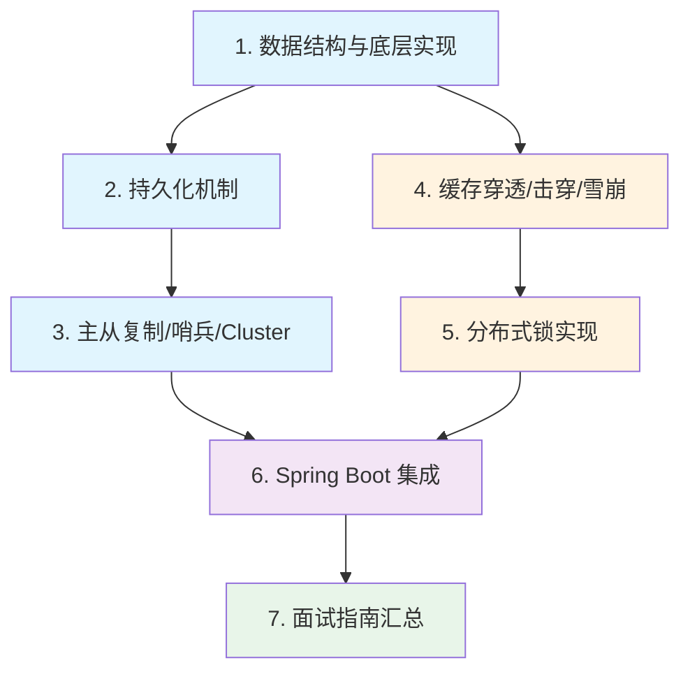

# Redis

## 概念说明

Redis（Remote Dictionary Server）是一个开源的**基于内存的键值存储系统**，支持多种数据结构，广泛用于缓存、分布式锁、消息队列、排行榜等场景。Redis 是 Java 后端面试中**仅次于 MySQL 的高频考察模块**，从数据结构底层编码到分布式锁实现，几乎每轮面试都会涉及。

本模块从 Redis 的数据结构底层实现出发，深入讲解持久化机制、主从复制与集群、缓存问题解决方案、分布式锁实现以及 Spring Boot 集成，帮助你系统掌握 Redis 面试和工作中的关键技术。

> ⚠️ 需要 Redis 环境的示例，请先启动 Docker：`docker compose -f docker/docker-compose.yml up -d redis`

## 知识点列表

| 序号 | 知识点 | 难度 | 面试频率 | 文档链接 |
|------|--------|------|----------|----------|
| 1 | 数据结构与底层实现 | ⭐⭐⭐ | 🔥🔥🔥 | [data-structures](./01-data-structures.md) |
| 2 | 持久化机制 | ⭐⭐⭐ | 🔥🔥🔥 | [persistence](./02-persistence.md) |
| 3 | 主从复制/哨兵/Cluster | ⭐⭐⭐ | 🔥🔥🔥 | [replication](./03-replication.md) |
| 4 | 缓存穿透/击穿/雪崩 | ⭐⭐⭐ | 🔥🔥🔥 | [cache-problems](./04-cache-problems.md) |
| 5 | 分布式锁实现 | ⭐⭐⭐ | 🔥🔥🔥 | [distributed-lock](./05-distributed-lock.md) |
| 6 | Spring Boot 集成 | ⭐⭐ | 🔥🔥 | [spring-integration](./06-spring-integration.md) |
| 7 | Redis 面试指南 | ⭐⭐⭐ | 🔥🔥🔥 | [interview](./99-interview.md) |

## 推荐学习顺序

**学习路线说明**：
- 🔵 **核心原理层**（1-3）：数据结构、持久化、集群是 Redis 的三大基石
- 🟠 **实战应用层**（4-5）：缓存问题和分布式锁是面试高频实战场景
- 🟣 **集成应用层**（6）：Spring Boot 集成是工作中的日常使用
- 🟢 **面试汇总**（7）：高频面试题和追问链路

## 相关模块链接

- [数据库/MySQL](/3-data-store/3.1-database/) — 缓存与数据库的配合使用
- [Spring Boot](/2-framework/2.2-springboot/) — Redis 与 Spring Boot 集成
- [分布式系统](/5-distributed/5.1-distributed/) — 分布式锁、分布式缓存方案

## 参考资料

- [Redis 官方文档](https://redis.io/docs/)
- [《Redis 设计与实现》— 黄健宏](https://book.douban.com/subject/25900156/)
- [《Redis 深度历险》— 钱文品](https://book.douban.com/subject/30386804/)
