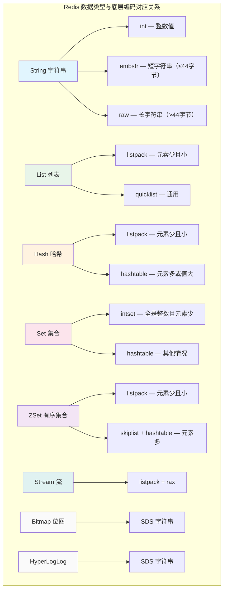
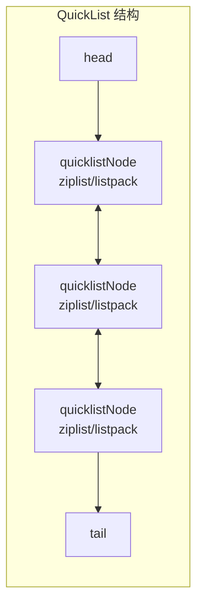
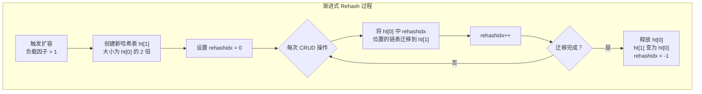
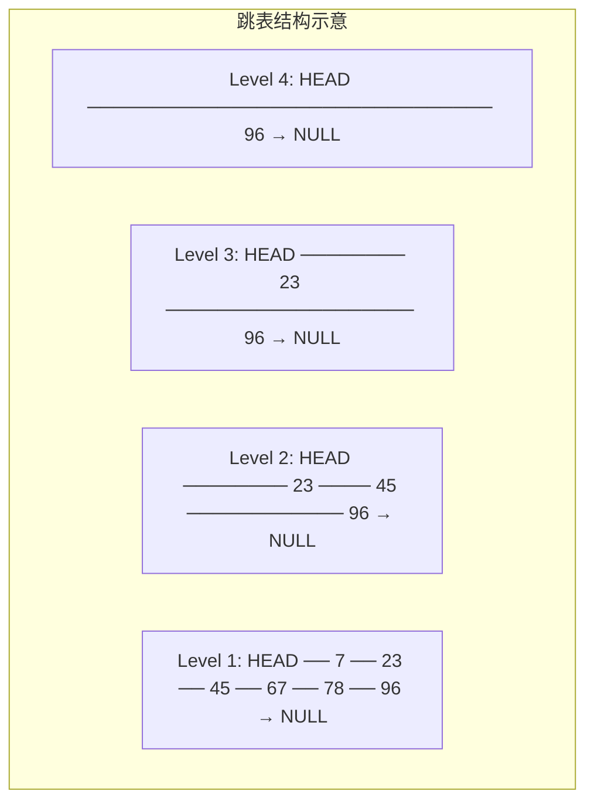

# Redis 数据结构与底层实现

## 概念说明

Redis 提供了丰富的数据结构，不仅仅是简单的 Key-Value 存储。理解每种数据结构的**底层编码实现**是面试中的高频考点，面试官通常会从"Redis 有哪些数据类型"开始，逐步追问到底层的 SDS、SkipList、ZipList 等实现细节。

Redis 的五种基本数据类型：String、List、Hash、Set、ZSet，以及三种特殊类型：Stream、Bitmap、HyperLogLog。每种类型在不同数据量下会使用不同的底层编码，这是 Redis 高性能的关键设计。

## 核心原理

### 一、Redis 对象系统与底层编码

Redis 中每个键值对都是一个 RedisObject，包含类型（type）和编码（encoding）两个关键属性：



> **注意**：Redis 7.0 之后，ZipList 已被 ListPack 替代。本文同时介绍两者，面试中需要了解演进历史。

### 二、String — SDS（Simple Dynamic String）

Redis 没有直接使用 C 语言的字符串（`char*`），而是自己实现了 SDS：

```c
struct sdshdr {
    int len;      // 已使用长度
    int alloc;    // 分配的总长度
    char flags;   // 类型标志（sdshdr5/8/16/32/64）
    char buf[];   // 实际数据
};
```

**SDS 相比 C 字符串的优势**：

| 特性 | C 字符串 | SDS |
|------|---------|-----|
| 获取长度 | O(n) 遍历 | O(1) 直接读 len |
| 缓冲区溢出 | 可能溢出 | 自动扩容，安全 |
| 二进制安全 | 不安全（`\0` 截断） | 安全（用 len 判断结束） |
| 内存分配 | 每次修改都分配 | 空间预分配 + 惰性释放 |

**String 的三种编码**：
- **int**：值为整数且可用 long 表示时
- **embstr**：字符串长度 ≤ 44 字节，RedisObject 和 SDS 连续分配，一次内存分配
- **raw**：字符串长度 > 44 字节，RedisObject 和 SDS 分开分配，两次内存分配

### 三、List — QuickList

Redis 3.2 之后，List 底层统一使用 QuickList（双向链表 + ZipList/ListPack 的组合）：



**设计思路**：
- 纯链表：内存碎片多，指针开销大
- 纯 ZipList：连续内存，但修改需要 realloc，大数据量时性能差
- QuickList：折中方案，链表的每个节点是一个 ZipList/ListPack，兼顾内存和性能

### 四、Hash — ListPack + HashTable

Hash 类型根据数据量使用不同编码：

- **ListPack**（小数据量）：当 field 数量 ≤ `hash-max-listpack-entries`（默认 128）且每个值长度 ≤ `hash-max-listpack-value`（默认 64 字节）时使用
- **HashTable**（大数据量）：超过阈值后转换为哈希表

**HashTable 结构**（类似 Java HashMap）：
- 数组 + 链表
- 使用 MurmurHash2 算法计算哈希值
- 渐进式 rehash：扩容时不一次性迁移，而是在每次操作时逐步迁移



### 五、Set — IntSet + HashTable

- **IntSet**：当所有元素都是整数且数量 ≤ `set-max-intset-entries`（默认 512）时使用
- **HashTable**：其他情况

IntSet 是一个有序整数数组，支持 int16、int32、int64 三种编码，会根据最大值自动升级编码。

### 六、ZSet — SkipList + HashTable

ZSet（有序集合）是 Redis 中最复杂的数据结构，大数据量时同时使用两种结构：

- **SkipList（跳表）**：支持范围查询，O(log n) 查找
- **HashTable**：支持 O(1) 按 member 查找 score



**跳表核心特点**：
- 多层链表，每层是下层的"快速通道"
- 查找时从最高层开始，逐层下降，平均 O(log n)
- 插入时通过随机函数决定层数（概率 p=0.25）
- 相比红黑树：实现简单、范围查询更高效、并发友好

**为什么 ZSet 用跳表而不是红黑树？**
1. 跳表实现更简单，代码量少
2. 范围查询时跳表只需遍历链表，红黑树需要中序遍历
3. 跳表更容易实现并发操作（CAS 修改指针）

### 七、特殊数据类型

#### Bitmap（位图）
底层是 SDS 字符串，通过 SETBIT/GETBIT 操作单个 bit。适用于：
- 用户签到（每天一个 bit）
- 在线状态统计
- 布隆过滤器

#### HyperLogLog
用于基数统计（去重计数），仅需 12KB 内存即可统计 2^64 个元素，误差率约 0.81%。适用于：
- UV 统计
- 独立 IP 计数

#### Stream
Redis 5.0 引入的消息队列数据结构，支持消费者组、消息确认、持久化。

## 代码示例

```java
// String 类型 — 缓存、计数器、分布式锁
SET user:1001 '{"name":"张三","age":25}'
INCR article:1001:views    // 文章浏览量计数

// List 类型 — 消息队列、最新列表
LPUSH news:latest "新闻1" "新闻2"
LRANGE news:latest 0 9     // 获取最新 10 条

// Hash 类型 — 对象存储
HSET user:1001 name "张三" age 25 email "zhangsan@example.com"
HGETALL user:1001

// Set 类型 — 标签、共同好友
SADD user:1001:tags "Java" "Redis" "Spring"
SINTER user:1001:friends user:1002:friends  // 共同好友

// ZSet 类型 — 排行榜
ZADD leaderboard 100 "player1" 200 "player2" 150 "player3"
ZREVRANGE leaderboard 0 9 WITHSCORES       // Top 10
```

> 💻 完整可运行代码：[DataStructureDemo.java](../../../code-examples/03-data-store/redis-examples/src/main/java/com/example/redis/datastructure/DataStructureDemo.java)
>
> ⚠️ 需要 Redis 环境：`docker compose -f docker/docker-compose.yml up -d redis`

## 常见面试题

### Q1: Redis 有哪些数据类型？分别适用什么场景？

**难度**：⭐⭐ | **频率**：🔥🔥🔥

**答题思路**：

1. 列举五种基本类型 + 三种特殊类型
2. 每种类型给出 1-2 个典型场景
3. 提到底层编码的区别

**标准答案**：

Redis 有五种基本数据类型和三种特殊类型：

- **String**：缓存、计数器、分布式锁（SETNX）、Session 共享
- **List**：消息队列（LPUSH+BRPOP）、最新列表（朋友圈时间线）
- **Hash**：对象存储（用户信息）、购物车
- **Set**：标签系统、共同好友（交集）、抽奖（SRANDMEMBER）
- **ZSet**：排行榜、延迟队列（按时间戳排序）
- **Bitmap**：签到、在线状态、布隆过滤器
- **HyperLogLog**：UV 统计（12KB 统计 2^64 元素）
- **Stream**：消息队列（支持消费者组）

**深入追问**：

- 每种类型的底层编码是什么？什么时候会转换？
- ZSet 为什么用跳表而不是红黑树？
- String 的 embstr 和 raw 编码有什么区别？

### Q2: Redis 的 SDS 和 C 语言字符串有什么区别？

**难度**：⭐⭐⭐ | **频率**：🔥🔥🔥

**答题思路**：

1. 从获取长度、缓冲区安全、二进制安全三个角度对比
2. 说明空间预分配和惰性释放策略

**标准答案**：

SDS 相比 C 字符串有四个优势：
1. **O(1) 获取长度**：SDS 用 len 字段记录长度，C 字符串需要 O(n) 遍历
2. **防止缓冲区溢出**：SDS 修改前会检查空间，不足时自动扩容
3. **二进制安全**：SDS 用 len 判断结束，可以存储任意二进制数据；C 字符串以 `\0` 结尾，无法存储包含 `\0` 的数据
4. **减少内存分配**：空间预分配（修改后预留空间）和惰性释放（缩短时不立即释放）

**深入追问**：

- SDS 的空间预分配策略是什么？（< 1MB 翻倍，≥ 1MB 多分配 1MB）
- embstr 编码为什么是 44 字节？（RedisObject 16 字节 + SDS header 3 字节 + `\0` 1 字节 = 20 字节，64 - 20 = 44）

### Q3: ZSet 为什么用跳表而不是红黑树或 B+树？

**难度**：⭐⭐⭐ | **频率**：🔥🔥🔥

**答题思路**：

1. 对比跳表和红黑树的实现复杂度
2. 分析范围查询的效率
3. 提到 Redis 作者的设计考量

**标准答案**：

Redis 作者 antirez 选择跳表的原因：
1. **实现简单**：跳表代码量远少于红黑树，易于调试和维护
2. **范围查询高效**：跳表找到起始节点后沿链表遍历即可，红黑树需要中序遍历
3. **并发友好**：跳表可以通过 CAS 操作实现无锁并发，红黑树的旋转操作难以并发
4. **内存局部性**：跳表节点在内存中更紧凑

不选 B+树：B+树适合磁盘存储（减少 IO），Redis 是内存数据库，不需要考虑磁盘 IO。

**深入追问**：

- 跳表的时间复杂度是多少？空间复杂度呢？
- 跳表的层数是怎么决定的？
- ZSet 同时用跳表和哈希表，不浪费内存吗？

**易错点**：

- 不要说"跳表比红黑树快"，两者查找都是 O(log n)
- 跳表的优势在于**实现简单**和**范围查询**，不是速度

## 参考资料

- [Redis 官方文档 - Data types](https://redis.io/docs/data-types/)
- [《Redis 设计与实现》第一部分 - 数据结构与对象](https://book.douban.com/subject/25900156/)
